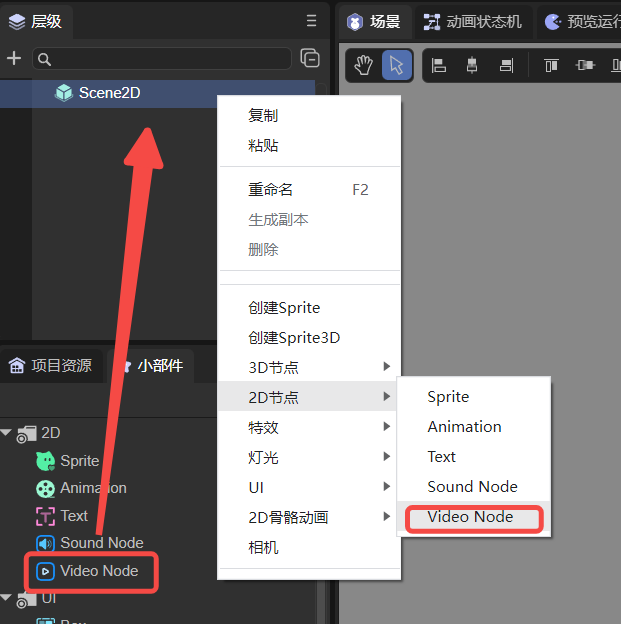
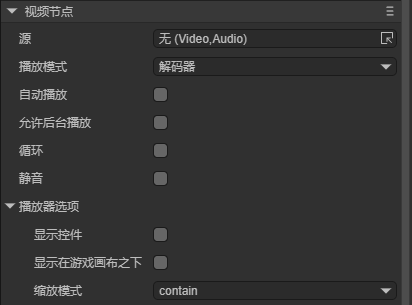
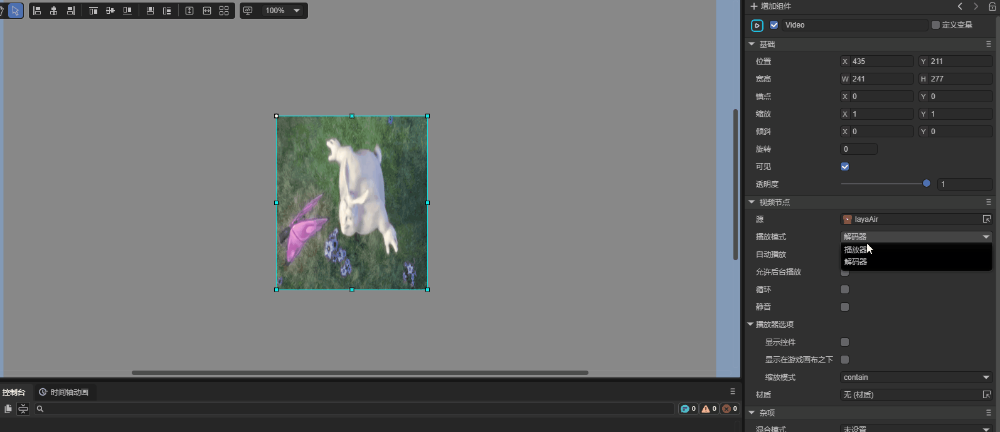
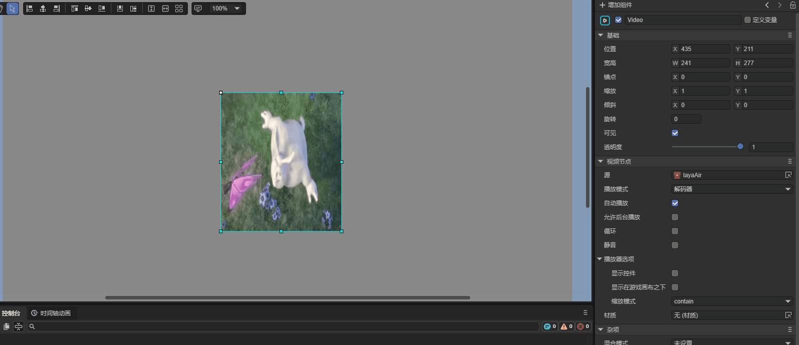

# 视频节点(VideoNode)

## 1. LayaAir IDE中使用视频节点

### 1.1 创建VideoNode

如图1-1所示，可以在`层级`窗口中右键进行创建，也可以从`小部件`窗口中拖拽添加。



（图1-1）


### 1.2 属性介绍

在IDE中，将VideoNode节点添加到场景编辑的视图区后，属性面板中VideoNode的专属属性如下图所示： 



（图1-2）

| 属性                                 | 功能说明                                                     |
| ------------------------------------ | ------------------------------------------------------------ |
| 源 **source**                        | 视频源                                                       |
| 播放模式  **mode**                   | 有两种播放模式，分别为播放器和解码器,如果设置的模式不支持，会尝试使用另外一种模式，详情见下文。 |
| 自动播放 **autoplay**                | 视频是否自动播放，默认为false。如果设置为true，则视频被创建并添加到舞台后自动播放 |
| 允许后台播放**allowBackground**      | 是否允许后台播放，默认值为false                              |
| 循环 **loop**                        | 循环播放，默认flase                                          |
| 静音 **muted**                       | 开启后视频静音，默认false                                    |
| 显示控件 **controls**                | 是否显示视频控制，默认false                                  |
| 显示在游戏画布之下 **underGameView** | 视频是否显示在游戏画布之下，默认false。此选项开启时画布需设置为透明 |
| 缩放模式  **objectFit**              | 有三种缩放模式，分别是fill，contain，cover。默认为contain，详情见下文。 |


### 1.3 播放模式 mode

两种播放模式的具体表现如下：
设置解码器后，由于被捕获到Texture在显示，所以与视频节点的宽高一致，如动图1-3所示



（动图1-3）

设置播放器后，由于视频直接浮动在主画布上面，所以维持视频原本的宽高比，如动图1-4所示



（动图1-4）

### 1.4 缩放模式 objectFit
缩放模式的具体表现如下：
fill模式：视频拉伸填满整个容器，不保证保持原有长宽比例。如图1-5所示


（图1-5）

contain模式：保持原有长宽比例。保证视频尺寸一定可以在容器里面放得下。因此，可能会有部分空白，如图1-6所示


（图1-6）

cover模式：保持原有长宽比例。保证视频尺寸一定大于容器尺寸，宽度和高度至少有一个和容器一致。因此，视频有部分会看不见，如图1-7所示


（图1-7）
### 1.5 脚本控制VideoNode

在1.2节中，将视频文件添加到Source后，是无法自动播放的，需要用代码进行控制。在Scene2D的属性设置面板中，增加一个自定义组件脚本。然后，将VideoNode拖入到其暴露的属性入口中。下面给出一个示例代码，实现脚本控制VideoNode：

```typescript
const { regClass, property } = Laya;

@regClass()
export class NewScript extends Laya.Script {

    @property({ type: Laya.VideoNode })
    public video: Laya.VideoNode;

    constructor() {
        super();
    }

    // 组件被激活后执行，此时所有节点和组件均已创建完毕，此方法只执行一次
    onAwake(): void {
        // 鼠标点击触发播放
        Laya.stage.on(Laya.Event.MOUSE_DOWN, () => {
            Laya.loader.load("resources/layaAir.mp4").then(() => {
                this.video.play(); //播放视频
            });
        })
    }
}
```

如果是在LayaAir IDE中运行，则VideoNode无需通过事件触发播放。但是在Chrome中，自动播放只允许**静音自动播放**。只有用户进行交互（单击、双击等）后，才允许自动播放声音。

并且，不同的浏览器对视频播放的协议要求不同，开发者可以通过代码设置视频纹理更新帧率：

```typescript
const { regClass, property } = Laya;

@regClass()
export class NewScript extends Laya.Script {

    @property({type: Laya.VideoNode})
    public video: Laya.VideoNode;

    //组件被启用后执行，例如节点被添加到舞台后
    onEnable(): void {
        // 鼠标点击触发播放
        Laya.stage.on(Laya.Event.MOUSE_DOWN, () => {
            // 视频纹理更新帧率
            this.video.videoTexture.useFrame = true;
            this.video.videoTexture.updateFrame = 30;

            this.video.play();
        });
    }
}
```


# 2. 代码创建VideoNode

如果不想让VideoNode节点一开始就在舞台上，而是在要用的时候才添加，这就要通过代码来创建了。在Scene2D的属性设置面板中，增加一个自定义组件脚本，示例代码如下：

```typescript
const { regClass, property } = Laya;

@regClass()
export class NewScript extends Laya.Script {
    //declare owner : Laya.Sprite3D;

    constructor() {
        super();
    }

    /**
     * 组件被激活后执行，此时所有节点和组件均已创建完毕，此方法只执行一次
     */
    onAwake(): void { 
        let video = new Laya.VideoNode;
        //添加到舞台
        Laya.stage.addChild(video);
        video.pos(200,200); //设置位置
        video.source = "resources/layaAir.mp4"; //设置视频源文件
        video.play(); //开始播放
    }
}
```

