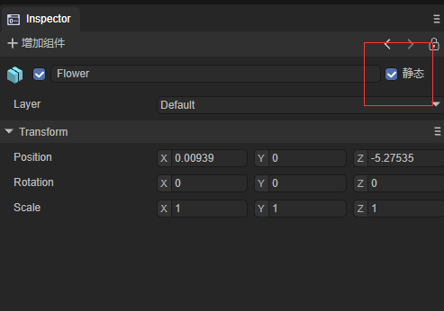
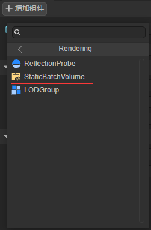

# 3D性能优化

## 1.图形性能的基本认知

### 1.1 降低渲染的CPU成本

在渲染过程中，对CPU渲染时间影响时间最大的因素是将渲染指令发送到GPU的成本，渲染指令包括Draw Call以及在绘制3D物体之前更改GPU上设置的命令。

以下的几种手段都可以降低渲染的CPU成本：

- 减少场景中渲染物体的数量
  - 考虑减少场景中对象的总数，例如：使用天空盒来代替远距离3D物体的渲染
  - 对场景中的物体执行更高效的剔除手段，以便减少引擎中渲染的压力。
- 减少渲染对象的次数
  - 在适当情况下，使用LightMap烘焙光照和阴影，该操作会增加显存使用量和构建时间，但可以提到运行效率
  - 减少光源的数量
  - 慎用实时阴影
  - 慎用反射探针

### **1.2 降低渲染的GPU成本**

受内存带宽限制，纹理尺寸太高，纹理数量过多，会引发GPU渲染瓶颈

- 为与相机的距离在运行时变化的纹理启用 mipmap。（例如，3D 场景中使用的大多数纹理）。这会增加这些纹理的内存使用量和存储空间，但可以提高运行时 GPU 性能。

- 使用合适的压缩格式来减小内存中纹理的大小。这可以缩短加载时间、减少内存占用并改善 GPU 渲染性能。压缩纹理仅使用未压缩纹理所需内存带宽的一小部分。

如果应用受到顶点处理的限制，意味着GPU在顶点处理阶段可以处理更多的顶点

- 降低顶点着色器的执行成本。

- 优化几何图形：不要使用不必要的三角形，并尽量保持 UV 映射接缝和硬边（双倍顶点）的数量尽可能少。
- 使用LOD优化不同的Mesh类型，优化顶点数量。

## 2.优化Draw Call

由于呈现状态更改会占用大量资源，因此对其进行优化非常重要。优化渲染状态更改的主要方法是减少它们的数量。有两种方法可以执行此操作：

- 减少绘制调用的总数。减少绘制调用的数量时，也会减少它们之间的渲染状态更改的数量。
- 以减少对呈现状态的更改次数的方式组织绘制调用。如果图形 API 可以使用相同的呈现状态来执行多个绘制调用，则可以将绘制调用组合在一起，而无需执行尽可能多的渲染状态更改。

LayaAir中提供了以下几种方法:

- GPU instance
- Dynamic Batch
- Static Batch
- Custom Static Batch

## 3.GPU instance

GPU 实例化是一个绘制调用优化方法，它在一个绘制调用中呈现具有相同材质的多个网格副本。网格的每个副本称为一个实例。这对于绘制场景中出现多次的事物很有用，例如，树木或草体。

GPU 实例在相同的绘制调用中呈现相同的网格。要添加变化并减少重复的外观，每个实例可以具有不同的属性，如 Color 或 Scale。绘制调用，呈现多个实例出现在框架调试器绘制网格(实例)。

GPU Instance需要硬件的支持，确保你当前所使用的硬件可以支持GPU Instance渲染

 

上图展示了一个GPU Instance测试场景和测试场景相对应的详细绘制信息，图中红-绿-蓝-黄为四种不同的材质

 当前Instance DrawCall仅为三个，引擎自动为符合Instance条件的物体执行了Instance渲染流程

引擎Instance渲染条件：

- 相同的Mesh
- 相同的材质
- enableInstance（自定义Shader上的开关，引擎默认shader开启了Instance）
- 阴影状态是否相同（是否接收阴影）
- 反射探针状态是否相同

红-绿-蓝三类物体，具有不同的Mesh、不同的材质，但每一个红色、绿色或者蓝色的物体都是具有相同的材质、相同的Mesh、相同的Instance状态、相同的阴影状态、相同的反射探针状态。所以这三类物体符合引擎Instance渲染判断流程。引擎自动为这三类物体进行了实例化渲染，将红-绿-蓝三种物体将每种颜色的所有物体实例化以一个InstanceDraw Call的形式完成了渲染流程。黄色物体满足了Instance渲染判断的几乎所有内容，但是因为Mesh网格数据不同、引擎不会对所有的黄色物体进行Instance实例化渲染。

综上，一个基本的Instance渲染条件基本可以归纳为三个点：开启了enableInstance，相同Mesh，相同材质。

如果需要自己定制具有个性化的Instance渲染判断，开发者需要通过[CommandBuffer](../CommandBuffer/readme.md)的形式自己组织渲染的数据

## 4.Dynamic Batch

动态合并分为 **实例合并** 与 **顶点合并** 两种。这两种优化都无需开发者进行任何设置，而且物体可动态移动，不受限制。但是合并原则相对严格。以下是两种合并最基本条件。

**实例合并:**

 需要同Mesh和同材质双条件满足。在三维场景中同Mesh同材质的模型还是可能大量存在的，在这时实例合并有不小的发挥空间。

**顶点合并:**

 需要同材质且模型顶点小于10个。顶点合并目前在一些假阴影和特效模型上有发挥空间。

**注意：**半透明的物体需要连续渲染才能动态合并，所以半透明物体的动态合并几率低。

**关闭动态合批选项**

在引擎的Config3D.ts文件中enableDynamicBatch值选项，true为开启动态合批，false为关闭动态合批

 

图4-1

## 5.Static Batch

静态批处理是一种绘制调用批处理方法，它组合不移动的网格以减少绘制调用。 它将组合的网格转换为世界空间，并为它们构建一个共享的顶点和索引缓冲区。 然后，对于可见网格，引擎执行一系列简单的绘制调用，每个调用之间几乎没有状态变化。 静态批处理不会减少绘制调用的次数，而是减少它们之间渲染状态更改的次数。 静态批处理比动态批处理更有效，因为静态批处理不会在 CPU 上转换顶点。 

**关闭静态合批选项**

在引擎的Config3D.ts文件中enableStaticBatch值选项，true为开启动态合批，false为关闭动态合批

 

图5-1

静态合批的条件：

- 物体为Static（包括子物体）
- 使用同种材质的统一模型

 

图5-2

## 6.Custom Static Batch(Static Batch Volume组件)

在Object的inspect面板，增加组件，选择Rendering选项，找到Static Batch Volume组件

 

图6-1

在Scene视窗中拖动小白点选择合适的Volume大小

 

图6-2

Static Batch Volume组件的使用: 上面的Volume框选到合适的大小后，在组件的详情面板中，勾选Static Instance Batch，再点击reBatch，Volume中所框选的物件就会执行Batch操作，优化Draw Call，提升运行效率。勾选了CheckLOD选项的Batch组件, 会自动检查Volume中的物体LOD属性信息, 然后将Volume中的所有物体按照LOD Cull Rate Array的物体LOD等级划分为不同的LOD渲染对象

 

图6-3


 

图6-4


## 7.基于节点的材质合批功能

### 7.1表现效果

基于节点的材质合批功能可以通过图7-1和图7-2来展示其表现，本测试案例的场景中一共有200个小球和1个平板。经过合批处理后， 最终场景内的**不透明绘制批次**


图7-1 场景截图


图7-2 Stat面板


### 7.2 使用示例

该示例使用脚本实现了一个基于节点的材质合批功能，主要通过为多个 3D 节点分配共享的材质和网格，并利用自定义的 UniformBuffer 来优化渲染性能。

脚本代码如下：

```typescript
const { regClass, property } = Laya;

@regClass()
export class Script extends Laya.Script {
    //共享材质，用于合批
    public batchMat: Laya.Material;
    //颜色数目
    private _colorNums = 20;
    //精灵数目
    private _spriteNums = 200;

    private _createColorBufferData() {
        //随机给20个颜色值
        let colorBuffer = new Float32Array(20 * 4);
        for (var i = 0; i < this._colorNums; i++) {
            let offset = i * 4;
            colorBuffer[offset] = Math.random();
            colorBuffer[offset + 1] = Math.random();
            colorBuffer[offset + 2] = Math.random();
            colorBuffer[offset + 3] = 1;
        }
        //设置uniformbuffer
        this.batchMat.setBuffer("colormap", colorBuffer);
    }

    //随机生成_spriteNums数目个的小球，使用随机颜色
    private _createMeshSpriteRender() {
        let mesh = Laya.PrimitiveMesh.createSphere(0.5);
        let ownerSprite = this.owner;
        let positionRanvge = 30;
        for (var i = 0; i < this._spriteNums; i++) {
            let sprite = ownerSprite.addChild(new Laya.Sprite3D());
            let filter = sprite.addComponent(Laya.MeshFilter);
            let render = sprite.addComponent(Laya.MeshRenderer);
            // 设置相同的材质与网格
            filter.sharedMesh = mesh;
            render.sharedMaterial = this.batchMat;
            //随机位置
            sprite.transform.localPosition = this._getRandomPosition(positionRanvge);
            //随机一个颜色索引
            let colorIndex = Math.floor(Math.random() * this._colorNums);
            //设置节点的 Laya.ENodeCustomData.custom_0 为对应的颜色索引
            render.setNodeCustomData(Laya.ENodeCustomData.custom_0, colorIndex);
        }
    }
    
    private _getRandomPosition(positionRanvge: number): Laya.Vector3 {
        let getRangeRandom = () => {
            return (Math.random() - 0.5) * positionRanvge;
        }
        return new Laya.Vector3(getRangeRandom(), 0.3, getRangeRandom());
    }

}
```


shader代码如下：

```glsl
Shader3D Start
{
    type:Shader3D
    name:PBRColorBatchShader
    enableInstancing:true,
    supportReflectionProbe:true,
    uniformMap:{
        u_AlphaTestValue: { type: Float, default: 0.5, range: [0.0, 1.0] },

        u_TilingOffset: { type: Vector4, default: [1, 1, 0, 0] },

        u_AlbedoColor: { type: Color, default: [1, 1, 1, 1] },
        u_AlbedoTexture: { type: Texture2D, options: { define: "ALBEDOTEXTURE" } },

        u_NormalTexture: { type: Texture2D, options: { define: "NORMALTEXTURE" } },
        u_NormalScale: { type: Float, default: 1.0, range: [0.0, 2.0] },

        u_Metallic: { type: Float, default: 0.0, range: [0.0, 1.0] },
        u_Smoothness: { type: Float, default: 0.0, range: [0.0, 1.0] },
        u_MetallicGlossTexture: { type: Texture2D, options: { define: "METALLICGLOSSTEXTURE" } },

        u_OcclusionTexture: { type: Texture2D, options: { define: "OCCLUSIONTEXTURE" } },
        u_OcclusionStrength: { type: Float, default: 1.0 },

        u_EmissionColor: { type: Color, default: [0, 0, 0, 0] },
        u_EmissionIntensity: { type: Float, default: 1.0 },
        u_EmissionTexture: { type: Texture2D, options: { define: "EMISSIONTEXTURE" } },
    },
    defines: {
        EMISSION: { type: bool, default: false },
        ENABLEVERTEXCOLOR: { type: bool, default: false }
    }
    shaderPass:[
        {
            pipeline:Forward,
            VS:LitVS,
            FS:LitFS
        }
    ]
}
Shader3D End

GLSL Start
#defineGLSL LitVS
    #define SHADER_NAME PBRColorBatchShader

    #include "Math.glsl";

    #include "Scene.glsl";
    #include "SceneFogInput.glsl"

    #include "Camera.glsl";
    #include "Sprite3DVertex.glsl";

    #include "VertexCommon.glsl";

    #include "PBRVertex.glsl";

    varying float spriteCustomData;

    void main()
    {
        Vertex vertex;
        getVertexParams(vertex);

        PixelParams pixel;
        initPixelParams(pixel, vertex);

        gl_Position = getPositionCS(pixel.positionWS);

        gl_Position = remapPositionZ(gl_Position);
        
        spriteCustomData = NodeCustomData0;

    #ifdef FOG
        FogHandle(gl_Position.z);
    #endif // FOG 
    }
#endGLSL

#defineGLSL LitFS
    #define SHADER_NAME PBRColorBatchShader

    #include "Color.glsl";

    #include "Scene.glsl";
    #include "SceneFog.glsl";

    #include "Camera.glsl";
    #include "Sprite3DFrag.glsl";

    #include "PBRMetallicFrag.glsl";

    uniform vec4 colormap[20];
    varying float spriteCustomData;

    void initSurfaceInputs(inout SurfaceInputs inputs, inout PixelParams pixel)
    {
        inputs.alphaTest = u_AlphaTestValue;

    #ifdef UV
        vec2 uv = transformUV(pixel.uv0, u_TilingOffset);
    #else // UV
        vec2 uv = vec2(0.0);
    #endif // UV

        inputs.diffuseColor = colormap[int(spriteCustomData)].rgb;
        inputs.alpha = colormap[int(spriteCustomData)].a;

    #ifdef COLOR
        #ifdef ENABLEVERTEXCOLOR
        inputs.diffuseColor *= pixel.vertexColor.xyz;
        inputs.alpha *= pixel.vertexColor.a;
        #endif // ENABLEVERTEXCOLOR
    #endif // COLOR

    #ifdef ALBEDOTEXTURE
        vec4 albedoSampler = texture2D(u_AlbedoTexture, uv);
        #ifdef Gamma_u_AlbedoTexture
        albedoSampler = gammaToLinear(albedoSampler);
        #endif // Gamma_u_AlbedoTexture
        inputs.diffuseColor *= albedoSampler.rgb;
        inputs.alpha *= albedoSampler.a;
    #endif // ALBEDOTEXTURE

        inputs.normalTS = vec3(0.0, 0.0, 1.0);
    #ifdef NORMALTEXTURE
         vec3 normalSampler = texture2D(u_NormalTexture, uv).rgb;
        normalSampler = normalize(normalSampler * 2.0 - 1.0);
        normalSampler.y *= -1.0;
        inputs.normalTS = normalScale(normalSampler, u_NormalScale);
    #endif

        inputs.metallic = u_Metallic;
        inputs.smoothness = u_Smoothness;

    #ifdef METALLICGLOSSTEXTURE
        vec4 metallicSampler = texture2D(u_MetallicGlossTexture, uv);
        inputs.metallic = metallicSampler.x;
        inputs.smoothness = (metallicSampler.a * u_Smoothness);
    #endif // METALLICGLOSSTEXTURE

        inputs.occlusion = 1.0;
    #ifdef OCCLUSIONTEXTURE
        vec4 occlusionSampler = texture2D(u_OcclusionTexture, uv);
        float occlusion = occlusionSampler.g;
        inputs.occlusion = (1.0 - u_OcclusionStrength) + occlusion * u_OcclusionStrength;
    #endif // OCCLUSIONTEXTURE

        inputs.emissionColor = vec3(0.0);
    #ifdef EMISSION
        inputs.emissionColor = u_EmissionColor.rgb * u_EmissionIntensity;
        #ifdef EMISSIONTEXTURE
        vec4 emissionSampler = texture2D(u_EmissionTexture, uv);
        #ifdef Gamma_u_EmissionTexture
        emissionSampler = gammaToLinear(emissionSampler);
        #endif // Gamma_u_EmissionTexture
        inputs.emissionColor *= emissionSampler.rgb;
        #endif // EMISSIONTEXTURE
    #endif // EMISSION
    }

    void main()
    {
        PixelParams pixel;
        getPixelParams(pixel);

        SurfaceInputs inputs;
        initSurfaceInputs(inputs, pixel);

        vec4 surfaceColor = PBR_Metallic_Flow(inputs, pixel);
        
    #ifdef FOG
        surfaceColor.rgb = sceneLitFog(surfaceColor.rgb);
    #endif // FOG

        gl_FragColor = surfaceColor;

        gl_FragColor = outputTransform(gl_FragColor);
    }
#endGLSL

GLSL End

```


#### 7.2.1原理介绍

 开发者可通过材质(Material)的`setBuffer`方法设置对应的uniform缓冲区。

 在示例中，我们创建了一个长度为 4 * 20 的Float32Array（即`colorBuffer`），作为`uniform vec4 colormap[20]`的数据源，包含20种不同的颜色信息。 

 在实现过程中，我们为每个节点生成随机颜色索引(colorIndex)，并通过 *BaseRender.setNodeCustomData* 方法将这些索引值存储在节点的自定义数据区域 *ENodeCustomData.custom_0* 位置上。需要注意的是：该接口仅支持设置数字类型数据。

 在渲染阶段，引擎检测到200个使用相同材质与网格的球体，会自动进行批次合并优化。不同节点的CustomData数据会以InstanceBuffer的形式被合并提交，最终这200个球体只需一个渲染批次即可完成绘制，大幅提升了渲染效率。


#### 7.2.2注意事项

1. 目前 *BaseRender.setNodeCustomData* 方法仅有 custom_0 , custom_1 , custom_2 可选项。
2. 材质在切换到在Instance渲染时，这三个槽位占用了顶点 VertexMesh.MESH_CUSTOME0，VertexMeshMESH_CUSTOME1，VertexMesh.MESH_CUSTOME2。
3. uniform缓冲区使用时需要注意，在低端手机上过大的数据可能存在uniform超出的风险。


