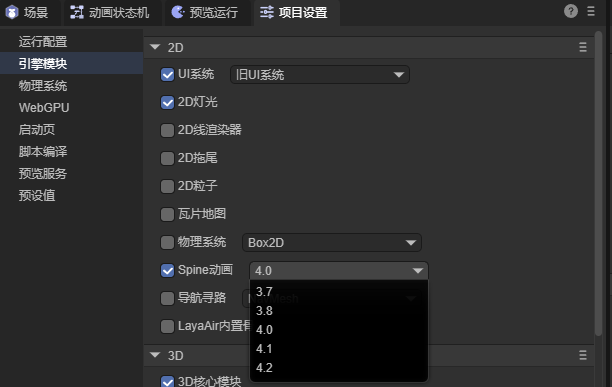
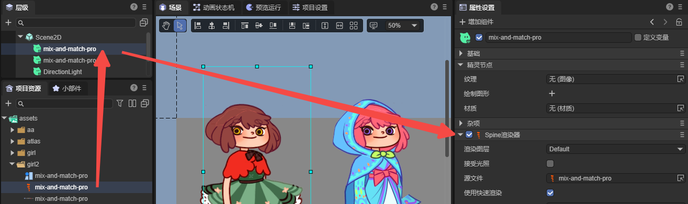
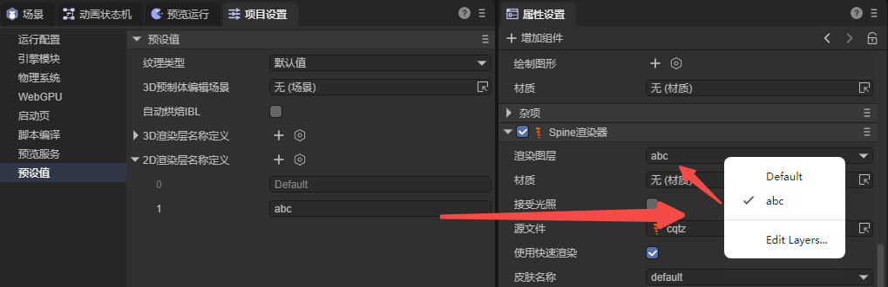

# Spine渲染器（`Spine2DRenderNode`）

> Author ：Charley

## 1、Spine使用入门

Spine 是一款专业的 2D 骨骼动画工具，广泛应用于游戏开发。它采用骨骼驱动的动画方式，通过关键帧插值和网格变形，使角色或对象的动画更加流畅，并且比逐帧动画更节省资源。

> 如何制作Spine骨骼动画，不在本文中介绍，感兴趣的开发者可以到[Spine 网站](https://zh.esotericsoftware.com/spine-academy)查看。

### 1.1 支持哪些 Spine 运行时

Spine 主要由 Spine 编辑器和 Spine 运行时（Runtime）两部分组成。Spine 编辑器用于创建和调整动画，支持导入位图资源、绑定骨骼、调整关键帧，并设置动画参数。

Spine 运行时则是官方提供的一系列开源库，LayaAir 引擎正是通过引入Spine 运行时的方式，将Spine动画的渲染接入到 LayaAir 引擎。

当前，LayaAir支持Spine 3.7、3.8、4.0、4.1、4.2版本的运行时库，开发者可以通过IDE的`项目设置` -> `引擎模块`  -> 2D  -> Spine动画，选择Spine动画相应版本的Spine运行时，操作界面如图1-1所示。

  

（图1-1）

**注意**：IDE无法自动识别Spine版本，所以开发者需要根据Spine资源的版本手动选择相应版本的运行时库，才可以保障Spine的正确运行。

### 1.2 Spine使用的基础流程

当Spine的资源放到资源目录（assets）后，可以直接拖拽Spine文件（`.skel`或`.json`）到层级面板使用，此时，会自动创建一个2D精灵节点，并在这个节点上自动创建一个`Spine渲染器`的组件，并默认将Spine的源文件路径指到拖拽的Spine资源。如图1-2所示。

 

(图1-2)

当然，开发者也可以在已创建的节点上，通过添加组件的方式，为节点添加`Spine渲染器`的组件，操作如动图1-3所示。

 

（动图1-3）

如果正常添加完Spine组件，并指定Spine资源，**没能在IDE中显示出来，通常是运行时库的版本不对**，需要先确认Spine资源的版本，并选择按图1-1所示，选择正确版本的Spine运行时库。

当通过代码来动态加载使用时，也需要注意Spine资源的运行时库版本。

代码动态添加的示例如下：

```typescript
const { regClass, property } = Laya;
@regClass()
export class Demo extends Laya.Script {
    spine: Laya.Spine2DRenderNode;
    //组件被激活后执行，此时所有节点和组件均已创建完毕，此方法只执行一次
    onAwake(): void {
        // 加载Spine动画数据资源（json文件），注意一定要设置为Laya.Loader.SPINE类型，否则不会把json认为是SPINE资源
        Laya.loader.load("girl2/mix-and-match-pro.json", Laya.Loader.SPINE).then(() => {
            // 添加Spine渲染器组件到精灵节点上
            this.spine = this.owner.addComponent(Laya.Spine2DRenderNode);
            this.spine.source = "girl2/mix-and-match-pro.json"; // 设置Spine动画数据源
            this.spine.skinName = "full-skins/girl"; // 设置皮肤名称
            this.spine.play("idle", false); // 播放名称为"idle"的动画，false表示不循环播放
        });
    }
}
```

## 2、Spine面板属性说明

### 2.1 渲染图层 layer

渲染图层主要用于是否被2D光照系统影响以及其它渲染层相关的逻辑影响。

例如，设置渲染图层为`abc`之后，如图2-1所示。当允许接受光照后，当前节点的Spine动画可以被`图层遮罩`设置为 `abc` 的2D灯光所影响。

 

（图2-1）

> 灯光如何影响渲染图层，可以参考[《2D灯光》](../../BaseLight2D/readme.md)的文档

### 2.2 接受光照 lightReceive

默认状态下，Spine不接受光照的影响，只有勾选了接受光照，才会被光照影响。

如图2-2所示，两个同样的Spine动画，右侧的Spine被蓝色的2D方向光所影响了。

 

（图2-2）

### 2.3 源文件 source

Spine动画的资源文件路径，资源格式为`.skel`或`.json`。

### 2.4 使用快速渲染 useFastRender

Spine组件默认会开启 快速渲染，此状态下，会采用GPU运算等一系列优化策略，使得Spine动画的性能大幅度提升。

然而这种优化策略为平衡性能与内存关系，会对单个顶点的骨骼数量采取限制，也就是单个顶点的骨骼控制数不能大于4，

当某个顶点的骨骼控制数量超过4个时，可能会导致渲染异常。引擎也会进行警告提醒，如图2-3所示。

 

（图2-3）

当渲染异常后，可以取消`使用快速渲染`，恢复普通的渲染流程。但是，我们更建议调整Spine美术资源以获取最优的动画播放性能。

### 2.5 皮肤名称 skinName

当Spine里存在多套皮肤的话，通过切换不同的皮肤名称，可以在IDE里预览不同皮肤的效果，如图2-4所示。


（图2-4）

开发者也可以通过代码根据逻辑来动态切换不同皮肤。

示例代码如下：

```typescript
const { regClass, property } = Laya;

@regClass()
export class NewScript extends Laya.Script {
    spine: Laya.Spine2DRenderNode;
    onEnable(): void {
        //拿到IDE节点上挂载的spine组件
        this.spine = this.owner.getComponent(Laya.Spine2DRenderNode); 
        let currentSkin: string = this.spine.skinName; // 记录当前皮肤状态
        //播放停止后执行逻辑
        this.owner.on(Laya.Event.STOPPED, this, () => {
            // 通过三元运算符切换皮肤名称
            currentSkin = currentSkin === "full-skins/girl" ? "full-skins/girl-blue-cape" : "full-skins/girl"; 
            this.spine.skinName = currentSkin;
            this.spine.play("idle", false); //切换后重新播放一次
            console.log(`当前皮肤切换至：${currentSkin}`); 
        });
    }
}
```

### 2.6 动画名称 animationName

在前文的示例代码中，我们通过play方法来直接播放动画。为了在IDE面板中更方便易用，我们提供的访问器`animationName`封装了play方法。

使得开发者可以在IDE面板中，直接查看当前Spine动画的所有名称，用于切换和查看不同名称的动画效果。效果如图2-5所示。

 

(图2-5)

### 2.7 循环播放 loop

与动画名称（animationName）一样，循环播放（loop）也是为了IDE内可视化操作，封装的用于控制是否循环播放的play方法。

勾选为循环播放，不勾选仅播放一次。

### 2.8 预览  preview

预览不是引擎功能，是IDE用于控制是否在场景编辑状态下是否播放动画的功能。

勾选为播放Spine动画，不勾选则不播放动画，仅显示静止帧。

### 2.9 物理更新 physicsUpdate

> 物理模拟的功能仅在Spine 4.2及以上版本上有效，我们当前仅支持none与update两个参数的设置。

- none：不使用物理模拟;

- update：启用物理更新，启用后，动画的最终姿势不再完全由时间轴决定，而是会受物理效果的影响。

  如动图2-6所示，右侧女孩在`启用物理更新`后，头发与裙摆受物理力的影响，自然的摆动。

 

(动图2-6)

具体物理参数需要在Spine编辑器中设置，LayaAir中仅决定是否启用。

## 3、外部皮肤 externalSkins（换部件）

`外部皮肤`的主要功能就是可以引入其它的Spine资源，用于替换当前Spine插槽上的不同皮肤下的附件。

> 外部皮肤的功能，不支持使用快速渲染模式(useFastRender)

### 3.1 引入外部皮肤资源

`外部皮肤 `右侧 `+` 号每次点击，都会创建了一个包含了`源文件` 和 `部件列表`的 子级对象属性。如图3-1所示。

 

（图3-1）

子对象列表中的`源文件`就是Spine的资源文件，`部件列表`中的皮肤和附件，正是从该源文件中获取。

原则上，每一个子对象的`源文件`对应一个不同的Spine的资源文件，不要重复。因为引擎会对列表中的每一个设置都会生效，重复的资源设置会覆盖上一个相同的设置。

需要注意的是，外部皮肤的作用是，用于替换当前Spine组件皮肤之外的另一套皮肤下的附件。

如果当前组件下的Spine资源中有多套皮肤，仍然可以在外部皮肤的子对象列表中引用，如图3-2所示，注意不要在子对象中重复使用即可。

 

(图3-2)

### 3.2 替换不同的部件

在`外部皮肤`子对象列表中的`部件列表`是用于处理当前子对象对应源文件中某个皮肤下的某个附件对应哪个插槽。

#### 3.2.1 插槽名称 slot

`插槽名称`是当前组件Spine资源文件中的所有插槽列表，开发者想替换哪个插槽，可以从列表中选择对应的插槽名称即可，如图3-3所示。

 

(图3-3)

#### 3.2.2 皮肤名称 skin

`皮肤名称`是来自于`外部皮肤`子对象中的`源文件`对应的全部皮肤列表。

在Spine中，同一套皮肤下，会对应有不同的附件，效果如动图3-4所示。

 

(动图3-4)

或者说，同一个附件名称，皮肤不同，外观也是不同的，效果如动图3-5所示，切换不同的皮肤名称，右腿的皮肤外观会产生变化。

 

(动图3-5)

#### 3.2.3 附件名称 attachment

为了方便换装或换武器等需求，通常会把Spine整体拆分为一个个的部件，这个部件，在Spine中有一个专业的名词，叫`附件attachment`，附件需要通过插槽来连接。效果如动图3-6所示。

 

(动图3-6)

###  3.3 替换部件的代码示例

可视化操作通常用于预览效果或者是更改默认设置。替换附件更常见的是通过代码来控制，例如更改武器等。

示例代码如下所示：

```typescript
const { regClass, property } = Laya;

@regClass()
export class NewScript extends Laya.Script {

    @property({ type: Laya.Button, caption: "切换按钮" })
    public btn: Laya.Button;

    spine: Laya.Spine2DRenderNode;

    //外部皮肤
    weaponSkin: Laya.ExternalSkin = new Laya.ExternalSkin();
    //外部皮肤列表项
    weaponSkinItem: Laya.ExternalSkinItem = new Laya.ExternalSkinItem();


    //组件被激活后执行，此时所有节点和组件均已创建完毕，此方法只执行一次
    onAwake(): void {
        // 加载Spine动画资源
        Laya.loader.load(["spine4.1/boss.json", "spine4.1/role.json"], Laya.Loader.SPINE).then(() => {
            // 添加Spine渲染器组件到精灵节点上 并在添加后返回Spine渲染器组件
            this.spine = this.owner.addComponent(Laya.Spine2DRenderNode);
            this.spine.source = "spine4.1/role.json"; // 设置Spine动画数据源
            this.spine.skinName = "default"; // 设置皮肤名称
            this.spine.play("att", true); // 播放名称为"att"的攻击动画，true表示循环播放

            this.btn.on(Laya.Event.CLICK, this, this.changeAttachment); //监听点击事件，触发切换武器的方法

            //以下基础设置可以在IDE里设置，这样代码就不用添加了，此处仅为演示代码使用方式
            //设置外部皮肤对象
            this.spine.externalSkins = [this.weaponSkin];
            // 给外部皮肤对象设置数据
            this.weaponSkin.source = "spine4.1/boss.json"; // 设置外部皮肤数据源
            this.weaponSkin.items = [this.weaponSkinItem];// 设置外部皮肤列表项
            // 给外部皮肤列表项设置数据
            this.weaponSkinItem.slot = "taidao"; // 设置插槽名称
            this.weaponSkinItem.skin = "default"; // 设置皮肤名称

        });
    }

    //改变武器
    changeAttachment(): void {
        // 根据当前附件状态切换武器
        const newAttachment = this.weaponSkinItem.attachment === "weapon_1" ? "weapon_3" : "weapon_1";
        this.setAttachment("taidao", "default", newAttachment);
        console.log(`切换到 ${newAttachment}`);
    }

    //设置武器的附件
    setAttachment(slot: string, skinName: string, attachmentName: string): void {
        this.weaponSkinItem.slot = slot; // 设置插槽名称
        this.weaponSkinItem.skin = skinName; // 设置皮肤名称
        this.weaponSkinItem.attachment = attachmentName; // 设置附件名称
        this.spine.resetExternalSkin(); // 重置加载的外部皮肤，使设置生效
    }
}
```

代码运行效果如动图3-7所示。

 

(动图3-7)

## 4、常见注意事项（必读）

### 4.1 异步加载导致的播放问题

有的时候由于Spine资源稍大，以及用户的网速较慢等综合原因，会导致代码在控制Spine组件的时候失效或报错。这是由于onAwake、onEnable等生命周期执行的时候，其实资源还处于异步加载中，并没有加载完。所以会出现使用问题。

解决方案是把稍大的Spine资源放到预加载的队列中，提前进行加载。

或者帧听`Laya.Event.READY`事件，再进行逻辑处理。

### 4.2 加载Spine的Json，必须指定类型

开发者如果加载二进制的Spine资源可以省略类型，因为Spine的二进制后缀比较特别，可以被直接引擎内部指定类型。但是JSON类型，是一种通用的资源类型，引擎无法内部指定类型，所以，开发者必须要在加载的时候指定Spine的类型为`Laya.Loader.SPINE`类型，示例如下：

```typescript
// 加载Spine动画数据资源（json文件），注意一定要设置为Laya.Loader.SPINE类型，否则不会把json认为是SPINE资源
Laya.loader.load(["aa.json", "bb.json"], Laya.Loader.SPINE);
```

### 4.3 存在透明混合的显示差异问题

一些开发者反馈，Spine上看到的效果与引擎效果有差异，常见的表现为亮度不够、半透明区域不明显等问题。

其实以上问题几乎都是透明混合的纹理配置导致的。尤其是3.1版本可能还正常，3.2开始就产生差异了。

由于LayaAir3.2开始，对spine预乘与不预乘的混合方式做了区分。

如果Spine存在透明混合的需求，则不能使用精灵纹理的纹理类型。需要对IDE项目的Spine资源需要做出如下的改动：

- 在项目资源面板中，选中Spine资源中的纹理。
- Spine纹理的属性面板上，把纹理类型改为默认值类型。
- 勾选sRGB颜色空间
- 注意不要勾选预乘Alpha（Spine导出的时候也不要勾选）
- 点击应用

以上操作如图4-1所示：

 

（图4-1）

注意：如果应用后效果不对，刷新一下IDE即可。
另外，如果有多个Spine，可以多选纹理，一次性设置好。或者开发者通过编写IDE插件自动处理以上操作。

### 4.4 不要主动加载Spine的atlas和png

当开发者在代码加载或IDE的Scene2D中预加载了Spine的atlas之后，运行的时候会出现类似以下提示的警告。

```sh
Failed to load 'http://localhost:18094/resources/ddlx_02/ddlx_02.atlas' Unexpected token 'd', "ddlx_02.pn"... is not valid JSON
```

这是由于，虽然spine的atlas和我们引擎的图集文件atlas同名，但不是同样的东西。我们的图集信息是Json格式，而Spine的不是，所以加载的时候，发现atlas不是JSON，就报了`"... load 'xxx.atlas'....is not valid JSON"`的警告。

开发者在加载Spine时，只需要加载Spine的主文件（`.skel`或`.json`）即可。atlas和png都不需要开发者主动加载，引擎会自动根据Spine主文件加载关联资源。