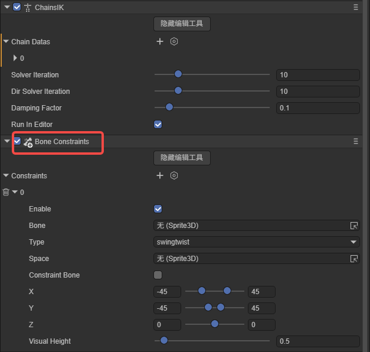
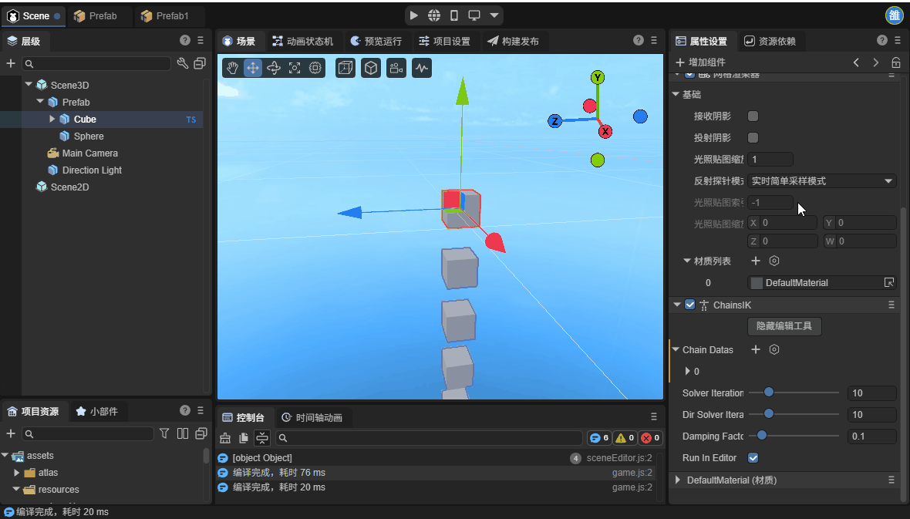
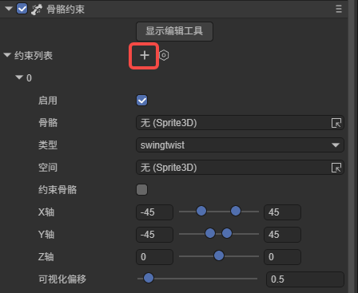
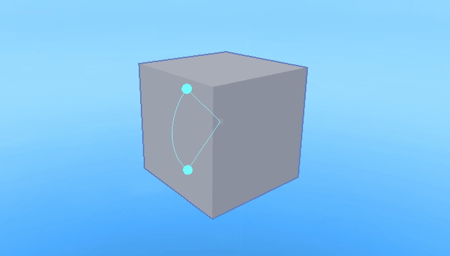

# 骨骼约束

## 一、前言

骨骼约束是一种用于控制和限制骨骼行为的机制。它就像是在骨骼上加了一层“规则”，让骨骼能够根据特定的逻辑自动运动，避免出现不自然的姿态。在引擎中骨骼约束组件需要与IK系统配合使用。

在阅读本文之前，建议开发者先了解[IK链](././ChainsIK/readme.md)。

## 二、创建骨骼约束

骨骼约束组件需要添加在已经添加了Ik组件的节点上，才能正常生效。

在属性设置面板中，点击增加组件，就可以在动画选项中找到骨骼约束组件。

添加好组件之后，还需要创建骨骼约束，点击加号即可创建：

## 三、骨骼约束的属性

骨骼约束有以下这些属性：

`启用`：是否启用该约束。

`骨骼`：要约束的骨骼节点。

`类型`：约束的类型。有`hinge（铰链）`、`euler（欧拉角）`、`swingtwist（摆动扭转）`三种

​	`hinge（铰链）`：最简单的约束，是一种类似于书翻页的结构，只允许骨骼绕着一个固定的轴进行旋转。

​	`euler（欧拉角）`：分别限制 X、Y、Z 三个轴的旋转范围，适用于需要独立控制三个轴旋转的关节。

​	`swingtwist（摆动扭转）`：将旋转分解为摆动和扭转两个独立分量，swing (摆动)分量形成一个圆锥形约束区域，twist (扭转)分量使骨骼绕轴旋转，一般用于模拟人体球窝关节（如肩膀）。

`空间`：约束空间，定义了约束的参考坐标系，影响约束的方向和行为。当`space`为 null 时，约束空间与父骨骼对齐，但保留当前骨骼的位置偏移。

`约束骨骼`：是否约束骨骼方向。

`X轴`： X 轴旋转角度范围。

`Y轴`： Y 轴旋转角度范围。

`Z轴`： Z 轴旋转角度范围。

`可视化偏移`：`swingtwist（摆动扭转）`模式下的可视化高度。

## 四、编辑工具

点击骨骼约束的显示编辑工具按钮，即可在场景中将骨骼约束显示出来，根据骨骼约束选择的类型，编辑工具显示的内容也不同。

hinge（铰链）模式：

此模式下只能设置X轴旋转角度范围，因此编辑工具只显示了一组角，点击并拖动白球即可调整旋转范围的上限和下限。

euler（欧拉角）模式：

此模式下可对三个轴分别设置旋转范围，因此编辑工具也显示了三组角，点击拖动对应颜色的球即可改变对应轴的旋转范围。

swingtwist（摆动扭转）模式

此模式下不能通过点击并拖动的方式改变范围，编辑工具只提供预览范围的效果。

