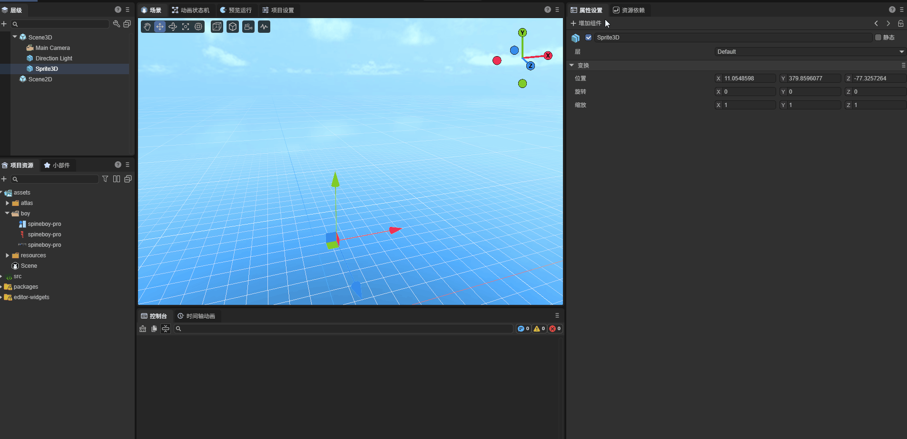
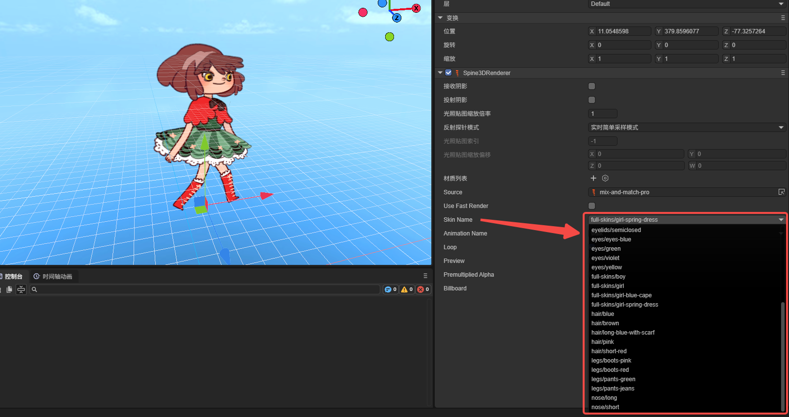
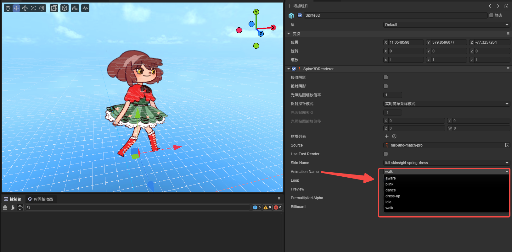

# Spine3D渲染器（`Spine3DRenderer`）


## 1、Spine3D使用入门

Spine3D渲染器是LayaAir引擎中用于在3D场景中播放Spine动画的组件。与2D Spine渲染器相比，3D版本能够在3D空间中更灵活地控制Spine动画的显示，支持面向相机、深度测试、光照影响等3D特性。

> 如何制作Spine骨骼动画，不在本文中介绍，感兴趣的开发者可以到[Spine 网站](https://zh.esotericsoftware.com/spine-academy)查看。

### 1.1 支持哪些 Spine 运行时

Spine3D渲染器与2D Spine渲染器共享相同的Spine运行时库。当前，LayaAir支持Spine 3.7、3.8、4.0、4.1、4.2版本的运行时库，开发者可以通过IDE的`项目设置` -> `引擎模块` -> 3D -> Spine3D，选择Spine动画相应版本的Spine运行时，操作界面如图1-1所示。


（图1-1）

**注意**：IDE无法自动识别Spine版本，所以开发者需要根据Spine资源的版本手动选择相应版本的运行时库，才可以保障Spine3D的正确运行。

### 1.2 Spine3D使用的基础流程

开发者需要在已创建的3D节点上，通过添加组件的方式，为节点添加`Spine3D渲染器`的组件，操作如动图1-2所示。



（动图1-2）

如果正常添加完Spine3D组件，并指定Spine资源，**没能在IDE中显示出来，通常是运行时库的版本不对**，需要先确认Spine资源的版本，并选择按图1-1所示，选择正确版本的Spine3D运行时库。

当通过代码来动态加载使用时，也需要注意Spine资源的运行时库版本。

代码动态添加的示例如下：

```typescript
const { regClass, property } = Laya;
@regClass()
export class Demo extends Laya.Script {
    spine3D: Laya.Spine3DRenderer;
    //组件被激活后执行，此时所有节点和组件均已创建完毕，此方法只执行一次
    onAwake(): void {
        // 加载Spine动画数据资源（json文件），注意一定要设置为Laya.Loader.SPINE类型，否则不会把json认为是SPINE资源
        Laya.loader.load("girl2/mix-and-match-pro.json", Laya.Loader.SPINE).then(() => {
            // 添加Spine3D渲染器组件到3D精灵节点上
            this.spine3D = this.owner.addComponent(Laya.Spine3DRenderer);
            this.spine3D.source = "girl2/mix-and-match-pro.json"; // 设置Spine动画数据源
            this.spine3D.skinName = "full-skins/girl"; // 设置皮肤名称
            this.spine3D.play("idle", false); // 播放名称为"idle"的动画，false表示不循环播放
        });
    }
}
```

## 2、Spine3D面板属性说明

### 2.1 源文件 source

Spine动画的资源文件路径，资源格式为`.skel`或`.json`。

### 2.2 使用快速渲染 useFastRender

Spine3D组件默认会开启快速渲染，此状态下，会采用GPU运算等一系列优化策略，使得Spine动画的性能大幅度提升。

然而这种优化策略为平衡性能与内存关系，会对单个顶点的骨骼数量采取限制，也就是单个顶点的骨骼控制数不能大于4。

当某个顶点的骨骼控制数量超过4个时，可能会导致渲染异常。引擎也会进行警告提醒。

当渲染异常后，可以取消`使用快速渲染`，恢复普通的渲染流程。但是，我们更建议调整Spine美术资源以获取最优的动画播放性能。

### 2.3 皮肤名称 skinName

当Spine里存在多套皮肤的话，通过切换不同的皮肤名称，可以在IDE里预览不同皮肤的效果，如图2-1所示。



（图2-1）

开发者也可以通过代码根据逻辑来动态切换不同皮肤。

示例代码如下：

```typescript
const { regClass, property } = Laya;

@regClass()
export class NewScript extends Laya.Script {
    spine3D: Laya.Spine3DRenderer;
    onEnable(): void {
        //拿到IDE节点上挂载的spine3D组件
        this.spine3D = this.owner.getComponent(Laya.Spine3DRenderer);
        let currentSkin: string = this.spine3D.skinName; // 记录当前皮肤状态
        //播放停止后执行逻辑
        this.owner.on(Laya.Event.STOPPED, this, () => {
            // 通过三元运算符切换皮肤名称
            currentSkin = currentSkin === "full-skins/girl" ? "full-skins/girl-blue-cape" : "full-skins/girl";
            this.spine3D.skinName = currentSkin;
            this.spine3D.play("idle", false); //切换后重新播放一次
            console.log(`当前皮肤切换至：${currentSkin}`);
        });
    }
}
```

### 2.4 动画名称 animationName

在前文的示例代码中，我们通过play方法来直接播放动画。为了在IDE面板中更方便易用，我们提供的访问器`animationName`封装了play方法。

使得开发者可以在IDE面板中，直接查看当前Spine3D动画的所有名称，用于切换和查看不同名称的动画效果。效果如图2-2所示。



（图2-2）

### 2.5 循环播放 loop

与动画名称（animationName）一样，循环播放（loop）也是为了IDE内可视化操作，封装的用于控制是否循环播放的play方法。

勾选为循环播放，不勾选仅播放一次。

### 2.6 面向相机 billboard

**面向相机**是3D Spine渲染器的特有功能。开启后，Spine3D动画将始终面向相机方向，类似于广告牌（Billboard）效果。

这对于需要在3D场景中始终正对玩家的UI元素或特效非常有用。例如，游戏中的伤害数字、浮动文字、指示标记等，都可以使用这个特性。

启用`面向相机`后，无论相机如何移动或旋转，Spine3D动画都会自动调整朝向，保持面向相机。效果如图2-3所示。


（动图2-3）

### 2.7 预乘Alpha premultipliedAlpha

通常情况下，LayaAir引擎会读取Spine动画与IDE中的'预乘Alpha'设置，根据设置对Spine纹理进行预乘处理。有些时候，开发者的图片本身已进行了预乘Alpha处理，但Spine与IDE中均没有勾选预乘Alpha选项，此时引擎将会作出错误判断与处理。启用此选项可以明确告知引擎，需要开启预乘Alpha处理。

### 2.8 渲染尺寸 renderSize
> 该功能需要在代码中启用

**渲染尺寸**用于控制Spine3D动画的显示大小。通过设置宽度（X）和高度（Y）参数，可以精确调整Spine3D的显示比例。

当不设置渲染尺寸时，Spine3D会使用Spine资源文件的原始尺寸。设置渲染尺寸后，将按照指定的尺寸进行显示。

### 2.9 启用缓存 enableCache
> 该功能需要在代码中启用

**启用缓存**是3D Spine渲染器的性能优化特性。当启用缓存后，Spine3D动画的渲染数据会自动缓存，提高重复播放的性能。

开启缓存后，动画的每一帧都会被缓存起来，再次播放同一动画时，可以直接使用缓存的数据，而不需要重新计算，从而显著提升性能。

### 2.10 物理更新 physicsUpdate

> 物理模拟的功能仅在Spine 4.2及以上版本上有效。

物理更新用于启用Spine的物理效果。启用后，动画的最终姿势不再完全由时间轴决定，而是会受物理效果的影响。

与2D Spine不同，3D Spine的物理更新可以通过`physicsTranslate`方法来交互，支持根据给定的坐标移动物体。


## 3、常见注意事项（必读）

### 3.1 异步加载导致的播放问题

有的时候由于Spine资源稍大，以及用户的网速较慢等综合原因，会导致代码在控制Spine3D组件的时候失效或报错。这是由于onAwake、onEnable等生命周期执行的时候，其实资源还处于异步加载中，并没有加载完。所以会出现使用问题。

解决方案是把稍大的Spine资源放到预加载的队列中，提前进行加载。

或者监听`Laya.Event.READY`事件，再进行逻辑处理。

示例代码如下：

```typescript
const { regClass, property } = Laya;

@regClass()
export class Demo extends Laya.Script {
    spine3D: Laya.Spine3DRenderer;
    onAwake(): void {
        // 加载Spine动画数据资源
        Laya.loader.load("spine/role.json", Laya.Loader.SPINE).then(() => {
            this.spine3D = this.owner.addComponent(Laya.Spine3DRenderer);
            this.spine3D.source = "spine/role.json";
        });

        // 监听READY事件
        this.owner.on(Laya.Event.READY, this, () => {
            console.log("Spine3D资源加载完成");
            this.spine3D.play("idle", true);
        });
    }
}
```

### 3.2 加载Spine的Json，必须指定类型

开发者如果加载二进制的Spine资源可以省略类型，因为Spine的二进制后缀比较特别，可以被直接引擎内部指定类型。但是JSON类型，是一种通用的资源类型，引擎无法内部指定类型，所以，开发者必须要在加载的时候指定Spine的类型为`Laya.Loader.SPINE`类型，示例如下：

```typescript
// 加载Spine动画数据资源（json文件），注意一定要设置为Laya.Loader.SPINE类型，否则不会把json认为是SPINE资源
Laya.loader.load(["aa.json", "bb.json"], Laya.Loader.SPINE);
```

### 3.3 存在透明混合的显示差异问题

一些开发者反馈，Spine上看到的效果与引擎效果有差异，常见的表现为亮度不够、半透明区域不明显等问题。

其实以上问题几乎都是透明混合的纹理配置导致的。由于LayaAir3D对spine预乘与不预乘的混合方式做了区分。

如果Spine存在透明混合的需求，则不能使用精灵纹理的纹理类型。需要对IDE项目的Spine资源需要做出如下的改动：

- 在项目资源面板中，选中Spine资源中的纹理。
- Spine纹理的属性面板上，把纹理类型改为默认值类型。
- 勾选sRGB颜色空间
- 注意不要勾选预乘Alpha（Spine导出的时候也不要勾选）
- 点击应用

以上操作如图3-1所示：


（图3-1）

注意：如果应用后效果不对，刷新一下IDE即可。
另外，如果有多个Spine，可以多选纹理，一次性设置好。或者开发者通过编写IDE插件自动处理以上操作。

### 3.4 不要主动加载Spine的atlas和png

当开发者在代码加载或IDE的Scene2D中预加载了Spine的atlas之后，运行的时候会出现类似以下提示的警告。

```sh
Failed to load 'http://localhost:18094/resources/ddlx_02/ddlx_02.atlas' Unexpected token 'd', "ddlx_02.pn"... is not valid JSON
```

这是由于，虽然spine的atlas和我们引擎的图集文件atlas同名，但不是同样的东西。我们的图集信息是Json格式，而Spine的不是，所以加载的时候，发现atlas不是JSON，就报了`"... load 'xxx.atlas'....is not valid JSON"`的警告。

开发者在加载Spine时，只需要加载Spine的主文件（`.skel`或`.json`）即可。atlas和png都不需要开发者主动加载，引擎会自动根据Spine主文件加载关联资源。

### 3.5 3D场景中的坐标转换

在3D场景中使用Spine3D时，需要注意坐标系统的转换。Spine3D使用的是3D世界坐标系，与2D场景的坐标系不同。

开发者可以通过以下方式获取和控制Spine3D的世界坐标：

```typescript
const { regClass, property } = Laya;

@regClass()
export class Demo extends Laya.Script {
    spine3D: Laya.Spine3DRenderer;
    onUpdate(): void {
        // 获取世界位置
        let worldPos = this.owner.transform.position;
        console.log(`Spine3D世界坐标: ${worldPos.x}, ${worldPos.y}, ${worldPos.z}`);

        // 获取屏幕坐标（用于点击检测等）
        let screenPos = this.spine3D._baseRenderNode.shaderData.getVector(Sprite3D.WORLDMATRIX);
    }
}
```

### 3.6 快速渲染模式的限制

与2D Spine相同，3D Spine的快速渲染模式对顶点的骨骼控制数量有限制。如果Spine资源中某个顶点被超过4个骨骼控制，可能会出现渲染错误。

出现以下警告时，建议关闭快速渲染模式：

```sh
WARNING: Vertex bone count exceeds limit (4)
```

关闭快速渲染的代码：

```typescript
this.spine3D.useFastRender = false;
```

### 3.7 物理功能的版本要求

**物理更新**和**物理平移**功能仅在Spine 4.2及以上版本中有效。如果使用的是低版本的Spine资源，调用这些方法将不会有任何效果。

开发者需要在加载Spine资源前确认版本，避免调用不兼容的功能。

## 4、性能优化建议

### 4.1 合理使用快速渲染

快速渲染模式可以显著提升性能，建议在以下情况启用：
- Spine资源简单，顶点骨骼控制数不超过4
- 场景中Spine实例数量较多
- 对性能有较高要求的游戏

### 4.2 适时启用缓存

缓存功能会占用额外内存，建议在以下情况启用：
- 动画循环播放时间较长
- 相同动画需要重复播放
- 动画数据复杂，计算成本高

不建议在以下情况启用缓存：
- 动画只播放一次
- 内存资源紧张
- 频繁切换动画

### 4.3 控制实例数量

在3D场景中，过多同时播放的Spine3D实例会显著增加Draw Call。建议通过对象池管理Spine3D实例，及时回收不用的实例。

### 4.4 优化资源加载

建议将常用的Spine资源预加载，避免运行时动态加载导致的卡顿。

```typescript
// 预加载常用Spine资源
Laya.loader.load([
    "spine/role_idle.json",
    "spine/role_run.json",
    "spine/role_attack.json"
], Laya.Loader.SPINE);
```
