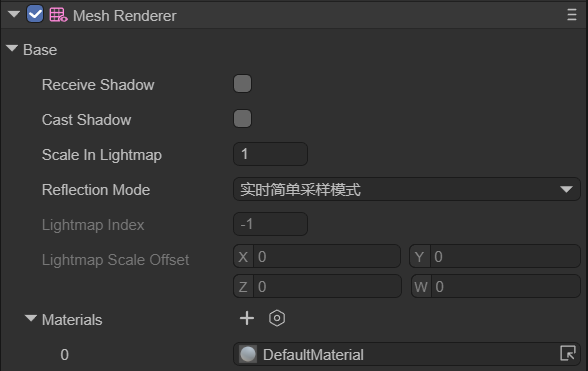

# 网格渲染器（MeshRenderer）

## 一、概述

MeshRenderer（网格渲染器）组件用于渲染3D网格模型。它继承自 BaseRender 组件类，与同一节点上的 MeshFilter 组件配合使用——MeshFilter 提供网格数据，MeshRenderer 负责将其渲染到场景中。

在 IDE 的组件面板中，添加 MeshRenderer 组件后的效果如图1-1所示：



（图1-1）

> MeshRenderer 的子类 SkinnedMeshRenderer（蒙皮网格渲染器）用于渲染带有骨骼动画的网格，本文档不做展开。

## 二、属性说明

### 2.1 阴影相关

**receiveShadow（接收阴影）**

指定该渲染器是否接收其他物体投射的阴影。类型为 `boolean`，默认为 `false`。

**castShadow（投射阴影）**

指定当合适的光源照射到该渲染器时，是否投射阴影。类型为 `boolean`，默认为 `false`。

> 阴影功能需要配合支持阴影的灯光组件（如方向光）才能生效，详见 [灯光与阴影](../../3DLight/Shadow/readme.md)。

### 2.2 光照贴图

**lightmapIndex（光照贴图索引）**

光照贴图的索引号，类型为 `number`。当场景烘焙了光照贴图后，该值指定当前渲染器使用哪一张光照贴图。

**lightmapScaleOffset（光照贴图缩放偏移）**

光照贴图的缩放和偏移值，类型为 `Vector4`。用于控制光照贴图在网格表面上的映射方式。

### 2.3 材质

**Materials（材质列表）**

渲染器的材质列表。一个 MeshRenderer 可以持有多个材质，每个材质对应网格的一个子网格（SubMesh）。

#### material 与 sharedMaterial 的区别

> **material**

当引用修改 `material` 属性时，LayaAir 会返回该渲染器下第一个**实例化后的材质**副本。

每个 MeshRenderer 组件有一个 Materials 数组，该数组决定了该物体上可以放几个 Material 组件，默认为1。当同一个物体上有多个 Material 时，可以手动调整 Material 组件的顺序。这里的"第一个实例化后的material"指的是该物体上排列的第一个 Material 组件。

每次引用 `material` 属性都会在内存中生成一个新的 Material 实例，但不会改变项目工程中材质资源的原始属性设置。

> **sharedMaterial**

当修改 `sharedMaterial` 时，所有使用该材质的物体都会受到影响，并且修改后的设置会被保存到项目工程中。

例如，cube01 和 cube02 共用材质 redMat，当通过 `sharedMaterial` 修改 cube01 的材质属性时，cube02 上对应的属性也会被同步修改。

> **使用建议**

- 使用 `material`：每次调用都会生成新的 Material 实例到内存中，适合需要独立材质的场景
- 使用 `sharedMaterial`：直接在原材质上修改，不生成新实例，适合确定材质仅被一个物体使用或需要批量修改的场景
- **推荐做法**：对于频繁修改材质属性的物体（如主角），可以先通过 `material` 获取一次实例化副本，之后使用 `sharedMaterial` 进行修改，避免重复创建新实例

### 2.4 渲染控制

**enabled（启用渲染）**

是否启用渲染器，类型为 `boolean`。设为 `false` 时，该渲染器将不会渲染任何内容。

**lightProbe（光照探针）**

光照探针模式。当场景中放置了光照探针（Volume GI）时，可通过该属性控制渲染器是否接受光照探针的间接光照。

### 2.5 其他属性

**bounds（包围盒）**

渲染器的包围盒，类型为 `Bounds`，只读属性。用于视锥裁剪和碰撞检测等。

**sortingFudge（排序矫正值）**

排序矫正值，类型为 `number`。用于调整渲染器的排序顺序，值越小越先渲染。

**ratioIgnor（距离裁剪系数）**

基于距离和包围盒的裁剪系数，类型为 `number`。值越大越容易被裁剪。

**reflectionMode（反射模式）**

反射模式，类型为 `ReflectionProbeMode`。设置渲染器使用的反射探针模式。

## 三、Morph Target（变形目标）

MeshRenderer 支持 Morph Target（变形目标 / 混合变形）功能，常用于面部表情动画等场景。

通过 `setMorphChannelWeight` 方法可以设置指定通道的权重：

```typescript
// 获取 MeshRenderer 组件
let meshRenderer = node.getComponent(Laya.MeshRenderer);

// 设置 morph target 通道权重（0.0 ~ 1.0）
meshRenderer.setMorphChannelWeight("smile", 0.8);
meshRenderer.setMorphChannelWeight("blink", 1.0);
```

## 四、代码示例

### 4.1 基本使用

```typescript
// 创建 3D 节点
let sprite3D = new Laya.Sprite3D();
scene.addChild(sprite3D);

// 添加 MeshFilter 和 MeshRenderer 组件
let meshFilter = sprite3D.addComponent(Laya.MeshFilter);
let meshRenderer = sprite3D.addComponent(Laya.MeshRenderer);

// 设置网格（以内置 Box 网格为例）
meshFilter.sharedMesh = Laya.PrimitiveMesh.createBox(1, 1, 1);

// 设置材质
meshRenderer.material = new Laya.BlinnPhongMaterial();
```

### 4.2 阴影设置

```typescript
let meshRenderer = node.getComponent(Laya.MeshRenderer);

// 开启投射阴影
meshRenderer.castShadow = true;

// 开启接收阴影
meshRenderer.receiveShadow = true;
```

### 4.3 材质操作

```typescript
let meshRenderer = node.getComponent(Laya.MeshRenderer);

// 获取实例化材质（会创建副本）
let mat = meshRenderer.material;

// 获取共享材质（直接引用原材质）
let sharedMat = meshRenderer.sharedMaterial;

// 获取所有材质
let allMats = meshRenderer.sharedMaterials;
```

> 创建基础模型请参考 [3D基础显示对象](../../../3D/displayObject/readme.md)
