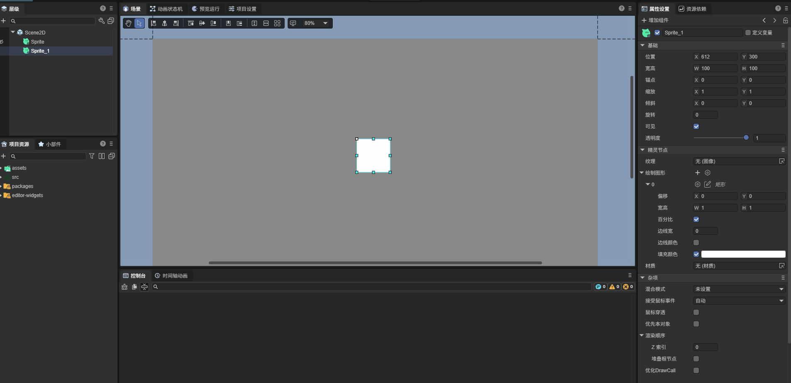

# 静态碰撞器 StaticCollider

> Author : Charley

引擎提供了 `StaticCollider`（静态碰撞器）组件类，专门用于处理静态物理对象（如地面、墙壁等不可移动的物体）。

`StaticCollider` 继承自 `ColliderBase`，其类型始终为 `static`。在位置上保持绝对静止，不受重力、冲量或其他外力的影响。

## 一、静态碰撞器的作用

静态碰撞器的主要作用是为场景提供物理边界和障碍物。当动态刚体与静态碰撞器接触时，动态刚体可以根据物理规则做出相应反应（如反弹、滑动或停止），而静态碰撞器本身保持不动。

从性能角度看，静态碰撞器比动态的刚体更为高效，因为不需要计算位置、速度、加速度等动态属性。

创建静态碰撞器如动图1-1所示

## 二、碰撞形状

`StaticCollider` 拥有 `shapes` 属性（类型为 `Physics2DShapeBase[]`），可以包含多个碰撞形状，与 `RigidBody` 使用相同的碰撞形状体系。

关于碰撞形状的详细说明，请参考 [2D物理编辑总览](../../../physicsEditor/physics2D/readme.md) 中碰撞形状章节。

## 三、与刚体类型的对比

|                  | 静态碰撞器 `StaticCollider`  | 动态刚体 `dynamic` | 运动学刚体 `kinematic` |
| ---------------- | ---------------------------- | ------------------- | ---------------------- |
| 是否受外部力影响 | 静止不动，且不受外部力影响   | **受外部力影响**    | 不受外部力影响         |
| 是否受重力影响   | 不受重力影响                 | **受重力影响**      | 不受重力影响           |
| 是否可设置速度   | 速度为零，且**不可设置**     | 可设置速度          | 可设置速度             |
