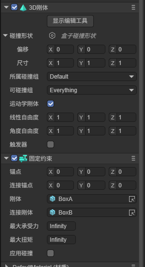

# 固定约束 FixedConstraint

> Author : Charley

固定约束（FixedConstraint）将两个物体完全固定在一起，限制所有的相对平移和旋转运动，就像被焊接在一起一样作为一个整体运动。常用于将武器固定到角色手上、将零件固定到机器上等场景。

固定约束没有专有属性，所有属性均来自约束基类 ConstraintComponent。由于其它约束类型也继承了这些基类属性，本文档同时作为约束通用属性的详细参考。

在 IDE 中为节点添加固定约束组件后，如图1-1所示：



（图1-1）

## 一、刚体与连接刚体`connectedBody`

约束组件需要挂载在一个带有物理碰撞器组件（Rigidbody3D 或 PhysicsCollider）的节点上，该节点即为约束的**刚体**。

**连接刚体**`connectedBody`用于指定约束连接的另一个目标刚体。约束会在刚体与连接刚体之间建立约束关系。若不指定连接刚体，物体会被约束到世界空间中的固定位置。

## 二、锚点`anchor`与连接锚点`connectAnchor`

**锚点**是约束在自身物体上的作用点，**连接锚点**是约束在连接刚体上的作用点，均使用本地坐标系的 Vector3 值。两个锚点共同定义了约束两端的连接位置。

## 三、最大承受力`breakForce`与最大扭矩`breakTorque`

**最大承受力**设置约束可承受的最大力，**最大扭矩**设置约束可承受的最大力矩。当约束承受的力或力矩超过阈值时，约束将断裂，两个物体随即分离。

默认值均为极大值（9999999），表示约束不会断裂。如果需要模拟可破坏的连接（如门被撞开、零件脱落），可以将它们设为合理的数值。

## 四、应用碰撞`enableCollison`

默认情况下，被约束连接的两个物体之间不进行碰撞检测。勾选**应用碰撞**后，约束连接的物体之间也能产生碰撞响应。

## 五、其它基类方法

约束基类还提供了以下代码中可用的属性和方法：

- `currentForce`：获取约束当前承受的力（Vector3），可用于判断约束是否接近断裂。
- `currentTorque`：获取约束当前承受的力矩（Vector3）。
- `setConstraintEnabled(enable)`：设置约束是否启用。
- `setOverrideNumSolverIterations(iterations)`：设置求解器迭代次数，次数越高越精确，但性能消耗也越大。

## 六、运行效果

动图1-2演示了固定约束的效果，两个物体被完全固定在一起直到约束断裂后分离：


（动图1-2）

## 七、代码示例

以下示例演示了如何通过代码配置固定约束：

```typescript
const { regClass, property } = Laya;

@regClass()
export default class FixedConstraintDemo extends Laya.Script {
    declare owner: Laya.Sprite3D;

    onAwake(): void {
        // 获取固定约束组件
        let constraint = this.owner.getComponent(Laya.FixedConstraint);

        // 设置最大承受力和最大扭矩（超过则断裂）
        constraint.breakForce = 1000;
        constraint.breakTorque = 500;

        // 允许约束连接的两个物体之间发生碰撞
        constraint.enableCollison = true;
    }
}
```

## 八、关联文档

- [《3D物理系统》](../../../physicsEditor/physics3D/readme.md)
