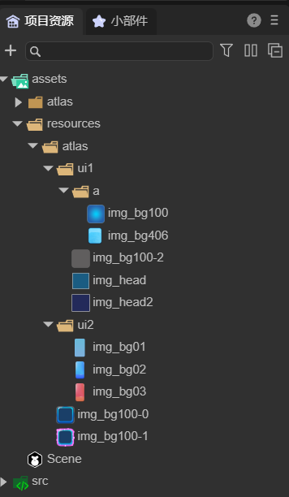
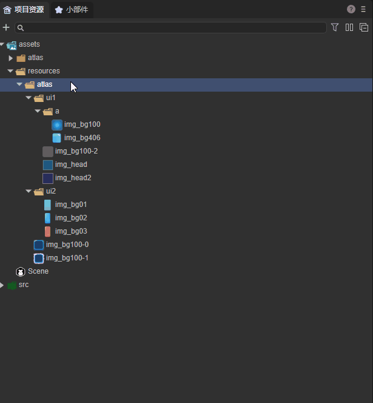
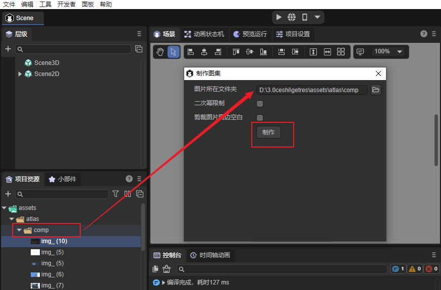
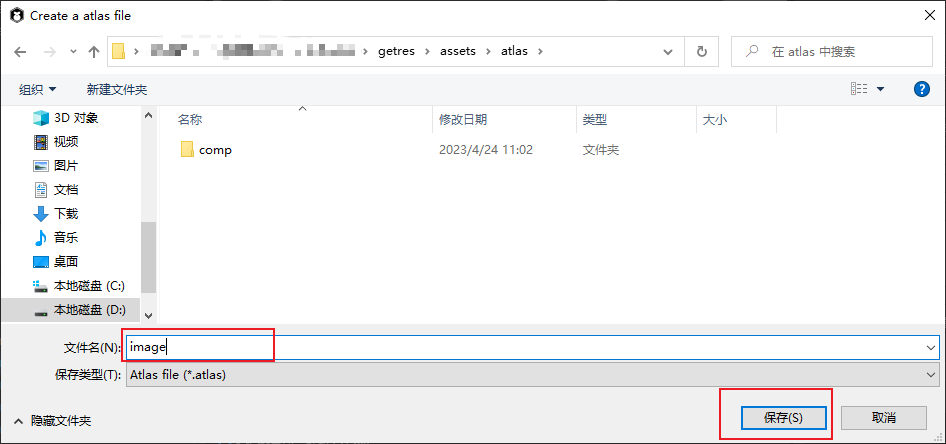
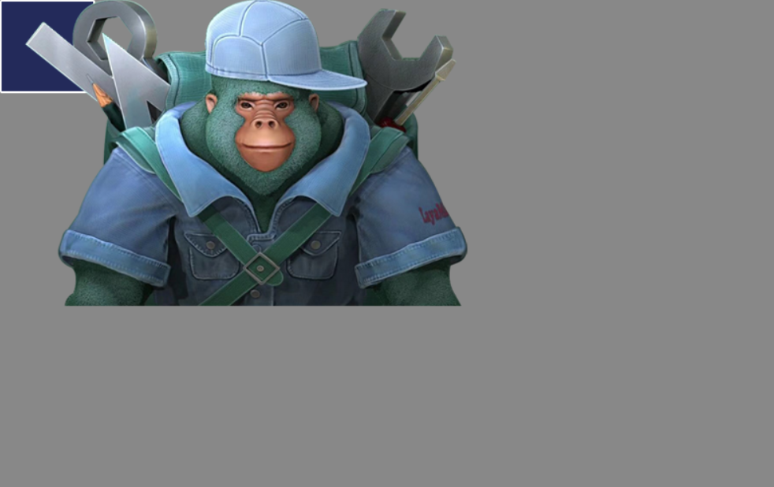

# 自动图集配置

## 打包图集

图集(Atlas)是游戏开发中常见的一种美术资源，通过IDE发布流程将多张图片合并成一张大图，并通过atlas格式的文件存放原始图片资源信息。

图1-1就是采用LayaAirIDE打包好的一张png图集资源。 


(图1-1)

### 3.1 为什么要使用图集资源

在游戏中使用多张图片合成的图集资源作为美术资源，有以下优势：

**1 优化内存**

合成图集时会去除每张图片周围的空白区域，加上可以在整体上实施各种优化算法，合成图集后可以大大减少游戏包体和内存占用。

**2 减少CPU运算**

多个 `Sprite` 如果渲染的是来自同一张图集的图片时，这些`Sprite`可以使用同一个渲染批次来处理，大大的减少CPU的运算时间，提高运行效率。


### 3.2 支持图集打包的格式

LayaAirIDE支持对PNG与JPG两种资源格式打包为图集。但是图集打包的原始资源，推荐使用PNG，因为JPG的体积会较大。

> Tips：
>
> 需要注意的是，PNG原始资源的位深度不能超过32，否则打包出来的图集会出现花屏。打进图集的资源 Texttrue Type 属性要设置为 SpritetTextrue 。另外，PNG与JPG资源不能是其它格式的资源改名为PNG与JPG格式的。


### 3.3 用LayaAir IDE制作图集的方式

用LayaAir IDE制作图集有两种方式，第一种方式更为细致，第二种方式更为简单快捷，开发者可以自行选择。

#### 3.3.1 自动生成

自动将图片资源打包只有在LayaAir IDE发布时才可以，但是需要添加和设置图集打包配置文件，这里我们通过一个示例来讲解，如图1-2所示： 



（图1-2） 

1，所有的图片资源都放在 assets/resources 目录下，上文提到，由于项目开发中图片可能会使用代码的使用方式，因此在不指定“始终包含的资源目录”的情况下，放在resources目录下会直接发布到输出目录中。

2，resources目录下的atlas目录，用来存放一些散图和子文件夹（里面也有散图），这么做的好处是对资源做好分类管理，往往resources目录下还有其它资源目录，尽量把图片资源和其它资源分开存放。

3，atlas目录下，有两张图片（img_bg100-0.png和img_bg100-1.png）和子文件夹ui1、ui2，里面分别有很多散图，同时ui1目录下还有 a子文件夹。

如果不进行图集打包，那么在发布后，输出目录下的 atlas 目录里都是散图。下面来看看如何打包图集：

**第一步：添加配置文件**

如动图1-3所示，在atlas目录下添加配置文件。  



（动图1-3）

在resources/atlas目录下，右键->创建，选择“自动图集设置”，则会创建一个AtlasConfig.atlascfg文件。放到atlas下的目的，是可以对atlas目录中的图片和子文件夹下的图片同时进行图集打包（支持单张图集和多个子文件夹图集）。开发者可以对此文件重命名。


**第二步：图集设置文件属性**

点击 AtlasConfig 文件，如图1-4所示： 


（图1-4）

`子文件夹处理`：

每个子目录创建一个纹理集：每个子文件夹打包一个图集。

共用一个纹理集：所有子文件夹和同级目录中的图片打包成一个大图集。

`包含子文件夹`：

勾选后，支持将子文件夹打包图集，不勾选，只处理同一级目录中的图片打包图集。

`图集最大宽\高度`：

默认值为`2048×2048`，该值决定单个图集的最大尺寸。如果原始图片过多，超过单个图集最大宽高时，则会在打包时生成新的图集文件（多个图集）。

`单图最大宽\高度`：

默认值为`512×512`，超过这个尺寸的单图将不会被打包到图集中。

> Tips：超过512×512的单图不建议打包到图集中，可以单独预加载此图，但是，加载单图也不能超过1024×1024，否则会对性能有影响。

`纹理集缩放`：

这里可以通过缩放减少图集体积，比如改为0.5，IDE会按原图宽高分别乘0.5生成到图集中，显示的时候会保持会通过拉伸保持原图大小，这样处理后，虽然图集的尺寸会变小，但是显示的效果也会有所影响，可以视为一种图集的另类压缩方案。如果要保持设计时的图片精度，尽量不要调整默认值。

`二次幂限制`：

如果勾选，则生成的图集图片宽高将会是2的整次幂。这里，建议美术在设计的时候，就按2的整次幂来设计，通过图集工具强行保持2的整次幂，肯定会导致图集的体积变大。所以，除非是面临某些强制要求按2的整次幂优化的Runtime环境，常规情况下无需勾选，尽量提要求给美术设计人员，按32、64、128、256等2的整次幂来设计图片的宽高。

`剪裁图片周边空白`：

如果勾选，则生成的图集图片会自动把原始图片中空白区域裁剪掉。默认是是勾选状态，不要去掉。

`纹理格式`：

png32为默认格式，此格式支持透明度和更多的颜色；png24，无透明度；纹理压缩参考文档[《纹理压缩》](../../IDE/uiEditor/textureCompress/readme.md)。


**第三步：发布生成图集**

当设置好后，在“构建发布”进行发布，等待发布成功，这时来看看发布后的目录，如图1-5所示： 


（图1-5）

1、生成了3个图集（AtlasConfig，ui1 和 ui2），由于选择了 `每个子目录创建一个纹理集` 方式，ui1 和 ui2 各自生成一个图集（子文件夹打成的图集文件命名是按照文件夹名字），atlas下的图生成一个图集（AtlasConfig.atlascfg所在文件夹生成的图集文件命名按照AtlasConfig文件名）。

2、如果有尺寸超过了512x512的图，则不打入图集（512×512是图1-4的设置）。

3、ui1目录下存在一个a目录，并且勾选了`包含子文件夹`，所以在图集ui1中也打入了a文件夹下的散图。如果不勾选`包含子文件夹`，则ui1/a 目录会保留，下面还是散图。


#### 3.3.2 工具制作

第二种方式更为快捷简单，但无法做到像第一种方式那样进行细致的属性设置，此方法在[《动画节点》](../../2D/displayObject/Animation/readme.md)中也有提到，下面来为大家演示。

首先点击”工具“菜单中的”制作图集“。 


（图1-6）

然后将所需要打包的文件夹拖入图片所在文件夹中，点击`制作`。 



（图1-7）

也可以点击文件夹图标自行选择路径，如图1-8所示。 


（图1-8）

点击制作之后，输入文件名点击保存如图1-9所示。 



（图1-9）

这样图集就制作好了。

当我们对图集中包含的图片有增删时，只需要重复一次上面的流程，点击.atlas文件，点击是，即可成功替换，如图1-10所示。


（图1-10）

> [!Tip]
>
> 如果使用第二种图集打包方式，那么开发者要保证，此目录会非常稳定，后续不会进行图片资源的增删修改，如果不能保证稳定的目录，那么最好使用第一种打包方式。


### 3.4 打包生成的图集文件介绍

#### 3.4.1 打包生成的图集文件

打包图集后，会生成图集专用资源（分别是同名的`.atlas`文件和`.png`文件）

#### 3.4.2 atlas后缀文件

`.atlas`是LayaAirIDE特有的图集格式，仅用于图集，所以在加载`.atlas`时不需要填写类型，和加载普通的单图方式一样，更加方便，是推荐的图集加载方式。atlas方式加载图集的示例代码为：

```typescript
//atlas方式图集使用示例
Laya.loader.load("resources/atlas/Atlas_ui.atlas").then( 
	()=>{} 
);
```


### 3.5 如何在项目中使用图集中的小图

在项目中如果用到图集中的资源，则需先预加载图集资源，然后设置图片的皮肤（*skin*）属性值为“原小图目录名/原小图资源名.png”。

例如：现在我们将图1-5中原来的小图 `img_head2.png` 和  comp 目录下的 image.png 在项目中通过图集的方式显示出来，示例代码如下：

```typescript
        let resArr: Array<any> = [

            { url: "resources/atlas/Atlas.atlas", type: Laya.Loader.ATLAS },
            { url: "resources/atlas/Atlas_ui.atlas", type: Laya.Loader.ATLAS },
            { url: "resources/atlas/Atlas_comp.atlas", type: Laya.Loader.ATLAS }];


        Laya.loader.load(resArr).then( ()=>{
                //创建Image1实例
                var img1 = new Laya.Image();
                //设置皮肤（取图集中小图的方式就是 原小图目录名/原小图资源名.png）
                img1.skin = "resources/atlas/img_head2.png";
                //添加到舞台上显示
                Laya.stage.addChild(img1);

                //创建Image2实例
                var img2 = new Laya.Image();
                //设置皮肤（取图集中小图的方式就是 原小图目录名/原小图资源名.png）
                img2.skin = "resources/atlas/comp/image.png";
                //添加到舞台上显示
                Laya.stage.addChild(img2);
            } 
        );
```

运行效果，如图1-11所示：



（图1-11）

至此，打包图集就介绍完了，开发者需要提前规划好图片的目录管理，可以根据功能划分，每个功能创建一个子文件夹，这样图集的尺寸能尽量控制在合理范围内，按功能划分的好处也是方便查找。开发者在使用过程中如果遇到问题，欢迎随时和我们交流。