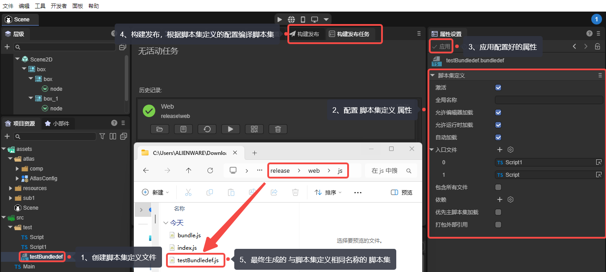
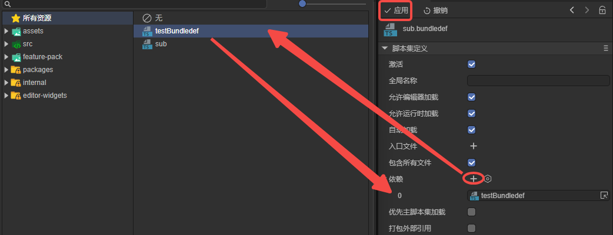

# 脚本集定义

> Author: Charley

## 1、基础使用流程

### 1.1 什么是脚本集定义

在了解“脚本集定义”之前，我们先明确什么是“脚本集”。

顾名思义，**脚本集**是由一组脚本文件组成的集合。

在 `LayaAir3-IDE` 的默认构建发布流程中，会将项目 `src` 目录下的所有 `TypeScript` 脚本统一编译并打包为一个名为 `bundle.js` 的脚本集合文件。我们称之为主脚本集。

而 **脚本集定义（Script Bundle Definition）**，则用于**自定义和管理这些脚本集合的构建方式**，使项目不仅局限于主脚本集，还可以根据需求创建多个独立的脚本集。

通过创建并配置 `.bundledef` 文件，开发者可以指定哪些 `TypeScript` 文件应被打包成独立的模块化 `.js` 文件，从而实现**脚本的模块化使用**。

### 1.2 创建脚本集定义

脚本集定义文件（ `.bundledef` ）通常放在一个独立的模块目录内，例如分包目录。

在项目资源面板中，通过 **右键目录 → 创建 → 脚本集定义** 即可生成脚本集定义文件，如图1-1所示。

  

（图1-1）

### 1.3 使用脚本集定义

脚本集定义有两种应用场景，一种是在主包中使用，另一种是分包中使用。

#### 1.3.1 主包中使用脚本集定义

选中脚本集定义文件（`.bundledef`），在属性面板中完成相关配置后，点击“应用”以保存设置。

构建发布完成后，系统会在主包目录（`js` 文件夹）下生成一个与**脚本集定义**文件同名的**脚本集**文件，如图1-2所示。

 

（图1-2）

> 具体的脚本集定义文件属性说明将在第2小节中介绍

#### 1.3.2 分包中使用

在构建发布设置中，通用 -> 分包 -> 分包配置 项允许将脚本集定义文件指定为该分包的**入口脚本**，如图1-3所示。

 

(图1-3)

当**脚本集定义**文件被设为分包**入口脚本后**，**构建发布**生成的**脚本集**文件名称，将不再与**脚本集定义**文件名一致，而是统一命名为分包目录下的 `game.js`，如图1-4所示。

（图1-4） 

## 2、文件配置属性说明

> 本小节开始 逐个介绍 脚本集定义文件 的属性配置

### 2.1 激活 `enabled`

默认勾选，勾选后脚本集定义的配置才会生效。

### 2.2 全局名称 `globalName`

一般不需要设置。用于模块命名，例如`module1`，那么其他模块可以通过”`module1.xxx`“访问这个模块导出的类和函数。

### 2.3 允许编辑器加载 `allowLoadInEditor`

默认勾选，控制脚本集是否在编辑器环境中被加载。

### 2.4 允许运行时加载 `allowLoadInRuntime`

默认勾选，发布构建时，只有勾选了该属性的脚本集才会被包含。

### 2.5 自动加载 `autoLoad`

默认勾选，决定是否在启动时自动加载执行脚本。

### 2.6 入口文件 `entries`

入口文件`entries` 用于控制哪些`TypeScript`文件需要被编译并打包到该脚本集（`js`）中。

在构建过程中，系统首先根据`entries`数组中指定的需要包含的`TypeScript`文件，

然后这些入口文件`entries` 引用的文件，以及被场景和预制体资源引用的文件才会被最终包含到输出中。

注意，非当前**脚本集定义**相同目录下的外部TS文件即使在该脚本集定义的`entries`中指定，也会被过滤掉。这种机制既提供了精确的文件选择能力，又保证了脚本集的封装性和模块隔离性。

在`IDE`中的具体操作方式为：

拖拽TS脚本文件到入口文件的右侧加号（+）处。或者，点击 加号（+）选择要编译的TS脚本文件，添加到入口文件的列表中，如图2-1所示：

 

（图2-1） 

### 2.7 包含所有文件 `includeAllFiles`

默认不勾选，

勾选后，构建发布流程会编译**脚本集定义文件**所在目录下**全部TS脚本**文件 为 对应的脚本集（`js`）。

只有不勾选的时候，才会处理**入口文件**`entries`中指定的TS脚本文件。

### 2.8 依赖 `references`

依赖`references`是指脚本集之间的依赖关系，用于调整不同脚本集之间的加载顺序，确保依赖项总是先于被依赖项处理，从而避免因依赖顺序错误导致的运行时错误。

例如，当一个脚本集A引用了另一个脚本集B时，A依赖于B中定义的内容。那么A脚本集定义中需要设置依赖为B脚本集定义，系统则会确保B在A之前被编译和加载。

点击 + 号，添加引用功能所在的脚本集定义文件，如图2-2所示，以确保加载顺序正确。  

 

(图2-2)

> 禁止依赖自己

### 2.9 优先主脚本集加载 `loadBeforeMain`

前文介绍过，主脚本集是指`bundle.js`。

`loadBeforeMain`决定了基于当前**脚本集定义** 编译的 模块脚本集（`js`） 是在 主脚本集（`bundle.js`）之前还是之后加载 。

如果勾选，则优先于`bundle.js`之前加载；未勾选，则在`bundle.js`之后再加载。

### 2.10 打包外部引用 `bundleExternals`

打包外部引用`bundleExternals`用于控制脚本集在打包时如何处理对脚本集外部文件的引用。

**不勾选**时，构建发布系统会检测脚本集中引用的文件是否属于其他脚本集，如果引用了其他脚本集的文件，不会将外部脚本文件内容编译打包进来，而是创建对该脚本集的引用。

**默认是不勾选。**保持脚本集之间的独立性，避免代码重复。

**勾选后，**不会进行脚本集检测，所有被引用的文件内容都会被直接打包到当前脚本集中，即使引用的脚本文件属于其他脚本集，也会被包含进来。最后生成的是完整的脚本文件内容，而不是引用。

在某些情况下，可能需要将外部依赖直接打包进来，以确保代码正常运行。当需要将相关代码聚合到一个脚本集文件（`js`）中时，可以勾选此选项。