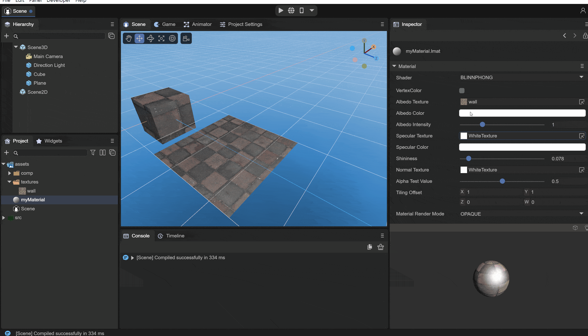
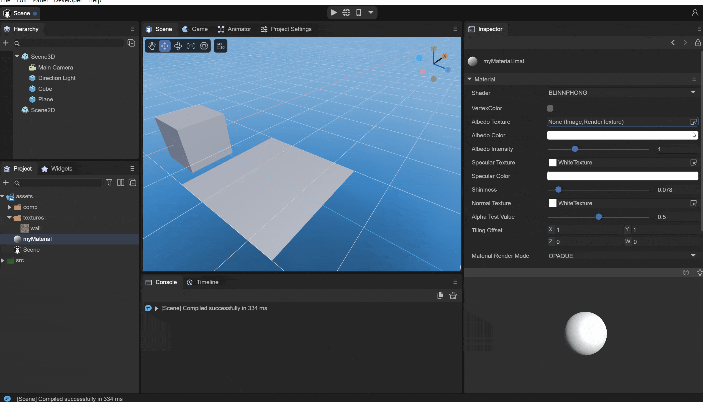
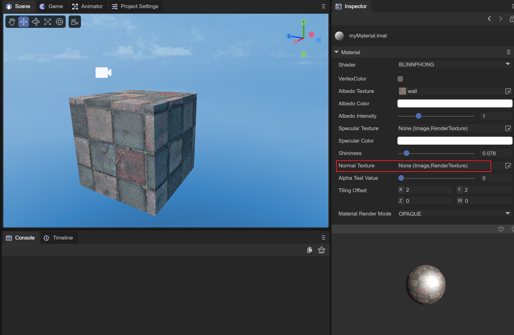

# 布林冯材质

> Author: Charley

布林冯材质（BlinnPhongMaterial）是LayaAir引擎中基于经典Blinn-Phong光照模型实现的材质类型。Blinn-Phong光照模型通过简洁的数学计算描述物体表面对光的吸收与反射，使物体呈现不同的明暗程度和高光效果。相较于PBR材质，布林冯材质的计算量更小、性能开销更低，适用于对真实感要求不极致但需要良好光照效果的场景。

## 一、布林冯材质概述

### 1.1 Blinn-Phong光照模型

Blinn-Phong光照模型是在Phong光照模型基础上改进而来的经典光照模型，主要由三个分量组成：

- **环境光（Ambient）**：模拟环境中的间接光照，为物体提供基础亮度；
- **漫反射光（Diffuse）**：模拟光线照射到粗糙表面后向各个方向均匀散射的效果；
- **镜面高光（Specular）**：模拟光线照射到光滑表面后产生的高光反射。

与PBR材质通过物理规律计算光照不同，Blinn-Phong使用经验公式近似模拟光照效果，因此在计算量上更加轻量。

### 1.2 与PBR材质的区别

| 对比项 | BlinnPhong材质 | PBR材质 |
|---|---|---|
| 光照模型 | 经验光照模型 | 基于物理的光照模型 |
| 参数直观性 | 需要手动调节漫反射和高光 | 金属度/粗糙度参数更直观 |
| 真实感 | 较好 | 更接近真实 |
| 性能开销 | 较低 | 较高 |
| 适用场景 | 卡通风格、低端设备、性能敏感场景 | 写实风格、高品质渲染 |

### 1.3 类继承关系

```
Material → BlinnPhongMaterial
```

在IDE中创建材质并选择 BlinnPhong Shader时，使用的就是 `BlinnPhongMaterial`。

## 二、反照率（Albedo）

反照率相关属性定义了布林冯材质的漫反射外观。

### 2.1 反照率颜色（albedoColor）

`albedoColor` 属性定义材质表面的固有颜色，类型为 `Color`（RGBA）。它与漫反射贴图颜色相乘后决定最终的漫反射颜色。


（图2-1）

### 2.2 反照率贴图（albedoTexture）

`albedoTexture` 属性用于设置漫反射贴图，提供逐像素的颜色细节。贴图颜色与 `albedoColor` 相乘后产生最终的漫反射颜色效果。


（图2-2）

### 2.3 反照率强度（albedoIntensity）

`albedoIntensity` 属性控制反照率的亮度强度，类型为 `number`。通过调节该值可以整体提亮或压暗漫反射颜色。

### 2.4 纹理平铺和偏移（tilingOffset）

`tilingOffset` 属性控制纹理在模型表面的重复次数和偏移量，类型为 `Vector4`：

| 分量 | 说明 |
|---|---|
| X | 纹理在U方向的重复次数（Tiling） |
| Y | 纹理在V方向的重复次数（Tiling） |
| Z | 纹理在U方向的偏移量（Offset） |
| W | 纹理在V方向的偏移量（Offset） |

## 三、高光（Specular）

高光属性控制材质表面的镜面反射效果，是布林冯材质的重要特征。

### 3.1 高光颜色（specularColor）

`specularColor` 属性设置高光反射的颜色，类型为 `Color`。高光颜色决定了光线照射到光滑表面时产生的高亮区域的颜色。


（图3-1）

### 3.2 高光贴图（specularTexture）

`specularTexture` 属性用于设置高光贴图，可以精确控制模型不同区域的高光强度和颜色。

### 3.3 高光强度/光泽度（shininess）

`shininess` 属性控制高光的集中程度，取值范围为0到1：

| 值 | 说明 |
|---|---|
| 趋近0 | 高光范围大而模糊，表面看起来粗糙 |
| 趋近1 | 高光范围小而集中，表面看起来光滑 |


（图3-2）

## 四、法线贴图（Normal Map）

### 4.1 法线贴图（normalTexture）

`normalTexture` 属性用于设置法线贴图。法线贴图通过修改表面法线方向来模拟凹凸细节，使低面数模型也能呈现丰富的表面纹理效果，而无需增加实际的几何面数。


（图4-1）

## 五、透光性（Transmission）

布林冯材质支持透光效果，可用于模拟薄片材质（如树叶、纸张、布料等）的半透光特性。

### 5.1 开启透光（enableTransmission）

通过设置 `enableTransmission` 为 `true` 来开启透光功能。

### 5.2 透光属性

| 属性 | 类型 | 说明 |
|---|---|---|
| `transmissionRata` | number | 透光率，影响漫反射和透光强度 |
| `transmissionColor` | Color | 透光颜色，模拟材质内部颜色吸收率 |
| `backDiffuse` | number | 透射影响范围指数 |
| `backScale` | number | 透射光强度 |
| `thinknessTexture` | BaseTexture | 厚度贴图，越厚透射光越弱 |


## 六、顶点色与渲染模式

### 6.1 顶点色（enableVertexColor）

`enableVertexColor` 属性控制是否支持顶点颜色，开启后可叠加网格的顶点颜色数据到最终渲染结果中。

### 6.2 渲染模式（renderMode）

布林冯材质支持以下渲染模式：

| 渲染模式 | 常量 | 值 | 说明 |
|---|---|---|---|
| 不透明 | `RENDERMODE_OPAQUE` | 0 | 默认的不透明渲染模式，性能最优 |
| 透明裁剪 | `RENDERMODE_CUTOUT` | 1 | 根据Alpha阈值裁剪像素，适合树叶、栅栏等 |
| 透明混合 | `RENDERMODE_TRANSPARENT` | 2 | 半透明渲染，支持Alpha混合 |

## 七、属性汇总

以下是 `BlinnPhongMaterial` 的完整属性列表：

| 属性 | 类型 | 说明 |
|---|---|---|
| `albedoColor` | Color | 反照率颜色 |
| `albedoTexture` | BaseTexture | 反照率贴图 |
| `albedoIntensity` | number | 反照率强度 |
| `normalTexture` | BaseTexture | 法线贴图 |
| `specularColor` | Color | 高光颜色 |
| `specularTexture` | BaseTexture | 高光贴图 |
| `shininess` | number | 高光强度（光泽度），范围0~1 |
| `tilingOffset` | Vector4 | 纹理平铺和偏移 |
| `enableVertexColor` | boolean | 是否支持顶点色 |
| `enableTransmission` | boolean | 是否开启透光效果 |
| `transmissionRata` | number | 透光率 |
| `transmissionColor` | Color | 透光颜色 |
| `backDiffuse` | number | 透射影响范围指数 |
| `backScale` | number | 透射光强度 |
| `thinknessTexture` | BaseTexture | 厚度贴图 |
| `renderMode` | number | 渲染模式 |

## 八、代码示例

### 8.1 创建基础布林冯材质

```typescript
// 创建BlinnPhong材质
let blinnPhongMat = new Laya.BlinnPhongMaterial();

// 设置反照率颜色
blinnPhongMat.albedoColor = new Laya.Color(0.8, 0.6, 0.4, 1.0);

// 设置高光颜色和强度
blinnPhongMat.specularColor = new Laya.Color(1.0, 1.0, 1.0, 1.0);
blinnPhongMat.shininess = 0.5;

// 应用到模型
let meshRenderer = sprite3D.getComponent(Laya.MeshRenderer);
meshRenderer.sharedMaterial = blinnPhongMat;
```

### 8.2 加载贴图的布林冯材质

```typescript
let mat = new Laya.BlinnPhongMaterial();

// 加载反照率贴图
Laya.loader.load("res/texture/diffuse.png").then((tex: Laya.Texture2D) => {
    mat.albedoTexture = tex;
});

// 加载法线贴图
Laya.loader.load("res/texture/normal.png").then((tex: Laya.Texture2D) => {
    mat.normalTexture = tex;
});

// 加载高光贴图
Laya.loader.load("res/texture/specular.png").then((tex: Laya.Texture2D) => {
    mat.specularTexture = tex;
});

// 设置纹理平铺（重复2次）
mat.tilingOffset = new Laya.Vector4(2, 2, 0, 0);

meshRenderer.sharedMaterial = mat;
```

### 8.3 透光效果材质

```typescript
let leafMat = new Laya.BlinnPhongMaterial();

// 加载树叶贴图
Laya.loader.load("res/texture/leaf.png").then((tex: Laya.Texture2D) => {
    leafMat.albedoTexture = tex;
});

// 开启透光
leafMat.enableTransmission = true;
leafMat.transmissionRata = 0.6;
leafMat.transmissionColor = new Laya.Color(0.2, 0.8, 0.1, 1.0);
leafMat.backScale = 1.0;

// 使用Cutout模式处理树叶边缘
leafMat.renderMode = Laya.BlinnPhongMaterial.RENDERMODE_CUTOUT;

meshRenderer.sharedMaterial = leafMat;
```

## 九、注意事项

1. **性能优势**：布林冯材质的着色计算量比PBR材质低，在低端移动设备或需要大量材质的场景中建议优先使用。

2. **适用风格**：布林冯材质更适合卡通风格、简约风格的游戏项目。对于写实风格项目，建议使用PBR材质。

3. **高光数据源**：布林冯材质的高光强度数据可来自高光贴图的RGB通道（`SPECULARSOURCE_SPECULARMAP`）或漫反射贴图的Alpha通道（`SPECULARSOURCE_DIFFUSEMAPALPHA`）。

4. **默认材质禁止修改**：`BlinnPhongMaterial.defaultMaterial` 为引擎内部使用的默认材质，开发者不应修改。
