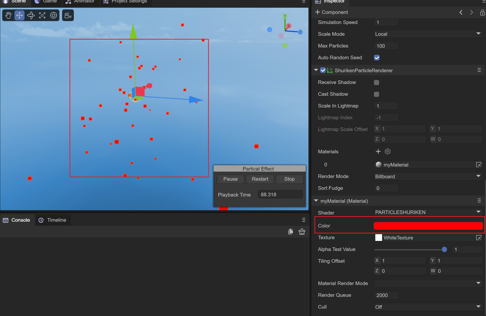
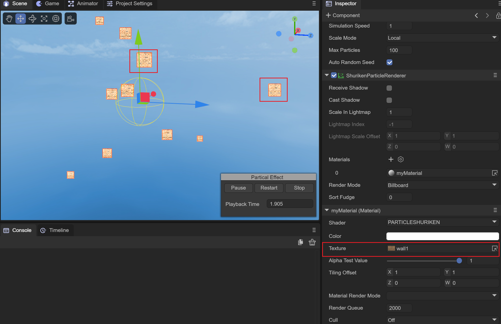

# 粒子材质

> Author: Charley

粒子材质（ShurikenParticleMaterial）是LayaAir引擎中专门用于粒子系统渲染的材质类型。粒子系统是游戏开发中实现各种动态视觉效果的重要工具，如火焰、烟雾、爆炸、魔法特效等。粒子材质定义了每个粒子的颜色、纹理和混合方式，是粒子系统视觉效果的关键组成部分。

## 一、粒子材质概述

### 1.1 粒子系统与粒子材质

粒子系统由粒子发射器、粒子动画器和粒子渲染器等多个模块组成。粒子材质作用于粒子渲染器，控制每个粒子面片的视觉外观。在LayaAir引擎中，粒子系统使用 `ShurikenParticleSystem`，对应的材质类为 `ShurikenParticleMaterial`。

### 1.2 类继承关系

```
Material → ShurikenParticleMaterial
```

粒子材质的属性相对精简，主要包含颜色、纹理、纹理平铺/偏移和渲染模式。

## 二、属性详解

### 2.1 颜色（color）

`color` 属性设置粒子的基础颜色，类型为 `Color`（RGBA）。颜色会与纹理颜色相乘产生最终渲染颜色。

此外，粒子材质还提供了逐通道的颜色分量设置方法：

| 方法 | 说明 |
|---|---|
| `colorR` | 设置颜色的R（红色）分量 |
| `colorG` | 设置颜色的G（绿色）分量 |
| `colorB` | 设置颜色的B（蓝色）分量 |
| `colorA` | 设置颜色的A（透明度）分量 |


（图2-1）

### 2.2 贴图（texture）

`texture` 属性用于设置粒子的纹理贴图，类型为 `BaseTexture`。纹理将映射到每个粒子面片上，是粒子外观的主要构成部分。

常见的粒子纹理包括：圆形渐变（用于火花）、烟雾形态、星形光芒、序列帧动画纹理等。


（图2-2）

### 2.3 纹理平铺和偏移（tilingOffset）

`tilingOffset` 属性控制纹理的重复次数和偏移量，类型为 `Vector4`。

粒子材质还提供了逐分量的设置方法：

| 方法 | 说明 |
|---|---|
| `tilingOffsetX` | 设置U方向纹理重复次数 |
| `tilingOffsetY` | 设置V方向纹理重复次数 |
| `tilingOffsetZ` | 设置U方向纹理偏移 |
| `tilingOffsetW` | 设置V方向纹理偏移 |

> 提示：当使用序列帧纹理时，可以通过纹理平铺和偏移来选择特定帧区域。

### 2.4 渲染模式（renderMode）

粒子材质支持以下渲染模式：

| 渲染模式 | 常量 | 值 | 说明 |
|---|---|---|---|
| 透明混合 | `RENDERMODE_ALPHABLENDED` | 0 | 透明混合模式，默认模式，适合烟雾、云朵等 |
| 加色法混合 | `RENDERMODE_ADDTIVE` | 1 | 加色法混合，适合火花、光效、魔法特效等 |

两种渲染模式的视觉差异：

- **透明混合（Alpha Blended）**：粒子颜色按透明度与背景混合，多个粒子叠加时颜色不会无限变亮。适合烟雾、尘埃等写实效果。
- **加色法混合（Additive）**：粒子颜色与背景颜色相加，多个粒子叠加时越加越亮。适合火焰、星光、魔法光效等发光效果。

## 三、属性汇总

| 属性 | 类型 | 说明 |
|---|---|---|
| `color` | Color | 粒子颜色 |
| `colorR` | number | 颜色R分量 |
| `colorG` | number | 颜色G分量 |
| `colorB` | number | 颜色B分量 |
| `colorA` | number | 颜色A分量 |
| `texture` | BaseTexture | 粒子纹理贴图 |
| `tilingOffset` | Vector4 | 纹理平铺和偏移 |
| `tilingOffsetX` | number | U方向纹理重复次数 |
| `tilingOffsetY` | number | V方向纹理重复次数 |
| `tilingOffsetZ` | number | U方向纹理偏移 |
| `tilingOffsetW` | number | V方向纹理偏移 |
| `renderMode` | number | 渲染模式（0=透明混合，1=加色法混合） |

## 四、代码示例

### 4.1 创建基础粒子材质

```typescript
// 创建粒子材质
let particleMat = new Laya.ShurikenParticleMaterial();

// 设置颜色（白色）
particleMat.color = new Laya.Color(1.0, 1.0, 1.0, 1.0);

// 加载粒子纹理
Laya.loader.load("res/texture/particle.png").then((tex: Laya.Texture2D) => {
    particleMat.texture = tex;
});

// 设置渲染模式为透明混合
particleMat.renderMode = Laya.ShurikenParticleMaterial.RENDERMODE_ALPHABLENDED;

// 应用到粒子系统
let particleSystem = sprite3D.getComponent(Laya.ShurikenParticleRenderer);
particleSystem.sharedMaterial = particleMat;
```

### 4.2 火焰粒子材质

```typescript
let fireMat = new Laya.ShurikenParticleMaterial();

// 设置暖色调
fireMat.color = new Laya.Color(1.0, 0.6, 0.2, 1.0);

// 加载火焰纹理
Laya.loader.load("res/texture/fire.png").then((tex: Laya.Texture2D) => {
    fireMat.texture = tex;
});

// 使用加色法混合，产生发光叠加效果
fireMat.renderMode = Laya.ShurikenParticleMaterial.RENDERMODE_ADDTIVE;

particleRenderer.sharedMaterial = fireMat;
```

### 4.3 动态修改粒子颜色

```typescript
let particleMat = new Laya.ShurikenParticleMaterial();

// 通过分量设置颜色
particleMat.colorR = 0.5;
particleMat.colorG = 0.8;
particleMat.colorB = 1.0;
particleMat.colorA = 0.7;

// 也可以在运行时动态修改
Laya.timer.frameLoop(1, this, () => {
    // 逐渐改变颜色实现渐变效果
    let r = (Math.sin(Laya.timer.currTimer * 0.001) + 1) * 0.5;
    particleMat.colorR = r;
    particleMat.colorG = 1 - r;
});
```

## 五、注意事项

1. **配合粒子系统使用**：粒子材质需要配合 `ShurikenParticleRenderer` 组件使用。粒子系统通过 `ShurikenParticleRenderer.sharedMaterial` 属性关联材质。

2. **渲染模式选择**：火焰、光效等发光效果应使用加色法混合（Additive）；烟雾、灰尘等非发光效果应使用透明混合（Alpha Blended）。

3. **纹理格式**：粒子纹理通常使用带Alpha通道的PNG格式，以实现粒子边缘的透明渐变效果。

4. **颜色与粒子系统配合**：粒子系统本身有随生命周期变化的颜色曲线。材质颜色与粒子系统颜色相乘后得到最终显示颜色，因此材质颜色建议设为白色，由粒子系统控制颜色变化。

5. **默认材质禁止修改**：`ShurikenParticleMaterial.defaultMaterial` 为引擎内部默认材质，开发者不应修改。
