# 纹理资源 设置说明

> Author: Charley

纹理是游戏开发中用于表现图形细节的重要资源，在LayaAir引擎中，纹理可以应用于2D对象（如Sprite、Image等）和3D对象（如Sprite3D的材质）上，用于呈现图像、颜色和细节。

## 1、纹理资源基础

### 1.1 纹理资源的类型
LayaAir引擎支持多种类型的纹理资源：

- 普通纹理资源：常规的图像纹理，如png、jpg、webp等后缀的资源类型；
- 压缩纹理资源 ：能被 GPU 直接读取显示的纹理叫 压缩纹理，如PVRTC（iOS）、KTX（Android）等资源；
- 渲染纹理 资源：用于离屏渲染的纹理资源，可将3D场景渲染到2D纹理上；
- 立方体贴图资源：用于环境贴图和天空盒等3D效果的纹理资源；
- 等等……

**本篇文档重点介绍普通纹理资源，**后续所提到的**纹理资源，专指普通纹理资源**。其它类型的纹理我们可以分别查看相应的文档。

### 1.2 纹理资源的设置

从“图片 → 纹理”的转换过程中，涉及格式转换、压缩编码、采样方式、缓存策略等多个处理环节，这些操作都与底层显卡的指令执行和显存上传参数密切相关。

由于纹理在不同的使用场景中（如 `2DUI`、模型贴图、光照贴图等）的要求不同，开发者需要根据具体用途合理配置各项参数，以获得理想的渲染效果。

纹理资源的属性设置，正是用于告诉引擎在加载与渲染该纹理时应采用的处理方式。

在 `LayaAir3 IDE` 中，选中一个纹理资源后，属性面板会显示纹理的参数配置区、大图预览窗口以及尺寸、格式等基础信息，如图 1-1 所示。

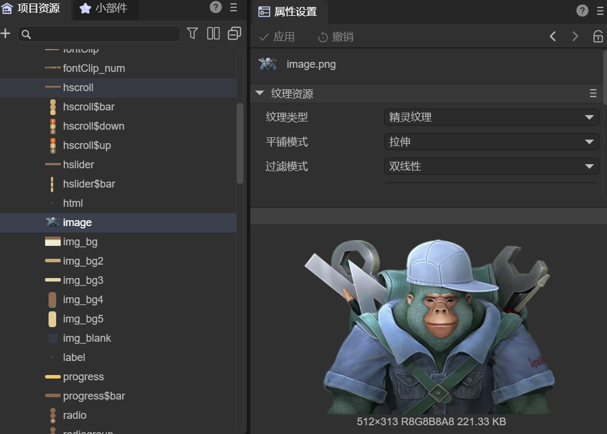 

(图1-1)

### 1.3 普通纹理资源的后缀类型

`LayaAir3`支持的普通纹理资源后缀包括："`tga`", "`tif`", "`tiff`", "`png`", "`jpg`", "`jpeg`", "`webp`",  

其中最常用的是`png`后缀的资源。

## 2、纹理资源的通用属性

### 2.1 纹理类型 `textureType`

#### 2.1.1 纹理类型概念

**纹理（Texture）** 是一种 `GPU` 资源，用于存储图像数据——包括颜色、法线、光照信息等。

**“纹理类型”**指的是引擎如何理解、管理、使用这张纹理的用途与特性。

需要注意的是，“**纹理类型**”不同于“**纹理资源类型**”。

前者关注纹理在渲染流程中的**使用用途**，后者则关注纹理在 `GPU` 层面的**数据结构和存储方式**。

在 `LayaAir3` 引擎中，纹理类型主要分为：

- 默认值（default）
- 光照贴图（`lightmap`）
- 精灵纹理（`spriteTexture`）

#### 2.1.2 默认值  `default`

选择 **默认值** 时，几乎包含所有通用的纹理属性设置。其默认属性值偏向于`3D`场景中常见的贴图应用，如图 2-1 所示。

 

(图2-1)

#### 2.1.3 光照贴图 `lightmap`

选择 **光照贴图** 时，表示该纹理仅用于光照贴图。`IDE` 只会显示与光照贴图相关的配置属性，其他无关属性将被隐藏，如图 2-2 所示。

 

（图2-2）

#### 2.1.4 精灵纹理 `spriteTexture`

选择 **精灵纹理** 时，表示该纹理用于 `2D` 场景中，例如精灵或 `UI`，与 `2D` 渲染无关的纹理属性不会显示，如图 2-3 所示。

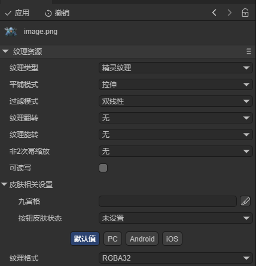 

（图 2-3）

#### 2.1.5 如何设置纹理导入时的类型

在`LayaAir3-IDE`中，**默认值**是纹理资源在导入到`IDE`后的默认类型。

如果开发者开发的是`2D`项目，完全用不上`3D`纹理的设置，可以通过 **项目设置 → 预设值** 修改纹理类型的默认导入设置为 **精灵纹理**。

在`3D`项目中，通常建议保持默认值的导入设置。如果需要同时使用`2D UI`资源，有两种方案：

- 第一，按 [《UI组件资源命名规则》](https://layaair.com/3.x/doc/IDE/uiEditor/uiComponent/namingRule/readme.html)对资源进行提前命名，这样在导入`IDE`的时候，会根据命名自动识别为精灵纹理。
- 第二，将`2D UI`资源集中放置在同一目录下，然后对这个目录的纹理资源批量全选，统一设置为精灵纹理类型。

### 2.2 环绕模式 `wrapMode`

**环绕模式（Wrap Mode）** 用于控制当纹理坐标（UV）超出 `[0,1]` 范围时，GPU 如何采样纹理边界像素。

由于模型的 UV 坐标可以超出纹理的归一化区间（`[0,1]`），环绕模式决定超出区域的显示方式。

`LayaAir3` 支持三种环绕模式：重复（`repeat`）、边缘拉伸（`clamp`）、镜像（`mirrored`）；

#### 2.2.1 重复（`repeat`）

选择**重复**时，当 UV 坐标超出 `[0,1]` 时，纹理会从头开始重复采样。这种模式会在模型表面形成连续、循环的纹理效果。如动图2-4所示。

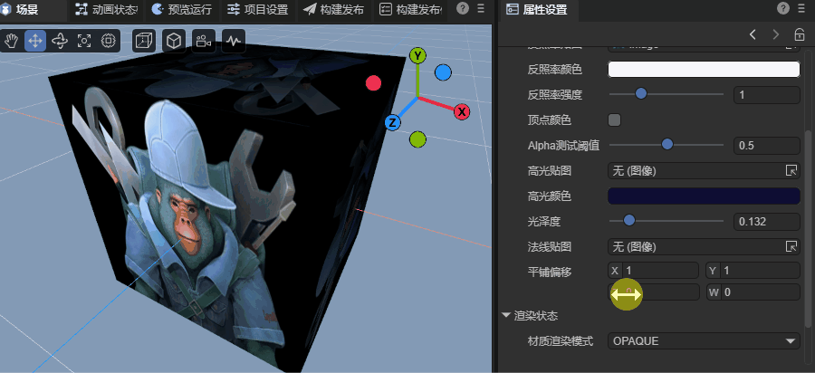 

（动图 2-4）

#### 2.2.2 边缘拉伸（`clamp`）

选择**边缘拉伸**时，当 UV 超出 `[0,1]` 时，纹理会重复显示其最外侧边缘像素的颜色。这样超出部分看起来像是从边缘被“拉伸”出来。如动图2-5所示。

 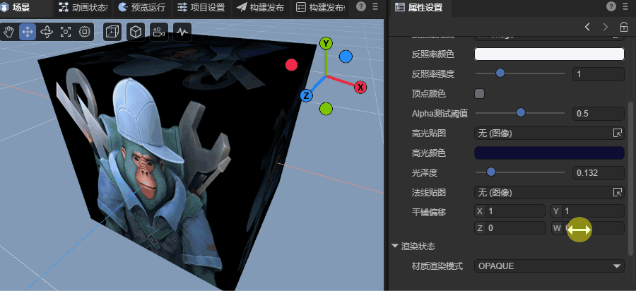 

（动图 2-5）

#### 2.2.3 镜像（`mirrored`）

选择**镜像**时，纹理会以镜像方式重复。第一个区间 `[0,1]` 正常显示，第二个区间 `[1,2]` 水平翻转，第三个区间 `[2,3]` 再恢复正常，依次交替。如动图2-6所示。

 

（动图 2-6）

#### 2.2.4 应用场景说明

环绕模式，主要应用于`3D`材质的纹理需求。对于`2D`的精灵与`UI`纹理完全不需要设置。

面对`2D`开发需求时，也可以用于`2D` Shader以及支持设置纹理偏移的`2D`渲染组件（例如`2D`网格渲染器）中。

### 2.3 过滤模式 `filterMode`

**过滤模式（Filter Mode）** 用于控制当纹理被缩放（放大或缩小时），`GPU` 如何计算与插值像素的颜色值，从而影响纹理的清晰度与平滑程度。

当模型表面的纹理被拉伸或压缩时，一个屏幕像素往往对应多个纹理像素（`Texel`），这时就需要采用不同的过滤策略进行采样插值。

#### 2.3.1 点过滤 `point`

每个纹理像素都有一个“中心点”，它是该像素颜色的代表。

点过滤也叫邻近点过滤，这是最简单的过滤模式。它不会进行插值计算，而是直接选择**距离采样坐标最近的纹理像素中心**，并使用该像素的颜色作为最终采样结果。

例如图2-7所示，左侧是四个不同颜色的像素点，左上角的加号表示纹理采样坐标。采样时，它会选择距离采样点最近的像素中心（图右侧浅蓝色）作为输出颜色。

 

（图2-7）

这种过滤模式在放大的情况下效率非常快，但会有明显的马赛克现象。

这种过滤模式计算效率极高，常用于放大纹理时保持清晰的像素块效果。然而在缩小或运动时，由于多个屏幕像素会对应同一个纹理像素区域，容易产生**摩尔纹** 或闪烁现象，如动图2-8所示。

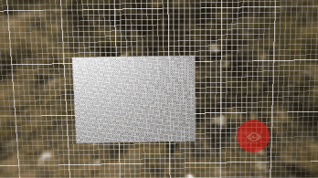 

（动图2-8）

这是由于多个像素落入同一个纹理像素区域造成的走样问题，需要使用双线性过滤结合多级纹理才可以解决。

因此，点过滤模式， 常用于像素风格游戏或需要保持锐利边缘的低分辨率贴图效果。

#### 2.3.2 双线性过滤 `bilinear`

双线性过滤是在点过滤的基础上引入插值计算的一种改进采样方式，能够有效减少放大纹理时的锯齿与块状感。

其原理是：当采样点落在四个纹理像素之间时，GPU 会读取周围四个像素的颜色，根据采样点在它们之间的位置，进行**双线性插值**，计算出平滑过渡的颜色值。效果如图2-9所示：

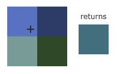  

（图2-9）

与点过滤相比，双线性过滤会在像素边缘产生柔和过渡，从而显著减少锯齿现象。但在纹理被大幅放大时，插值过程会导致画面略微模糊。对比效果如图2-10所示。

 

（图2-10）

双线性过滤在处理放大纹理时非常有效，但在纹理缩小时（即一个像素覆盖多个纹理区域）仍会出现闪烁和摩尔纹等走样问题。这是因为双线性过滤只在单一 Mipmap 层级内工作，并未考虑跨层采样。

因此，通常会结合**多级纹理（Mipmap）**使用，在不同分辨率层级中动态选择合适的采样纹理，以消除缩小时的走样现象。

双线性过滤结合多级纹理的效果，如动图2-11所示。

 

（动图2-11）

#### 2.3.3 三线性过滤`trilinear`

尽管双线性过滤的效果要优于点过滤，但远距离的噪点问题仍然存在，所以通常双线性过滤还是要结合多级纹理来解决噪点与摩尔纹问题。

但是，当处理不同级别纹理之间的时候，就可能出现跳变现象，这种模糊到清晰的分界线，在运动的时候会更为明显。

因此，三线性过滤在相邻的两级多级纹理（`MipMap`）之间再进行一次线性插值（即“两次线性插值”），从而在层级切换时获得平滑过渡，不再显得突兀。效果如图2-12所示。

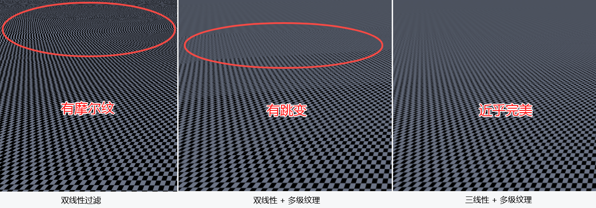  

（图2-12）

> 从性能消耗上，从小到大依次为：点过滤  →   双线性过滤   →   三线性过滤

#### 2.3.4 应用场景说明

过滤模式在 `3D` 渲染中应用更为广泛，但在 `2D` 场景中同样发挥着重要作用，尤其是在涉及缩放或相机运动时。

在 `2D` 渲染中通常选择固定的采样模式（点过滤或双线性过滤），而在 `3D` 场景中则更常结合 `MipMap` 使用，或根据距离动态调整过滤模式。

在 `2D` 场景中，过滤模式常用于 **Spine 动画贴图** 与 **瓦片地图** 的地表纹理。

例如，当 `2D` 场景中，角色相机移动或缩放时，如果使用点过滤，纹理采样可能无法与屏幕像素精确对齐，从而出现轻微的抖动或波纹感。此时可以改用双线性过滤以获得更平滑的视觉效果。

### 2.4 纹理翻转 `flip`

**纹理翻转 **主要用于修正纹理坐标与图像数据存储方向不一致的问题。常见的翻转方式包括：

- **X轴（水平）翻转**：沿 X 轴反转纹理，常用于镜像特效或角色左右对称动画。

- **Y轴（垂直）翻转**：沿 Y 轴反转纹理，用于校正图片上下颠倒的情况；

> 纹理翻转不会影响纹理本身的数据，只在采样时调整 UV 坐标的映射方向。

### 2.5 纹理旋转 `rotate`

**纹理旋转** 用于改变纹理在表面上的朝向，以 90° 为单位进行顺时针（左）或逆时针（右）调整2

- **左（顺时针）**：顺时针旋转纹理 90°。
- **右（逆时针）**：逆时针旋转纹理 90°。

> 纹理旋转不会影响纹理本身的数据，只在采样时调整 UV 坐标的方向。

> [!Tip]
>
> 需要重点注意的是，对于2D图集中的散图，是不支持设置纹理翻转和旋转的。
>
> 在 IDE 中，由于纹理是预处理的，因此设置纹理属性，可立即在IDE编辑模式下，查看单图纹理设置效果。
>
> 但运行预览的时候，引擎加载的是 **图集的纹理数据**，并非原始单图，因此纹理属性不会生效，导致 **编辑器预览效果与实际运行效果不一致**。
>
> 建议开发者，**不要对自动图集中的图片** 设置翻转或旋转属性，以避免运行时出现与预期不符的情况。

### 2.6 非2次幂缩放 `npot`

图形硬件在处理纹理时，**最理想的尺寸是 2 的次幂**，例如 `128×128`、`512×256` 等。这类纹理被称为 **POT（Power Of Two）纹理**。

当纹理尺寸不是 2 的次幂（称为 **`NPOT`，Non-Power Of Two**）时，部分 `GPU` 或旧平台在处理时可能产生性能下降或采样异常，因此引擎通常会进行自动缩放或补齐。

在 `LayaAir3` 中，可设置“非 2 次幂缩放”选项，控制引擎对 `NPOT` 纹理的处理方式：

- **无（none）**：保持原始尺寸（非2次幂可能在某些环境下降低性能、某些情况下会自动采用**最近的**参数设置）；
- **最近的（nearest）**：将纹理缩放至最接近的 2 次幂尺寸；（如：300×500 → 256×512）；
- **较大的（larger）**：始终向上取整至最近的 2 次幂尺寸（如：300×500 → 512×512）；
- **较小的（smaller）**：向下取整至最近的 2 次幂尺寸（如：300×500 → 256×256）。

> 在现代 `GPU` 中，`NPOT` 支持已普遍实现，但自动缩放仍能提升性能与兼容性，尤其在移动端或 `WebGL` 环境下。

### 2.7 可读写 `readWrite`

**可读写**  选项决定了纹理在被 `GPU` 上传后，是否仍保留一份可被 CPU 访问的副本。

默认情况下，纹理数据上传至显存后，CPU 端的像素数据会被释放以节省内存，此时纹理是**不可读写**的。

若**启用“可读写”**，引擎会在内存中保留一份可访问的纹理数据，以便在运行时执行以下操作：

- 获取像素颜色值（如拾取、取样分析）；
- 动态修改像素（如绘制笔刷、纹理混合）。

开启后，纹理的内存占用将约增加一倍，并降低加载性能。

建议仅在需要脚本动态读取像素数据或 CPU 访问纹理的场景下开启，例如编辑器模式、调试工具或特效生成系统。

### 2.8 纹理格式 `format`

**纹理格式（Texture Format）** 指纹理在 `GPU` 中的像素数据存储方式。

它决定了每个像素的颜色精度、是否带透明通道、是否经过压缩，以及显存占用和渲染性能。

在 `LayaAir3` 中，支持**RGBA32**（R8G8B8A8）、**RGB24**（R8G8B8）、**压缩纹理格式**，这三种。不同纹理格式的选择会直接影响内存消耗、加载速度与画质表现。

#### 2.8.1 `RGBA32` / `R8G8B8A8`

- **描述**：每个像素占用 32 位（4 字节），包含红、绿、蓝、透明四个通道。
- **特点**：色彩还原准确，透明度支持完整，最常见的标准纹理格式。
- **应用场景**：UI 元素、角色贴图、带透明通道的精灵纹理等。

#### 2.8.2 `RGB24` / `R8G8B8`

- **描述**：每个像素占用 24 位（3 字节），无透明通道。
- **特点**：节省显存，但不支持透明。
- **应用场景**：背景贴图、地表、天空盒等不需要透明度的场景等。

#### 2.8.3 压缩纹理格式

- **描述**：采用 `GPU` 专用压缩算法（如 `ETC`, `ASTC`等），在显存中高效存储像素数据。
- **特点**：大幅减少内存占用和性能消耗，但可能产生画面失真。
- **应用场景**：对纹理质量要求不高或运动的场景，`UI`通常不适用压缩纹理。

> 压缩纹理需要在构建时由工具转换为对应平台支持的格式，运行时不能直接修改。
> 选择合适的格式不仅影响图像质量，也关系到游戏的整体性能与加载体验。

关于压缩纹理，有一篇专门介绍的文档，请跳转至《[压缩纹理格式](../../uiEditor/textureCompress/readme.md)》查看。

## 3、精灵纹理的专有属性

选择精灵纹理类型后，除了通用的纹理资源属性设置外，还有两项专属的纹理设置，分别为：九宫格、按钮皮肤状态。

### 3.1 九宫格 `sizeGrid`

**九宫格（SizeGrid）** 是一种用于 **可拉伸 UI 纹理** 的布局技术。

通过将纹理分割为九个区域，可以在拉伸 UI 控件尺寸时，**保持四个角不变形，仅中间与边缘部分被平滑拉伸**。

这种方式常用于按钮、面板、输入框、气泡框等需要自适应尺寸的 UI 元素。

九宫格的参数格式为：上,右,下,左,是否重复填充。如图3-1所示。

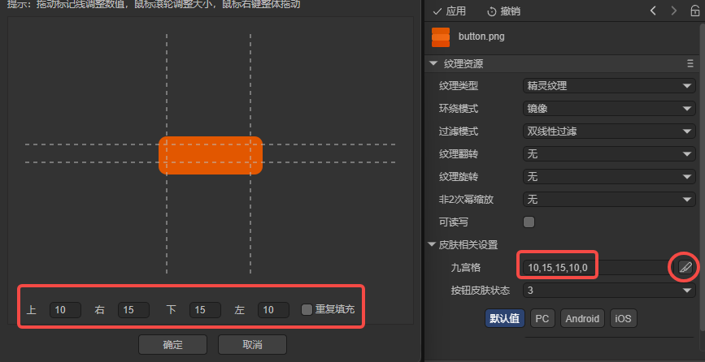 

（图3-1） 

通常，九宫格属性可直接在 UI 组件中设置。

但对于按钮、背景等**经常重复使用的纹理**，如果不希望在每个组件中都手动设置 `sizeGrid`，

可以选择在**纹理资源**上统一设置。

这样，所有引用该纹理的 UI 元素都会自动继承九宫格属性，避免重复设置，提升效率与一致性。

### 3.2 按钮皮肤状态  `stateNum`

**按钮皮肤状态** 用于定义按钮在不同交互状态下所对应的纹理数量与顺序。

在 LayaAir 的经典 UI 系统中，按钮通常使用一张包含多帧状态的皮肤贴图。这些状态按固定顺序从上到下排列，`stateNum` 属性用于指定该按钮皮肤中包含的状态数量。

按钮状态的皮肤排列顺序从上至下包括：

- **移出**：鼠标不在按钮上时的默认外观；
- **悬停**：鼠标悬停在按钮上时的外观；
- **按下**：按钮被按下时的外观；

当 `stateNum = 3` 时，按钮贴图会被等分为三段，并在运行时根据按钮状态（移出、悬停、按下）自动切换对应区域的纹理。

若按钮仅包含两种状态（例如移动端不需要“悬停”状态），可将 `stateNum` 设置为 `2`，此时按钮贴图按两段等分切割，仅显示“移出”和“按下”两种皮肤外观。

当设置为 `1` 时，按钮将只使用单一状态贴图，不切割皮肤资源，也不会在交互中变化，适用于静态装饰性或无交互变化的按钮。

**需要注意的是**，如果在纹理资源属性中设置了皮肤状态（`stateNum`），则该设置会被按钮组件自动继承，**按钮组件中将不再显示皮肤状态选项**。

希望在按钮组件中单独配置皮肤状态时，请将纹理资源的 按钮皮肤状态 `stateNum` 属性设置为 **“未设置”**。

> [!Tip]
> 建议美术资源在制作多状态按钮皮肤时，**按从上到下的顺序**排列不同状态图像，确保皮肤尺寸一致、边缘无缝衔接。
>
> 如果按钮状态贴图由多张分离图片构成，那么也可以使用LayaAir3-IDE导航菜单→工具→制作按钮皮肤，将多个单状态的皮肤组合成一个多状态的按钮皮肤。但该工具每次只能转换一个多状态按钮皮肤，常用于少量的按钮皮肤转换需求。

## 4、其它纹理属性

默认的纹理资源的属性配置较为全面，其中包含了光照贴图所需的配置，因此本节不再单独介绍光照贴图配置参数。

以下内容将重点介绍除通用属性外的其他纹理属性。

### 4.1 纹理形状 `textureShape`

**纹理形状（Texture Shape）** 用于指定纹理在 GPU 中的维度类型，不同的形状决定了纹理的采样方式与应用场景。

在 LayaAir3 中，主要提供两种纹理形状设置：**平面（2D）** 与 **立方体（Cube）**。前者用于绝大多数材质与贴图，后者用于反射与天空盒等具有空间方向性的渲染效果。

#### 4.1.1 平面纹理（2D）

**平面纹理** 是最常见的纹理类型，用于在二维平面上采样像素颜色。

它不仅适用于 2D 游戏或 UI 元素，更是 3D 渲染中最基础的纹理形态。例如，模型表面的漫反射贴图、法线贴图、金属度贴图等。

甚至全景天空材质贴图，也是以 **平面纹理** 的形式存在。

在 GPU 中，**平面纹理**形状，以 2D 坐标系统 `UV（u,v）` 进行采样，坐标范围通常在 `[0,1]` 之间。

#### 4.1.2 立方体（Cube）

立方体纹理，用于天空盒材质纹理与反射贴图的渲染效果。

构成**立方体纹理**的方式有两种，一种是由六张正方形图像组成的立体纹理。

另一种，就是将单张全景图片，通过设置纹理形状为立方体，由IDE自动转换为立方体纹理。如图4-1所示。

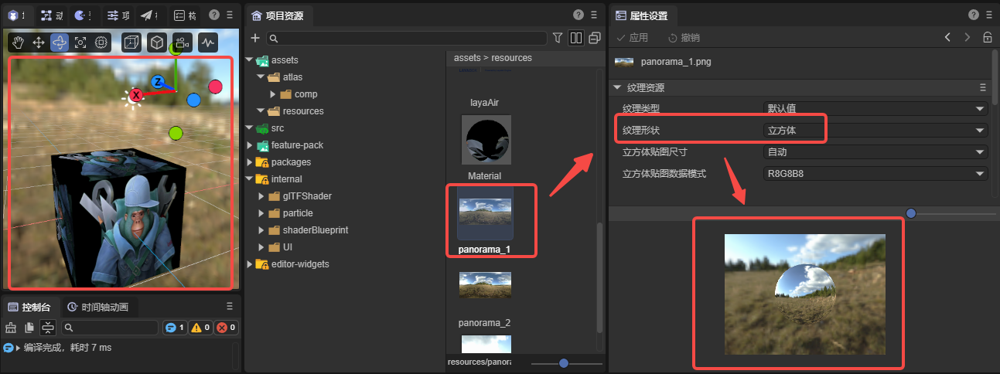 

（图4-1）

> [!Tip]
>
> 需要重点注意的是，如果纹理的原始尺寸小于2，不符合全景天空纹理的需求，哪怕是应用了该设置，也会导致生成**立方体纹理**失败。无法作为立方体纹理来使用。

在LayaAir3-IDE里，当纹理形状设置为立方体之后，还有两个关联的设置：立方体贴图尺寸`cubemapSize`、立方体贴图数据模式`cubemapFileMode`。

##### 4.1.2.1 立方体贴图尺寸`cubemapSize`

该参数表示立方体纹理的分辨率，支持自动模式与多个以 2 为幂的固定值（最小 2，最大 2048）设置项。如图4-2所示。

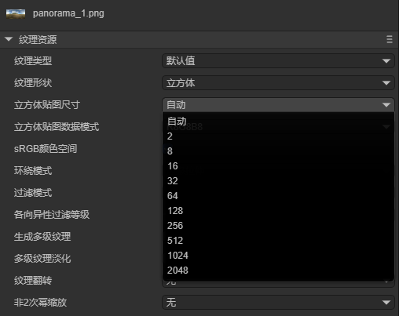 

（图4-2）

选项值作为立方体纹理的高度尺寸，宽度尺寸为高度的一倍。

例如，选中256，表示立方体纹理的高度尺寸为256，宽度尺寸为512。

如果开发者选择“**自动**”模式，则系统会根据**非 2 次幂缩放（npot）**属性自动计算合适的尺寸。

例如，宽高为300 × 600的原始资源：

- **非2次幂缩放**的值为**无**，系统自动选择`最近的（nearest）`模式，缩放纹理为：256 × 512。
- **非2次幂缩放**的值为**较大的**，缩放纹理为：512 × 1024。

##### 4.1.2.2 立方体贴图数据模式`cubemapFileMode`

该参数用于设置立方体贴图的**像素数据格式**，即每个像素的颜色通道（红、绿、蓝、透明）所使用的位深与组成方式。不同的数据模式会影响贴图的**内存占用、渲染精度和性能**。

在多数情况下，默认的 `R8G8B8` 模式已经能够满足常规的天空盒和反射贴图需求。 若需要更高精度或包含透明通道的纹理，可根据项目需求选择更高位深的模式。

| 选项值       | 说明                                                         |
| ------------ | ------------------------------------------------------------ |
| R8G8B8       | 每像素 8 位精度，共 24 位色深，不包含 Alpha 通道。适用于标准的天空盒或环境贴图。 |
| R8G8B8A8     | 每像素 8 位精度，共 32 位色深，包含 Alpha 通道。常用于带透明效果的立方体贴图。 |
| R16G16B16    | 每像素 16 位精度，共 48 位色深，不包含 Alpha 通道。更高的色彩层次与过渡平滑度，适合 HDR（高动态范围）贴图。 |
| R16G16B16A16 | 每像素 16 位精度，共 64 位色深，包含 Alpha 通道。适用于高精度环境反射或光照缓存。 |
| R32G32B32    | 每像素32 位精度，共 96 位色深，不包含 Alpha 通道。适用于需要极高色彩精度的专业渲染场景。 |
| R32G32B32A32 | 每像素 32 位精度，共 128 位色深，包含 Alpha 通道。最高精度，用于物理级光照反射（如 PBR 的反射探针），内存开销最大。 |

### 4.2 sRGB颜色空间`sRGB`

#### 4.2.1  sRGB 定义

**sRGB（Standard RGB）** 是由 **HP 和 Microsoft 于 1996 年联合提出** 的一种标准化 **RGB （红绿蓝）颜色空间**，全称为 *Standard Red Green Blue*。旨在为 **不同设备（显示器、打印机、网络图像）提供统一的色彩表现基准**。

它定义了一种标准的 Gamma 校正曲线，近似 2.2 的非线性伽马，用于将线性 RGB 值映射到非线性的显示亮度。这种映射符合人眼对亮度的感知规律，使颜色在不同亮度范围下更加自然和平衡。

由于 sRGB 在设计时考虑了人眼的感知特性，其色域相对较小，但覆盖了大多数常见 SDR 显示器，从而保证跨设备的颜色一致性。

需要注意的是，sRGB 也有局限性：色彩范围有限，无法覆盖所有可见颜色；对比度受限，最亮与最暗的差距较小；不适合高动态范围（HDR）内容；在线性工作流程中，可能会出现色彩失真或过渡不自然的问题。

#### 4.2.2 什么时候使用 sRGB？

如果纹理用于存储颜色信息（如漫反射/基色纹理），可以勾选使用 sRGB；

对于存储物理属性或非颜色数据的纹理（如法线贴图、金属度、粗糙度、AO 等），则不应勾选 sRGB，应保持线性空间，以保证物理计算的正确性。

### 4.3 透明通道`alphaChannel`

在纹理属性中，**透明通道（Alpha Channel）** 是用于控制纹理透明和混合效果的核心参数。

它决定了像素在渲染时的可见程度，从而实现诸如**半透明材质、叠加混合、玻璃、烟雾、树叶、UI 元素透明边缘**等效果。

在 LayaAir3 中，该属性用于控制当前纹理是否包含 Alpha 通道数据，并告知渲染管线如何解析与使用该通道。

- 若勾选 `alphaChannel`，则表示该纹理包含 Alpha 通道数据，系统会在导入与编码阶段保留并处理该通道。
- 若未勾选，则纹理被视为 **不透明纹理**，即便图像源文件中存在 Alpha 信息，也会被忽略，从而节省显存与提升采样效率。

### 4.4 生成多级纹理`generateMipmap`

#### 4.4.1 什么是多级纹理

多级纹理（Mipmap）是一组同源的纹理图像，它们的尺寸按 1/2 的比例依次缩小。第 0 级是原始纹理，每继续一个级别都会缩小到上一层的一半大小。这样的层级关系可以一直递减到 1 × 1 像素为止。

例如，如果原始纹理的大小是256 × 256像素，那么多级纹理共有9个级别，0级就是原始尺寸256，除此之外，还会生成8个额外级别（1-8）的纹理，具体尺寸分别为：128 × 128、64 × 64、32 × 32、16 × 16、8 × 8、4 × 4、2 × 2、1 × 1像素。示意效果如图4-3所示：

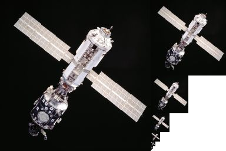 

（图4-3） 

在 LayaAir3-IDE 中，不会直接为PNG 等一般纹理资源，生成这些缩小图，而是在运行时交由 GPU 在显存中自动创建多级纹理。

常见的纹理尺寸对应级别为：

| 原始尺寸    | Mipmap级别总数 | Mipmap级别尺寸递减顺序（从 Level 0 到最后一级）             |
| ----------- | -------------- | ----------------------------------------------------------- |
| 2048 × 2048 | 12             | 2048 → 1024 → 512 →256 → 128 → 64 → 32 → 16 → 8 → 4 → 2 → 1 |
| 1024 × 1024 | 11             | 1024 → 512 → 256 → 128 → 64 → 32 → 16 → 8 → 4 → 2 → 1       |
| 512 × 512   | 10             | 512 → 256 →128 → 64 → 32 → 16 → 8 → 4 → 2 → 1               |
| 256 × 256   | 9              | 256 → 128 → 64 → 32 → 16 → 8 → 4 → 2 → 1                    |
| 128 × 128   | 8              | 128 → 64 → 32 → 16 → 8 → 4 → 2 → 1                          |

####  4.4.2 生成多级纹理 `generateMipmap`

在“2.3 过滤模式”一节中，我们已经提到：当纹理被缩小时，如果只使用双线性过滤，会产生严重的摩尔纹，如图 4-4 所示。

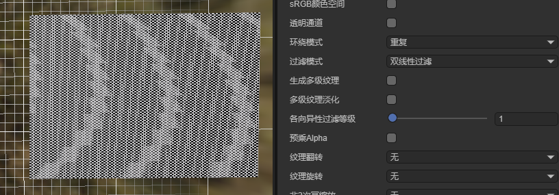 

（图4-4）

而 勾选 生成多级纹理`generateMipmap`后，GPU 会自动创建一系列缩小版本，再经过双线性过滤，可有效地消除摩尔纹现象。效果如图4-5所示。

 

（图4-5）

除了修复视觉瑕疵，Mipmap 还有以下性能优势：

- **减少显存带宽读取**：例如，当物体远离摄像机时，理论上只需要纹理的一小部分细节。如果没有 Mipmap，GPU 需要读取整个高分辨率纹理。有了 Mipmap，GPU 可以直接访问尺寸更小、更匹配距离的纹理层级，大幅节省带宽。
- **在 PBR 渲染中复用 Mipmap 实现反射模糊**：例如，在基于物理的渲染（PBR）中，渲染器可以读取不同 Mipmap 级别的粗糙度贴图，以模拟**反射模糊**。当物体表面非常光滑时，它会读取高分辨率 Mipmap；当表面非常粗糙时，它可以读取更低、更模糊的 Mipmap 级别，从而**更真实地模拟远处的反射光模糊**，同时节省计算量。

当然，多级纹理也有代价：它需要额外的显存（约 33%～50% 的额外纹理体积），并在生成时带来一定计算成本。是否启用仍需根据项目需求权衡。

#### 4.4.3 多级纹理过滤 `mipmapFilter`

多级纹理过滤`mipmapFilter` 是在启用 “生成多级纹理” 后，用于 **压缩纹理** 的额外过滤设置。

为什么普通纹理（如PNG、JPG等）不需要设置它？

因为普通纹理的 mipmap 数据由 GPU 在运行时自动生成，而压缩纹理（如 KTX、ASTC、ETC）是 GPU **直接读取其存储的数据**，不会在运行时再生成缩小图。

因此：

- 对普通纹理：`mipmapFilter` 无需配置。
- 对压缩纹理：需要启用 `mipmapFilter`，并选择用于生成各级 Mipmap 的过滤方式，以便构建时生成完整 Mipmap 数据。

过滤方式与前文的过滤模式相同，只是应用对象不同。

#### 4.4.4 最大MIP层数 `maxMipLevels`

前文曾介绍过，默认情况下，多级纹理会从原始尺寸开始逐级缩小，直到生成1 × 1像素的纹理图。

然而在实际使用中，不是所有 MIP 层都能带来视觉收益。

对于许多纹理，当尺寸缩小到一定程度后，再继续生成更低分辨率的 MIP 层并不会改善画面质量，反而会：

- 让压缩格式在极小尺寸下产生明显色块（尤其是 PVRTC、ETC 等）
- 增加纹理文件体积（仅限压缩纹理）
- 增加显存占用
- 增加构建时间

因此，可以通过限制生成的 MIP 数量来减少不必要的数据。

`maxMipLevels` 的作用，就是控制 MIPMAP 链的最大层数，以减少 **压缩纹理文件体积** 与 **显存占用**。

例如，一个 64×64 的纹理理论上可以生成：

64 → 32 → 16 → 8 → 4 → 2 → 1（共 7 层），

但最小的 2×2 和 1×1 层往往意义不大，甚至可能被 PVRTC 或 ETC 在压缩时产生明显的色偏。

此时，可以将 `maxMipLevels` 设为 5，这表示生成：

Level 0 → Level 4（共 5 层），

即：64 → 32 → 16 → 8 → 4

这样便能在不影响远距离渲染效果的前提下，减少额外 MIP 层带来的存储与显存消耗。

需要注意的是，这个设置只针对 GPU 压缩纹理（如 PVR、KTX、DDS）。

普通 PNG / JPG 等源图格式本身不包含 MIPMAP，因此不会受到影响，设置了也没有效果。

#### 4.4.5 各向异性过滤等级`anisoLevel`

当 3D 模型表面倾斜着延伸到远处时（例如地面、道路、墙壁），传统的纹理过滤技术会遇到困难。

为了防止远处细节过多导致像素闪烁（即“摩尔纹”现象）与跳变现象，通常使用多级纹理技术与三线性过滤结合处理。

问题在于， 三线性过滤假设纹理在所有方向上的缩放比例相同（即**各向同性**）。

但在倾斜的表面上，情况并非如此，当表面倾斜时，纹理在屏幕上的投影往往是长条形的，水平和垂直方向的缩放比例差异极大。

结果是，三线性过滤会错误地使用了**过度模糊**的 Mipmap 级别，导致**近处**的倾斜纹理看起来还行。**远处**的倾斜纹理（比如地平线）变得**一团模糊**，细节完全丢失。如图4-6所示：

 

（图4-6）

而 **各向异性过滤** 正是专门为解决上述问题而诞生的纹理采样优化技术。

它会根据视角与表面法线的夹角（倾斜度），分析纹理在屏幕上的投影形状，自动识别纹理在屏幕上投影的长轴（倾斜方向）和短轴（垂直方向），进行分离采样。

例如，**短轴（垂直）**继续使用正常的 Mipmap 级别（保持清晰，避免闪烁）。

**长轴（倾斜）**在不增加模糊的情况下，沿着倾斜方向进行**额外的、拉伸的纹理采样**。这样，能有效减少远处或倾斜表面的模糊与锯齿，使地面、墙面、道路等平面在透视角度下依然保持锐利。如图4-7所示：

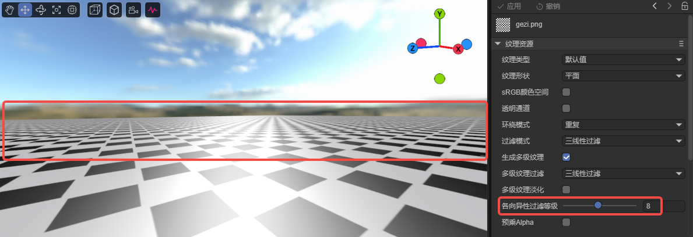 

（图4-7）

各向异性过滤等级，用于控制倾斜方向“额外采样”的强度，数值越高意味着过滤器可以处理越极端的**倾斜角度**，图像质量越高，细节保留越好。但同时显存带宽与采样性能消耗也会越大。

- **`anisoLevel = 1`**：关闭各向异性过滤，仅使用基础的双线性或三线性过滤。
- **`anisoLevel > 1`**：启用各向异性过滤，常见可选值为 2、4、8、16，对应不同的清晰度与性能消耗。

建议：

- 对 **地面贴图、墙面贴图、道路贴图** 等倾斜显示的纹理可开启较高等级（如 8~16）。
- 对 **法线贴图、体积纹理** 等不依赖透视清晰度的资源，使用默认值 1 即可。

### 4.5 预乘Alpha `premultiplyAlpha`

在透明纹理的渲染处理中，Alpha 通道不仅决定像素的透明度，也关系到颜色是否能够正确地与背景混合。当纹理使用不当时，边缘会出现明显的“白边”、“黑边”、“发光边”，尤其在 UI、粒子、半透明材质中非常常见。

为了解决透明边缘混合错误的问题，渲染系统常使用 **预乘 Alpha（Premultiplied Alpha）** 技术。

#### 4.5.1 什么是预乘 Alpha？

普通纹理存储的颜色为：`(R, G, B, A)` 。

预乘 Alpha 则会在存储前让颜色乘上透明度：`(R*A, G*A, B*A, A)`，

这样意味着：

- 透明区域（A=0） → 颜色也会被压成 0（完全透明、无残留颜色）
- 半透明区域（A=0.5） → 颜色会变成一半
- 不透明区域（A=1） → 颜色保持原样

这样做的直接好处是：**透明边缘不会出现原图颜色的“残影”或“白边”，混合时更加自然正确。**

#### 4.5.2 为什么透明纹理会出现白边或黑边？

许多透明 PNG 的边缘区域都带有 “颜色扩展（bleeding）”，RGB 边缘被填成亮色或白色，但 Alpha 仍然接近 0。

当 GPU 对透明纹理进行采样（尤其在双线性 / 三线性过滤下），会混合周围多个像素。如果边缘像素的 Alpha 很小但 RGB 很亮，那么这些颜色就会被带入最终结果，形成白边或亮边。

**开启预乘 Alpha 后**，在透明区域 RGB 已被乘到接近 0。即使 GPU 多次采样混合，也不会把“边缘颜色”拉进最终画面。所以边缘变得干净、自然。

#### 4.5.3 什么时候应用和设置？

以下场景**强烈推荐开启预乘 Alpha**：

- UI 图标、按钮、圆角面板
- 粒子系统、烟雾、光效、魔法特效
- 贴花（Decal）、透明贴图、树叶、人物头发
- 使用双线性、三线性过滤的纹理
- 使用 Mipmap 的透明纹理（无预乘最容易白边）

在这些情况下，预乘 Alpha 能有效避免：

- “白边、黑边”
- 半透明边缘出现亮色边框
- 放大或缩小时边缘被过滤“污染”
- UI 元素叠加时发灰或发亮

**当纹理完全不透明**（A=1 或无透明），**关闭预乘不会造成问题**。例如：

- 金属、石头、地面贴图
- 法线贴图、金属度贴图等非颜色纹理
- 完全不透明的模型纹理

这些纹理不涉及透明混合，自然不需要预乘。