# CPU粒子系统

## 一、CPU粒子系统简介

CPU 粒子系统不如 GPU 粒子系统灵活，但 CPU 粒子系统适用于更广泛的硬件，并且可以为手机或旧设备提供更好的支持。由于粒子渲染在 CPU 上进行处理，因此性能上不如 GPU 粒子系统。

CPU粒子系统的一个重要功能是支持Unity项目导出的粒子效果。Unity中粒子特效的各种属性与LayaAir引擎中内置的3D粒子系统无法适配，因此在Unity中导出的资源需要CPU粒子系统插件才能正常使用。

在LayaAir-IDE中，打开包管理器，安装CPU粒子系统。

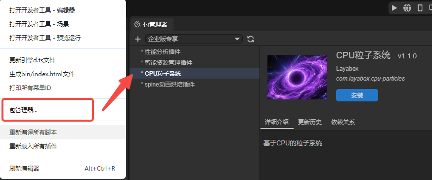

> 注：CPU粒子系统属于LayaAir会员功能。

导入插件之后，即可在层级面板中添加CPU粒子。

也可以在属性设置面板中的渲染栏添加CPU粒子。

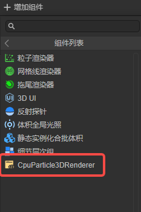

## 二、CPU粒子系统属性介绍

### 2.1 属性的参数模式

对于粒子系统，一个属性可能存在多种参数模式，这里我们以`StartLifetime`为例：

点击属性最右侧的箭头，即可选择属性的参数模式，共有四种：

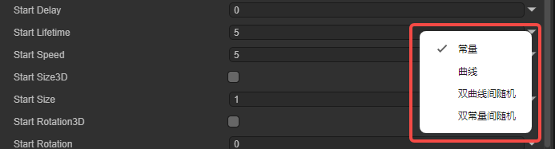

**常量**：参数值在属性所属的生命周期中为一个常量值，不会发生变化。

**曲线**：参数值在属性所属的生命周期中随时间变化，具体值为曲线在这一时刻对应的值。

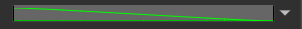

点击即可打开曲线编辑面板，面板中可以编辑参数值的范围与曲线的形状。

**双曲线间随机**：参数值在属性所属的生命周期中随时间变化，具体值在这一时刻对应的取值范围上下限中随机取值。

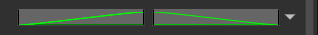

**双常量间随机**：参数值在属性所属的生命周期中不断变化，取值范围由设置的常量来决定。

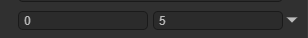

这里解释一下`属性所属的生命周期`这一概念，CPU粒子中存在粒子系统生命周期和粒子生命周期这两种生命周期。前者属于粒子系统，影响粒子发射的数量，粒子的初始数据等；后者属于发射后的单个粒子，影响粒子的大小变化，运动速度等。

### 2.2 粒子系统属性

粒子系统属性是影响整个系统的全局属性，其中大部分属性用于控制粒子的初始状态，少部分属性用于控制系统的运行规则。粒子系统属性包含以下内容：

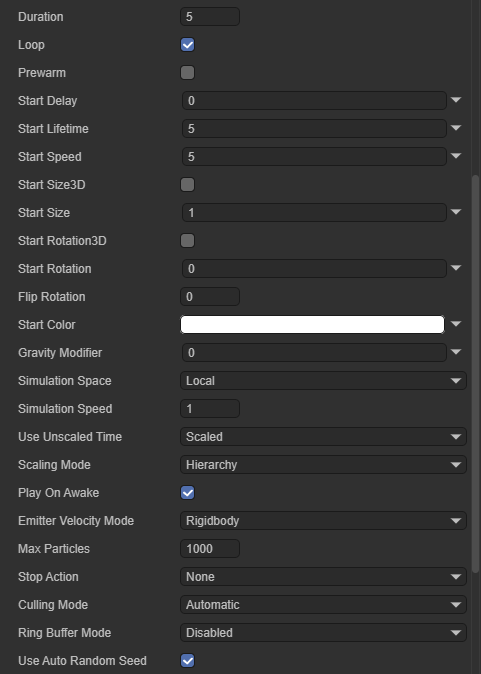

`Duration（运行时长）`：粒子系统运行的时间长度。

`Loop（循环）`：勾选后，粒子系统在持续时间结束时，再次启动并继续重复循环。

`Prewarm（预热）`：仅在`Loop（循环）`属性勾选后生效，启用此属性后，系统将初始化，使粒子系统看起来已经完成一个运行周期。

`Start Delay（延迟开始）`：系统开始发射前的延迟时间。

`Start Lifetime（生命周期）`：控制每个粒子的生命周期，也就是粒子发生多长时间后消失。

`Start Speed（初始速度）`：每个粒子在适当方向上的初始速度。只表示速度的大小，不包含方向。

`Start Size3D（3D初始大小）`：勾选此属性后，开发者可以分别控制粒子每个轴的初始大小。

​	`Start SizeX（X轴初始大小）`：用于控制粒子X轴上的大小。

​	`Start SizeY（Y轴初始大小）`：用于控制粒子Y轴上的大小。

​	`Start SizeZ（Z轴初始大小）`：用于控制粒子Z轴上的大小。

`Start Size`：每个粒子的初始大小。勾选`StartSize3D（3D初始大小）`后此属性失效。

`Start Rotation3D（3D初始旋转）`：勾选此属性后，开发者可以分别控制粒子每个轴上的旋转角度。

​	`Start RotationX（X轴初始旋转）`：用于控制粒子在X轴上的旋转。

​	`Start RotationY（Y轴初始旋转）`：用于控制粒子在Y轴上的旋转。

​	`Start RotationZ（Z轴初始旋转）`：用于控制粒子在Z轴上的旋转。

`Start Rotation3D（3D初始旋转)`：每个粒子的初始旋转。勾选`StartRotation3D（3D初始旋转）`后此属性失效。

`Flip Rotation（镜像旋转）`：一个归一化的值，代表有多少粒子会被反向旋转。

`Start Color（初始颜色）`：每个粒子的初始颜色。

`Gravity Modifier（重力影响）`：设置物理重力值。零值会关闭重力。

`Simulation Space（模拟空间）`：控制粒子的运动位置是在父对象的局部空间中（与父对象一起移动）、在世界空间中还是相对于自定义位置。

`Simulation Speed（模拟速度）`：调整整个系统更新的速度。

`Use Unscaled Time（使用未缩放时间）`：属性有`Scaled`和`Unscaled`两个选项，`Scaled`时粒子系统的运行效率会受到项目帧率的影响，`Unscaled`则不受影响。

`Scaling Mode（缩放模式）`：属性有`Hierarchy`、`Local` 或 `Shape`这三个选项。

​	`Hierarchy`：代表粒子会像普通节点一样，随各级父节点的缩放而缩放；

​	`Local`：模式下粒子系统只根据组件所属节点的缩放而缩放；

​	`Shape`：模式下缩放效果只作用于粒子发射器的形状，对粒子本身没有影响。

`Play On Awake（自动播放）`：勾选后粒子系统会在启动时自动开始发射粒子，否则需要通过代码控制发射。

`Emitter Velocity Mode（发射器速度模式）`：选择粒子系统如何计算使用的速度。

​	`Transform`：根据组件所属节点的Transform.position来估算速度

​	`Rigidbody`：从组件所属节点上的刚体组件中获取速度值，相当于使用了物理引擎计算的速度。

​	`Custom`：自定义速度，选择这个值后会出现`EmitterVelocity`这个属性，用于设置速度值。

`MaxParticles（最大粒子数）`：系统中同时允许的最多粒子数。

`Stop Action（结束动作）`：当属于系统的所有粒子都已完成，且粒子系统的运行也已经结束时，可使系统执行某种操作。

​	`None`不执行任何操作；

​	`Disable`禁用组件所属节点；

​	`Destory`：销毁组件所属节点；

​	`CallBack`：向挂载在同一个节点上的脚本发送一个回调信号。

`Culling Mode（剔除模式）`：当粒子系统不在视野范围内时，系统应如何处理它的模拟计算。

​	`AutoMatic（自动）`：如果是循环粒子，使用 Pause；如果是一次性粒子，使用 Always Simulate。

​	`Pause（暂停）`：粒子离开视野后，立即停止计算；重新进入视野时，从停止的那一刻继续。

​	`AlwaysSimulate（始终模拟）`：无论粒子是否在视野范围内，都持续计算。

​	`PauseAndCatchup（暂停并追赶）`：粒子离开视野时暂停模拟，重新进入视野时会一次性计算出这段时间内应该发生的位移。

`Ring Buffer Mode（循环覆盖模式）`：当粒子数量达到最大限制时。通过覆盖“最老的”粒子来产生新的粒子，而不是停止发射

​	`Disabled (默认)`：不启用此选项，粒子按生命周期正常消失。

​	`PauseUntilReplaced`：粒子数量达到最大时，老粒子在其寿命结束时不会消失，而是暂停在原地。直到新粒子需要空间时，它才会被替换。

​	`LoopUntilReplaced`：老粒子在其寿命结束时不会消失，而是重新循环其动画或生存周期。直到新粒子需要空间时，它才会被替换。

`Use Auto Random Seed（自动随机种子）`：启用后每次播放都会有不同。

### 2.3 发射器

发射器用于控制粒子的发射速率和时间。发射器包含以下内容：

`Enable（启用）`：是否启用发射器，勾选后粒子系统才会正常发射粒子。

`Rate Over Time（随单位时间产生的粒子数）`：每秒发射的粒子数。

`Rate Over Distance（随单位移动距离产生的粒子数）`：每个移动距离单位发射的粒子数，此模式可模拟实际由对象运动产生的粒子（例如，泥路上车轮留下的尘土）。

`Bursts（爆发）`：爆发是产生粒子的事件。用于控制粒子系统在指定时间一次性发射多个粒子。

​	`Time（时间）`：设置发射爆发粒子的时间（粒子系统开始播放后的秒数）。如果设置的值大于粒子系统的`Duration（运行时长）`，则爆发不会生效。

​	`Count（数量）`：设置单次爆发的最大粒子发射数量。粒子实际的发射数量会受到`MaxParticles（最大粒子数）`的限制。

​	`Cycle Count（循环次数）`：设置播放爆发次数的值。

​	`Repeat Interval（循环间隔）`：设置触发每个爆发周期的间隔时间（以秒为单位）的值。

​	`Probability（概率）`：控制每个爆发事件生成粒子的可能性。较高的值使系统产生更多的粒子，而值为 1 将保证系统产生粒子。

### 2.4 形状

形状用于定义粒子系统可发射粒子的体积或表面，以及粒子起始速度的方向。

形状模块有以下这些通用的属性：

`Enable（启用）`：是否启用形状模块。禁用后所有粒子会从同一点发射。

`Type（类型）`：选择要使用的发射器类型。根据选择形状的不同，形状模块的其余属性会有所不同。

`Position（位置）`：将一个偏移应用于生成粒子的发射器形状。

`Rotation（旋转）`：旋转生成粒子的发射器形状。

`Scale（缩放）`：更改生成粒子的发射器形状的大小。

`Align To Direction（方向对齐）`：将粒子的本地坐标轴与它发射时的速度方向保持一致。

`RandomDirection（随机化方向）`：将粒子发射时的速度方向朝随机方向混合。值为0时此属性不生效；值为1时，粒子随机运动。

`SphericalDirection（球面方向）`：将粒子发射时的速度方向朝球面方向混合。值为0时此属性不生效；值为1时，粒子方向从中心向外。

`RandomPosition（随机位置）`：为粒子的初始位置赋予一个随机值。值越大，位置的随机程度越高。

这些属性在后续的内容中不再重复讲解。

#### 2.4.1 Sphere（球形）、Hemisphere（半球形）

这两种形状的属性完全相同，因此一同讲解。

`Sphere`：在所有方向均匀发射粒子

`Hemisphere`：在平面其中一面的所有方向均匀发射粒子。

`Radius（半径）`：形状的圆形半径。

`Radius Thickness（半径厚度）`：发射粒子的体积比例。值为 0 表示从形状的外表面发射粒子。值为 1 表示从整个体积发射粒子。介于两者之间的值将使用体积的一定比例。

`Arc（弧度）`：发射器的有效弧度，默认为360°，粒子会从发射器的任意位置发射。当减小这个值时（例如设为180°），粒子将只从发射器的“一半”区域发射。

`Arc Mode（弧度模式）`：发射器喷出粒子的位置在有效范围内的移动方式。

​	`Random（随机）`：粒子会随机出现在圆弧范围之内。

​	`Loop（循环）`：粒子从起始点平滑的移动到终点，然后跳回起始点重新开始。

​	`PingPong（乒乓）`：粒子从起始点移动到终点，到达终点后不返回，而是原路折返。

​	`BurstSpread（爆发扩散）`：一般配合`Bursts（爆发）`使用，可以将单次爆发的所有粒子均匀的分布在整个弧度范围内。

`Arc Speed（弧度速度）`：当`Arc Mode（弧度模式）`选择了`Loop（循环）`或`PingPong（乒乓）`时，这个属性才会出现，用于控制发射器喷出粒子的位置在有效范围内的移动速度。

`Arc Spread（弧度散布）`：每隔多少度发射一次粒子，粒子按间隔角度均匀发射，间隔角度 = Arc * Arc Spread的值。

#### 2.4.2 Cone（锥形）

此形状下，所有粒子从圆锥体的顶部出发，沿着圆锥的角度向外扩散。

`Angle（角度）`：锥体在其顶点处的角度。角度为 0 时产生圆柱体，角度为 90 度时产生圆盘。

`Radius（半径）`： 锥体顶部的半径，设置为0时所有粒子都从同一个点出发。

`Radius Thickness（半径厚度）`：发射粒子的体积比例。值为 0 表示从形状的外表面发射粒子。值为 1 表示从整个体积发射粒子。介于两者之间的值将使用体积的一定比例。

`Arc（弧度）`：发射器的有效弧度，默认为360°，粒子会从发射器的任意位置发射。当减小这个值时（例如设为180°），粒子将只从发射器的“一半”区域发射。

`Arc Mode（弧度模式）`：发射器喷出粒子的位置在有效范围内的移动方式。

​	`Random（随机）`：粒子会随机出现在圆弧范围之内。

​	`Loop（循环）`：粒子从起始点平滑的移动到终点，然后跳回起始点重新开始。

​	`PingPong（乒乓）`：粒子从起始点移动到终点，到达终点后不返回，而是原路折返。

​	`BurstSpread（爆发扩散）`：一般配合`Bursts（爆发）`使用，可以将单次爆发的所有粒子均匀的分布在整个弧度范围内。

`Arc Speed（弧度速度）`：当`Arc Mode（弧度模式）`选择了`Loop（循环）`或`PingPong（乒乓）`时，这个属性才会出现，用于控制发射器喷出粒子的位置在有效范围内的移动速度。

`Arc Spread（弧度散布）`：每隔多少度发射一次粒子，粒子按间隔角度均匀发射，间隔角度 = Arc * Arc Spread的值。

#### 2.4.3 Box（盒形）

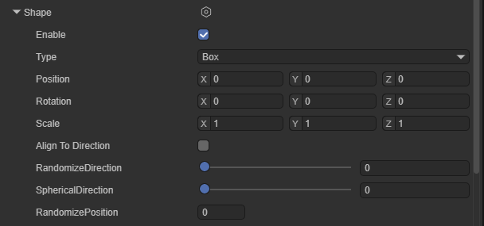

盒形发射器的形状是一个立方体，粒子在发射器体积内的任意位置出发。盒型发射器没有特殊属性，这里不再介绍。

#### 2.4.4 ConeVolume（锥形体积）

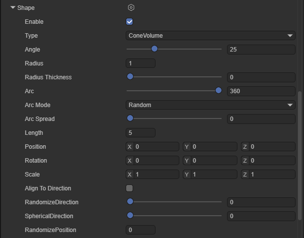

此形状下，粒子会在圆锥体内部空间的随机位置生成，而不是仅在圆锥体顶部生成。`ConeVolume（锥形体积）`的大多数属性和`Cone（锥形）`相同，这里不再重复介绍，只有`Length（长度）`这一属性是`Cone（锥形）`没有的：

`Length（长度）`：粒子可以生成的纵深范围。

#### 2.4.5 Circle（圆形）

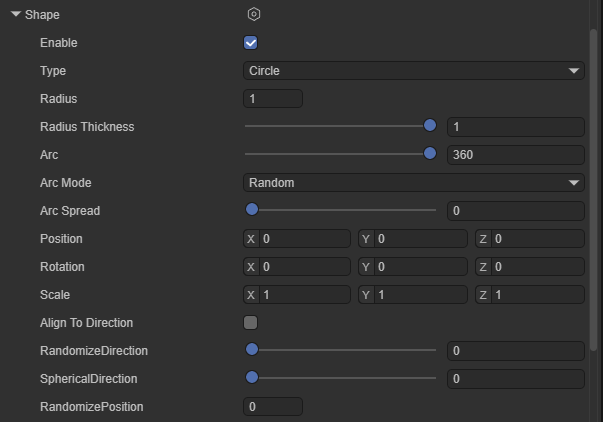

圆形发射器是一个平面发射器，粒子的发射趋势是沿着圆面发射，默认状态下粒子处于同一平面内，调整Scale.z的值不会影响发射器的形状。

`Radius（半径）`：圆形的半径。

`Radius Thickness（半径厚度）`：发射粒子的体积比例。值为 0 表示从形状的外表面发射粒子。值为 1 表示从整个体积发射粒子。介于两者之间的值将使用体积的一定比例。

`Arc（弧度）`：发射器的有效弧度，默认为360°，粒子会从发射器的任意位置发射。当减小这个值时（例如设为180°），粒子将只从发射器的“一半”区域发射。

`Arc Mode（弧度模式）`：发射器喷出粒子的位置在有效范围内的移动方式。

​	`Random（随机）`：粒子会随机出现在圆弧范围之内。

​	`Loop（循环）`：粒子从起始点平滑的移动到终点，然后跳回起始点重新开始。

​	`PingPong（乒乓）`：粒子从起始点移动到终点，到达终点后不返回，而是原路折返。

​	`BurstSpread（爆发扩散）`：一般配合`Bursts（爆发）`使用，可以将单次爆发的所有粒子均匀的分布在整个弧度范围内。

`Arc Speed（弧度速度）`：当`Arc Mode（弧度模式）`选择了`Loop（循环）`或`PingPong（乒乓）`时，这个属性才会出现，用于控制发射器喷出粒子的位置在有效范围内的移动速度。

`Arc Spread（弧度散布）`：每隔多少度发射一次粒子，粒子按间隔角度均匀发射，间隔角度 = Arc * Arc Spread的值。

#### 2.4.6 SingleSideEdge（边缘形）

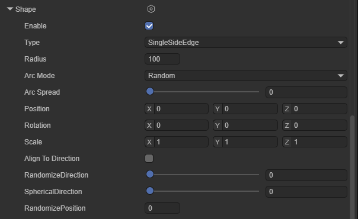

边缘形发射器的形状是一条线。粒子在发射器对象的向上 (Y) 方向上移动。

`Radius（半径）`：此半径属性用于定义边的长度。

`Arc Mode（弧度模式）`：控制粒子在圆弧区域内生成的位置以及顺序。

​	`Random（随机）`：粒子会随机出现在圆弧范围之内。

​	`Loop（循环）`：粒子从起始点平滑的移动到终点，然后跳回起始点重新开始。

​	`PingPong（乒乓）`：粒子从起始点移动到终点，到达终点后不返回，而是原路折返。

​	`BurstSpread（爆发扩散）`：一般配合`Bursts（爆发）`使用，可以将单次爆发的所有粒子均匀的分布在整个弧度范围内。

`Arc Speed（弧度速度）`：当`Arc Mode（弧度模式）`选择了`Loop（循环）`或`PingPong（乒乓）`时，这个属性才会出现，用于控制发射器喷出粒子的位置在有效范围内的移动速度。

`Arc Spread（弧度散布）`：每隔多少度发射一次粒子，粒子按间隔角度均匀发射，间隔角度 = Arc * Arc Spread的值。

#### 2.4.7 BoxShell（盒形外壳）

与`Box（盒形）`发射器类似，`BoxShell（盒形外壳）`同样也是一个立方体形状的发射器，粒子会在发射器立方体的表面出发。它有一个特殊属性。

`Box Thickness（盒体厚度）`：当值为0时，粒子只会在发射器立方体表面发射；当值不为0时，粒子会在发射器内部发射。

#### 2.4.8 BoxEdge（盒型边缘）

`BoxEdge（盒型边缘）`也是一个立方体形状的发射器，粒子会在发射器立方体的每条边出发。

`Box Thickness（盒体厚度）`：当值为0时，粒子只会在发射器立方体的每条边发射；当值不为0时，粒子会在发射器的表面发射。

#### 2.4.9 Donut（甜甜圈）

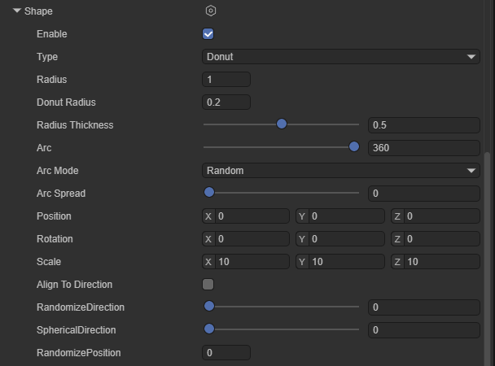

`Donut（甜甜圈）`形粒子发射器是一个圆环形的发射器，粒子会从圆环的环面出发并向外移动。

`Radius（半径）`：圆环的半径。

`DountRadius（甜甜圈半径）`：圆环的粗度。

`Radius Thickness（半径厚度）`：发射粒子的体积比例。值为 0 表示从形状的外表面发射粒子。值为 1 表示从整个体积发射粒子。介于两者之间的值将使用体积的一定比例。

`Arc（弧度）`：发射器的有效弧度，默认为360°，粒子会从发射器的任意位置发射。当减小这个值时（例如设为180°），粒子将只从发射器的“一半”区域发射。

`Arc Mode（弧度模式）`：发射器喷出粒子的位置在有效范围内的移动方式。

​	`Random（随机）`：粒子会随机出现在圆弧范围之内。

​	`Loop（循环）`：粒子从起始点平滑的移动到终点，然后跳回起始点重新开始。

​	`PingPong（乒乓）`：粒子从起始点移动到终点，到达终点后不返回，而是原路折返。

​	`BurstSpread（爆发扩散）`：一般配合`Bursts（爆发）`使用，可以将单次爆发的所有粒子均匀的分布在整个弧度范围内。

`Arc Speed（弧度速度）`：当`Arc Mode（弧度模式）`选择了`Loop（循环）`或`PingPong（乒乓）`时，这个属性才会出现，用于控制发射器喷出粒子的位置在有效范围内的移动速度。

`Arc Spread（弧度散布）`：每隔多少度发射一次粒子，粒子按间隔角度均匀发射，间隔角度 = Arc * Arc Spread的值。

#### 2.4.10 Rectangle（矩形）

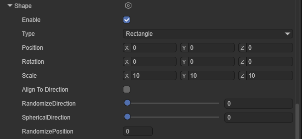

从矩形发射粒子，所有粒子会从同一个矩形平面的随机位置出发，默认状态下沿z轴正方向移动。

`Rectangle（矩形）`没有特殊属性，这里不再讲解。

### 2.5  Velocity Over Lifetime（速度随生命周期变化）

此模块控制粒子在其生命周期内的速度。

`Enable`：是否启用此模块。

`X,Y,Z`：粒子在 X、Y 和 Z 轴上的线性速度。

> 注意：如果设置了粒子系统的`StartSpeed（初始速度）`属性，则粒子最终的速度会由`StartSpeed（初始速度）`和`X,Y,Z`相加得到。

`Space`：指定`X,Y,Z`是参照本地空间还是世界空间。

` OrbitalX,Y,Z`：粒子围绕 X、Y 和 Z 轴旋转的轨道速度。

`OrbitalOffset X, Y, Z`：轨道中心位置偏移。

`Radial`：粒子远离/朝向轨道中心位置的径向速度。值大于0时，粒子远离中心点运动；值小于0时，粒子朝向中心点运动。

`SpeedModifier`：粒子总速度的一个倍率缩放。

### 2.6 Limit Velocity Over Lifetime （限制速度随生命周期变化）

此模块控制粒子的速度在其生命周期内如何降低。

`Enable`：是否启用此模块。

`SeparateAxes`：将轴拆分为单独的 X、Y 和 Z 分量。不勾选此项时，模块会计算粒子速度的大小并进行限制。

​	`Limit X,Y,Z`：速度在X、Y 和 Z 轴上的限制值。勾选`SeparateAxes`后显示并生效

`Speed`：设置粒子的速度限制。不勾选`SeparateAxes`时显示并生效。

`Dampen`：当粒子速度超过速度限制时，粒子速度降低的比例。这个值会使粒子速度降低的较为平滑。

`Drag`：对粒子速度施加线性阻力。粒子的速度会持续受到此值的影响，即使粒子的速度已经小于`Speed`限制的速度。

`Multiply by Size`：启用此属性后，较大的粒子会更大程度上受到阻力系数的影响。

`Multiply by Velocity`：启用此属性后，较快的粒子会更大程度上受到阻力系数的影响。

### 2.7 Inherit Velocity（继承速度）

此模块控制粒子的速度如何随时间推移而受到其父对象移动的影响。

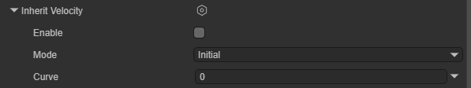

`Enable`：是否启用此模块。

`Mode`：指定如何将发射器速度应用于粒子。

 	`Current`：发射器的当前速度将应用于每一帧上的所有粒子。例如，如果发射器减速，所有粒子也将减速。

​	`Initial`：每个粒子出生时将施加一次发射器的速度。粒子出生后对发射器速度的任何改变都不会影响该粒子。

`Multiplier`：粒子应该继承的发射器速度的比例。

### 2.8 Lifetime by Emitter Speed（随发射器速度变化的生命周期）

该模块根据粒子生成时发射器的速度控制每个粒子的初始生命周期。它将粒子的初始生命周期乘以一个值，该值取决于产生它们的对象的速度。对于大多数粒子系统，此为游戏对象速度，但对于子发射器，速度来自子发射器粒子所源自的父粒子。

`Enable`：是否启用此模块。

`Multiplier`：应用于粒子初始生命周期的乘数。模块会根据设置的曲线模式以不同方式使用此值。

​	`Constant`：使用常数乘数值。此时`Speed Range`会失效。

​	`Curve`：曲线的横坐标为发射器的速度，纵坐标为乘数。

​	`Random Between Two Constants`：为每个粒子在设置的两个常量之间取一个随机值作为常数。此时`Speed Range`会失效。

​	`Random Between Two Curves`：曲线的横坐标为发射器的速度，纵坐标为乘数。模块会在两条曲线之间随机取值。

`Speed Range`：发射器速度的最小值和最大值。模块会将这个值归一化，并在`Multiplier`曲线中采样。

### 2.9 Force Over Lifetime（力随生命周期变化）

通过指定的力对粒子加速。

`Enable`：是否启用此模块。

`X,Y,Z`：在 X、Y 和 Z 轴上施加到每个粒子的力。

`Space`：选择是在局部空间还是在世界空间中施力。

`Randomize`：当`X,Y,Z`选择了`Random Between Two Constants`或`Random Between Two Curves`模式时，此属性会导致模块在每帧都会为粒子施加不同的力，因此会产生更动荡、更不稳定的运动。

### 2.10 Color Over Lifetime（颜色随生命周期变化）

此模块指定粒子的颜色和透明度在其生命周期中如何变化。

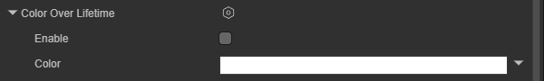

`Enable`：是否启用此模块。

`Color`：粒子在其生命周期内的颜色渐变。渐变条的左侧点表示粒子生命周期的开始，而渐变条的右侧表示粒子生命周期的结束。

### 2.11 Color By Speed（随速度变化的颜色）

此模块指定粒子的颜色随粒子速度产生的变化。

`Enable`：是否启用此模块。

`Color`：在速度范围内定义的粒子的颜色渐变。

`Range`：粒子速度范围的下限和上限。粒子的速度会被映射到`Color`的横轴上，超出范围的速度会映射到端点。

### 2.12 Size over Lifetime（大小随生命周期变化）

此模块指定粒子的大小随粒子生命周期而产生的变化。

`Enable`：是否启用此模块。

`Separate Axes`：在每个轴上独立控制粒子大小。

`Size`：定义粒子的大小在其生命周期内如何变化。

### 2.13 Size by Speed（随速度变化的粒子大小）

此模块指定粒子的大小随粒子速度产生的变化。

`Enable`：是否启用此模块。

`Separate Axes`： 在每个轴上独立控制粒子大小。

`Size`：粒子的大小。模块会根据设置的曲线模式以不同方式使用此值。

​	`Constant`：粒子大小为一个常数。此时`Range`会失效。

​	`Curve`：曲线的横坐标为粒子的速度，纵坐标为粒子大小。

​	`Random Between Two Constants`：为每个粒子在设置的两个常量之间取一个随机值作为粒子大小。此时`Range`会失效。

​	`Random Between Two Curves`：曲线的横坐标为粒子的速度，纵坐标为粒子大小。模块会在两条曲线之间随机取值。

`Range`：粒子速度范围的下限和上限。粒子的速度会被映射到`Size`的横轴上，超出范围的速度会映射到端点。

### 2.14 Rotation Over Lifetime（旋转随生命周期变化）

此模块指定粒子的旋转随粒子生命周期而产生的变化。

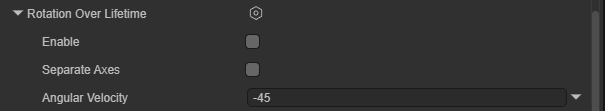

`Enable`：是否启用此模块。

`Separate Axes`：允许根据每个轴指定旋转速度。启用此选项后，即可为 X、Y 和 Z 轴中的每个轴设置旋转速度。

`Angular Velocity`：粒子的旋转速度。这个属性只在未勾选`Separate Axes`才会出现，设置的值会作用于粒子的每个轴。

### 2.15 Rotation By Speed（随速度变化的粒子旋转）

此模块指定粒子的旋转随粒子速度产生的变化。

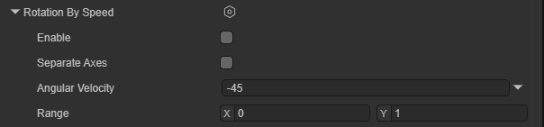

`Enable`：是否启用此模块。

`Separate Axes`：允许根据每个轴指定旋转速度。启用此选项后，即可为 X、Y 和 Z 轴中的每个轴设置旋转速度。

`Angular Velocity`：粒子的旋转速度。

​	`Constant`：粒子旋转速度为一个常数。此时`Range`会失效。

​	`Curve`：曲线的横坐标为粒子的速度，纵坐标为粒子的旋转速度。

​	`Random Between Two Constants`：为每个粒子在设置的两个常量之间取一个随机值作为粒子的旋转速度。此时`Range`会失效。

​	`Random Between Two Curves`：曲线的横坐标为粒子的速度，纵坐标为粒子的旋转速度。模块会在两条曲线之间随机取值。

`Range`：粒子速度范围的下限和上限。粒子的速度会被映射到`Angular Velocity`的横轴上，超出范围的速度会映射到端点。

### 2.16 External Forces（外部力场）

此属性用于修改风区和粒子系统立场对系统发射粒子的影响。

`Enable`：是否启用此模块。

`Multiplier`：应用于风区外力的比例值。

`Influence Filter`：影响过滤。决定哪些力场可以影响该粒子系统。

​	`LayerMask`：利用 Layer（层级）来过滤力场。只有在指定 Layer 上的力场组件才会对粒子生效。

​	`List`：根据指定的列表来过滤力场。

​	`LayerMaskAndList`：层级和列表都使用。

### 2.17 Noise（噪声）

此模块用于为粒子的运动轨迹添加随机扰动，让粒子不再生硬地直线飞出。

`Enable`：是否启用此模块。

`Separate Axes`：在每个轴上独立控制强度和重新映射。

`Strength`：噪声的总强度。数值越大，粒子抖动、偏离原轨道的幅度越大。

`Frequency`：低值会产生柔和、平滑的噪声，而高值会产生快速变化的噪声。此属性可控制粒子改变行进方向的频率以及方向变化的突然程度。

`Scroll Speed`：噪声场的移动速度。让噪声随时间发生位移，产生一种“风在吹动抖动感”的效果。

`Damping`：阻尼。如果开启，粒子的速度越快，受到的噪声影响就越小。

`Octave Count`：指定组合多少层重叠噪声来产生最终噪声值。使用更多层可提供更丰富、更有趣的噪声，但会显著增加性能成本。

`Octave Multiplier`：对于每个附加的噪声层，按此比例降低强度。

`Octave Scale`：对于每个附加的噪声层，按此乘数调整频率。

`Quality`：质量。此属性会影响噪声生成的精细程度

`Remap Enabled`：启用重新映射。将最终噪声值重新映射到不同的范围。

`Remap`：描述最终噪声值如何变换的曲线。

`Position Amount`：用于控制噪声对粒子位置影响程度的乘数。

`Rotation Amount`：用于控制噪声对粒子旋转（以度/秒为单位）影响程度的乘数。

`Size Amount`：用于控制噪声对粒子大小影响程度的乘数。

### 2.18 Collision（碰撞）

此模块控制粒子如何与场景中的游戏对象碰撞。

`Enable`：是否启用此模块。

`Type`：碰撞模式。有`Planes（平面模式）`和`World（世界模式）`两种。

​	`Planes（平面模式）`：指定一组平面，粒子只会与这些平面碰撞。

​	``World（世界模式）``：粒子会与场景中所有带Collider的节点发生碰撞。

`Plane Sps`：`Planes（平面模式）`模式下用于碰撞的平面。

`Dampen`：粒子碰撞后损失的速度比例。

`Bounce`：粒子碰撞后从表面反弹的速度比例。

`Lifetime Loss`：粒子碰撞后损失的总生命周期比例。

`Min Kill Speed`：碰撞后运动速度低于此速度的粒子将从系统中予以移除。

`Max Kill Speed`：碰撞后运动速度高于此速度的粒子将从系统中予以移除。

`Radius Scale`：允许调整粒子碰撞球体的半径，使其更贴近粒子图形的可视边缘。

### 2.19 Sub Emitters（子发射器）

在此模块中可设置子发射器。这些子发射器是在粒子生命周期的某些阶段在粒子位置处创建的附加粒子发射器。

`Enable`：是否启用此模块。

`Sub Emitters`：配置一个子发射器列表，并选择它们的触发条件以及它们从父粒子继承的属性。

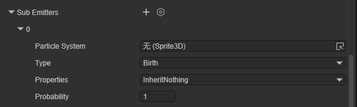

`Particle System`：选择粒子发射器要继承的粒子系统。

`Type`：子发射器的出发条件。

​	`Birth（出生）`：父粒子产生时，子粒子也随之产生

​	`Collision（碰撞）`： 父粒子撞到物体时产生。

​	`Death（死亡）`：父粒子寿命结束时产生。

​	`Trigger（触发器）`： 当粒子进入特定的 Trigger 区域时产生。

​	`Manual（手动）`：通过脚本代码控制触发。

`Properties`：控制哪些属性会被子发射器继承。可继承属性包括颜色，大小，旋转，生命周期，持续时间。

`Probability`：子发射器会被出发的概率。

### 2.20 Texture Sheet Animation（纹理片集动画）

此模块使用一张包含多个帧的图集，让每个粒子在生命周期内播放这张图集中的动画。

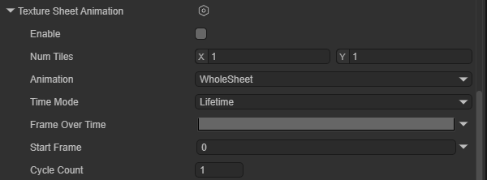

`Enable`：是否启用此模块。

`Num Tiles`：纹理在 X（水平）和 Y（垂直）方向上划分的区块数量。

`Animation`：控制动画的播放模式

​	`WholeSheet`：循环播放整张纹理的所有帧。

​	`SingleRow`：只播放特定的一行。

`Time Mode`：控制动画的播放速度。

​	`Lifetime`：动画进度随粒子寿命推进

​	`Speed`：动画播放速度随粒子移动速度改变。

​	`FPS`：设定固定的帧率播放。

`Frame over Time`：控制动画帧随时间的推移如何增加。旋转`Lifetime`模式后生效。

`Start Frame`：粒子出生时从哪一帧开始播放动画。

`Cycle Count`：在粒子的生命周期内，动画重复播放多少次。

### 2.21 Trails（拖尾）

此模块可将拖尾添加到粒子上。

`Enable`：是否启用此模块。

`Mode`：粒子系统生成轨迹的模式

​	`PerParticle`：在粒子的运动轨迹上生成拖尾。

​	`Ribbon`：创建根据存活时间连接每个粒子的轨迹带。

`Ratio`：定义有多少比例的粒子会产生拖尾。

`Lifetime`：拖尾存在的时长（以粒子寿命的百分比计）。

`Min Vertex Distance`：顶点密度。粒子每移动多少距离生成一个新顶点。数值越小拖尾越平滑，但性能消耗也越高。

`World Space`：勾选后，拖尾顶点留在世界坐标；如果不勾选，移动发射器时整个拖尾会跟着一起平移。

`Die with Particles`：随粒子销毁。勾选时，粒子一死拖尾立即消失；不勾选时，拖尾会播完自己的 Lifetime 后才消失。

`Texture Mode`：纹理模式。

​	`Stretch`：贴图被拉伸填满整条拖尾。

​	`Tile`：贴图按长度重复平铺

​	`Distribute Per Segment`：贴图按顶点分布。

​	`Repeat Per Segment`：每两个顶点间重复一次贴图。

​	`Static`：静态贴图。

`Texture Scale`：拖尾纹理的缩放。

`Size affects Width`：如果启用此属性，则轨迹宽度受粒子大小影响。

`Size affects Lifetime`：如果启用此属性，则轨迹生命周期受粒子大小影响。

`Inherit Particle Color`：如果启用此属性，则轨迹颜色由粒子颜色调制。

`Color over Lifetime`：拖尾颜色随时间的变化。

`Width over Trail`：宽度曲线。横坐标 0 是拖尾头部（紧贴粒子处），1 是末尾。

`Color over Trail`：颜色渐变曲线。控制拖尾从头到尾的颜色和透明度。

## 三、CPU粒子系统渲染介绍

渲染器模块的设置决定了粒子如何着色和绘制。

`Render Mode`：渲染模式。

​	`Billboard`：粒子始终朝向摄像机。

​	`Alignment`：选择粒子广告牌面向的方向。`Render Mode`选择`Billboard`时生效。

​		`View`：粒子面向摄像机平面。

​		`World`：粒子与世界轴对齐。

​		`Local`：粒子与游戏对象的变换组件对齐。

​		`Facing`：粒子面向摄像机游戏对象的直接位置。

​		`Velocity`：粒子面向其速度方向。

​	`Stretched`：粒子根据速度、长度或缩放进行拉伸。

​		`Camera Velocity Scale`：根据摄像机运动拉伸粒子。将此值设置为 0 可禁用摄像机运动拉伸。

​		`Velocity Scale`：根据粒子速度按比例拉伸粒子。将此值设置为 0 可禁用基于速度的拉伸。

​		`Length Scale`：沿着粒子的速度方向根据粒子当前大小按比例拉伸粒子。将此值设置为 0 会使粒子消失，相当于 0 长度。

​		`Freeform Stretching`：指示粒子是否应使用自由形式拉伸。通过这种拉伸行为，当正面查看粒子时，粒子不会变薄。

​		`Rotate With Stretch`：指示是否根据粒子的拉伸方向旋转粒子。此属性仅在`Freeform Stretching` 启用时有效。

​	`Horizontal Billboard`：粒子水平固定在 XZ 平面上。

​	`Vertical Billboard`：粒子垂直站在 Y 轴上，但会跟随摄像机旋转。

​	`Mesh`：使用 3D 模型作为粒子。

​	`None`：不渲染任何东西。

`Alignment`：选择粒子广告牌面向的方向。

​	`View`：粒子面向摄像机平面。

​	`World`：粒子与世界轴对齐。

​	`Local`：粒子与游戏对象的变换组件对齐。

​	`Facing`：粒子面向摄像机游戏对象的直接位置。

​	`Velocity`：粒子面向其速度方向。

`Flip`：在指定轴上镜像一定比例的粒子。较高的值会翻转更多的粒子。

`Enable GPUInstancing`：控制是否要使用 GPU 实例化来渲染粒子系统。需要使用网格渲染模式并使用兼容的着色器。

`Pivot`：修改旋转粒子的中心轴心点。此值是粒子大小的乘数。

`Visualize Pivot`：在场景面板中预览粒子轴心点。

