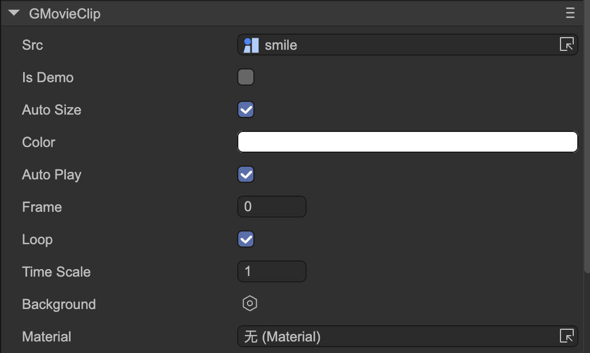

# 动画（GMovieClip）
Author: 谷主

- **Src** 图集资源。
- **Is Demo Src**设置的内容只作为Demo，也就是只在IDE编辑时显示，发布时将自动清空。
- **Auto Size** 是否自动大小。在改变Src时，如果Auto Size是true，则节点的大小会自动改变为动画的大小。
- **Color** 动画的颜色。
- **AutoPlay** 是否自动播放。
- **Frame** 当前帧索引。
- **Loop** 是否循环播放。
- **Time Scale** 变速设置。