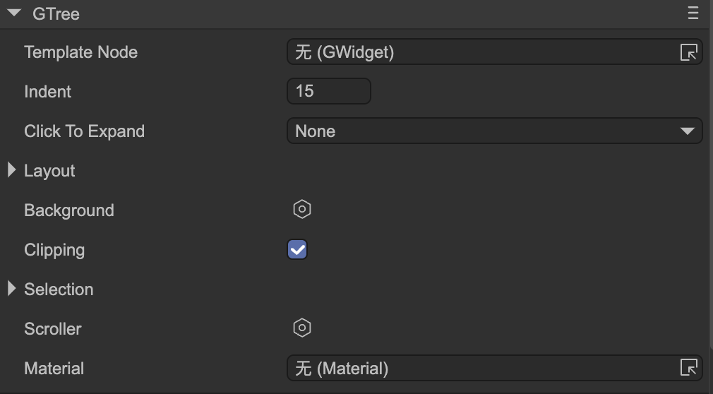

# 树 （GTree）
Author: 谷主

- `Template Node` item节点模版。从层级面板拖入一个节点。这个节点必须为GTree节点的孩子。
- `Indent` 每级缩进。树节点的深度每增加一级，向右缩进的像素距离。例如，如果每级缩进是15像素，树节点的层级是3级，那么树节点的缩进是15*3=45像素。
- `Click To Expand` 点击文件夹节点时是否自动展开或者折叠这个这个节点。
  - `None` 没有动作。
  - `SingleClick`  单击时展开这个节点。
  - `DoubleClick`  双击时展开这个节点。
- `Layout` 参考[布局容器](../layout/readme.md)。
- `Clipping` 是否开启剪裁。开启后，超出容器尺寸的内容将会被隐藏。
- `Selection` 参考[Selection支持](../selection/readme.md)
- `Scroller`  参考[滚动支持](../scroller/readme.md)。