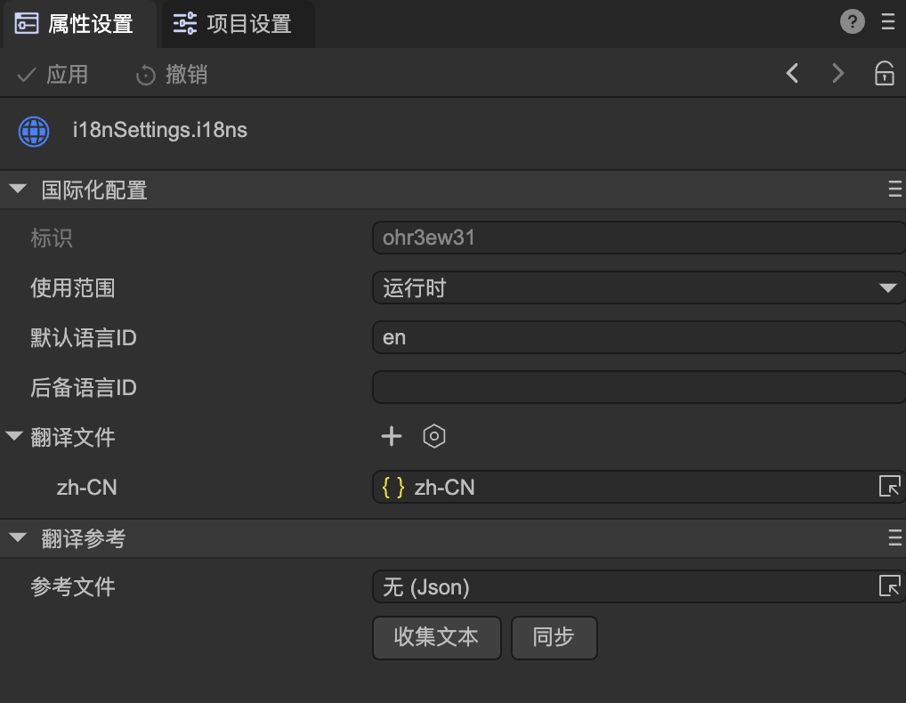
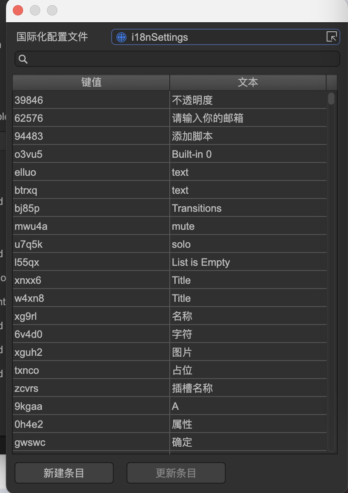
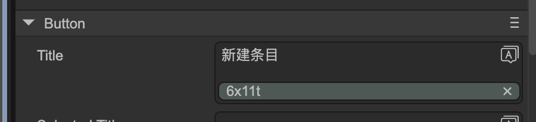

# 国际化
Author: 谷主

本UI系统提供的国际化功能，可以方便的让你的UI界面支持多国语言。首先我们需要一个新建一个国际化配置文件，这个文件放置在你的所有界面文件所在的目录或上级目录。如图1-1,1-2所示


（图1-1）



（图1-2）

**标识**：国际化配置文件的唯一标识，自动生成，不可修改（如果确实要修改，可以用文本方式打开配置文件直接修改，但需要自行保证唯一。但修改后已经在界面上绑定的会全部丢失）。

**使用范围：**运行时或编辑器扩展，使用默认的运行时即可。

**默认语言ID**：通过可视化方式制作编辑器预制体时，在界面设计时使用的文本语言。举例，如果你用中文制作界面，那这里就是zh-CN，如果你用英文制作界面，那这里是en，等等。如果这里设定的语言与运行时的语言一致，那么将直接使用界面上的文本，不会使用翻译文件进行替换。

**后备语言ID**：如果找不到匹配运行时语言的翻译文件，就会使用后备语言ID继续进行匹配。例如，如果运行时语言是德语，而翻译文件里没有德语（de）的翻译文件，就会使用后备语言ID（en）的翻译文件。

**翻译参考**：一般用于自动收集界面上的文字，形成一个参考文件。然后用这个参考文件去翻译成各种语言，再添加到翻译文件列表中。参考文件不需要添加到翻译文件列表中，因为参考文件内的文字都是界面上现存的。

**收集文本：**点击后，将分析配置文件所在目录和子目录下的所有预制体文件，收集所有需要翻译的文字到参考文件中，并将这些文本转换为国际化的格式。如果参考文件未设定，则会自动生成一个。

**同步**：当重新收集文本后，点击同步，可以使所有翻译文件的条目与参考文件匹配。例如，如果界面上新建了一个文本“abc”，点击收集文本后，参考文件将增加一个条目“abc"。点击同步后，所有翻译文件都会增加一个条目"abc"。

除了自动收集界面上的文字，我们也可以手动设定，例如一个按钮的标题，如图1-3所示：


（图1-3）

点击右上角的按钮，将弹出界面，如图1-4所示：



（图1-4）

在这里可以选择，或者新建语言文件中的条目。选择一项后，输入框更新显示为，如图1-,5所示：



（图1-5）

绿色的横条显示着翻译文件的键值，表示这个文本已经国际化。

**界面****国际化****后，语言的适配是全自动的，无需代码干预。**

除了界面国际化，代码输出的信息也需要国际化。通常我们建议使用另外的配置文件，不要和界面使用的配置文件混淆。手动创建多个翻译文件后，拖入到翻译文件列表中就可以了。这些文件的键值需要自行同步。

翻译参考功能可以忽略，因为无需从界面上收集。如图1-所示


（图1-6）

代码里使用的方式为：

```TypeScript
let myI18n: Laya.Translations;

myI18n = await Laya.loader.load("editorResources/i18nSettings.i18ns");
console.log(myI18n.t("a"));
```

在很多情况下，如果只是代码里用到的一些小量国际化的支持，并不想创建多个json文件，那么也有全代码的方法。

```TypeScript
//第一个参数需要全局唯一
let myI18n = Laya.Translations.create("LodSimplify");
myI18n.setContent("zh-CN", {
    meshRate : "模型压缩比例",
    meshRateTips : "根据设置的比例对模型网格进行压缩2x"
});
console.log(myI18n.t("meshRate", "Mesh Rate"));
```

可以多次调用setContent添加不同语言的翻译，下面的例子添加了语言en的翻译，所以在应用t函数时可以省略默认值。

```TypeScript
//第二个参数是备用语言ID，默认是en，所以在这里是可以省略不写的
let myI18n = Laya.Translations.create("LodSimplify", "en");
myI18n.setContent("zh-CN", {
    meshRate : "模型压缩比例",
    meshRateTips : "根据设置的比例对模型网格进行压缩2x"
}).setContent("en", {
    meshRate: "Mesh Rate2",
    meshRateTips: "Compress the model mesh based on the set ratio."
});

console.log(myI18n.t("meshRate"));
```