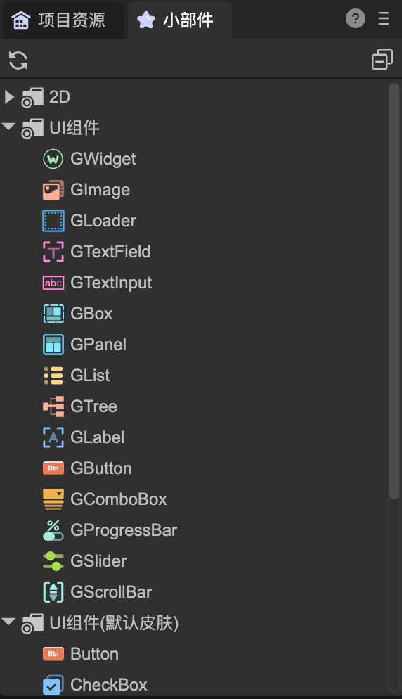

# FairyGUI架构的新UI系统
Author: 谷主

## 基础概述

### 一、节点类型概述

在新UI系统中，所有组件的基类是GWidget，它从引擎的Sprite类派生，因此Sprite具有的属性和方法都可以使用，也就是说，它具有普通2D节点的所有功能。

新UI系统内置的组件类型有以下这些，按功能分类：

- `图片显示`：GImage、GLoader
  -  GImage和GLoader都可以用作最基础的图片显示用途，但GImage更为轻量，所以当一张图片在IDE被拖入舞台区域时，默认创建的是GImage。
  -  GImage显示的图片永远是填满节点的宽度和高度，GLoader则可以在图片尺寸小于或大于节点尺寸时，选择拉伸、居中、保持比例等适配方式。
  -  GLoader还可以显示序列帧动画，也就是它的src属性既可以是一个图片的url，也可以是一个序列帧动画（atlas文件）的url。
- `文本处理`：GTextField、GTextInput
  -  GTextField用于显示静态文本，是对引擎Text类的封装，支持显示普通文字、富文本、图文混排等。
  -  GTextInput用于接收用户输入的文本，是对引擎Input类的封装。
- `布局容器:`  GBox
  -  GBox用于对子节点进行布局，可以设置子节点的排列方向、间隔、对齐方式等。常见的布局方式有单行、单列、多行、多列，分页等。
- `面板容器`：GPanel、GList、GTree
  -  GPanel从GBox派生，除了具有GBox的布局功能外，还可以设置是否剪裁子节点、是否使用滚动功能等。
  -  GList和GTree都从GPanel派生，是用于显示列表和树形结构的容器。GList支持虚拟化，用于高性能显示大量数据。
- `行为组件`：GLabel（标签）、GButton（按钮）、GComboBox（下拉框）、GProgressBar（进度条）、GSlider（滑动条）、GScrollBar（滚动条）
  -  这类组件应用了组合设计模式，将显示和行为分离，使组件的样式和行为可以独立修改。具体说，就是这些组件只实现了具体的行为逻辑，但不带任何显示功能的组件（如文字图片等），需要用户为它绑定显示组件才能正常显示内容。
  -  举例，当在舞台上创建一个GButton组件时，发现它在舞台上完全空白，没有任何按钮形态的显示。只有在绑定了另外一个GTextField节点作为它的标题组件，或者绑定了另外一个GImage节点作为它的图标组件后，它才会具有一个按钮的真实效果。
  -  通常我们不需要每次都这样操作，所以像按钮这类组件通常会在IDE中制作成预制体再使用。例如“UI组件（默认皮肤）”里的按钮组件，就是IDE内置提供的一个按钮预制体。
  -  这种设计模式的好处是，用户可以自由定制行为组件的显示部分，可以直接设置显示组件的所有属性，而不用依赖行为组件的二次导出，从而实现了组件的高度定制化。

### 二、编辑器操作

在使用IDE制作场景或者预制体时，GWidget以及它的派生类可以直接加入到场景的节点树中，使用方法和引擎的旧UI系统一样，如下图1-1，1-2所示。

（图1-1）

（图1-2）

### 三、常见问题

- 拖入一个GButton到舞台，设置它的Title为何没有任何效果？

GButton是一个行为组件，它不带显示功能。你需要制作自己的按钮再拖入使用。当然，也可以使用“UI组件（默认皮肤）”里的提供的预制好的按钮。其他如下拉框、进度条也类似这种情况。

- 拖入了“UI组件（默认皮肤）”里的按钮到舞台，怎样改变它的三态图？

按钮没有三态图这个属性。从设计理念来说，仅设置三张图片的地址，对于个性化按钮来说是不足够的，图片的大小，位置等属性，或者是一张图片用在同时两态上这种情况，等等，GButton类不可能提供大量接口去完成个性化，既损失效率，也对包体不友好。

​       在新UI系统中，你应该为每种皮肤不同的按钮制作一个预制体。编辑器也提供了快捷生成按钮预制体的功能，在`工具->制作按钮`菜单下。如下图1-3所示。

（图1-3）

- 想显示一段文字，拖入一个GLabel到舞台，为何显示不出文字？

显示文字应该使用GTextField，而不是GLabel。GLabel不是文字组件，它是一个行为组件，一般用于预制体的根节点。

- 关于GRoot
GRoot是UI系统的根节点，在游戏启动时自动创建。它在整个游戏中只有一个，并且总是显示在所有场景的最前面。一般来说，我们只做的UI界面直接放在场景（Scene2D）中即可，无需添加到GRoot下。如果调用GRoot的showPopup，或者显示窗口（GWindow），这些内容会自动添加在GRoot下。
因为GRoot只有一个实例，访问GRoot使用GRoot.inst即可。