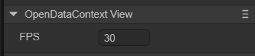

# 开放数据域视图（OpenDataContextView）

> Author:  Charley

## 一、什么是开放数据域

### 1.1 小游戏平台中的概念 

小游戏平台里的开放数据域（openDataContext）是一个封闭、独立的 JavaScript 作用域，相当于一个单独的游戏执行环境。在微信小游戏中，开放数据域也叫“子域”。

它与主游戏的代码执行环境（也可称为主域）相互隔离，资源、引擎、程序均不共享。

其主要作用是**安全地获取和展示用户的关系链数据**，如好友信息、群成员数据、可能对该游戏感兴趣的好友列表，并可将这些数据用于实现排行榜等功能，同时也能保存游戏相关数据，助力小游戏实现社交互动等玩法，提升游戏的社交属性和用户粘性，同时还不会将用户的关系链数据外泄。

> 需要注意的事，尽管抖音小游戏等平台也具有开放数据域的功能，但真正需要获取关系链数据的主要是微信小游戏平台，因此，本篇以微信小游戏作为应用场景来举例说明，如果其它平台存在差异性的部分，以各小游戏平台官方的说明为准。

### 1.2 LayaAir中的概念

在LayaAir中，`OpenDataContextView`的中文名称是**开放数据域视图**。

用于小游戏**开放数据域**的数据交互，刷新帧率，以及相对于主域中的位置布局等作用。

## 二、IDE中设置开放数据域

2.1 如图1-1所示，可以在`层级`窗口中右键进行创建，也可以从`小部件`窗口中拖拽添加。

 

（图1-1）

将OpenDataContextView组件添加到场景编辑的视图区后，属性面板中OpenDataContextView组件的专属属性如下图所示： 

 

（图1-2）

它只有FPS一个属性，表示sharedCanvas（主域和开放数据域都可以访问的一个离屏画布，详见[这里](https://developers.weixin.qq.com/minigame/dev/guide/open-ability/opendata/basic.html#%E5%B1%95%E7%A4%BA%E5%85%B3%E7%B3%BB%E9%93%BE%E6%95%B0%E6%8D%AE)）更新到主域的帧率。

除了在IDE中，还可以用脚本代码调节它的属性，在Scene2D的属性设置面板中，增加一个自定义组件脚本。然后，将OpenDataContextView拖入到其暴露的属性入口中。下面给出一个示例代码，实现脚本控制OpenDataContextView：

```typescript
const { regClass, property } = Laya;

@regClass()
export class NewScript extends Laya.Script {
    //declare owner : Laya.Sprite3D;

    @property({ type: Laya.OpenDataContextView })
    public opendata: Laya.OpenDataContextView;

    constructor() {
        super();
    }

    /**
     * 组件被激活后执行，此时所有节点和组件均已创建完毕，此方法只执行一次
     */
    onAwake(): void {
        this.opendata.pos(100,100);
        this.opendata.size(500,500);
    }
}
```


## 2. 代码创建OpenDataContextView

有时，不想让OpenDataContextView一开始就在舞台上，这就要通过代码来创建了。在Scene2D的属性设置面板中，增加一个自定义组件脚本，示例代码如下：

```typescript
const { regClass, property } = Laya;

@regClass()
export class NewScript extends Laya.Script {
    //declare owner : Laya.Sprite3D;

    constructor() {
        super();
    }

    /**
     * 组件被激活后执行，此时所有节点和组件均已创建完毕，此方法只执行一次
     */
    onAwake(): void {
        let opendata = new Laya.OpenDataContextView();
        Laya.stage.addChild(opendata);
        opendata.pos(100,100);
        opendata.size(500,500);
    }
}
```


## 3. 作用与效果

开放数据域一般用来显示好友排行榜，需要发布为微信小游戏，然后用微信开发者工具才能看到效果。详细的流程请参考[《微信小游戏》](../../../../released/miniGame/wechat/readme.md)。

