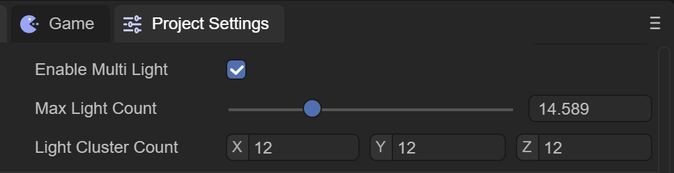
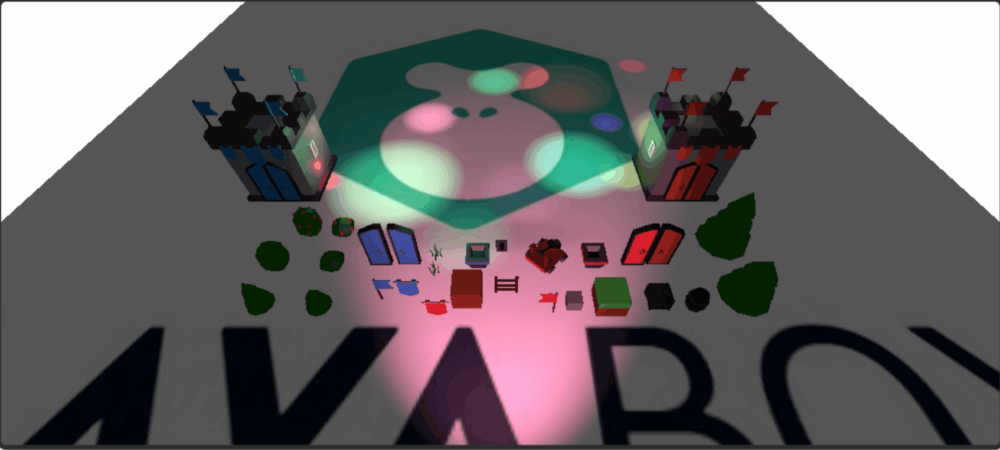

# 3D灯光与阴影

> Author : Charley

## 一、概述

光源是每一个场景的重要组成部分。网格和纹理决定了一个物体的形状和外观，但是光源决定了你的环境的颜色和氛围。灯光的种类有多种，不同的光源呈现的效果不同，可以设置不同的参数。

目前LayaAir引擎支持的光源种类有：

- **DirectionLight（方向光）**：有固定方向，无衰减和范围限制，照亮全场景，常用于模拟太阳光。
- **PointLight（点光源）**：向四面八方发射光线，有强度、颜色和衰减半径属性，如灯泡、蜡烛。
- **SpotLight（聚光灯）**：从特定方向射出锥形光线，有照射范围和锥形角度，如手电筒、舞台筒灯。
- **AreaLight（区域光）**：从矩形或圆盘形状的表面均匀发射光线，只能烘焙使用，阴影更柔和细腻。

各灯光类型的详细属性和使用方法，请查看对应的组件文档：

| 灯光类型 | 组件文档 |
| --- | --- |
| 方向光 | [《3D方向光》](../../IDE/Component/3DLight/DirectionLight/readme.md) |
| 点光源 | [《3D点光源》](../../IDE/Component/3DLight/PointLight/readme.md) |
| 聚光灯 | [《3D聚光灯》](../../IDE/Component/3DLight/SpotLight/readme.md) |
| 区域光 | [《3D区域光》](../../IDE/Component/3DLight/AreaLight/readme.md) |
| 阴影 | [《3D阴影》](../../IDE/Component/3DLight/Shadow/readme.md) |

## 二、多光源渲染

如图7-1所示，在IDE的项目设置中，可以对支持多光源做设置



（图7-1）

Enable Multi Light：是否支持多光源

Max Light Count：最大支持的光源数量，目前最大是50

Light Cluster Count： X、Y、Z轴的光照集群数量

X、Y、Z轴的光照集群数量，Z值会影响Cluster接受区域光(点光、聚光)影响的数量，Math.floor(2048 / lightClusterCount.z - 1) * 4 为每个Cluster的最大平均接受区域光数量，如果每个Cluster所接受光源影响的平均数量大于该值，则较远的Cluster会忽略其中多余的光照影响。



（动图7-2）

动图7-2，为多光源的示例，下面为创建多光源的代码

> 代码参考"引擎API使用示例"

```typescript
export class MultiLight extends BaseScript {

    constructor() {
        super();
    }

	onAwake(): void {
		var moveScript: LightMoveScript = this.camera.addComponent(LightMoveScript);
		var moverLights: Laya.Sprite3D[] = moveScript.lights;
		var offsets: Vector3[] = moveScript.offsets;
		var moveRanges: Vector3[] = moveScript.moveRanges;
		moverLights.length = 15;
		for (var i: number = 0; i < 15; i++) {
			var pointLight: Laya.Sprite3D = (<Laya.Sprite3D>this.scene.addChild(new Laya.Sprite3D()));
			var pointLightCom: Laya.PointLightCom = pointLight.addComponent(Laya.PointLightCom);
			pointLightCom.range = 2.0 + Math.random() * 8.0;
			pointLightCom.color.setValue(Math.random(), Math.random(), Math.random(), 1);
			pointLightCom.intensity = 6.0 + Math.random() * 8;
			moverLights[i] = pointLight;
			offsets[i] = new Vector3((Math.random() - 0.5) * 10, pointLightCom.range * 0.75, (Math.random() - 0.5) * 10);
			moveRanges[i] = new Vector3((Math.random() - 0.5) * 40, 0, (Math.random() - 0.5) * 40);
		}

		var spotLight: Laya.Sprite3D = (<Laya.Sprite3D>this.scene.addChild(new Laya.Sprite3D()));
		var spotLightCom: Laya.SpotLightCom = spotLight.addComponent(Laya.SpotLightCom);
		spotLight.transform.localPosition = new Vector3(0.0, 9.0, -35.0);
		spotLight.transform.localRotationEuler = new Vector3(-15.0, 180.0, 0.0);
		spotLightCom.color.setValue(Math.random(), Math.random(), Math.random(), 1);
		spotLightCom.range = 50;
		spotLightCom.intensity = 15;
		spotLightCom.spotAngle = 60;
	}
}
```
