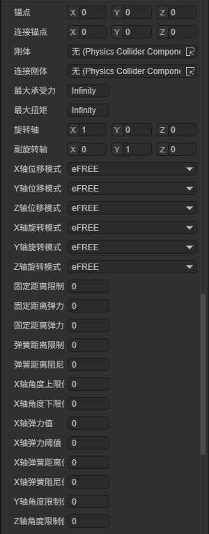
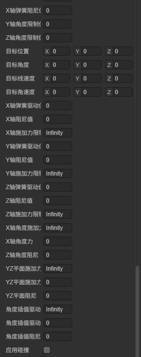
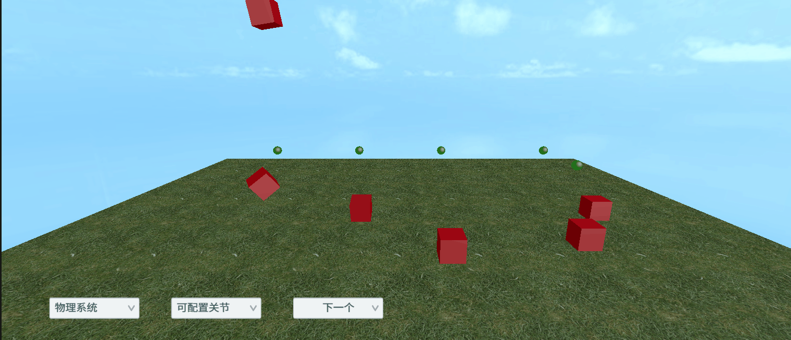

# 可配置约束 ConfigurableConstraint

> Author : Charley

> 约束的通用属性（刚体、连接刚体、锚点、连接锚点、最大承受力、最大扭矩、应用碰撞）请查看[《固定约束》](../FixedConstraint/readme.md)中约束基类属性章节。

可配置约束（ConfigurableConstraint）是功能最强大、最灵活的约束类型。它允许开发者分别控制每个轴向上的平移和旋转自由度，并为每个自由度单独配置限制范围、弹簧、阻尼和驱动力等参数。

通过可配置约束，可以实现其它约束类型的全部功能，也可以创建更复杂的约束效果，例如布娃娃系统中的关节、机械臂的多自由度关节、带弹性的滑轨等。

在 IDE 中添加可配置约束组件后，属性面板如图1-1和图1-2所示：



（图1-1）



（图1-2）

## 一、轴设置

可配置约束通过主轴和副轴来定义约束的坐标系，所有的运动限制和驱动都基于该坐标系进行。

**旋转轴**`axis`定义约束坐标系的 X 轴方向，默认值为 `(1, 0, 0)`。**副旋转轴**`secondaryAxis`定义 Y 轴方向，第三轴（Z 轴）由主轴和副轴通过叉积自动计算。

## 二、运动模式

运动模式用于设置物体在各个轴向上的运动约束方式。X/Y/Z 三个轴的位移模式和旋转模式均可独立设置为以下三种之一：

- **eFREE（自由）**：物体在该轴向上不受约束，可以自由运动。
- **eLOCKED（锁定）**：物体在该轴向上完全锁定，不允许任何运动。
- **eLIMITED（限制）**：物体在该轴向上受到限制，只能在指定范围内运动。

| 属性 | API 名称 | 说明 |
| --- | --- | --- |
| X/Y/Z轴位移模式 | `XMotion` / `YMotion` / `ZMotion` | 控制沿对应轴方向的平移 |
| X/Y/Z轴旋转模式 | `angularXMotion` / `angularYMotion` / `angularZMotion` | 控制绕对应轴的旋转 |

> 只有当运动模式设为 eLIMITED 时，对应的限制参数才会生效。

## 三、距离限制

当位移模式设为 eLIMITED 时，以下属性控制物体的移动范围和边界行为：

| 属性 | API 名称 | 说明 |
| --- | --- | --- |
| 固定距离限制 | `distanceLimit` | 允许的最大移动距离 |
| 固定距离弹力 | `distanceSpring` | 到达边界时的弹簧恢复力 |
| 固定距离弹力 | `distanceBounciness` | 到达边界时的反弹力 |
| 弹簧距离限制 | `distanceBounceThreshold` | 触发反弹所需的最小速度 |
| 弹簧距离阻尼 | `distanceDamper` | 距离限制的阻尼系数 |

## 四、角度限制

当旋转模式设为 eLIMITED 时，以下属性控制旋转范围。X轴采用上下限范围，Y/Z轴采用正负对称范围。

**X 轴角度限制：**

| 属性 | API 名称 | 说明 |
| --- | --- | --- |
| X轴角度上限 | `angularXMaxLimit` | 绕 X 轴旋转的最大角度 |
| X轴角度下限 | `angularXMinLimit` | 绕 X 轴旋转的最小角度 |
| X轴弹力值 | `AngleXLimitBounceness` | X 轴角度边界的反弹力 |
| X轴弹力阈值 | `AngleXLimitBounceThreshold` | 触发反弹所需的最小速度 |
| X轴弹簧距离限制 | `AngleXLimitSpring` | X 轴角度限制的弹簧刚度 |
| X轴弹簧阻尼 | `AngleXLimitDamp` | X 轴角度限制的阻尼 |

**Y/Z 轴角度限制（正负对称）：**

| 属性 | API 名称 | 说明 |
| --- | --- | --- |
| Y轴角度限制 | `AngleYLimit` | 绕 Y 轴的最大旋转角度 |
| Z轴角度限制 | `AngleZLimit` | 绕 Z 轴的最大旋转角度 |

> Y/Z 轴共享弹簧和阻尼参数：`AngleYZLimitSpring`、`AngleYZLimitDamping`、`AngleYZLimitBounciness`、`AngleYZLimitBounceThreshold`。

## 五、目标设置

目标属性用于指定驱动系统的目标状态，驱动力会将物体推向这些目标值：

| 属性 | API 名称 | 说明 |
| --- | --- | --- |
| 目标位置 | `targetPosition` | 线性驱动的目标位置（本地坐标） |
| 目标角度 | `targetRotation` | 角度驱动的目标旋转（欧拉角） |
| 目标线速度 | `targetPositionVelocity` | 线性驱动的目标速度 |
| 目标角速度 | `targetAngularVelocity` | 角度驱动的目标角速度 |

## 六、线性驱动

线性驱动用于在平移方向上主动驱动物体运动，类似于弹簧-阻尼系统将物体推向目标位置。X/Y/Z 三个轴的驱动参数格式相同：

| 参数 | X 轴 | Y 轴 | Z 轴 |
| --- | --- | --- | --- |
| 弹簧驱动力 | `XDriveSpring` | `YDriveSpring` | `ZDriveSpring` |
| 阻尼值 | `XDriveDamp` | `YDriveDamp` | `ZDriveDamp` |
| 施加力限制 | `XDriveForceLimit` | `YDriveForceLimit` | `ZDriveForceLimit` |

## 七、角度驱动

角度驱动用于在旋转方向上主动驱动物体转动。可以按轴单独驱动，也可以使用 Slerp（球面线性插值）进行统一驱动：

| 参数 | X 轴角度 | YZ 平面 | 角度插值(Slerp) |
| --- | --- | --- | --- |
| 驱动力 | `angularXDriveForce` | `angularYZDriveForce` | `angularSlerpDriveForce` |
| 阻尼 | `angularXDriveDamp` | `angularYZDriveDamp` | `angularSlerpDriveDamp` |
| 施加力限制 | `angularXDriveForceLimit` | `angularYZDriveForceLimit` | `angularSlerpDriveForceLimit` |

## 八、运行效果

动图1-3演示了可配置约束的运行效果：



（动图1-3）

## 九、代码示例

以下示例演示了如何配置一个沿 Y 轴受限滑动的约束，模拟升降平台效果：

```typescript
const { regClass, property } = Laya;

@regClass()
export default class ConfigurableConstraintDemo extends Laya.Script {
    declare owner: Laya.Sprite3D;

    onAwake(): void {
        let constraint = this.owner.getComponent(Laya.ConfigurableConstraint);

        // 锁定X和Z方向的平移，Y方向设为受限运动
        constraint.XMotion = Laya.D6Axis.Locked;
        constraint.ZMotion = Laya.D6Axis.Locked;
        constraint.YMotion = Laya.D6Axis.Limited;

        // 设置Y方向的距离限制
        constraint.distanceLimit = 5;
        constraint.distanceSpring = 100;
        constraint.distanceDamper = 10;

        // 锁定所有旋转
        constraint.angularXMotion = Laya.D6Axis.Locked;
        constraint.angularYMotion = Laya.D6Axis.Locked;
        constraint.angularZMotion = Laya.D6Axis.Locked;
    }
}
```

## 十、关联文档

- [《固定约束》](../FixedConstraint/readme.md)
- [《3D物理系统》](../../../physicsEditor/physics3D/readme.md)
