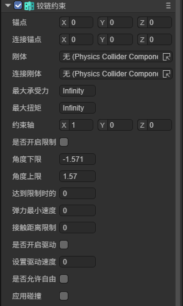
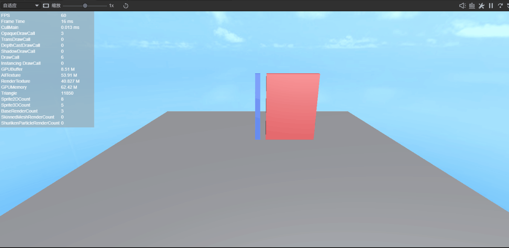

# 铰链约束 HingeConstraint

> Author : Charley

> 约束的通用属性（刚体、连接刚体、锚点、连接锚点、最大承受力、最大扭矩、应用碰撞）请查看[《固定约束》](../FixedConstraint/readme.md)中约束基类属性章节。

铰链约束（HingeConstraint）允许两个物体围绕一个共同轴进行旋转，类似于现实中的门铰链、车轮轴承等结构。被铰链约束连接的两个物体只能绕指定的旋转轴做相对旋转运动，其余方向的平移和旋转都被锁定。

在 IDE 中添加铰链约束组件后，属性面板如图1-1所示：



（图1-1）

## 一、约束轴`Axis`

**约束轴**用于设置铰链的旋转轴方向，值为 Vector3 类型，表示自身刚体的局部坐标方向。

例如，设置为 `(0, 1, 0)` 表示绕 Y 轴旋转（类似门的铰链），设置为 `(1, 0, 0)` 表示绕 X 轴旋转（类似翻盖）。

## 二、是否开启限制`limit`

勾选**是否开启限制**后，可以对旋转角度进行限制，防止物体旋转超出指定范围。

**角度下限**`lowerLimit`与**角度上限**`uperLimit`共同定义了旋转的允许范围，单位为弧度。物体只能在下限和上限之间旋转。

> 注意：API 名称为 `uperLimit`（非 upperLimit），使用时注意拼写。

**达到限制时的**`bounceness`设置到达角度限制边界时的反弹力大小，值越大反弹效果越明显，值为 0 表示不反弹。

**弹力最小速度**`bouncenMinVelocity`设置触发反弹所需的最小速度，只有速度超过该值才会产生反弹效果。

**接触距离限制**`contactDistance`设置距离角度限制边界多远时开始施加限制力，较大的值使限制效果更平滑。

## 三、是否开启驱动`motor`

勾选**是否开启驱动**后，铰链约束可以像电机一样驱动物体持续旋转，适用于模拟风车、齿轮等机械结构。

**设置驱动速度**`targetVelocity`用于设置马达的目标角速度，物理引擎会驱动物体朝该速度旋转。

**是否允许自由**`freeSpin`控制马达是否自由旋转。勾选后，马达只在目标方向上施加力，不会反向制动；不勾选时，马达会主动制动以达到目标速度。

## 四、运行时方法

铰链约束还提供了两个运行时方法：

- `getAngle()`：获取当前关节相对于初始位置的旋转角度。
- `getVelocity()`：获取当前关节的角速度，返回值为 Vector3 类型。

## 五、运行效果

动图2-1演示了铰链约束的效果，物体围绕铰链轴进行旋转运动：



（动图2-1）

## 六、代码示例

以下示例演示了如何配置铰链约束，模拟一扇可以被推开的门：

```typescript
const { regClass, property } = Laya;

@regClass()
export default class HingeConstraintDemo extends Laya.Script {
    declare owner: Laya.Sprite3D;

    onAwake(): void {
        let hinge = this.owner.getComponent(Laya.HingeConstraint);

        // 设置旋转轴为Y轴（门的铰链方向）
        hinge.Axis = new Laya.Vector3(0, 1, 0);

        // 启用角度限制（单位：弧度）
        hinge.limit = true;
        hinge.lowerLimit = -Math.PI / 2;  // -90度
        hinge.uperLimit = Math.PI / 2;    // 90度
        hinge.bounceness = 0.3;

        // 启用马达驱动
        hinge.motor = true;
        hinge.targetVelocity = 5;
        hinge.freeSpin = false;
    }
}
```

## 七、关联文档

- [《固定约束》](../FixedConstraint/readme.md)
- [《3D物理系统》](../../../physicsEditor/physics3D/readme.md)
