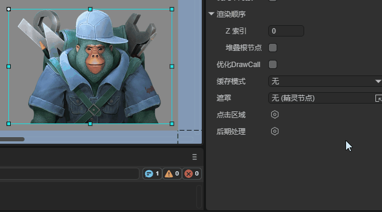

# 后期处理

## 一、概述

后期处理主要用来实现图像的各种特殊效果，使图像取得最佳艺术效果。通过后期处理我们可以使用一份美术素材达到不同的效果。引擎中支持的2D后期处理效果有变色效果、变灰效果、模糊效果、发光效果四种。


### 1.1创建后期处理效果

选中一个节点，并创建一个后期处理实例，然后在效果列表中添加后期处理效果，创建完成后，即可看到效果：



后期处理实例上的启用属性决定了后期处理是否生效，此属性会对每个效果都生效，默认勾选：


### 1.2 添加多个后期处理效果

一个节点上可以添加多个后期处理效果，一种后期处理效果也可以重复添加到一个节点上，这些后期处理效果会相互叠加，并同时生效：


## 二、变色效果

ColorEffect2D是变色效果，通过设置不同的参数，变色效果可以在不改变图像大致样式的前提下，使其呈现出不同的风格和效果。实际运行时，变色效果不会对节点进行变形处理，只改变亮度、对比度、饱和度、色调等效果。正确使用变色效果，可以修正图像非正常曝光等问题。


### 2.1基础属性

如图所示，变色效果有以下这些属性：


**启用**：是否启用此效果。

**颜色**：调整图像的整体色彩倾向。

**亮度**：控制图像的明暗程度。

**对比度**：调整明暗差异的强烈程度。

**饱和度**：控制色彩的鲜艳程度。

**色调**：改变颜色在色轮上的位置。


### 2.2代码实现

我们也可以通过代码来创建一个变色效果，示例如下：

```typescript
const { regClass, property } = Laya;

@regClass()
export class Script extends Laya.Script {
    //获取节点
    @property(Laya.Sprite)
    public sp: Laya.Sprite;

    onAwake(): void {
        //创建后期处理实例
        this.sp.postProcess = new Laya.PostProcess2D();
        //创建变色效果
        let colorEffect2D = new Laya.ColorEffect2D();
        //创建后期处理效果数组
        let effectGroup: Laya.PostProcess2DEffect[] = [];
        //将变色效果添加到后期处理效果数组中
        effectGroup.push(colorEffect2D);
        //将后期处理效果数组添加到节点上的后期处理实例上
        this.sp.postProcess.effects = effectGroup;

        //依次设置颜色、亮度、对比度、饱和度、色调
        colorEffect2D.color(0.5, 0.5, 0.5, 1);
        colorEffect2D.adjustBrightness(30);
        colorEffect2D.adjustContrast(8);
        colorEffect2D.adjustSaturation(30);
        colorEffect2D.adjustHue(-15);

    }
}
```


## 三、 变灰效果

变灰效果是变色效果的一种特殊用法，使用此效果时开发者无需自行设置各项属性，引擎会自行设置。此效果一般会用于标识此节点处于禁用状态等效果，当UI组件勾选了显示置灰或禁用鼠标事件的属性后，引擎会自动创建一个变灰效果。

### 3.1基础属性

变灰效果在IDE中只有启用这一个属性可被设置：


### 3.2代码实现

我们可以通过代码来创建一个变灰效果，示例如下：

```typescript
const { regClass, property } = Laya;

@regClass()
export class Script extends Laya.Script {
    //获取节点
    @property(Laya.Sprite)
    public sp: Laya.Sprite;

    onAwake(): void {
        //创建后期处理实例
        this.sp.postProcess = new Laya.PostProcess2D();
        //创建变灰效果
        let grayEffect2D = new Laya.GrayscaleEffect2D();
        //创建后期处理效果数组
        let effectGroup: Laya.PostProcess2DEffect[] = [];
        //将变灰效果添加到后期处理效果数组中
        effectGroup.push(grayEffect2D);
        //将后期处理效果数组添加到节点上的后期处理实例上
        this.sp.postProcess.effects = effectGroup;
    }
}
```


## 四、模糊效果

模糊效果是一种常用的图像处理技术，通过减少图像的细节和噪点，创造出模糊或朦胧的效果。


### 4.1基础属性

如图所示，模糊效果有两个基础属性：


**启用**：是否启用此效果。

**强度**：模糊效果的强度。值越大，图像越不清晰。


### 4.2代码实现

我们可以通过代码来创建一个模糊效果，示例如下：

```typescript
const { regClass, property } = Laya;

@regClass()
export class Script extends Laya.Script {
    //获取节点
    @property(Laya.Sprite)
    public sp: Laya.Sprite;

    onAwake(): void {
        //创建后期处理实例
        this.sp.postProcess = new Laya.PostProcess2D();
        //创建模糊效果
        let blurEffect2D = new Laya.BlurEffect2D();
        //创建后期处理效果数组
        let effectGroup: Laya.PostProcess2DEffect[] = [];
        //将模糊效果添加到后期处理效果数组中
        effectGroup.push(blurEffect2D);
        //将后期处理效果数组添加到节点上的后期处理实例上
        this.sp.postProcess.effects = effectGroup;

        //设置模糊效果的强度
        blurEffect2D.strength = 10;
    }
}
```


## 五、发光效果

发光效果用于为节点添加光晕效果，可以在节点边缘产生一圈光环。


### 5.1基础属性

如图所示，发光效果有以下这些基础属性：


**启用**：是否启用此效果。

**偏移**：发光效果相较于节点的偏移。下图为不设置偏移和设置偏移后的效果对比。


**模糊**：发光效果的边缘模糊大小，数值越大，边缘越模糊。

**颜色**：发光滤镜的颜色。通过颜色和偏移可以创建类似阴影的效果：


### 5.2代码实现

我们可以通过代码创建发光效果，示例如下：

```typescript
const { regClass, property } = Laya;

@regClass()
export class Script extends Laya.Script {
    //获取节点
    @property(Laya.Sprite)
    public sp: Laya.Sprite;

    onAwake(): void {
        //创建后期处理实例
        this.sp.postProcess = new Laya.PostProcess2D();
        //创建发光效果
        let glowEffect2D = new Laya.GlowEffect2D();
        //创建后期处理效果数组
        let effectGroup: Laya.PostProcess2DEffect[] = [];
        //将发光效果添加到后期处理效果数组中
        effectGroup.push(glowEffect2D);
        //将后期处理效果数组添加到节点上的后期处理实例上
        this.sp.postProcess.effects = effectGroup;

        //依次设置偏移、模糊、颜色值
        glowEffect2D.offsetX = 10;
        glowEffect2D.offsetY = 10;
        glowEffect2D.blur = 5;
        glowEffect2D.color = "#33ff00ff"
    }
}
```


