# 开放数据域

## 一、开放数据域简介

开放数据域是一个封闭、独立的 JavaScript 作用域。在设计小游戏时，为了使游戏的可玩性更强，开发者需要实现一些社交玩法，例如排行榜，游戏中邀请其它玩家对战等。这些功能需要用到一些玩家的隐私数据，但微信官方出于安全性考虑不会直接提供这些数据。

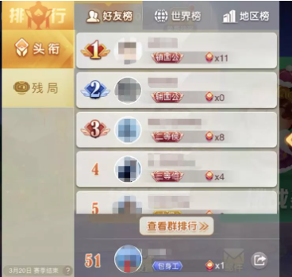

图1-1 排行榜示例

在这个背景之下，微信官方设计了开放数据域这个功能，这是一个封闭、独立的 JavaScript 作用域。在这个作用域中，开发者可以获取到玩家的一些隐私数据，并对这些数据进行处理。开放数据域和执行游戏逻辑的主域是相互隔离的，并且只能进行从主域到开放数据域的单向通信。


对于开发者而言，想要使用开放数据域需要了解以下几个方面的知识：

1.创建开放数据域（在场景中添加开放数据域视图节点，在构建发布后的项目中创建开放数据域工程文件）

2.主域和开放数据域的通信（从主域发送消息和玩家数据，并在开放数据域中进行接收）

3.开放数据域渲染（使用canvas引擎，将获取到的数据渲染到主域和开放数据域共享的sharedCanvas上）


## 二、创建开放数据域

我们可以在层级面板中右键进行创建，也可以在小部件面板中拖拽创建一个开放数据域节点：


我们也可以通过脚本创建开放数据域节点，在Scene2D节点上添加一个自定义组件脚本，脚本内容如下：

```typescript
const { regClass, property } = Laya;

@regClass()
export class NewScript extends Laya.Script {
    //declare owner : Laya.Sprite3D;

    constructor() {
        super();
    }

    /**
     * 组件被激活后执行，此时所有节点和组件均已创建完毕，此方法只执行一次
     */
    onAwake(): void {
        let opendata = new Laya.OpenDataContextView();
        Laya.stage.addChild(opendata);
        opendata.pos(100,100);
        opendata.size(500,500);
    }
}
```


成功创建开放数据域视图节点后，我们只是完成了引擎层面要完成的工作流程，接下来我们还要完成微信小游戏层面的工作，这之中的第一步就是创建一个开放数据域工程文件。

来到构建发布界面，在微信小游戏构建页勾选生成开放数据域工程模板选项，然后进行构建：


打开构建好的项目文件夹，可以看到其中有一个openDataContext文件夹，这个就是开放数据域工程文件：

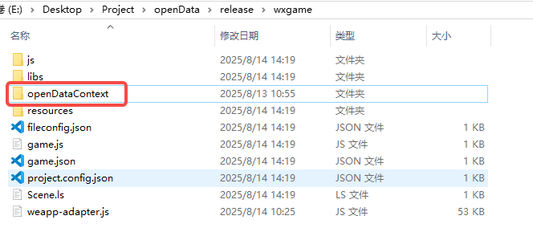

引擎创建好的开放数据域工程文件中包含一个可直接运行的示例，开发者可以在微信小游戏开发者工具中打开这个示例，就可以看到开发数据域的效果，后续开发的过程中我们也会在这个示例的基础上进行修改：


有关生成开放数据域工程模板这一选项，有三点需要注意：

1.是否勾选此选项不影响开放数据域功能的使用，开发者可以自行创建openDataContext文件夹并进行开发。

2.勾选此选项后，如果输出目录中已经存在openDataContext文件夹，引擎就不会重复生成此文件夹，开发者无需担心自己的代码被覆盖。

3.不勾选此项时，引擎会在构建发布时删除输出目录中的openDataContext文件夹，开发者要自行保证代码安全。


## 三、主域和开放数据域的通信

开放数据域的主要功能之一就是制作排行榜，为此我们需要在开放数据域中获取到玩家游戏得分、玩家头像、昵称等数据。有些时候我们也需要在主域中控制开放数据域，这一切都离不开两者之间的相互交互。下面我们来介绍几种通信方式。


### 1.postMessage和onMessage

这两个方法分别用于主域向开放数据域发送消息和开放数据域监听主域发送的消息。

在Scene2D节点上添加一个自定义组件脚本，脚本中设置的代码如下所示：

```typescript
const { regClass, property } = Laya;

@regClass()
export class Script extends Laya.Script {
    
    //组件被激活后执行，此时所有节点和组件均已创建完毕，此方法只执行一次
    onAwake(): void {
        //获取开放数据域
        //@ts-ignore
        const openDataContext = wx.getOpenDataContext();

        // 向子域发送消息，开发者可以通过key：value的形式自行定义发送的内容
        openDataContext.postMessage({
            text: "从主域发送的信息",
        });
    }

}
```


在代码编辑器中打开上一节创建好的开放数据域工程文件，找到index.js文件，在文件的init方法中我们可以看到，模板已经执行了onMessage方法，开发者可以自行实现onMessage中的逻辑。


这里的onMessage方法的回调函数打印了此方法获取到的值，我们可以在微信开发者工具中运行一下项目，就可以看到打印出的信息。

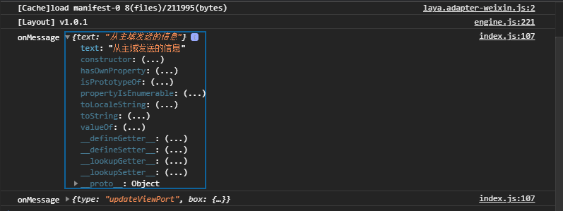

> 注：这里我们可以看到打印了两次信息，这是因为引擎在运行时也会调用postMessage方法。


这两个方法一般用于主域向开放数据域发送需要及时响应的消息，例如主域点击按钮后开放数据域刷新内容。


### 2.setUserCloudStorage和getFriendCloudStorage

这两个方法用于对用户托管数据进行写数据操作和拉取当前用户所有同玩好友的托管数据。一般来说，游戏得分产生的时机和需要用到游戏得分的时机往往是不同的，因此我们需要将这些数据上传到服务器，在需要的时候从服务器获取这些数据。下面我们来看看如何使用这两个方法。

首先是写入数据的方法setUserCloudStorage。在Scene2D节点上添加一个自定义组件脚本，脚本中添加如下代码：

```typescript
const { regClass, property } = Laya;

@regClass()
export class Script extends Laya.Script {

    //组件被激活后执行，此时所有节点和组件均已创建完毕，此方法只执行一次
    onAwake(): void {

        //创建一个KVData数组
        let KVDataList = [];

        //向KVData数组中添加数据，setUserCloudStorage方法支持一次传递多组数据
        for (let i = 0; i < 5; i++) {
            //每项数据都是一个包含 key 和 value 两个属性的对象。
            let KVData = {
                key: "test" + i,
                value: "" + i * 1000,
            }
            KVDataList.push(KVData);
        }

        /**
         * KVDataList：KV 数据列表
         * success：接口调用成功的回调函数
         * fail：接口调用失败的回调函数
         * complete：接口调用结束的回调函数（调用成功、失败都会执行）
         */
        //@ts-ignore
        wx.setUserCloudStorage({
            KVDataList: KVDataList,
            success: () => {
                console.log("数据保存成功")
            },
            fail: () => {
                console.log("数据保存失败")
            },
            complete: () => {
                console.log("执行调用结束回调")
            }
        });
    }

}
```


然后是getFriendCloudStorage方法，来到开放数据域的index.js文件中，在onMessage方法中执行getFriendCloudStorage方法，修改后的方法如下：

```typescript
function init() {
    wx.onMessage((data) => {
        console.log("onMessage", data);
        if (data.type === "updateViewPort") {
            Layout.updateViewPort(data.box);
            draw(POWERRANK);
        } else if (data.type === 'close') {
            Layout.clear();
        }

        /**
         * keyList: 要获取的 key 列表，这个key就是在KVData中设置的key
         * success：接口调用成功的回调函数
         * fail：接口调用失败的回调函数
         * complete：接口调用结束的回调函数（调用成功、失败都会执行）
         */
        wx.getUserCloudStorage({
            keyList: ["test1", "test5"],
            success: (res) => {
                console.log("获取数据成功：", res);
            },
            fail: () => {
                console.log("获取数据失败");
            },
            complete: () => {
                console.log("执行调用结束回调");
            }
        })
    });
}
```


到此为止，我们完成了代码上的设置，但此时我们还不能正常获取数据，因为在微信中获取用户隐私数据需要得到用户授权。

来到微信小程序管理后台，打开账号设置页面，点击服务内容声明--用户隐私保护指引：

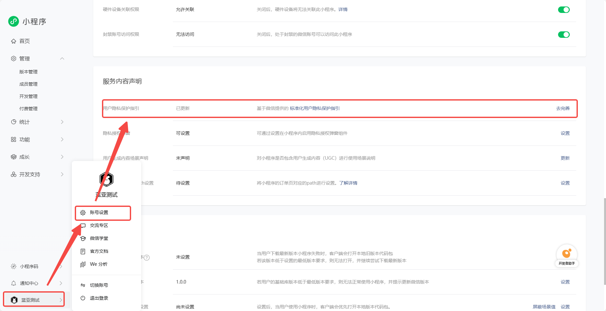

点击增加信息类型，勾选微信朋友关系这一项，并确认


然后继续填写其它内容，完成后点击确定并生成协议。

接下来在服务内容声明中开启隐私授权弹窗，即可获取用户的个人信息了。


来到微信开发者工具中，可以看到我们成功获取了已经玩过这款游戏的朋友的信息，到此，我们成功的完成了主域和开放数据域通信这一目标。


## 四、开放数据域渲染

在获取到我们需要的数据后，我们就要把这些数据显示出来，比如说按分数制作一个排行榜。开放数据域会显示到一个画布上的，因此开发者可以直接调用canvas上的各种方法进行绘制，但很多时候这样并不方便，因此我们推荐开发者选择一款轻量化的canvas引擎来完成绘制工作。

市面上常见的轻量化canvas引擎有很多，这里不再一一推荐，我们只讲解[minigame-canvas-engine](https://wechat-miniprogram.github.io/minigame-canvas-engine/)（后面简称 Layout）这款引擎的用法。


**Layout 引擎的目标在于用 Web 的开发方式来开发简单的 Canvas 应用。**


一般来说，一个Web由HTML，CSS和JS代码三部分组成，Layout引擎在渲染时也采用了类似的思路：`template`属性控制开放数据域的内容和结构，`style`属性控制开放数据域的样式和布局，`JS`代码控制开放数据域的交互逻辑。

这里有一段代码，开发者可以将这段代码替换到index.js文件中，并在微信开发者工具中查看效果：

```javascript
const Layout = require("./engine.js").default;
let sharedCanvas = wx.getSharedCanvas();
let sharedContext = sharedCanvas.getContext("2d");

// 使用XML格式的内容来描述开放数据域的界面，一般使用模板函数来构建
let template = `
  <view id="container">
    <text id="testText" class="redText" value="hello canvas"></text>
  </view>
`;

// 以键值对的形式定义开放数据域的样式和布局
let style = {
    container: {
        width: 400,
        height: 200,
        backgroundColor: "#ffffff",
        justifyContent: "center",
        alignItems: "center",
    },
    testText: {
        color: "#ffffff",
        width: "100%",
        height: "100%",
        lineHeight: 200,
        fontSize: 40,
        textAlign: "center",
    },
    // 文字的最终颜色为#ff0000
    redText: {
        color: "#ff0000",
    },
};

// JS部分，用于控制开放数据域的各种逻辑
function init() {
    wx.onMessage((data) => {
        Layout.clear();
        Layout.init(template, style);
        Layout.layout(sharedContext);
    });
}

init();

```

运行效果如下图所示：

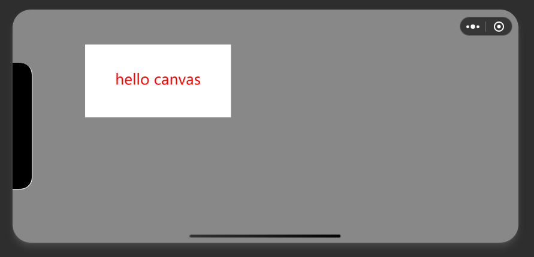

下面我们来了解一下Layout引擎的使用方法。

### 1.Layout引擎

当开发者想要通过Layout引擎来渲染一个画面时，需要执行以下四个方法：

`Layout.updateViewPort`：更新被绘制的canvas窗口信息。

`Layout.clear`：清理画布，同时会清理之前计算出的渲染树。

`Layout.init`：初始化渲染引擎，使用给定的`template` 和 `style`，计算布局、生成节点树。

`Layout.layout`：将节点树绘制在canvas上，同时会执行事件绑定等逻辑，传入canvas的渲染上下文（context）作为参数。

一般来说，开发者只需要自行决定后三个方法的执行时机即可，LayaAir引擎内部会自行执行`Layout.updateViewPort`这个方法，无需开发者手动调用。

前面我们讲过，Layout是要用Web的形式来开发canvas应用，在调用`Layout.init`方法进行初始化时传入的两个参数`template`和`style`就分别对应了Web中的HTML和CSS，

`template`是一段XML格式的字符串，它支持的标签和属性如下图所示

标签：

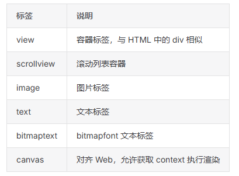

属性：

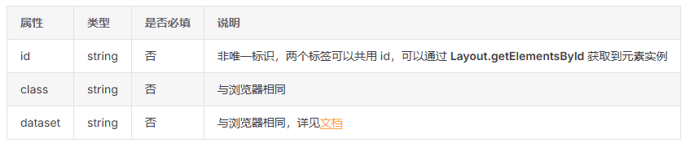

`style`决定了标签的布局方式，以键值对的形式存储数据。开发者可以在[Layout文档](https://wechat-miniprogram.github.io/minigame-canvas-engine/components/overview.html)中查看具体的样式属性，这里我们不详细讲解。

> 注：这篇文档是Layout引擎的教学文档，开发者应当熟知。


现在我们面对的问题就是如何生成`template`字符串，对于开发者而言，我们不可能手动编写`template`，一般情况下我们会使用模板引擎来生成这个字符串。


### 2.模板引擎

模板引擎是一种将数据与预设模板结合，最终生成文档（通常是 HTML、XML 等文本格式）的工具或库。它的核心作用是分离数据和表现层，让开发者可以更高效地管理动态内容的展示逻辑。

单独讲解概念会显得有些难以理解，我们来看一个具体的例子。

打开这个网页[codepen](https://codepen.io/pen?template=VwEeLKw)，这个网站是一个Layout引擎调试工具，而我们打开的网页是一个示例，其中已经设置好了[doT.js](https://olado.github.io/doT/index.html)这款模板引擎。

在网页的左上角我们可以看到这个示例的“源码”，这是一段类似于XML格式的字符串，与XML格式不同的是，其标签中的 `value`属性并不是一个具体的值，而是一个以特定格式传入的参数，

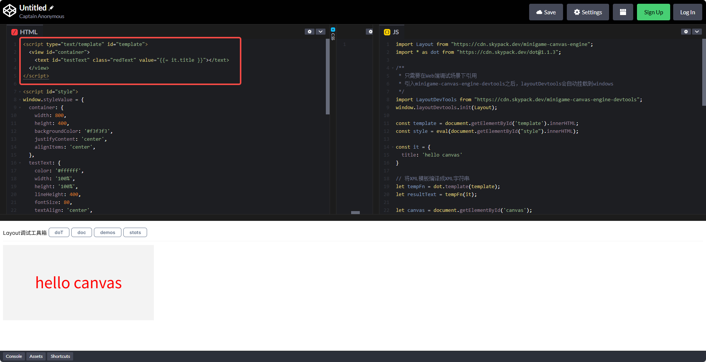

点击Layout工具箱中的doT按钮，模板引擎就会将这段“源码”编译成一个模板函数：

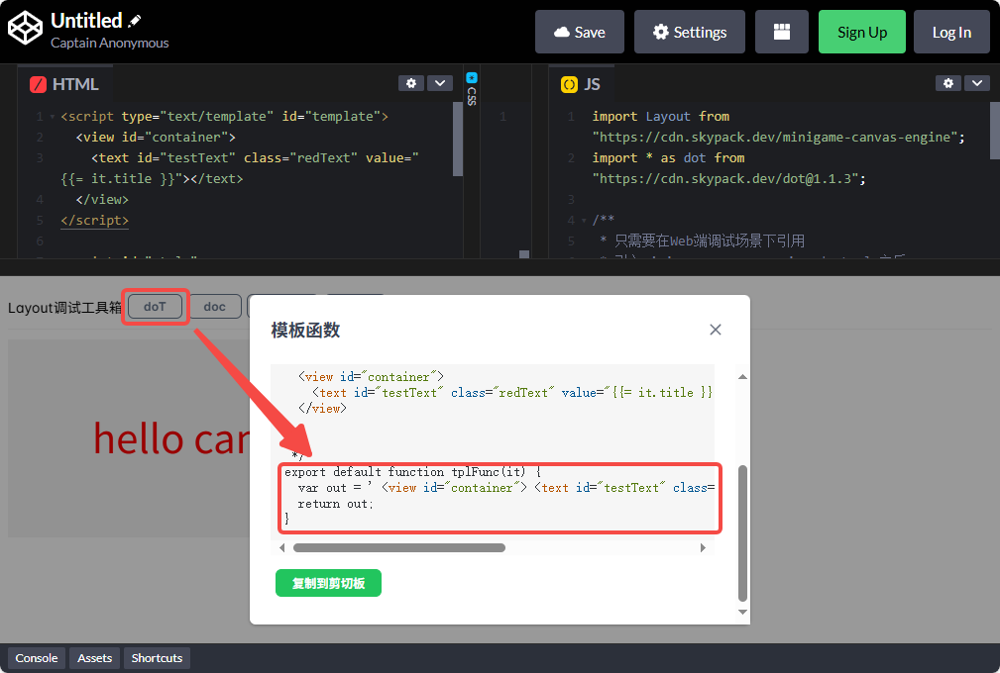

模板函数的内容如下所示：

```javascript
function tplFunc(it) {
  var out = ' <view id="container"> <text id="testText" class="redText" value="' + (it.title) + '"></text> </view>';
  return out;
}
```

我们可以为这个函数传入一个参数值，并执行这个函数，就可以得到一个XML格式的字符串：

```javascript
const it = {
  title: 'hello canvas'
}

let template = tplFunc(it);
console.log(template);

//输出结果为
//` <view id="container">
//    <text id="testText" class="redText" value="hello canvas"></text>
//  </view>
//`
```

可以看到我们得到的就是上文的演示代码中使用的字符串。


除了插值外，dot.js引擎还支持条件判别，循环等语法，这里我们不讲解dot.js引擎的具体用法，感兴趣的开发者可以[自行学习](https://olado.github.io/doT/index.html)。

> 注：只要可以生成符合要求的XMl字符串，无论使用什么模板引擎都可以，开发者可根据自己的喜好进行选择。


了解模板引擎的用法之后，开发者就可以根据自己的需求设计开放数据域的效果了，设计开放数据域需要开发者具备一定的Web前端开发知识，如果开发者从未接触过这些知识，可以先阅读下面这两篇教程后再进行开发：

[CSS教程](https://www.runoob.com/css/css-tutorial.html)：了解 Web 端是如何组织页面样式的；

[Flex布局教程](https://www.ruanyifeng.com/blog/2015/07/flex-grammar.html)：这个非常重要，Layout 布局仅仅支持 Flex 布局，通读教程能够了解如何进行页面布局。

除此之外，使用已有的示例进行魔改也是一个不错的选择，这里为大家推荐两个示例：[得分榜](https://codepen.io/yuanzm/pen/QWZybox)和[邀请好友](https://codepen.io/yuanzm/pen/QWZNQNG)


## 五、流程演示

本节内容我们将演示一个示例，这个示例能够真实运行，对玩家数据进行处理并显示。

### 1.创建项目

创建一个新的2D空项目，在场景中添加三个节点：

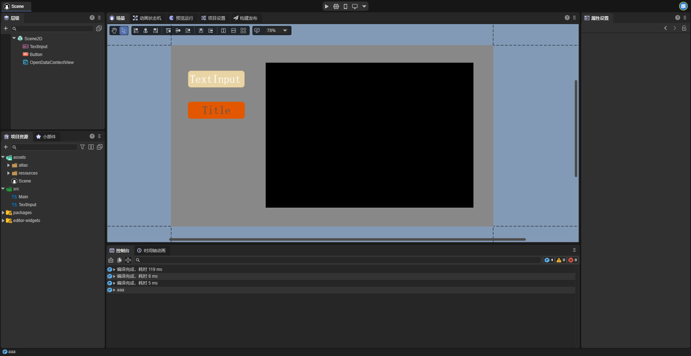

这三个节点的用途分别是：

`TextInput`：输入文本节点，由使用者自行输入内容，用于模拟游戏过程中玩家产生的数据，例如游戏得分。

`Button`：按钮，用于控制开放数据域是否显示。

`OpenDataContext`：开放数据域节点。


### 2.添加脚本

在`TextInput`和`Button`这两个节点上添加脚本，脚本的内容和用途如下所示：

`TextInput`脚本用于在节点失去焦点时（也就是内容输入完成后）将输入的内容上传至云端，以此来模拟玩家在游戏结束时产生对局数据的效果，例如游戏得分：

```typescript
const { regClass, property } = Laya;

@regClass()
export class TextInput extends Laya.Script {
    declare owner: Laya.TextInput;

    //开启监听，当输入文本节点失去焦点时执行回调，发送数据
    onAwake(): void {
        this.owner.on(Laya.Event.BLUR, this, this.sendData)
    }

    //将玩家数据上传至云端
    sendData() {
        //组织数据
        let KVDataList = [];
        let text = Number(this.owner.text);
        if(!isNaN(text) && text >= 0 && text <= 9999) {
            this.owner.text = text.toString()
        } else {
            this.owner.text = "1000";
        }
        //开发者要根据这个key来获取数据
        let KVData = {
            key: "playerData",
            value: this.owner.text
        }
        KVDataList.push(KVData);

        //@ts-ignore
        wx.setUserCloudStorage({
            KVDataList: KVDataList,
            success: () => {
                console.log("数据保存成功")
            },
            fail: () => {
                console.log("数据保存失败")
            },
            complete: () => {
                console.log("执行调用结束回调")
            }
        });
    }

}
```


`Button`脚本用于控制开放数据域是否显示，当开放数据域开始显示时，脚本会向开放数据域发送消息，刷新开放数据域显示的内容：

```typescript
const { regClass, property } = Laya;

@regClass()
export class Script extends Laya.Script {
    declare owner: Laya.Button;

    //通过装饰器获取开放数据域节点
    @property(Laya.OpenDataContextView)
    public openDataView: Laya.OpenDataContextView;

    openDataContext: any;

    onAwake(): void {
        //获取开放数据域
        //@ts-ignore
        this.openDataContext = wx.getOpenDataContext();
    }

    onMouseClick(evt: Laya.Event): void {
        this.openDataView.visible = !this.openDataView.visible;

        if (this.openDataView.visible) {
            // 向子域发送消息，刷新开放数据域内容
            this.openDataContext.postMessage({
                type: 'reFresh',
            });
        }
    }

}
```

添加好脚本后，开发者就可以根据本文第二节的内容，将项目构建发布为微信小游戏，下面我们要前往开放数据域部分进行开发。


### 3.创建模板函数和样式

打开[RankList](https://codepen.io/yuanzm/pen/QWZybox)，这是一个列表排名示例，本文中我们以这个示例来演示开放数据域的效果：

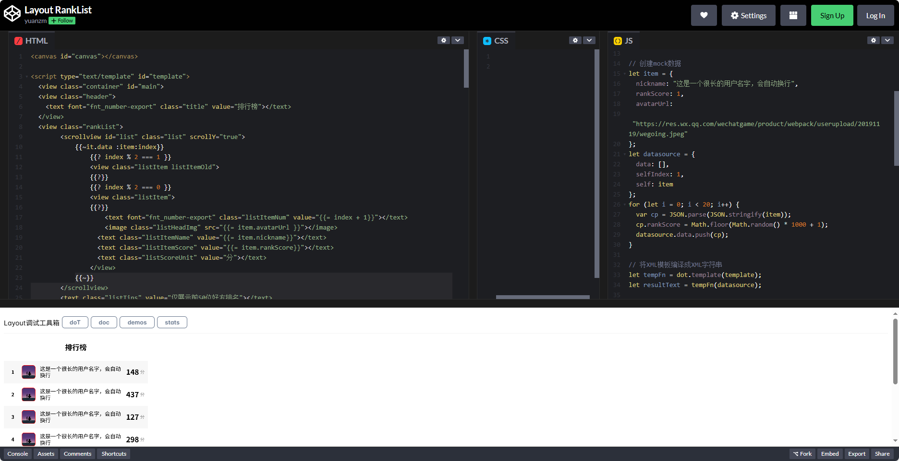


开发者可以自行编辑开放数据域效果，也可以在这个示例的基础上进行修改，例如我们不想要列表最下方展示第一名的内容，就可以删除对应位置的代码：

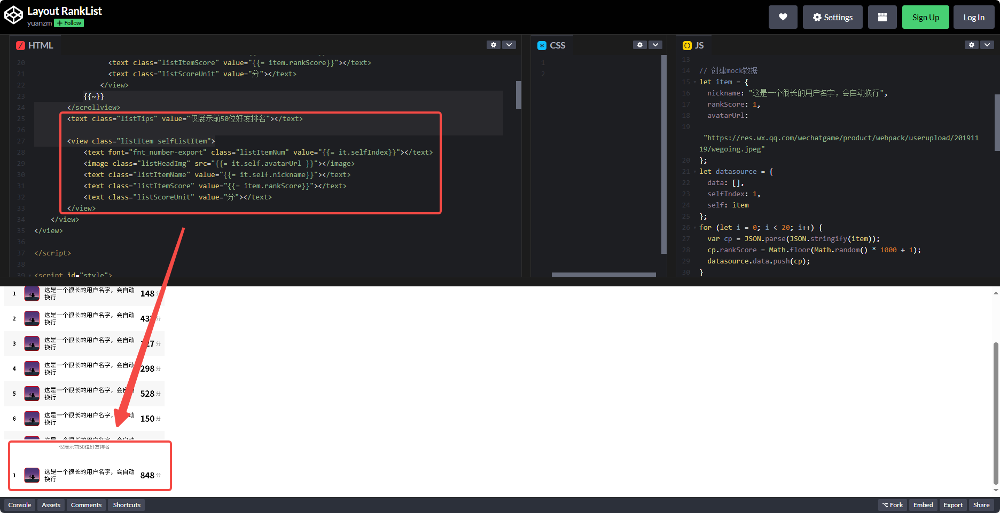


调整好效果后，点击doT按纽来导出模板函数：

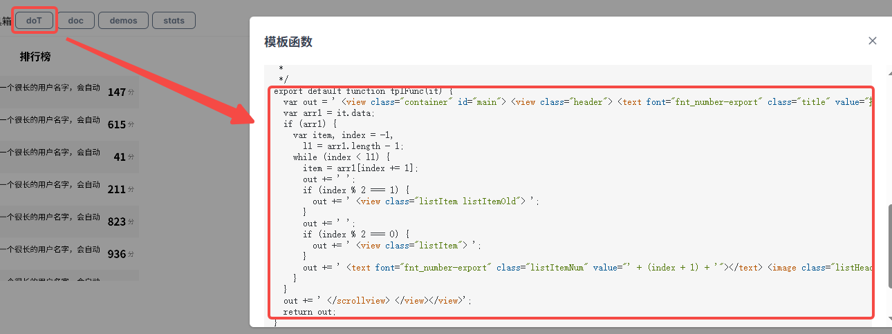


打开开放数据域文件夹，找到tplfn.js文件，用刚才导出的函数替换原有的函数：

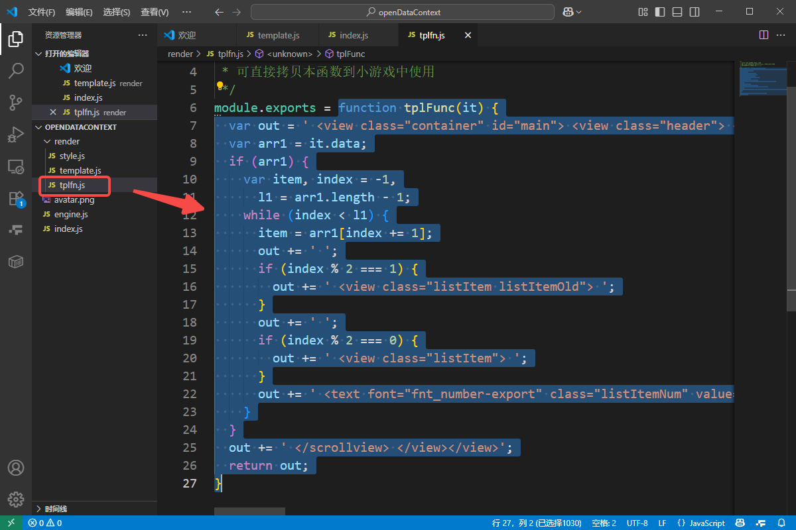


接下来将示例中的style也同样复制过来：

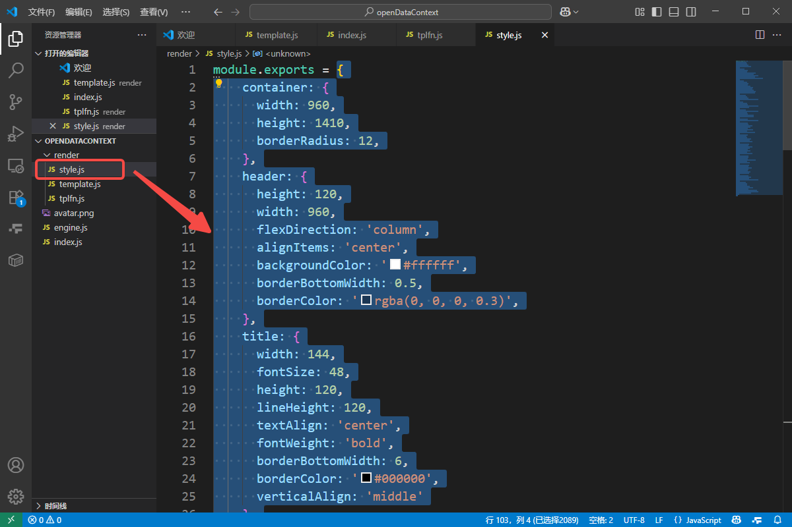


> 注：这里我们沿用了生成的开放数据域工程模板，实际开发的过程中开发者可自行定义模板函数和样式的位置，只要能正常调用即可。


### 4.编写js代码

开放数据域以index.js文件作为入口，开发者要在这个文件中实现初始化等操作，这里我们编写好了要用到的代码，开发者可结合代码的注释，理解每部分代码的用途：

```javascript
//引用各个模块
const style = require("./render/style.js");
const tplFn = require("./render/tplfn.js");
const Layout = require("./engine.js").default;

//获取开放数据域画布
let sharedCanvas = wx.getSharedCanvas();
let sharedContext = sharedCanvas.getContext("2d");

//刷新数据
function reFresh() {
    wx.getFriendCloudStorage({
        //要获取的数据的key列表，开发者可以上传多个数据，并根据key列表获取指定的数据
        keyList: ["playerData"],
        success: res => {
            console.log("获取好友数据:", res);
            draw(res);
        },
        fail: err => {
            console.log(err);
        }
    })
}

//处理获取到的数据，并进行绘制
function draw(res) {
    if (res == undefined) {
        return;
    }

    //组织数据，此处数据的格式要与模板函数中的逻辑相适配
    let resNumber = res.data.length;
    let it = {
        data: []
    };
    for (let i = 0; i < resNumber; i++) {
        //如果玩家没有此项数据，就设置一个默认值
        if (res.data[i].KVDataList.length == 0) {
            let item = {
                nickname: res.data[i].nickname,
                rankScore: "1000",
                avatarUrl: res.data[i].avatarUrl
            };
            it.data.push(item);
        } else {
            let item = {
                nickname: res.data[i].nickname,
                rankScore: res.data[i].KVDataList[0].value,
                avatarUrl: res.data[i].avatarUrl
            };
            it.data.push(item);
        }
    }

    //调用模板函数，生成XML格式的字符串
    let template = tplFn(it);

    //执行渲染
    Layout.clear();
    Layout.init(template, style);
    Layout.layout(sharedContext);

}

function init() {
    //开启监听，根据信息类型的不同执行不同函数
    wx.onMessage((data) => {
        if (data.type === "updateViewPort") {
            Layout.updateViewPort(data.box);
        } else if (data.type === 'reFresh') {
            reFresh();
        }
    });
}

init();
```


### 5.运行并查看效果

开发者需要自行准备一个账号，账号需要成功注册小程序开发与管理权限，同时小程序也要有获取用户个人信息的权限（参考第三节第二小节），使用这个账号登录微信开发者工具，并打开我们设置好的项目，此时就可以看到开放数据域的效果了：

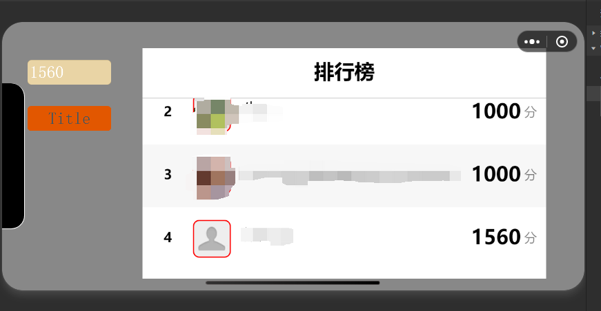


