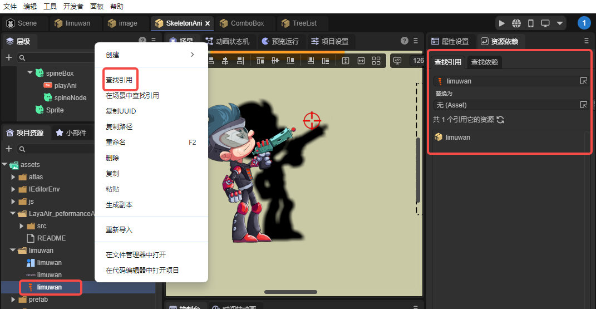
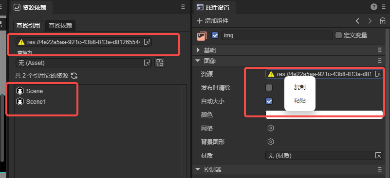
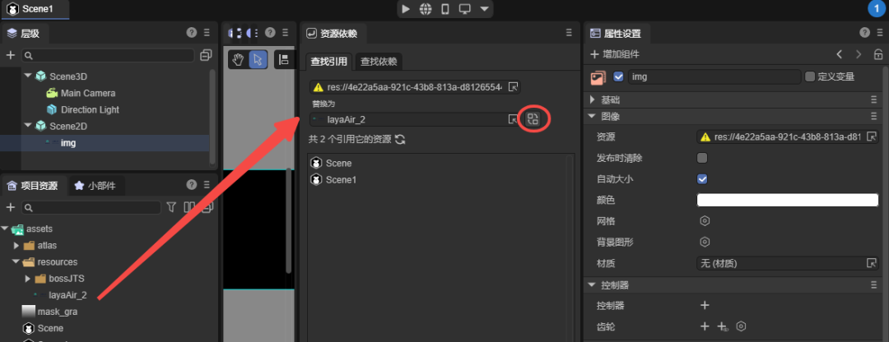
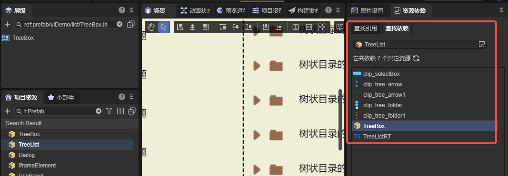
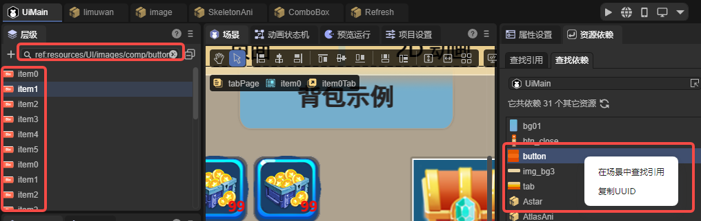

# 资源依赖面板

> Author： Charley

资源依赖是 `LayaAir3-IDE` 在 3.3.4 版本中新增的内置插件工具，用于帮助开发者快速分析资源之间的引用关系。无论是排查丢失资源、清理工程、替换素材，还是进行批量资源管理，这个工具都能显著提升项目维护效率。

## 1、面板打开方式

资源依赖面板默认位于属性设置面板右侧。如果被关闭，可通过顶部菜单栏的 ”面板 → 资源依赖 ” 重新打开，如图 1-1 所示。

 

（图1-1）

也可以在项目资源面板中，对任意资源右键选择 **“查找引用”**，直接跳转到资源依赖面板，如图 1-2 所示。

 

(图1-2)

## 2、查找引用

### 2.1 查找资源被引用的情况

在项目中，资源引用关系通常非常复杂，一个贴图、动画或材质可能深藏在多个场景和预制体之中。不了解资源被谁使用，就无法安全地修改、替换或删除。

“查找引用” 功能能够快速生成一份清晰的引用清单，让你准确判断一个资源是否仍在使用、是否会被误删，以及是否需要统一替换。此功能对大型工程的维护尤为关键。

实际使用时，可在资源面板选中资源并右键 “查找引用”，或将资源拖放到引用输入框中，系统会立即列出所有引用该资源的场景、预制体和动画等，如图 2-1 所示。

 

（图2-1） 

### 2.2 查找丢失的资源引用

“查找引用”不仅可用于分析现有资源，也能帮助定位已经丢失的资源。

例如，当某个资源被删除后，组件的资源属性可能只剩下 `UUID`。只需在属性**输入框**中右键复制 `UUID`，并粘贴到“查找引用”的输入框中，就能找出所有引用这个丢失资源的地方，如图 2-2 所示。

 

（图2-2）

### 2.3 批量替换资源

无论是替换丢失资源还是进行资源升级，“查找引用”中的替换功能都能快速完成操作。

我们只需要在“替换为”的资源输入框那里选择或拖入新的资源，再点击资源输入框右侧的替换按钮，如图2-3所示，即可批量替换结果列表中的全部引用。

 

（图2-3）

如果不希望某些引用参与替换，可以在列表中选中对应条目，右键选择 **“从列表中移除”**，即可将其排除在替换范围之外，如图 2-4 所示，使替换过程更安全、更灵活。

 

（图2-4）

## 3、查找依赖

### 3.1 查找依赖

资源依赖的另一个重要功能 **“查找依赖”** 则是从反方向分析资源的依赖链，帮助开发者快速了解资源构成。

例如，一个预制体依赖哪些贴图、材质、模型、脚本文件等。如图3-1所示。

 

（图3-1）

面板会以清单形式列出所有依赖项，有助于评估资源与贴图数量、脚本数量等，排查异常缺失或重复依赖问题。

### 3.2 场景中查找引用

有些时候，我们通过查找依赖，找到了场景的依赖的全部资源，但是，由于节点被重命名了，资源与节点的名称并不一致。当场景中有大量的节点与复杂的结构时，快速地找到某个资源对应的全部节点，并不容易。

此时可在依赖结果列表中，对资源条目右键选择“在场景中查找引用”，即可在当前打开的场景层级面板中，列出所有引用了该资源的节点。如图3-2所示。

 

（图3-2）

## 4、插件接口调用方式

除了 `IDE` 内置的操作方式，`LayaAir3-IDE` 的插件系统也提供了相应的 `API`，包括查询依赖（`queryDependency`）、查询引用（`queryReference`）和替换引用（`replaceReference`）。这些接口均位于核心类 `IEditorEnv.AssetDependencyTool` 中，方便开发者在自己的插件中使用相关功能。

示例代码如下：

```typescript
let result = await IEditorEnv.AssetDependencyTool.queryReference([
    "45897bb8-a4bd-4607-a70e-ba1a7546882f"
]);
```