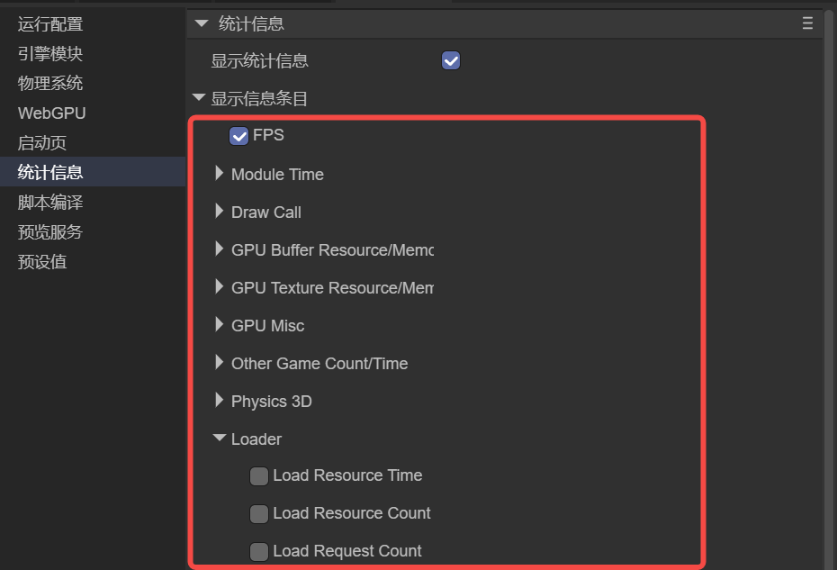

# 引擎统计信息

> Author: Charley

引擎的统计信息面板，本质是一套**实时、可视化的性能与资源观测工具**。它把引擎运行时最关键的性能数据（FPS、Frame Time、各阶段耗时、DrawCall、几何量、GPU 显存、加载与脚本等）持续呈现在屏幕上，目的是：

> **把“感觉卡”变成“能定位、能对比、能验证的数字”。**

它是**性能调试的第一现场**：用于快速判断瓶颈方向、指导优化决策，并验证每一次修改是否真的有效。

本篇将完整的介绍 IDE 中引擎统计信息的每一个可设置参数的作用。

## 1. 统计信息的显示开启/关闭

### 1.1 统计面板的开启与关闭

统计信息面板通常用于 **IDE 开发与调试阶段**。通常，开发者只需在 IDE 面板中勾选 **“显示统计信息”** 选项，即可开启统计面板，如图 1-1 所示。

 

（图1-1）

统计信息面板开启后，会在运行过程中**持续显示并实时刷新**当前选中的统计项数据。

在某些场景下，开发者可能希望在代码中，或通过 DevTools 控制台 **动态控制统计信息面板的显示状态**。此时可以直接调用引擎提供的 API。

- **开启统计面板**
   调用 `Laya.Stat.show()` 后，统计面板会显示在屏幕上，并按照当前配置的统计项进行刷新显示。
- **关闭统计面板**
   调用 `Laya.Stat.hide()` 后，统计面板将停止刷新，并从屏幕中移除。

> 统计信息面板的刷新频率为 **每帧一次**，用于实时反映当前帧的性能与资源状态。

### 1.2 统计项的开启与关闭

如果默认显示的统计信息无法满足开发需求，开发者可以在 **IDE 的统计配置面板** 中，通过勾选或取消勾选的方式，自定义需要显示的统计项，如图 1-2 所示。

 

（图1-2）

除了 IDE 面板配置外，统计信息面板也支持通过代码进行精确控制。开发者可以通过设置`Laya.Stat.elements`，指定需要显示的统计项集合。

示例代码如下：

```ts
const { regClass, property } = Laya;

@regClass()
export class Demo extends Laya.Script {
    onEnable(): void {
        Laya.Stat.elements = [
            Laya.StatElement.CT_FPS,
            Laya.StatElement.CT_DrawCall,
            Laya.StatElement.M_GPUMemory
        ];
        // 开启统计面板（参数为x,y坐标，默认为0,0）
        Laya.Stat.show(5, 5);

        // 关闭示例：
        // Laya.Stat.hide();
    }
}
```

通过代码方式配置统计面板，适合以下场景：

- 仅在特定调试阶段显示统计信息
- 根据运行状态动态切换统计项
- 在不同设备或模式下使用不同的统计配置

### 1.3 统计项的前缀标识

在引擎中，依据统计项名称前缀进行区分不同的统计类型，具体如下：

以 `T_` 开头：**时间类统计项**，单位为 **毫秒（ms）**

以 `M_` 开头：**内存类统计项**，单位为 **MB**

以 `C_` / `CT_` 开头：**数量或次数统计项**，显示为 **整数（无小数）**

尽管在 IDE 的统计信息配置项中，并不会显示这些前缀，仅仅是为了可读性更好，在引擎与项目的实际使用中，一定要注意，是存在统计项前缀的。


## 2. FPS（CT_FPS）

FPS（Frames Per Second，每秒帧数）用于表示 **当前设备在运行过程中，每秒能够完成的渲染帧数**，它直接反映了游戏整体运行是否流畅。

在多数项目中，FPS 往往是新人最先关注、同时也是**最容易被误解**的统计指标，因此在实际分析中，需要配合 **Frame Time** 以及各模块耗时一起解读，而不建议单独作为性能判断依据。

### 2.1 FPS 的意义与应用

FPS 的主要作用有两方面。首先，它是判断游戏是否流畅的第一信号。一般来说，60FPS 被视为完全流畅，而低于 20FPS 时，玩家的主观体验会明显下降。其次，FPS 可作为性能回归的对比基线。在相同场景、机型和操作路径下，如果新功能引入后 FPS 下降，就能快速判断是否存在性能回退。

在开发阶段，FPS 常用于快速自检。比如在添加 AI、物理、特效或后处理系统后，可以先观察 FPS 是否下降，再结合统计面板分析具体的性能压力来源。在机型适配和性能档位调整中，低端机 FPS 偏低时，开发者可以通过统计面板决定优化策略，包括降低阴影分辨率、减少粒子数量、降低贴图精度或关闭部分后处理效果。

需要强调的是，FPS 仅是性能结果，而不是原因。当 FPS 下降时，应联动查看其他关键指标：

- **帧时间** (`T_Frame_Time`)：是否超过目标阈值（如 >16ms 对应 60FPS，>33ms 对应 30FPS）。
- **脚本更新耗时** (`T_ScriptUpdateTime`)：判断脚本逻辑是否过重。
- **阴影和渲染开销** (`T_ShadowPass` / `CT_ShadowDrawCall`)：分析阴影计算压力。
- **资源占用** (`M_AllTexture` / `M_GPUMemory`)：检查显存或资源占用是否影响性能。

初步优化可从以下方向入手：DrawCall 偏高时优先合批、减少材质与贴图切换及 UI 节点碎片化；阴影开销大时可减少投射对象、降低分辨率或更新频率；脚本逻辑复杂时拆分或降低更新频率，并使用缓存和对象池优化。

### 2.2 性能调试总览

为了让统计面板真正指导性能优化，可以遵循一个清晰的流程：**先判断瓶颈大类 → 再定位具体阶段 → 最后验证优化效果**。

首先，应明确目标帧率（常见为 60FPS 或 30FPS）并固定复现条件，包括机型、场景、视角和操作路径。只有在一致条件下，FPS 与 Frame Time 的对比才有参考价值，其中 FPS 显示整体结果，而 Frame Time 更适合判断是否达标。

接下来进行快速分流，判断性能压力主要来源于 CPU 还是渲染。一般流程如下：

- **脚本开销**：检查 `T_ScriptUpdateTime` / `T_ScriptLateUpdateTime`，如果明显偏高，则 CPU 脚本逻辑是主要瓶颈。
- **2D 渲染开销**：观察 `T_AllRender2D` 和 `CT_2DDrawCall`，常见于 UI 过复杂或节点碎片化严重。
- **3D 渲染开销**：查看 `T_AllRender3D` 以及 `T_ShadowPass`、`T_DepthPass`、`T_3DMainPass_*` 指标，分析渲染压力来源。

在定位原因时，建议使用配套指标综合判断。

耗时高的指标（`T_`）可配合次数或规模指标（`CT_ / C_`）分析，例如 `T_3DMainPass_Opaque` 偏高时，可查看 `CT_OpaqueDrawCall`、`CT_ShaderChange` 或 `CT_Triangle`。

资源占用高（`M_`）时，也应参考数量指标（`C_`），如 `M_AllTexture` 高时，查看 `C_AllTexture` 与 `M_RenderTexture`。对于加载或网络相关问题，可通过 `T_LoadRequestTime` 与 `T_LoadResourceTime` 对比，区分下载慢或解析慢。

最后，每次优化后必须验证效果。重点关注三方面：核心指标是否改善（目标 `T_ / CT_` 是否下降）、整体性能是否提升且稳定（FPS 与 Frame Time 是否改善）、是否引入副作用（画质是否可接受，其他性能指标是否异常，如 DrawCall 降低但三角形数量暴增或显存飙升）。


## 3. Module Time（模块耗时）

在 IDE 中，`Module Time` 为分组标题，用于把“时间类统计项（`T_`）”集中展示。此分组内的值主要由 `LayaGL.statAgent.recordTimeData(...)` 写入。

**使用指南**

- **先看总体**：先看 `FPS` 与 `T_Frame_Time`，确认“是否真的卡”（FrameTime 是否明显 > 16ms/33ms）。
- **再找大头**：对比 `T_ScriptUpdateTime`、`T_AllRender3D`、`T_AllRender2D`、`T_ShadowPass`、`T_Render_PostProcess`，找出占用最大的模块。
- **最后下钻**：在 3D 内部再看 `T_CullMain`、`T_DepthPass`、`T_3DMainPass_*`、`T_3DContext*`，逐步缩小到具体阶段。

**调试与优化速查表**

> 使用方式：先找到“最高/最异常”的 `T_` 项，再按表中的“常见原因 → 优先优化建议”执行；优化后用 `T_Frame_Time` 与对应 `T_` 项做回归验证。

| 指标                     | 异常信号（经验判断）               | 常见原因（从高概率到低概率）                            | 优先优化建议（建议按顺序做）                                 |
| ------------------------ | ---------------------------------- | ------------------------------------------------------- | ------------------------------------------------------------ |
| `T_Frame_Time`           | 长期高于目标（>16ms/33ms）或波动大 | 任何模块耗时超标；偶发尖峰可能是资源创建/编译/GC        | 先用本章其它 `T_` 找“大头”；再看 `CT_*/C_*/M_*` 配套指标；对尖峰优先排查资源创建与首编译 |
| `T_AllRender3D`          | 3D 总耗时明显大于 2D/脚本          | 3D 主流程重（主渲染/阴影/深度/透明/材质复杂）           | 先拆分看 `T_ShadowPass`/`T_DepthPass`/`T_3DMainPass_*`；再用 `CT_*DrawCall`/`CT_ShaderChange`/`CT_Triangle` 找根因 |
| `T_DepthPass`            | 开启后处理/深度后明显升高          | Depth/DepthNormals 额外绘制；参与对象过多               | 降低依赖深度的效果质量/数量；减少参与对象；检查是否不必要地开启 DepthNormals |
| `T_ShadowPass`           | 开阴影后显著升高                   | 阴影分辨率高、级联多、投射对象多、更新频率高            | 优先减少投射阴影对象；降低阴影分辨率/级联；降低阴影更新频率；必要时关阴影或改成烘焙 |
| `T_3DMainPass`           | 主渲染阶段很高                     | 不透明/透明绘制重、材质复杂、光照复杂                   | 先看 `T_3DMainPass_Opaque/Trans` 分摊；再降 DrawCall/ShaderChange/三角形；减少透明过绘制 |
| `T_3DContextPre`         | “准备阶段”很高                     | shader 首次编译、频繁 define/状态变化、UBO/资源更新频繁 | 预热 shader；减少每帧动态改材质/宏定义；减少频繁创建/销毁资源；降低 UBO 上传（见 `CT_UBO*`） |
| `T_3DContextRender`      | “绘制阶段”很高                     | DrawCall 多、三角形多、透明过绘制、状态切换多           | 先降 `CT_DrawCall/CT_3DDrawCall`；再降 `CT_Triangle`；再降 `CT_ShaderChange`；减少全屏透明/粒子 |
| `T_3DMainPass_Opaque`    | 不透明耗时占比最高                 | 不透明对象多、材质碎、光照复杂                          | 合批/实例化/静态合并；减少材质种类；优化灯光与阴影参与；LOD/裁剪 |
| `T_3DMainPass_Trans`     | 透明耗时异常高                     | 透明对象/粒子多、排序与过绘制严重                       | 减少透明数量与覆盖面积；合并特效；尽量避免大面积半透明叠加；优先优化粒子 |
| `T_3DBatchTime`          | 合批耗时高但 DrawCall 降不明显     | 场景对象极多、合批策略不匹配、动态变化频繁              | 先确认合批是否带来 DrawCall 收益；无收益时减少参与/改策略；降低动态变更频率 |
| `T_CullMain`             | 场景对象一多就升高                 | 3D 节点/渲染器数量大，裁剪/剔除成本上升                 | 降低同屏对象数量；启用/优化裁剪策略；尽量减少不可见但仍参与列表的对象 |
| `T_CullShadow`           | 阴影开启后裁剪就很贵               | 投射阴影对象过多、级联/多光源导致重复裁剪               | 减少投射对象；降低阴影范围；降低级联/光源数量；提高过滤条件  |
| `T_Render_PostProcess`   | 开后处理后明显升高                 | 后处理链过长/效果重/分辨率高                            | 关闭或降低重效果；降低后处理分辨率；减少叠加效果数量         |
| `T_AllRender2D`          | UI/2D 场景下显著升高               | UI 节点碎、mask/滤镜多、频繁重建                        | 先看 `CT_2DDrawCall`；减少 mask/滤镜；做列表虚拟化；减少每帧布局/文字重建 |
| `T_2DPass`               | 多 Pass 时升高                     | Pass 数量多、离屏/后处理多                              | 减少 Pass；合并效果；降低离屏 RT 分辨率                      |
| `T_2DContextPre`         | 2D 准备阶段高                      | 2D 元素准备/数据上传重                                  | 减少动态变化；缓存/复用；降低几何重建                        |
| `T_2DContextRender`      | 2D 绘制阶段高                      | DrawCall 多、透明叠加、过绘制                           | 降 `CT_2DDrawCall`；合图集；减少层级与透明覆盖               |
| `T_ScriptUpdateTime`     | 每帧脚本耗时高                     | 逻辑重、遍历大、频繁分配/GC、事件过多                   | 优先减少每帧分配；拆分重逻辑/降频；缓存查找结果；对象池；减少全量遍历 |
| `T_ScriptLateUpdateTime` | LateUpdate 很高                    | 跟随/插值/后处理逻辑重、与动画/骨骼联动                 | 同 `T_ScriptUpdateTime`；同时检查是否有可移到低频更新或事件驱动的逻辑 |

### 3.1 Frame Time（T_Frame_Time）

表示 **单帧耗时（ms）** 的近似值，内部以 \(1000 / FPS\) 计算得到。

在项目中，Frame Time 的价值在于：它能把“流畅/卡顿”直接量化成毫秒数，便于你判断当前是否满足目标帧率（例如 60FPS≈16.6ms，30FPS≈33.3ms）。当你在优化时，Frame Time 也是最直观的“优化是否有效”的衡量指标。

**典型用途：**

- **移动端稳帧**：目标 30FPS 时，Frame Time 需要尽量稳定在 ~33ms 内；偶发尖峰会带来明显掉帧感。
- **功能回归验证**：新增系统后 Frame Time 上升，说明整体成本变高；需要进一步看是脚本还是渲染在变重。

### 3.2 All Render 3D（T_AllRender3D）

表示 **本帧所有 3D 场景的提交渲染总耗时（ms）**。它统计的是舞台渲染时对所有 `Scene3D` 的 `renderSubmit()` 调用耗时总和。

在项目中，这个指标最常用于回答两个问题：

- **“卡顿是否主要来自 3D？”**：把它与 `T_AllRender2D`、`T_ScriptUpdateTime` 对比，通常可以快速判断瓶颈大类。
- **“某个 3D 场景/相机是否变贵了？”**：当你切换场景、开启/关闭特效或后处理后，该值常会立刻变化。

**典型用途：**

大场景、复杂材质、密集灯光、阴影开启、透明过多时，该项往往显著升高。

### 3.3 Depth Pass（T_DepthPass）

表示 **深度相关 Pass 的总耗时（ms）**，包括：

- 生成 Depth Texture（Depth）
- 生成 DepthNormals Texture（DepthNormals）

在项目中，该项常用于判断“深度预处理是否值得”：当你开启深度纹理（例如后处理需要 Depth/DepthNormals）时，Depth Pass 会额外绘制一遍（或多遍）场景对象，成本会直接体现在这里。

**典型用途：**

- **使用后处理依赖深度**（景深、雾效、屏幕空间特效等）时，Depth Pass 通常必不可少。
- **对象数量非常多**时，Depth Pass 可能成为明显开销；你需要考虑减少参与对象或降低相关效果质量。

### 3.4 Shadow Pass（T_ShadowPass）

表示 **阴影贴图渲染阶段的总耗时（ms）**，统计范围为主渲染流程中“渲染阴影贴图”的整体阶段耗时。

在项目中，该项用于衡量“阴影系统的总体代价”。阴影贴图往往需要对投射阴影的对象进行额外绘制（并可能按级联/光源类型重复执行），因此是移动端最常见的性能热点之一。

**典型用途：**

- **打开实时阴影后 FPS 明显下降**：优先看 `T_ShadowPass` 与 `CT_ShadowDrawCall`。
- **阴影质量过高**：阴影分辨率、级联数量、更新频率等都会显著影响该值。

### 3.5 3D Main Pass（T_3DMainPass）

表示 **3D 主渲染 Pass 总耗时（ms）**，通常包括不透明绘制、天空盒/环境绘制、透明绘制等主流程。

当你需要进一步拆分时，可配合下面两个子项（3.8、3.9）定位不透明与透明的占比。

在项目中，这个指标常用于判断“主渲染是否是最大开销”。如果 `T_3DMainPass` 很高，而 `T_ShadowPass`、`T_DepthPass` 不高，通常说明主要成本就发生在真正的主场景绘制阶段（材质复杂、光照复杂、透明过绘制等）。

### 3.6 3D Context Pre（T_3DContextPre）

表示 **3D 渲染上下文“绘制前准备阶段”的耗时（ms）**。通常包含：

- Context 级别的 Shader Define 合并与准备
- RenderElement 的预更新（如材质/着色器准备、必要的编译与状态准备）
- Uniform/Buffer 等上传前的准备与触发

**典型用途：**

- **“DrawCall 不高但还是卡”**：可能卡在准备阶段（例如频繁 shader 编译、频繁 UBO 更新、频繁状态变更）。
- **“首帧/切换材质时卡一下”**：可能是 shader 首次编译或资源准备导致的尖峰。

### 3.7 3D Context Render（T_3DContextRender）

表示 **3D 渲染上下文“实际绘制阶段”的耗时（ms）**。它统计的是 RenderElement 执行 `_render(...)` 过程的时间，通常更贴近 GPU 提交/绘制相关的 CPU 开销。

在项目中，若 `T_3DContextRender` 明显高于 `T_3DContextPre`，往往意味着真正的绘制提交更重（例如大量 draw、状态切换、三角形数高、透明过绘制等）。

### 3.8 3D Main Pass Opaque（T_3DMainPass_Opaque）

表示 **3D 主渲染 Pass 中不透明队列绘制耗时（ms）**。

**典型用途：**不透明绘制通常占比最大；当开启大量静态物体、复杂材质、密集灯光时，可能明显升高。

### 3.9 3D Main Pass Trans（T_3DMainPass_Trans）

表示 **3D 主渲染 Pass 中透明队列绘制耗时（ms）**。

**典型用途：**透明队列常伴随排序、混合与过绘制，容易造成帧耗上升；当透明对象数量多/面积大时需要重点关注。

### 3.10 3D Batch Time（T_3DBatchTime）

表示 **3D 合批（Batch）阶段耗时（ms）**。在不透明渲染队列渲染前，引擎会尝试执行实例合批/队列合并，该项记录这一步的 CPU 开销。

**典型用途：**当开启动态合批/实例合批且场景对象数量多时，用于观察合批本身是否成为瓶颈。

### 3.11 Cull Main（T_CullMain）

表示 **主相机视锥裁剪（以及相关剔除逻辑）的耗时（ms）**，统计的是从渲染列表中筛选出本帧需要渲染对象的阶段成本。

典型用途：当场景对象非常多时，裁剪成本可能显著；可结合 BVH/遮挡剔除等手段优化。

### 3.12 Cull Shadow（T_CullShadow）

表示 **阴影渲染阶段的裁剪耗时（ms）**，即从渲染列表中筛选出需要投射阴影的对象集合的成本（包含级联/聚光等阴影裁剪路径）。

**典型用途：**阴影开启后，除了 Shadow Pass 本身，Shadow Cull 也可能成为额外开销来源。

### 3.13 Render PostProcess（T_Render_PostProcess）

表示 **后处理（PostProcess）阶段耗时（ms）**。当相机启用后处理且效果链不为空时，该项会统计后处理命令执行阶段的耗时。

**典型用途：**定位后处理链是否是帧耗主因（Bloom/SSR/SSAO 等通常成本较高）。

### 3.14 All Render 2D（T_AllRender2D）

表示 **本帧所有 2D 场景渲染总耗时（ms）**，统计的是舞台渲染中 `_render2d()` 的整体耗时。

**典型用途：**当 UI/2D 特效密集时，用于判断 2D 是否是主要耗时来源。

### 3.15 2D Pass（T_2DPass）

表示 **2D Pass 管理器执行耗时（ms）**，统计的是 2D PassManager `apply(...)` 的整体阶段时间。

**典型用途：**当 2D 存在多 Pass（例如离屏、后处理、mask 等）时，可用于评估 Pass 管理与切换开销。

### 3.16 2D Context Pre（T_2DContextPre）

表示 **2D 渲染上下文“绘制前准备阶段”的耗时（ms）**。常见包含：

- RenderElement2D 的 `_prepare(...)`
- Uniform/Buffer 等上传触发

### 3.17 2D Context Render（T_2DContextRender）

表示 **2D 渲染上下文“实际绘制阶段”的耗时（ms）**，统计的是 RenderElement2D 的 `_render(...)` 阶段时间。

### 3.18 Script Update Time（T_ScriptUpdateTime）

表示 **本帧所有组件脚本 `onUpdate()` 执行的总耗时（ms）**。它统计的是 `ComponentDriver.callUpdate()` 内遍历执行脚本更新的耗时。

**典型用途：**判断 CPU 是否主要消耗在脚本逻辑（AI、寻路、数值计算、状态机等）。

### 3.19 Script Late Update Time（T_ScriptLateUpdateTime）

表示 **本帧所有组件脚本 `onLateUpdate()` 执行的总耗时（ms）**。它统计的是 `ComponentDriver.callLateUpdate()` 内遍历执行脚本 LateUpdate 的耗时。

**典型用途：**判断 LateUpdate 是否存在重逻辑（例如跟随/插值、延迟刷新、骨骼/IK 驱动等）。


## 4. Draw Call（绘制调用）

在 IDE 中`Draw Call` 为分组标题，用于把“每帧绘制调用数量（`CT_`）”集中展示。`CT_` 类型通常按 1 秒窗口计算平均值显示。

**使用指南**

- DrawCall 可以理解为“渲染提交次数”。次数越多，CPU 侧的渲染组织与状态切换成本通常越高。
- 很多项目的优化路径都是：**先把 DrawCall 降下来**（合批/减少材质与纹理切换），再看三角面与像素压力。
- 判断 DrawCall 是否异常时，建议同时看：`CT_ShaderChange`（Shader 切换）与 `CT_Triangle`（三角面数量）。

**调试与优化速查表**

| 指标                     | 异常信号                     | 常见原因                                   | 优先优化建议（建议按顺序）                                   | 如何验证                                                     |
| ------------------------ | ---------------------------- | ------------------------------------------ | ------------------------------------------------------------ | ------------------------------------------------------------ |
| `CT_DrawCall`            | 总体很高且随场景规模线性上涨 | 对象/材质过碎；合批无效；频繁切换贴图/材质 | 合图集与材质统一 → 合批/实例化/静态合并 → 减少 UI 碎片与层级 | 观察 `CT_DrawCall` 下降，同时 `T_3DContextRender`/`T_AllRender2D` 是否下降 |
| `CT_2DDrawCall`          | UI 场景很高                  | UI 节点过碎、mask/滤镜多、图集不统一       | UI 合图集 → 减少 mask/滤镜 → 列表虚拟化 → 减少动态文字/布局重建 | `CT_2DDrawCall` 下降且 `T_AllRender2D` 下降                  |
| `CT_3DDrawCall`          | 3D 场景很高                  | 网格/材质碎片化、光照/阴影拆批             | 合批/实例化/静态合并 → 降低材质种类 → 合并小物体             | `CT_3DDrawCall` 下降且 `T_AllRender3D`/`T_3DContextRender` 下降 |
| `CT_OpaqueDrawCall`      | 不透明批次高                 | 不透明对象多、材质多                       | 先做静态合并/实例化；减少材质变体                            | `CT_OpaqueDrawCall` 下降，`T_3DMainPass_Opaque` 下降         |
| `CT_TransDrawCall`       | 透明批次高                   | 粒子/透明材质过多，难合批                  | 减少透明数量与覆盖面积；合并特效；能不透明就不透明           | `CT_TransDrawCall` 与 `T_3DMainPass_Trans` 同时下降          |
| `CT_ShadowDrawCall`      | 阴影批次高                   | 投射阴影对象多、级联/多光源导致重复绘制    | 减少投射对象；降低阴影分辨率/级联/更新频率                   | `CT_ShadowDrawCall` 与 `T_ShadowPass` 下降                   |
| `CT_DepthCastDrawCall`   | 深度批次高                   | Depth/DepthNormals 参与对象过多            | 只在必要时启用深度；减少参与对象                             | `CT_DepthCastDrawCall` 与 `T_DepthPass` 下降                 |
| `CT_Instancing_DrawCall` | 该值为 0 但期望实例化        | 没启用实例化/材质不满足/数据不匹配         | 确认相同材质与渲染状态；用实例化替代重复对象                 | `CT_Instancing_DrawCall` 上升且 `CT_DrawCall` 下降           |
| `CT_IndirectDrawCall`    | 值突然升高                   | 使用了 Indirect Draw（WebGPU）             | 通常是正常现象；若异常高，检查是否重复提交间接命令           | 与 `CT_DrawCall`、`T_3DContextRender` 联动判断是否带来收益   |

### 4.1 Opaque DrawCall（CT_OpaqueDrawCall）

表示 **不透明渲染队列中的 DrawCall 数量**（按渲染元素计数）。

**典型用途：**

- **不透明通常占 3D 绘制的大头**。当该值很高时，常见原因是：对象过碎、材质过多、批次合并效果不好。
- 与 `T_3DMainPass_Opaque` 联合解读：  
  - DrawCall 高 + 耗时高：多半是“提交太多次”或“状态切换太频繁”。  
  - DrawCall 不高 + 耗时高：多半是“单次绘制很重”（shader 复杂、三角形多、光照复杂等）。

### 4.2 Trans DrawCall（CT_TransDrawCall）

表示 **透明渲染队列中的 DrawCall 数量**（按渲染元素计数）。

**典型用途：**

- 透明对象常常需要排序与混合，**更难合批**，也更容易出现“透明越多越卡”的情况。
- 当透明 DrawCall 高时，常见对应现象是：粒子/特效过多、UI 透明层级过复杂、半透明材质过碎。

### 4.3 Depth Cast DrawCall（CT_DepthCastDrawCall）

表示 **Depth/DepthNormals Pass 中的 DrawCall 数量**（用于生成深度相关贴图的绘制调用计数）。

**典型用途：**

- 该值上升通常意味着：**有大量对象参与深度预渲染**。当你启用依赖深度的后处理或效果时，需要重点关注它是否“把整个场景又画了一遍”。
- 若 `T_DepthPass` 同时升高，说明 Depth Pass 已成为可见成本；可以考虑减少参与对象、降低深度需求或降低效果质量。

### 4.4 Shadow DrawCall（CT_ShadowDrawCall）

表示 **阴影贴图渲染中的 DrawCall 数量**（投射阴影对象的绘制调用计数）。

**典型用途：**

- 阴影 DrawCall 高通常意味着：**太多对象在投射阴影**，或阴影级联/多光源导致重复绘制。
- 如果移动端性能紧张，阴影相关的 DrawCall 通常是最先需要压的指标（减少投影对象、降低阴影分辨率/更新频率）。

### 4.5 2D DrawCall（CT_2DDrawCall）

表示 **2D 渲染上下文提交的 DrawCall 数量**（按 2D RenderElement 计数）。

**典型用途：**

- 2D DrawCall 高通常来自：UI 节点过碎、遮罩(mask)/滤镜过多、频繁换贴图/材质、动态文字/图集频繁变化等。
- 当你发现 `T_AllRender2D` 升高时，优先看这个值，通常能快速判断是否是“提交次数太多”导致的。

### 4.6 3D DrawCall（CT_3DDrawCall）

表示 **3D 渲染上下文提交的 DrawCall 数量**（按 3D RenderElement 计数）。

**典型用途：**

- 用它与 `CT_2DDrawCall` 对比，可以快速判断 DrawCall 压力主要来自 2D 还是 3D。
- 当你做 3D 合批、实例化、LOD 时，3D DrawCall 的变化是最直接的收益体现。

### 4.7 DrawCall（CT_DrawCall）

表示 **总体 DrawCall 数量**。该值通常来源于底层渲染设备每次执行 draw 指令时的计数（含 2D、3D）。

**典型用途：**它是“总体提交次数”的最终汇总。在做性能优化时，通常可以先把 `CT_DrawCall` 当作第一目标指标之一（尤其是 CPU 侧瓶颈时）。

### 4.8 Indirect DrawCall（CT_IndirectDrawCall）

表示 **Indirect Draw 的调用数量**（如 WebGPU 的 `drawIndirect/drawIndexedIndirect`）。

注意：在 WebGL 路径下通常不会产生 Indirect Draw；若当前运行环境不支持/未使用 Indirect，则可能为 0。

### 4.9 Instancing DrawCall（CT_Instancing_DrawCall）

表示 **实例化绘制（Instancing）的 DrawCall 数量**。

**典型用途：**

- 该项用于判断“实例化是否真的在工作”。例如草海/树木/弹孔/同材质重复物体，如果实例化生效，通常能显著降低总体 DrawCall。
- 与 `CT_DrawCall` 联合看：当 `CT_Instancing_DrawCall` 上升、但 `CT_DrawCall` 下降或保持稳定，通常意味着实例化在发挥作用。


## 5. GPU Buffer Resource/Memory（GPU 缓冲资源/内存）

该分组包含 Buffer 类资源的 **内存（`M_`，单位 MB）** 与 **数量（`C_`）**。统计数据通常在 Buffer 创建、扩容、销毁时累计更新。

**使用指南**

- 这组指标主要用于回答两个问题：**“GPU Buffer 是否过多/是否泄漏？”**以及**“Buffer 显存是否异常上涨？”**  
- 非常有用的实践是：在关键场景切换（进入战斗/退出战斗/加载大地图/打开关闭 UI）前后对比这些数值，观察是否“该降不降”（泄漏/未释放）或“突然暴涨”（资源配置不合理）。

### 5.1 GPU Buffer Memory（M_GPUBuffer）

表示 **所有 GPU Buffer 的内存总和（MB）**。Buffer 包括顶点缓冲、索引缓冲、Uniform/UBO 等。

**典型用途：**用于监控“几何/Uniform 等数据在 GPU 上占了多少空间”。当该值持续上升且不回落时，往往意味着存在资源未释放、动态网格/粒子缓冲不断扩容等问题。

### 5.2 GPU Buffer Count（C_GPUBuffer）

表示 **GPU Buffer 的对象数量**（创建 +1，销毁 -1）。

**典型用途：**用于排查“Buffer 对象是否越来越多”。如果切换场景或关闭某系统后数量不下降，通常需要检查资源生命周期与引用关系。

### 5.3 Vertex Buffer Memory（M_VertexBuffer）

表示 **顶点缓冲（Vertex Buffer）的内存占用（MB）**。

**典型用途：**顶点缓冲直接对应网格/粒子/2D 生成网格的顶点数据；当你做“减少网格细分、减少粒子数量、减少 UI 动态重建”时，这项通常会下降。

### 5.4 Vertex Buffer Count（C_VertexBuffer）

表示 **顶点缓冲对象数量**。

**典型用途：**用于判断顶点数据是否被过度拆分（大量小 VB）或存在未释放；数量过多也可能带来管理与上传开销。

### 5.5 Index Buffer Memory（M_IndexBuffer）

表示 **索引缓冲（Index Buffer）的内存占用（MB）**。

**典型用途：**索引缓冲与网格拓扑相关；如果你发现该项很高，通常意味着场景里存在大量网格或粒子系统使用了较大索引数据。

### 5.6 Index Buffer Count（C_IndexBuffer）

表示 **索引缓冲对象数量**。

**典型用途：**与 `C_VertexBuffer` 类似，用于排查索引数据是否被过度拆分或未释放。

### 5.7 UBO Buffer Memory（M_UBOBuffer）

表示 **Uniform Buffer（UBO）的内存占用（MB）**。

**典型用途：**UBO 常用于材质/相机/场景参数等统一数据块。该项过大可能意味着 UBO 分配策略不合理或存在大量动态 UBO。

### 5.8 UBO Buffer Count（C_UBOBuffer）

表示 **Uniform Buffer（UBO）的对象数量**。

**典型用途：**当该数量异常高时，通常意味着每个对象/材质都在生成独立 UBO，可能需要合并/共享策略。

### 5.9 Device Buffer Memory（M_DeviceBuffer）

表示 **设备侧 Buffer（WebGPU DeviceBuffer/StorageBuffer 等）的内存占用（MB）**。

> 在 WebGPU 路径下通常更常见；在 WebGL 路径下可能为 0 或仅在某些扩展实现中产生。

用于 WebGPU 路径下观察“StorageBuffer/Compute 等相关数据结构”的资源占用是否合理。

### 5.10 Device Buffer Count（C_DeviceBuffer）

表示 **设备侧 Buffer 的对象数量**。

**典型用途：**配合 `M_DeviceBuffer` 一起用于排查设备缓冲对象是否泄漏或创建过多。


## 6. GPU Texture Resource/Memory（GPU 纹理资源/内存）

该分组包含 Texture 类资源的 **内存（`M_`，单位 MB）** 与 **数量（`C_`）**。统计数据在纹理/RenderTexture 创建、更新显存估算值、销毁时累计更新。

**使用指南**

- 纹理与渲染纹理（RenderTexture）通常是移动端最容易“爆显存”的来源之一。  
- 当出现**卡顿、花屏、黑屏、WebGL 上下文丢失（context lost）、或设备发热严重**时，优先检查这组指标，尤其是 `M_GPUMemory`、`M_AllTexture`、`M_RenderTexture`。

**调试与优化速查表**

| 指标                        | 异常信号                       | 常见原因                                    | 优先优化建议（建议按顺序）                                   | 如何验证                                        |
| --------------------------- | ------------------------------ | ------------------------------------------- | ------------------------------------------------------------ | ----------------------------------------------- |
| `M_AllTexture`              | 总纹理显存很高或切场景后不回落 | 贴图分辨率过大/数量过多；图集碎片化；未释放 | 优先压缩/降分辨率 → 减少常驻贴图 → 检查资源释放与缓存策略    | 切场景/关闭系统后数值能回落；加载峰值下降       |
| `M_RenderTexture`           | RT 显存很高                    | 后处理/离屏 RT 过多、分辨率过高、RT 未回收  | 降低 RT 分辨率（尤其是后处理）→ 减少效果链/Pass → 检查 RT 池化/回收 | `M_RenderTexture` 与 `C_RenderTexture` 同时下降 |
| `C_AllTexture`              | 数量持续上涨                   | 重复创建/重复加载、缓存失控、引用未释放     | 检查资源生命周期与引用；避免重复加载；合理分组与释放         | 场景切换后能回落到稳定值                        |
| `M_Texture2D`/`C_Texture2D` | UI/贴图类指标异常高            | UI 图集过多/过大；多语言/皮肤资源常驻       | 合并图集/按需加载；降低贴图尺寸；做场景分包                  | 指标下降且 UI 渲染性能改善                      |
| `M_TextureCube`             | 立方体显存异常                 | 天空盒/反射探针分辨率过高                   | 降低 cube 分辨率；减少探针数量；按场景启用                   | 显存下降且画面无明显劣化                        |
| `M_Texture2DArray`          | 数组纹理显存异常               | 层数过多/分辨率过高                         | 控制层数与分辨率；按需创建                                   | 显存下降且功能正常                              |

### 6.1 All Texture Memory（M_AllTexture）

表示 **所有纹理（含普通纹理与 RenderTexture）的显存占用总和（MB）**。

**典型用途：**它是最直观的“纹理显存总览”。当你怀疑贴图过大、贴图加载过多或 RT 使用过度时，先看它是否超出目标机型的可承受范围。

### 6.2 All Texture Count（C_AllTexture）

表示 **所有纹理对象数量**。

**典型用途：**用于排查纹理是否“越用越多”。如果切场景后数量不回落，通常存在纹理资源未释放或缓存策略不当。

### 6.3 Texture2D Memory（M_Texture2D）

表示 **2D 纹理显存占用（MB）**。

**典型用途：**项目里绝大多数美术贴图、UI 图集都属于 Texture2D。该项过高时，常见处理是：压缩纹理、降低分辨率、减少常驻贴图、拆分加载策略。

### 6.4 Texture2D Count（C_Texture2D）

表示 **2D 纹理对象数量**。

**典型用途：**Texture2D 数量过多通常意味着：图集碎片化、重复加载、或资源未释放。排查时建议对照资源加载点与缓存策略。

### 6.5 TextureCube Memory（M_TextureCube）

表示 **立方体纹理显存占用（MB）**。

**典型用途：**常用于天空盒、反射探针等。立方体贴图分辨率很容易导致显存飙升（6 面），在移动端需要特别谨慎。

### 6.6 TextureCube Count（C_TextureCube）

表示 **立方体纹理对象数量**。

**典型用途：**用于排查反射探针/天空盒资源是否重复创建或未释放。

### 6.7 Texture3D Memory（M_Texture3D）

表示 **3D 纹理显存占用（MB）**。

**典型用途：**3D 纹理常用于体积数据、某些高级效果或 GPU 计算相关数据。若项目并未使用相关功能但数值不为 0，建议检查是否误用或资源未回收。

### 6.8 Texture3D Count（C_Texture3D）

表示 **3D 纹理对象数量**。

**典型用途：**用于判断 3D 纹理是否被频繁创建（可能带来显存与创建成本）。

### 6.9 Texture2DArray Memory（M_Texture2DArray）

表示 **2DArray 纹理显存占用（MB）**。

**典型用途：**Texture2DArray 常用于批量纹理采样、实例化渲染等。该项偏高时，需要关注数组层数与分辨率是否过大。

### 6.10 Texture2DArray Count（C_Texture2DArray）

表示 **2DArray 纹理对象数量**。

**典型用途：**用于排查 Texture2DArray 是否被重复创建或未释放。

### 6.11 RenderTexture Memory（M_RenderTexture）

表示 **所有 RenderTexture 的显存占用（MB）**。

**典型用途：**RenderTexture 常用于后处理、离屏渲染、UI 特效、反射等。它们往往分辨率高、数量多时显存与带宽成本非常大，是性能问题的高发区。

### 6.12 RenderTexture Count（C_RenderTexture）

表示 **RenderTexture 对象数量**。

**典型用途：**当该数量过高时，常见原因是：多相机/多后处理链/频繁创建临时 RT 未回收。建议检查 RT 池化与生命周期管理。

---

## 7. GPU Misc（GPU 其他统计）

**使用指南**

这一组更偏“渲染细节”。当你已经知道是渲染在慢（例如 `T_AllRender3D` 高），它们能帮助你进一步判断“慢在提交次数、Shader 切换、几何量，还是数据上传”。

**调试与优化速查表**

| 指标                                                 | 异常信号           | 常见原因                                 | 优先优化建议（建议按顺序）                       | 如何验证                                          |
| ---------------------------------------------------- | ------------------ | ---------------------------------------- | ------------------------------------------------ | ------------------------------------------------- |
| `M_GPUMemory`                                        | 总显存高或不回落   | 纹理/RT/Buffer 占用过高或泄漏            | 优先压缩贴图与降 RT → 检查资源释放 → 复用与池化  | 场景切换/关闭系统后回落；峰值下降                 |
| `CT_ShaderChange`                                    | 频繁切换           | 材质/Shader 过碎；同屏很多不同材质小物体 | 统一材质与 shader 变体；减少材质种类；合并小物体 | `CT_ShaderChange` 下降且 `T_3DContextRender` 下降 |
| `CT_Triangle`                                        | 三角形异常高       | 模型面数高、LOD 缺失、粒子网格过多       | LOD/简模；减少同屏高模；减少粒子网格             | `CT_Triangle` 下降且画面可接受                    |
| `CT_BufferUploadCount`                               | 上传次数高         | 动态 VB/IB/UBO 更新频繁                  | 减少每帧更新；合并批量更新；缓存与对象池         | 次数下降且帧耗尖峰减少                            |
| `CT_GeometryBufferUploadCount`                       | 几何上传高         | 动态网格/文字/粒子重建                   | 缓存几何、降低重建频率、减少动态文字更新         | 次数下降且 2D/3D 对应耗时下降                     |
| `CT_UBOBufferUploadCount`/`CT_UBOBufferUploadMemory` | UBO 上传次数或量高 | 每帧修改大量材质/对象参数                | 减少不必要参数改动；共享批次参数；合并更新       | 上传指标下降且 `T_3DContextPre`/`Render` 下降     |

### 7.1 GPU Memory（M_GPUMemory）

表示 **GPU 侧总显存估算（MB）**。通常会在 Buffer 与 Texture 的内存变更时同步累计更新，是一个“总览型”指标。

**典型用途：**这是最建议长期关注的指标之一。显存过高会导致加载抖动、渲染不稳定甚至崩溃（尤其是移动端）。如果你看到它在某些操作后持续上涨且不回落，优先排查资源释放与 RT 池。

### 7.2 Shader Change（CT_ShaderChange）

表示 **Shader Program 切换次数**（按 1 秒窗口平均）。当渲染过程中频繁 `useProgram` 时会增加。

**典型用途：**

- Shader 切换次数高，通常意味着材质/Shader 过于碎片化，导致 GPU 状态切换频繁。
- 常见在：同屏大量不同材质的小物体、UI 混用大量不同 shader、特效材质种类过多等场景。

### 7.3 Triangle（CT_Triangle）

表示 **三角形数量**（每帧/每秒窗口平均，取决于统计窗口显示策略）。

**典型用途：**

- 三角形数量直接反映“几何复杂度”，是判断顶点处理压力的核心指标之一。
- 常见用于：评估模型面数是否超标、是否需要 LOD、是否需要简模或合批。

### 7.4 Buffer Upload Count（CT_BufferUploadCount）

表示 **BufferSubData 上传次数**（例如 WebGL 中对 buffer 的数据更新次数）。

**典型用途：**

- 该值高说明 CPU->GPU 数据更新频繁，容易造成 CPU 开销与带宽压力。
- 常见来源：粒子系统每帧写 VB、动态文字/图形频繁重建、动态网格/蒙皮数据频繁更新等。

### 7.5 Geometry Buffer Upload Count（CT_GeometryBufferUploadCount）

表示 **几何 Buffer（VB/IB）上传次数**。

**典型用途：**更聚焦“几何数据上传”。当你看到 DrawCall 不高但仍卡顿时，如果该项很高，往往说明“上传在拖慢你”，需要减少每帧更新或改为缓存/批量更新。

### 7.6 UBO Buffer Upload Count（CT_UBOBufferUploadCount）

表示 **UBO 上传次数**。

### 7.7 UBO Buffer Upload Memory（CT_UBOBufferUploadMemory）

表示 **UBO 上传的数据量（MB）**（统计上传的 size 累计）。

**典型用途：**

- 这两项一起用于衡量“Uniform 数据更新是否过量”。当对象数量多且每帧大量改材质参数时，UBO 上传次数与上传量会显著升高。
- 常见优化：减少不必要的每帧参数改动、合并相同材质参数、尽量批次共享、使用实例化将 per-object 数据打包上传。

---

## 8. Other Game Count/Time（其他对象数量/耗时）

**使用指南**

- 这一组用于回答“场景规模有多大、对象有多少、动画/骨骼/粒子更新是否变重”。  
- 当你不知道从哪里开始优化时，先看对象数量是否异常（`C_Sprite2DCount/C_Sprite3DCount/C_BaseRenderCount`），再看更新耗时是否异常（`T_AnimatorUpdate/T_SkinBoneUpdate/T_ShurikenUpdate`）。

### 8.1 Sprite2D Count（C_Sprite2DCount）

表示 **处于激活层级中的 2D 节点（Node/Sprite）数量**。节点激活进入层级时 +1，退出时 -1。

**典型用途：**

- 2D 节点数过高，通常意味着 UI 结构过复杂或拆分过碎，会带来：遍历/布局/事件/脚本/渲染的综合压力。
- 常见场景：列表未做虚拟化、复杂 HUD 常驻、动态生成节点未回收等。

### 8.2 Sprite3D Count（C_Sprite3DCount）

表示 **处于激活层级中的 3D 节点（Sprite3D）数量**。

**典型用途：**3D 节点数过高通常意味着场景对象规模大，裁剪与渲染组织成本会上升；可与 `T_CullMain` 联合判断是否“裁剪阶段就很贵”。

### 8.3 BaseRender Count（C_BaseRenderCount）

表示 **所有渲染器（BaseRender 派生类）的数量**，例如 MeshRenderer、SkinnedMeshRenderer、ParticleRenderer 等。

**典型用途：**渲染器数量决定了“需要被渲染系统管理的对象规模”。当该值很高时，通常意味着渲染对象非常多，DrawCall/裁剪/更新的压力都会增加。

### 8.4 MeshRender Count（C_MeshRenderCount）

表示 **MeshRenderer 的数量**。

**典型用途：**用于判断普通网格渲染器数量是否过多。若数量巨大，建议检查：是否能合并静态物体、是否能使用实例化、是否需要 LOD/裁剪策略。

### 8.5 SkinnedMeshRender Count（C_SkinnedMeshRenderCount）

表示 **SkinnedMeshRenderer 的数量**。

**典型用途：**蒙皮渲染器数量对 CPU（骨骼计算）与 GPU（蒙皮数据/顶点处理）都有压力。角色多、怪物多、同屏动画多时需要重点关注。

### 8.6 ShurikenParticleRender Count（C_ShurikenParticleRenderCount）

表示 **ShurikenParticleRenderer 的数量**。

**典型用途：**用于判断粒子渲染器数量规模。粒子系统过多时往往带来透明绘制、过绘制、VB 更新等问题，可与 `CT_TransDrawCall`、`T_ShurikenUpdate` 联合排查。

### 8.7 Animator Update（T_AnimatorUpdate）

表示 **Animator 更新耗时（ms）**。统计范围为 Animator 在更新/融合/事件脚本等流程中的总耗时。

**典型用途：**当同屏角色/怪物数量增加导致卡顿时，这项经常是“脚本之外”的重要 CPU 消耗点。若该项高，通常需要降低动画更新频率、减少状态机复杂度、减少同屏活动角色数量等。

### 8.8 SkinBone Update（T_SkinBoneUpdate）

表示 **蒙皮骨骼数据更新耗时（ms）**。该项统计的是 SkinnedMeshRenderer 在渲染更新阶段进行骨骼矩阵计算与提交的耗时。

**典型用途：**这项高通常意味着骨骼数量多、蒙皮角色多或更新过于频繁。常见优化方向是：降低骨骼数、减少同屏蒙皮对象、使用简化骨架/LOD、减少不可见角色更新。

### 8.9 Shuriken Update（T_ShurikenUpdate）

表示 **Shuriken 粒子系统更新耗时（ms）**。该项统计粒子系统每帧（或按更新掩码）进行发射、更新并可能写回 VertexBuffer 的阶段成本。

**典型用途：**粒子往往是移动端性能问题高发点（尤其是透明过绘制 + 每帧更新）。当该项高时，常见策略是：减少粒子数量、降低发射频率、合并特效、缩短生命周期、减少全屏覆盖的透明粒子。


## 9. physics 3D（3D 物理）

`physics 3D` 为分组标题，用于汇总物理模块相关统计。需要注意：**物理模块存在两套统计来源**：

- 一类直接写入 `LayaGL.statAgent`（因此能直接被统计面板显示）。
- 一类写入 `Physics3DStatInfo`（需要开发者在需要时同步到 `statAgent`，否则统计面板可能显示为 0）。该类更适用于物理内部“每帧清零”的事件计数。

**使用指南**

- 物理相关卡顿最常见的表现是：**同屏刚体/碰撞体数量增多时帧率下降**，或者**事件风暴（Enter/Stay/Exit）导致脚本与事件派发变慢**。
- 推荐先看：`T_Physics_Simulation`（模拟本身）、`T_Physics_UpdateNode`（同步）、`T_PhysicsEvent`（派发）与 `C_PhysicsEventCount`（事件量），快速判断问题属于“模拟算不过来”还是“事件太多”。

**调试与优化速查表**

| 指标                          | 异常信号             | 常见原因                                | 优先优化建议（建议按顺序）                                  | 如何验证                 |
| ----------------------------- | -------------------- | --------------------------------------- | ----------------------------------------------------------- | ------------------------ |
| `T_Physics_Simulation`        | 同屏刚体多时显著上升 | 动态刚体多、碰撞形状复杂、约束多        | 减少动态刚体；简化碰撞体；降低更新频率/子步                 | 模拟耗时下降且行为可接受 |
| `T_Physics_UpdateNode`        | 同步耗时高           | 大量刚体回写 transform                  | 减少动态刚体；减少每帧强制同步；降低更新频率                | 同步耗时下降             |
| `T_PhysicsEvent`              | 事件派发耗时高       | 事件风暴（Stay 多）、过滤不足           | 做层过滤/事件过滤；减少触发器密度；减少持续接触             | 派发耗时与事件数下降     |
| `C_PhysicsEventCount`         | 数量异常高           | Stay 过多、触发器范围过大、碰撞组未过滤 | 优先做碰撞组/层过滤；减少触发器覆盖；避免无意义的 Stay 监听 | 数量下降且玩法不受影响   |
| `C_Physica*`/`C_PhysicsJoint` | 数量过大或不回落     | 物理对象未销毁/未移除                   | 检查生命周期；场景切换释放；避免重复创建                    | 切场景后数量回落到稳定值 |

### 9.1 Physics Simulation（T_Physics_Simulation）

表示 **物理世界模拟阶段耗时（ms）**（通常对应 `simulate + fetchResults` 等步骤）。

> 如果当前运行后端未对该项写入 `statAgent`，统计面板可能显示为 0；。

**典型用途：**该项高通常意味着模拟计算量大（刚体/碰撞体多、约束多、迭代次数高等）。新人优化时常见策略是：减少同屏动态刚体、降低物理更新频率/子步、简化碰撞形状。

### 9.2 Physics Update Node（T_Physics_UpdateNode）

表示 **物理到渲染的变换同步耗时（ms）**（例如刚体 transform 回写到节点）。

### 9.3 Physics Event（T_PhysicsEvent）

表示 **物理事件派发阶段耗时（ms）**（碰撞/触发 enter/stay/exit 的事件分发）。

### 9.4 Physics Event Count（C_PhysicsEventCount）

表示 **物理事件数量**（Enter/Stay/Exit 等事件累加的总次数）。

> 在 PhysX 实现中，该计数主要写入 `Physics3DStatInfo`；

**典型用途：**事件数量是“物理事件风暴”的直接信号。若该值过高，常见原因是：大量物体持续接触（Stay 过多）、触发器范围过大/过密、没有做层过滤/事件过滤等。

### 9.5 Physics Collider（T_PhysicsCollider）

表示 **碰撞（Collision）事件处理阶段耗时（ms）**（不含 Trigger）。

### 9.6 Physics Trigger（T_PhysicsTrigger）

表示 **触发器（Trigger）事件处理阶段耗时（ms）**。

### 9.7 Physics Collider Enter（T_PhysicsColliderEnter）

表示 **Collision Enter 事件处理耗时（ms）**。

### 9.8 Physics Collider Exit（T_PhysicsColliderExit）

表示 **Collision Exit 事件处理耗时（ms）**。

### 9.9 Physics Collider Stay（T_PhysicsColliderStay）

表示 **Collision Stay 事件处理耗时（ms）**。

### 9.10 Physics Trigger Enter（T_PhysicsTriggerEnter）

表示 **Trigger Enter 事件处理耗时（ms）**。

### 9.11 Physics Trigger Exit（T_PhysicsTriggerExit）

表示 **Trigger Exit 事件处理耗时（ms）**。

### 9.12 Physics Trigger Stay（T_PhysicsTriggerStay）

表示 **Trigger Stay 事件处理耗时（ms）**。

### 9.13 Physics Dynamic RigidBody（C_PhysicaDynamicRigidBody）

表示 **动态刚体数量**（创建/加入物理世界时 +1，移除时 -1）。

### 9.14 Physics Static RigidBody Count（C_PhysicaStaticRigidBody）

表示 **静态刚体数量**。

### 9.15 Physics Kinematic RigidBody Count（C_PhysicaKinematicRigidBody）

表示 **运动学刚体数量**。

### 9.16 Physics Character Controller Count（C_PhysicaCharacterController）

表示 **角色控制器数量**。

### 9.17 Physics Joint Count（C_PhysicsJoint）

表示 **物理关节数量**。

---

## 10. Loader（加载）

`Loader` 为分组标题，用于汇总资源加载（解析/网络）相关统计。

**使用指南**

- 加载问题通常表现为：**加载慢、加载卡顿、首包大、网络波动下失败率高**。这组指标能帮助你区分“慢在解析还是慢在网络”。  
- 推荐做法：在关键加载阶段（进入游戏、切场景、打开大 UI）观察 `T_LoadRequestTime` 与 `T_LoadResourceTime` 的变化，判断瓶颈属于哪一段。

**调试与优化速查表**

| 指标                  | 异常信号           | 常见原因                              | 优先优化建议（建议按顺序）                              | 如何验证                             |
| --------------------- | ------------------ | ------------------------------------- | ------------------------------------------------------- | ------------------------------------ |
| `T_LoadRequestTime`   | 下载时间高或波动大 | 网络带宽/延迟；资源体积过大；请求过碎 | 资源压缩/分包；合并请求；优化 CDN；合理并发与缓存       | 下载时间下降；请求数下降；失败率降低 |
| `C_LoadRequestCount`  | 请求次数很高       | 资源拆分过碎、缺少合包/图集           | 合包、合图集、预加载关键资源                            | 请求数下降且首包改善                 |
| `T_LoadResourceTime`  | 解析时间高         | 解析重（模型/贴图解码/图集/反序列化） | 降低资源复杂度（模型面数/贴图尺寸）；延迟解析；分帧加载 | 解析时间下降且加载卡顿减少           |
| `C_LoadResourceCount` | 加载次数异常高     | 重复加载/缓存失效/逻辑反复触发        | 排查重复加载点；统一缓存；避免循环触发                  | 次数下降且内存/显存更稳定            |

### 10.1 Load Resource Time（T_LoadResourceTime）

表示 **资源加载 + 解析总耗时（ms）**。该项统计的是一次 `Loader.load(...)` 内部执行具体 `assetLoader.load(task)` 的耗时（含解析）。

**典型用途：**

- 该项更偏“加载 + 解析”的整体成本。若网络不慢但这里很高，通常说明解析阶段重（例如模型解析、纹理解码、图集解析、资源反序列化等）。
- 当你遇到“加载时卡一下（主线程抖动）”，这项往往是第一排查对象之一。

### 10.2 Load Resource Count（C_LoadResourceCount）

表示 **资源加载次数**（每触发一次资源加载任务 +1）。

**典型用途：**用于评估“加载次数是否异常”。如果同一资源被重复加载、或逻辑反复触发加载，会导致加载次数偏高并带来不必要的 IO 与解析开销。

### 10.3 Load Request Count（C_LoadRequestCount）

表示 **网络请求次数**（每发起一次下载请求 +1）。

**典型用途：**用于评估网络请求是否过碎。请求过多会带来并发压力与调度开销，常见优化是合包、合图集、合理设置并发与缓存。

### 10.4 Load Request Time（T_LoadRequestTime）

表示 **网络下载耗时（ms）**（从请求发起到完成回调的时间差）。

**典型用途：**用于判断“慢在网络”。如果该项高而 `T_LoadResourceTime` 不高，通常意味着网络带宽/延迟问题或资源体积过大；需要考虑 CDN、资源压缩、分包、断点与重试策略等。