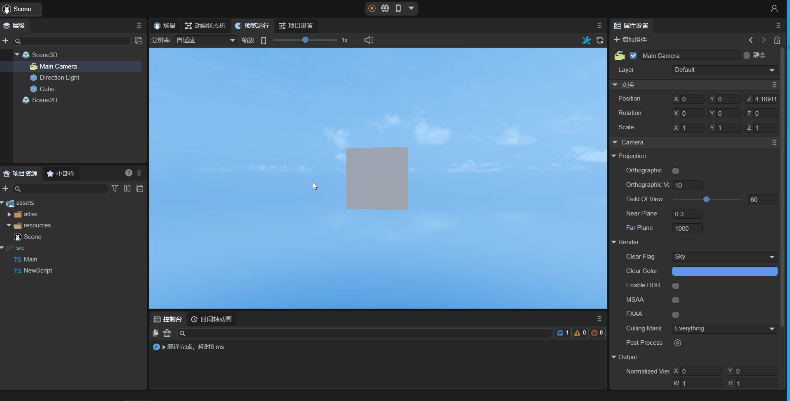

# 实体组件系统（ECS）

> Author：Charley 、谷主、孟星煜

## 1、基础概念

### 1.1 什么是ECS

ECS是Entity-Component-System（实体-组件-系统）的简写，这是一种基于数据驱动的游戏设计模式。

### 1.2 LayaAir的实体

在标准ECS理论中，实体被定义为唯一的**标识符（ID）**，其核心作用仅是通过ID关联组件，不包含任何数据或对象属性。这种设计旨在实现**彻底的数据与逻辑解耦**。

在LayaAir引擎中，基础的游戏对象是节点（Node），开发者的组件脚本都是基于节点对象或继承于节点的对象添加的。

所以，LayaAir的实体是指场景中的节点对象，每一个实体都可以为其添加一个或多个不同的组件脚本。

### 1.3 LayaAir的组件与系统

在ECS架构中，组件与系统各司其职：组件负责存储数据，不包含任何业务逻辑；系统则是纯粹的逻辑处理单元，根据组件提供的数据驱动实体行为。

在LayaAir引擎中，组件和系统的职责融合在**组件脚本**（即继承自 `Laya.Script` 的类）中体现：

**组件部分**：通过类中的属性字段或访问器承担组件的数据职责，通常使用 `@property()` 装饰器标记这些字段，将其暴露到IDE属性面板，方便开发者进行可视化配置和数据传递。

> 装饰器相关内容在后面的小节中会详细介绍

**系统部分**：通过引擎提供的生命周期方法（如 `onEnable`、`onStart`等）或事件方法（如`onMouseClick`、`onKeyDown`等）承担系统的逻辑职责，这些方法构成了系统逻辑的执行入口，用于根据组件数据实现具体的行为控制。

这种设计方式将组件与系统职责集中在一个脚本中，既简化了使用流程，也便于逻辑复用和模块解耦，是LayaAir对ECS模式的工程化实现。

这类同时承担数据与逻辑的脚本，我们通常称为**组件脚本**。

### 1.4 什么是生命周期方法

在 LayaAir 引擎中，生命周期方法是指在游戏对象（如场景、角色、UI 元素等）从创建到销毁的整个过程中，引擎会在特定的阶段自动调用的一系列方法。这些方法允许开发者在不同的阶段执行特定的代码逻辑，以实现对游戏对象的初始化、更新、渲染以及销毁等操作的控制。

例如，`onEnable`方法是在组件被启用时调用，比如节点被添加到舞台后，可在此方法中进行一些初始化的操作，如获取组件引用、设置初始状态等。`onDestroy`方法在游戏对象被销毁时调用，可在此方法中释放游戏对象所占用的资源，如内存、纹理等，以避免内存泄漏和资源浪费。通过合理利用这些生命周期方法，开发者能够更好地管理游戏对象的状态和行为，提高游戏的性能和稳定性。

### 1.5 什么是事件方法

在 LayaAir 引擎中，事件方法是用于响应各种事件的脚本方法。这些事件可以是用户操作（如鼠标点击、键盘输入）、物理状态变化（如：碰撞开始、碰撞进行，碰撞结束）等。通过注册事件方法，开发者可以让游戏在特定事件发生时执行相应的逻辑。

## 2、组件脚本的内置方法

在 LayaAir 引擎开发中，当组件脚本类继承自 `Laya.Script` 后，即可使用引擎提供的一系列生命周期方法（如 `onAwake`、`onEnable`、`onUpdate` 等）和事件响应方法（如 `onMouseDown`、`onMouseClick` 等）。这些内置方法作为组件脚本的逻辑执行入口，对应于 ECS 架构中系统的逻辑处理部分。

全部内置方法的构成如图2-1所示：


（图2-1）组件脚本的生命周期方法


### 2.1 组件的生命周期方法

生命周期方法是指在物体的创建、销毁、激活、禁用等过程中，会自动调用的方法。当使用自定义的组件脚本时，可以实现如下生命周期方法，方便快速开发业务逻辑。可以在每个方法中打印一条日志，方便开发者进行测试。

| 名称         | 条件                                                         |
| ------------ | ------------------------------------------------------------ |
| onAdded      | 被添加到节点后调用，和Awake不同的是即使节点未激活onAdded也会调用 |
| onReset      | 重置组件参数到默认值，如果实现了这个函数，则组件会被重置并且自动回收到对象池，方便下次复用。如果没有重置，则不进行回收复用 |
| onAwake      | 组件被激活后执行，此时所有节点和组件均已创建完毕，此方法只执行一次 |
| onEnable     | 组件被启用后执行，比如节点被添加到舞台后                     |
| onStart      | 第一次执行onUpdate之前执行，只会执行一次                     |
| onUpdate     | 每帧更新时执行，尽量不要在这里写大循环逻辑或者使用getComponent方法 |
| onLateUpdate | 每帧更新时执行，在onUpdate之后执行，尽量不要在这里写大循环逻辑或者使用getComponent方法 |
| onPreRender  | 渲染之前执行                                                 |
| onPostRender | 渲染之后执行                                                 |
| onDisable    | 组件被禁用时执行，比如从节点从舞台移除后                     |
| onDestroy    | 手动调用节点销毁时执行                                       |

在代码中的使用如下：

```typescript
	//被添加到节点后调用，和Awake不同的是即使节点未激活onAdded也会调用
    onAdded(): void {
        console.log("Game onAdded");
    }

    //重置组件参数到默认值，如果实现了这个函数，则组件会被重置并且自动回收到对象池，方便下次复用。如果没有重置，则不进行回收复用
    onReset(): void {
        console.log("Game onReset");
    }

    //组件被激活后执行，此时所有节点和组件均已创建完毕，此方法只执行一次
    onAwake(): void {
        console.log("Game onAwake");
    }

    //组件被启用后执行，比如节点被添加到舞台后
    onEnable(): void {
        console.log("Game onEnable");
    }

    //第一次执行update之前执行，只会执行一次
    onStart(): void {
        console.log("Game onStart");
    }

    //每帧更新时执行，尽量不要在这里写大循环逻辑或者使用getComponent方法
    onUpdate(): void {
        console.log("Game onUpdate");
    }

    //每帧更新时执行，在update之后执行，尽量不要在这里写大循环逻辑或者使用getComponent方法
    onLateUpdate(): void {
        console.log("Game onLateUpdate");
    }

    //渲染之前执行
    onPreRender(): void {
        console.log("Game onPreRender");
    }

    //渲染之后执行
    onPostRender(): void {
        console.log("Game onPostRender");
    }

    //组件被禁用时执行，比如从节点从舞台移除后
    onDisable(): void {
        console.log("Game onDisable");
    }

    //手动调用节点销毁时执行
    onDestroy(): void {
        console.log("Game onDestroy");
    }
```

下面以“2D入门示例”中的一个子弹脚本`Bullet.ts`为例，讲解生命周期方法，以下是此脚本文件的代码：

```typescript
const { regClass, property } = Laya;
/**
 * 子弹脚本，实现子弹飞行逻辑及对象池回收机制
 */
 @regClass()
export default class Bullet extends Laya.Script {
    constructor() { super(); }

    onEnable(): void {
        //设置初始速度
        let rig: Laya.RigidBody = this.owner.getComponent(Laya.RigidBody);
        rig.setVelocity({ x: 0, y: -10 });
    }

    onTriggerEnter(other: any, self: any, contact: any): void {
        //如果被碰到，则移除子弹
        this.owner.removeSelf();
    }

    onUpdate(): void {
        //如果子弹超出屏幕，则移除子弹
        if ((this.owner as Laya.Sprite).y < -10) {
            this.owner.removeSelf();
        }
    }

    onDisable(): void {
        //子弹被移除时，回收子弹到对象池，方便下次复用，减少对象创建开销
        Laya.Pool.recover("bullet", this.owner);
    }
}
```

在游戏中，将子弹添加到舞台上时，每次添加到舞台都得有初速度，但如果将onEnable()换成onAwake()，那么这个初速度就会失效。onUpdate()是每帧执行一次，子弹超出屏幕，则移除子弹，此处的 if 条件判断是每一帧都会判断一次。onDisable()是节点从舞台移除后触发，当子弹超出屏幕被移除时，就触发这个方法，这里是回收子弹到对象池了。

### 2.2 组件的事件方法

事件方法是指在某些特定的情况下，会根据条件自动触发的方法。当使用自定义的组件脚本时，可以通过事件方法方便快速开发业务逻辑。

#### 2.2.1 物理事件

使用物理引擎时，我们有时候需要根据物理的碰撞事件在代码中实现逻辑交互。为此，LayaAir引擎在物理碰撞的首次发生时、持续碰撞时以及退出碰撞时，均会触发这些特定的物理事件方法。这些方法在引擎中默认不包含具体实现，可以视为待开发者重写的方法。开发者只需继承`Laya.Script`类，并在其中重写这些方法，就可以实现自定义的逻辑响应，替代默认的空W实现。

这样，通过重写这些特定方法，开发者可以根据物理碰撞的具体阶段执行相应的游戏逻辑或者交互效果，从而使得游戏或应用能够在遇到物理碰撞时，有更自然、更真实的响应。下面表格罗列了全部的物理事件方法：

| 名称             | 条件                                                         |
| ---------------- | ------------------------------------------------------------ |
| onTriggerEnter   | 3D物理触发器事件与2D物理碰撞事件，开始碰撞时执行，仅执行一次 |
| onTriggerStay    | 3D物理触发器事件与2D物理碰撞事件(不支持传感器)，持续碰撞时执行，每帧都执行 |
| onTriggerExit    | 3D物理触发器事件与2D物理碰撞事件，结束碰撞时执行，仅执行一次 |
| onCollisionEnter | 3D物理碰撞器事件（不适用2D），开始碰撞时执行，仅执行一次     |
| onCollisionStay  | 3D物理碰撞器事件（不适用2D），持续碰撞时执行，每帧都执行     |
| onCollisionExit  | 3D物理碰撞器事件（不适用2D），结束碰撞时执行，仅执行一次     |

通过以上表格可以看出，2D物理事件只有三个事件方法，而3D物理事件，则分为触发器事件和碰撞器事件两类，有六个事件方法。

碰撞器事件是指反生物理反馈的事件，触发器事件是只有物理事件的触发，但没有实际物理碰撞反馈的一种事件，这与2D碰撞体启用了传感器的效果是一样的，只不过2D物理无论是碰撞反馈事件还是启用了传感器的无反馈物体事件，都是只用onTrigger事件。

特别提醒的是，2D物理启用传感器之后，onTriggerStay事件是不被触发的，这一点需要新手开发者注意。

在脚本中的事件使用示例如下：

```typescript
class DemoScript extends Laya.Script {
    
    /**
     * 3D物理触发器事件与2D物理碰撞事件, 在每一次发生物理碰撞的开始时，引擎都会调用一次的事件方法。
     * @param other 碰撞目标对象的碰撞体以及所属节点对象等信息
     * @param self  自身的碰撞体以及所属节点对象等信息（该参数只有2D物理有，3D物理只有other）
     * @param contact  物理引擎携带的碰撞信息b2Contact，开发者可以通过查询b2Contact对象来获取两个刚体碰撞有关的详细信息。但是通常用不上，other和self中已存在常规需要的信用，足够用了。（该参数只有2D物理有，3D物理只有other）
     */
     onTriggerEnter(other: Laya.PhysicsComponent | Laya.ColliderBase, self?: Laya.ColliderBase, contact?: any): void {
        // 假如碰到了炸弹
        if (other.label == "bomb") {
            // 此处省略爆炸伤害的逻辑

            console.log("碰到炸弹：" + self.label + "受到伤害，生命值减少xx");

        } else if (other.label == "Medicine") {  // 假如碰到了药箱
            // 此处省略恢复生命值的逻辑

            console.log("碰到药箱：" + self.label + "接受治疗，生命值恢复xx");
            
        }
        console.log("onTriggerEnter:", other, self);
    }	

    /**
    * 3D物理触发器事件与2D物理碰撞事件(不支持传感器), 发生持续的物理碰撞时，也就是碰撞生命周期内的第二次碰撞到碰撞结束前，每帧都在触发调用的事件方法。
    * 尽量不要在该事件方法中执行复杂的逻辑和函数调用，尤其是运算等消耗性能的代码，否则会对性能有明显的影响。
    * @param other 碰撞目标对象的碰撞体以及所属节点对象等信息
    * @param self  自身的碰撞体以及所属节点对象等信息（该参数只有2D物理有，3D物理只有other）
    * @param contact  物理引擎携带的碰撞信息b2Contact，开发者可以通过查询b2Contact对象来获取两个刚体碰撞有关的详细信息。但是通常用不上，other和self中已存在常规需要的信用，足够用了（该参数只有2D物理有，3D物理只有other）
    */
    onTriggerStay(other: Laya.PhysicsComponent | Laya.ColliderBase, self?: Laya.ColliderBase, contact?: any): void {
        //持续碰撞时，打印日志，尽量不使用该事件方法，如果使用不当对性能的消耗会影响较大。
        console.log("onTriggerStay====", other, self);
    }

    /**
    * 在每一次的物理碰撞结束时，引擎都会调用一次的事件方法。
    * @param other 碰撞目标对象的碰撞体以及所属节点对象等信息
    * @param self  自身的碰撞体以及所属节点对象等信息（该参数只有2D物理有，3D物理只有other）
    * @param contact  物理引擎携带的碰撞信息b2Contact，开发者可以通过查询b2Contact对象来获取两个刚体碰撞有关的详细信息。但是通常用不上，other和self中已存在常规需要的信用，足够用了（该参数只有2D物理有，3D物理只有other）
    */
    onTriggerExit(other: Laya.PhysicsComponent | Laya.ColliderBase, self?: Laya.ColliderBase, contact?: any): void {   
        //模拟角色离开毒气区域，触发逃脱奖励
        if (other.label == "poison") {
            // 此处省略逃脱奖励的逻辑

            console.log("离开毒气区域：" + self.label + "获得逃脱奖励，生命值+10");
        }

        console.log("onTriggerExit========", other, self);
    }

    /**
     * 3D物理碰撞器事件（不适用2D），在每一次发生物理碰撞的开始时，引擎都会调用一次的事件方法。
     * @param other 碰撞目标对象
     */
    onCollisionEnter(other:Laya.Collision): void {
        //碰撞开始后，物体改变颜色
        (this.owner.getComponent(Laya.MeshRenderer).material as Laya.BlinnPhongMaterial).albedoColor = new Laya.Color(0.0, 1.0, 0.0, 1.0);//绿色
    }

    /**
    * 发生持续物理碰撞时的3D物理碰撞器事件（不适用2D），也就是碰撞生命周期内的第二次碰撞到碰撞结束前，每帧都在触发调用的事件方法。
    * 尽量不要在该事件方法中执行复杂的逻辑和函数调用，尤其是运算等消耗性能的代码，否则会对性能有明显的影响。
    * @param other 碰撞目标对象
    */
    onCollisionStay(other:Laya.Collision): void {
    	//持续碰撞时，打印日志，尽量不使用该事件方法，如果使用不当对性能的消耗会影响较大。
        console.log("peng");
    }

   /**
    * 3D物理碰撞器事件（不适用2D），在每一次的物理碰撞结束时，引擎都会调用一次的事件方法。
    * @param other 碰撞目标对象
    */
    onCollisionExit(other:Laya.Collision): void {
        ////碰撞离开后，物体变回原本颜色
		(this.owner.getComponent(Laya.MeshRenderer).material as Laya.BlinnPhongMaterial).albedoColor = new Laya.Color(1.0, 1.0, 1.0, 1.0);//白色
    }
}
```

基于上面的代码示例，为3D模型添加脚本。如动图2-2所示。


（动图2-2）

#### 2.2.2 鼠标事件

| 名称               | 条件                                               |
| ------------------ | -------------------------------------------------- |
| onMouseDown        | 鼠标按下时执行                                     |
| onMouseUp          | 鼠标抬起时执行                                     |
| onRightMouseDown   | 鼠标右键或中键按下时执行                           |
| onRightMouseUp     | 鼠标右键或中键抬起时执行                           |
| onMouseMove        | 鼠标在节点上移动时执行                             |
| onMouseOver        | 鼠标进入节点时执行                                 |
| onMouseOut         | 鼠标离开节点时执行                                 |
| onMouseDrag        | 鼠标按住一个物体后，拖拽时执行                     |
| onMouseDragEnd     | 鼠标按住一个物体，拖拽一定距离，释放鼠标按键后执行 |
| onMouseClick       | 鼠标点击时执行                                     |
| onMouseDoubleClick | 鼠标双击时执行                                     |
| onMouseRightClick  | 鼠标右键点击时执行                                 |

在代码中的使用如下：

```typescript
	//鼠标按下时执行
    onMouseDown(evt: Laya.Event): void {
    }

    //鼠标抬起时执行
    onMouseUp(evt: Laya.Event): void {
    }

    //鼠标右键或中键按下时执行
    onRightMouseDown(evt: Laya.Event): void {
    }

    //鼠标右键或中键抬起时执行
    onRightMouseUp(evt: Laya.Event): void {
    }

    //鼠标在节点上移动时执行
    onMouseMove(evt: Laya.Event): void {
    }

    //鼠标进入节点时执行
    onMouseOver(evt: Laya.Event): void {
    }

    //鼠标离开节点时执行
    onMouseOut(evt: Laya.Event): void {
    }

    //鼠标按住一个物体后，拖拽时执行
    onMouseDrag(evt: Laya.Event): void {
    }

    //鼠标按住一个物体，拖拽一定距离，释放鼠标按键后执行
    onMouseDragEnd(evt: Laya.Event): void {
    }

    //鼠标点击时执行
    onMouseClick(evt: Laya.Event): void {
    }

    //鼠标双击时执行
    onMouseDoubleClick(evt: Laya.Event): void {
    }

    //鼠标右键点击时执行
    onMouseRightClick(evt: Laya.Event): void {
    }
```

下面以onMouseDown和onMouseUp为例，在自定义的组件脚本“Script.ts”中加入以下代码：

```typescript
const { regClass, property } = Laya;

@regClass()
export class Script extends Laya.Script {
    /**
     * 鼠标按下时执行
     */
	onMouseDown(evt: Laya.Event): void {
        console.log("onMouseDown");
    }
    /**
     * 鼠标抬起时执行
     */
    onMouseUp(evt: Laya.Event): void {
        console.log("onMouseUp");
    }
}
```

如图2-3所示，将组件脚本添加到Scene2D的属性面板后，先不勾选 Mouse Through，因为如果勾选它，Scene2D下鼠标事件将不会响应。如果是一个3D场景，它会传递到Scene3D中。


（图2-3）

运行项目，如动图2-4所示，当鼠标按下时执行onMouseDown，打印“onMouseDown”；松开鼠标，鼠标弹起时执行onMouseUp，打印“onMouseUp”。


（动图2-4）


#### 2.2.3 键盘事件

| 名称       | 条件                   |
| ---------- | ---------------------- |
| onKeyDown  | 键盘按下时执行         |
| onKeyPress | 键盘产生一个字符时执行 |
| onKeyUp    | 键盘抬起时执行         |

在代码中的使用如下：

```typescript
	//键盘按下时执行
     onKeyDown(evt: Laya.Event): void {
    }

    //键盘产生一个字符时执行
    onKeyPress(evt: Laya.Event): void {
    }

    //键盘抬起时执行
    onKeyUp(evt: Laya.Event): void {
    }
```

> 注意：onKeyPress是产生一个字符时执行，例如字母“a”、“b”，“c”等。像上、下、左、右键，F1、 F2等不是字符输入的按键，就不会执行此方法。


## 3、组件在IDE的暴露方式

在 LayaAir 引擎采用的 ECS（实体 - 组件 - 系统）架构中，**组件是承载数据的核心单元。每个组件专注于存储实体某一方面的属性和状态**，例如角色的位置、速度、生命值等。这些数据为系统提供了处理逻辑的基础，系统会基于组件的数据来执行相应的业务逻辑。

而装饰器在 LayaAir-IDE 中的核心作用，就是帮助 IDE 识别开发者自定义的组件。**通过装饰器标识，开发者可以将组件内部需要配置的数据，方便快捷地暴露到 IDE 的属性面板上。**这样一来，开发者无需编写额外的配置代码，就能在可视化界面中直接调整组件参数，实现高效的数据传递与组件配置，大大提升了开发效率和操作便捷性。

关于装饰器的全部说明，请跳转到《[组件装饰器说明](../../../IDE/customComponent/decorators/readme.md)》 


## 四、代码中使用属性

前文已经介绍了组件组件的添加与识别。相信有一定基础的开发者已经可以直接使用LayaAir的实体组件系统了。

但针对一些新手开发者朋友，本小节通过几种常用类型的属性使用示例，进一步帮助大家理解组件化开发的基础。

### 4.1 节点类型方式

LayaAir分为2D节点与3D节点类型，当设置为2D节点Laya.Sprite时，不能将3D节点作为其属性值。当设置为3D节点Laya.Sprite3D时，不能将2D节点作为其属性值。

#### 4.1.1 2D节点的使用

首先，如动图4-1所示，将场景中已经添加好的2D节点Sprite拖入到@property暴露的属性入口中，这样就获取到了此节点。


（动图4-1）

然后就可以在脚本中使用代码改变节点的属性了，例如，给Sprite添加纹理等，示例代码如下所示：

```typescript
const { regClass, property } = Laya;

@regClass()
export class NewScript extends Laya.Script {

    @property({ type : Laya.Sprite})
    public spr: Laya.Sprite;
    
    onAwake(): void {
        this.spr.size(512, 313); //设置Sprite大小
        this.spr.loadImage("atlas/comp/image.png"); //添加纹理
    }

}
```

效果如图4-2所示：


（图4-2）


#### 4.1.2 3D节点的基础使用

首先，如动图4-3所示，将场景中已经添加好的3D节点Cube拖入到@property暴露的属性入口中，这样就获取到了此节点。


（动图4-3）

然后就可以在脚本中使用代码改变节点的属性了，例如，可以让Cube绕自身旋转，示例代码如下所示：

```typescript
const { regClass, property } = Laya;

@regClass()
export class NewScript extends Laya.Script {

    @property({ type : Laya.Sprite3D})
    public cube: Laya.Sprite3D;

    private rotation: Laya.Vector3 = new Laya.Vector3(0, 0.01, 0);

    onStart() {
        Laya.timer.frameLoop(1, this, ()=> {
            this.cube.transform.rotate(this.rotation, false);
        });
    }
}
```

效果如动图4-4所示：



（动图4-4）


#### 4.1.3 3D节点的进阶使用

```typescript
    @property( { type :Laya.Sprite3D } ) //节点类型
    public p3d: Laya.Sprite3D;

    onAwake(): void {

        this.p3d.transform.localPosition = new Laya.Vector3(0,5,5);
        let p3dRenderer = this.p3d.getComponent(Laya.ShurikenParticleRenderer);
        p3dRenderer.particleSystem.simulationSpeed = 10;
    }
```

通过暴露@property( { type :Laya.Sprite3D } )节点类型属性，来拖入particle节点，可以获得particle节点对象。transform可以直接修改，而simulationSpeed属性则通过getComponent(Laya.ShurikenParticleRenderer).particleSystem的方式获取。


### 4.2 组件类型的使用

```typescript
    @property( { type : Laya.ShurikenParticleRenderer } ) //组件类型
    public p3dRenderer: Laya.ShurikenParticleRenderer;

    onAwake(): void {

        (this.p3dRenderer.owner as Laya.Sprite3D).transform.localPosition = new Laya.Vector3(0,5,5);
        this.p3dRenderer.particleSystem.simulationSpeed = 10;
    }
```

通过暴露@property( { type : Laya.ShurikenParticleRenderer } )组件类型属性，来拖入particle节点，可以获得particle的ShurikenParticleRenderer组件。transform可以通过(this.p3dRenderer.owner as Laya.Sprite3D)修改，而simulationSpeed属性则通过this.p3dRenderer.particleSystem的方式获取。

> 不能通过直接使用Laya.ShuriKenParticle3D作为属性类型，因为IDE无法识别，只有节点和组件类型可以识别。
>
> 就算将type类型设置为Laya.Sprite3D，这样IDE虽然标识了属性是Sprite3D节点，但也无法转换为Laya.ShuriKenParticle3D对象。


### 4.3 Prefab类型属性

当使用Laya.Prefab作为属性时，例如：

```typescript
@property( { type : Laya.Prefab } ) //加载 Prefab 的对象
private prefabFromResource: Laya.Prefab;    
```

此时，需要按动图4-5所示，从assets目录下，拖入prefab资源。运行时会直接获取到加载实例化后的prefab。


（动图4-5）


