## LayaAir屏幕适配详解

> Author: Charley  

屏幕适配是涉及的知识点较多，很多开发者都无法真正理解。

本篇从基础概念入手，详细介绍LayaAir引擎的各个屏幕适配缩放模式。

## 1、基础概念

**以下基础概念非常重要，会影响到后面引擎适配原理的理解，请大家认真阅读。**

### 1.1 物理分辨率

物理分辨率简单理解就是硬件所支持的分辨率，以像素（px）为单位，所以我们称这个硬件上的每一个像素点为物理像素，也叫设备像素。将屏幕实际存在的像素以`行数 × 列数`这样的数学表达方式体现出来，就是物理分辨率。

而LayaAir引擎运行于浏览器或其它运行器环境上，进行屏幕适配时，物理分辨率实际上是指浏览器或运行环境上的屏幕分辨率。以`屏幕宽的像素数量 × 屏幕高的像素数量`这样来体现。因此，横屏与竖屏得到的物理分辨率宽高，会有所差别。

例如：iPhone8 在默认的竖屏状态下，物理分辨率宽高表达为`750 × 1334`。横屏状态下，物理分辨率宽高表达为`1334 × 750` 。

### 1.2 缩放因子与逻辑分辨率

#### 1.2.1 缩放因子 起源

iOS绘制图形是以 point （pt）为单位，在早期的时候`1 point=1 pixel`。在2010年推出的iPhone4 开始采用 Retina(视网膜) 屏幕显示技术 ，物理分辨率提升了4倍，此时，如果iPhone4 还是`1pt=1px`这个方案，将会导致如图1-1的显示效果。

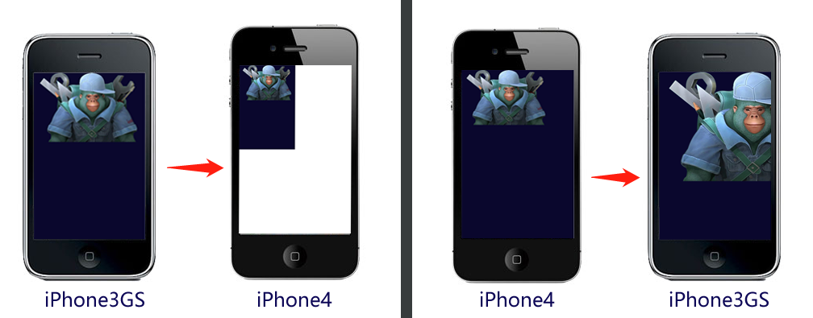 （图1-1）

在图1-1中，按 iPhone3GS的`320 × 480`进行全屏设计，那在iPhone4下的显示效果则如图1左侧，原来的满屏内容只占了四分之一，其余部分留空。而按iPhone4分辨率 `640 × 960`进行全屏设计，那在iPhone3GS的屏幕下显示效果则如图1右侧，大量内容超出可显示区。

很显然，apple不会让图1的事情发生。实际上，iPhone4的缩放因子为[@2X](https://github.com/2X)，也就是在这个机型上1个point 用`2×2`的像素矩阵来表示，如图2中效果所示，完美解决图1-2中可能发生的问题。

 

（图1-2）

随着时代的发展，后续的机型物理分辨率也越来越高，1个point占用的物理像素也越来越多，如图1-3。

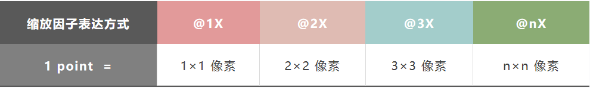 

（图1-3）

> 缩放因子的概念在安卓机型中也适用

#### 1.2.2 逻辑分辨率

逻辑分辨率简单理解就是软件所使用的分辨率，我们设计适配全靠他，也是用乘法数学表达方式来体现。为了更好的理解这个概念，我们先看一组数据表格。如图图1-4。

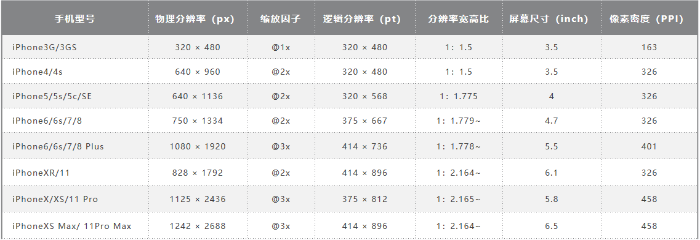 

（图1-3）

通过图4的数据，我们可以看出，随着手机设备的更新，物理分辨率已经越来越高，如果我们按物理分辨率来进行屏幕适配，先不算安卓，光iPhone的机型就很碎片化了，还好，在缩放因子的作用下，我们看到逻辑分辨率基本上变化不大，所以我们后面讲的引擎适配，主要是针对逻辑分辨率进行适配。

### 1.3 设备像素比

我们基于浏览器开发时，之前介绍的缩放因子概念对应的是**DPR** (Device Pixel Ratio)，中文叫设备像素比 。LayaAir引擎中通过 `Laya.Browser.pixelRatio` 可以获得浏览器的DPR值。

这里稍展开讲几句，在浏览器里，默认是由用户来控制缩放的，例如，我们在手机浏览器双指扩张，发现网页会放大，但清晰度并不减小。这就是用户自主缩放导致，并非是由DPR值来决定缩放。如果我们想和APP开发那样，通过逻辑分辨率来适配，让浏览器依据设备的DPR来决定一个CSS像素占用几个物理像素。那需要在入口HTML页面的的meta标签中用 viewport进行了相关的配置。代码如下：

```
 <meta name='viewport' content='width=device-width,initial-scale=1.0,minimum-scale=1.0,maximum-scale=1.0,user-scalable=no'/>
```

> 以上代码LayaAir引擎中默认添加，并强制添加不得删除。

通过上面这段viewport的配置，那页面在禁止用户手动缩放的同时，也会按设备的DPR进行自动缩放。

### 1.4 逻辑宽高

逻辑宽高是指逻辑分辨率的宽高。浏览器里，可以缩放的逻辑分辨率像素是CSS像素，在设置了viewport的情况下，浏览器会根据DPR的值决定一个CSS占用多少个像素，例如DPR为3时，1个CSS像素就占用`3×3`个物理像素。

LayaAir引擎里可以通过`Laya.Browser.clientWidth`获取逻辑分辨率的宽，通过`Laya.Browser.clientHeight`获取逻辑分辨率的高。

在手机等移动设备的竖屏状态下，窄面为宽，长面为高。如果发生了屏幕翻转的横屏状态，则长的一面为宽，窄面为高。

在PC浏览器中，则是获取的浏览器窗口可视宽高。

### 1.5 物理宽高（屏幕宽高）

物理宽高对应的是之前介绍的物理分辨率概念，也称为屏幕宽高。开发者可以通过引擎封装的接口获得宽高值，通过`Laya.Browser.width`可以得到屏幕宽上有多少像素，通过`Laya.Browser.height`可以得到屏幕高上有多少像素。

> 只有在全屏的时候屏幕宽高是硬件屏幕宽高，开发者需要理解的是，屏幕宽高实际是指运行环境窗口宽高，例如在浏览器上运行就是浏览器显示窗口的宽高。

LayaAir引擎中的物理宽高是通过`逻辑宽高*DPR`计算而来。

引擎中的相关代码如下：

```typescript
    /**
     * @en The physical width of the browser window, taking into account the device pixel ratio.
     * @zh 浏览器窗口的物理宽度，考虑了设备像素比。
     */
    static get width(): number {
        Browser.__init__();
        return ((ILaya.stage && ILaya.stage.canvasRotation) ? Browser.clientHeight : Browser.clientWidth) * Browser.pixelRatio;
    }

    /**
     * @en The physical height of the browser window, taking into account the device pixel ratio.
     * @zh 浏览器窗口的物理高度，考虑了设备像素比。
     */
    static get height(): number {
        Browser.__init__();
        return ((ILaya.stage && ILaya.stage.canvasRotation) ? Browser.clientWidth : Browser.clientHeight) * Browser.pixelRatio;
    }
```


### 1.6 设计宽高

设计宽高是开发者在设计产品时采用的宽高，面对众多机型，如图1-5，选择哪个作为设计宽高，也是一些新手开发者有点迷茫的，这里简单多说几句。

 

（图1-5）

设计宽高，首先要考虑的是优先兼容多数的常用屏幕比例。通过上面图5的表格，我们看到去掉过时的机型，基本上手机屏幕就分两类，一类是宽高比约为`1:1.78`的非全面屏手机，另一类是宽高比约为`1:2.17`全面屏手机。各品牌的安卓机型屏幕比例，大多也是这两种或者接近这两种。

基于性能优先的原则，通常开发者都会选择分辨率小一些的作为主效果设计，然后向其它比例屏幕进行适配。比如：常见的`宽750高1334`或`宽720高1280`。

> 以上宽高描述是指竖屏模式设计，横屏需反过来。

打开LayaAir3-IDE 的**项目设置**`Project Settings`面板，可以直接设置设计宽高，效果如图1-6所示。

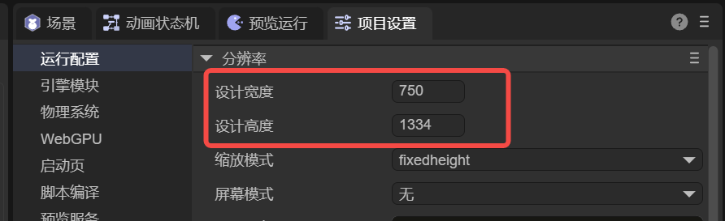 

（图1-6）

在引擎中，设计的宽高，位于Stage类中，可以通过`Laya.stage.designWidth`和`Laya.stage.designHeight`来设置。

示例代码如下：

```typescript
import { IndexRTBase } from "./IndexRT.generated";

const { regClass } = Laya;

@regClass()
export default class IndexRT extends IndexRTBase {

    onAwake(): void {        
        //设置舞台设计宽高
        Laya.stage.designWidth = 1080;
        Laya.stage.designHeight = 1920;
        //在引擎初始化之后改变舞台设置的话，必须要手动调用一次updateCanvasSize方法，否则不会生效
        Laya.stage.updateCanvasSize(); 
    }
}
```

### 1.7 画布宽高

众所周知，`<canvas>`是HTML5中的画布，其 `width、heigth` 属性就是画布宽高。

**画布的宽高，不是直接设置的，而是以设计宽高为基础，通过`适配模式`规则的计算以及是否`开启视网膜画布模式`而得到。**

画布宽高的值对画面最终的清晰度以及性能都会产生影响，甚至边缘锯齿或画面模糊也与此处画布宽高值有关。

画布宽高越大，显示效果越清晰，尤其是小字号的文本等。

然而，**画布宽高越大，也会带来更大的性能压力与内存压力**，开发者需要综合考虑取舍。

我们在IDE里任意运行一个页面， 在打开的chrome里用F12进入调试模式后，入口页面中找到id为 `layaCanvas`的canvas标签。记住这个位置，图1-7中红圈标记的，就是画布的初始宽高，后面理解屏幕适配模式的时候，大家可以多关注这里。

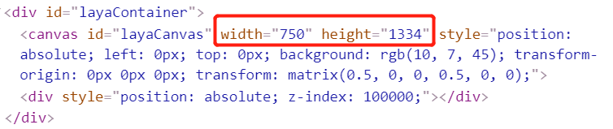 

（图1-7）

### 1.8 适配宽高

由于Canvas是基于位图像素绘图的，画布宽高对画面质量及性能有影响。为了性能与内存的优化，默认并不使用直接修改画布宽高的方案来适配。

而是通过LayaAir引擎的不同适配模式规则，计算出适配宽高需要缩放的比例，然后通过transform的matrix（矩阵）来对画布缩放至**逻辑宽高**的分辨率范围内，再通过DPR机制缩放还原。

基于以上种种，我们需要了解，**适配宽高才是LayaAir引擎适配规则处理后的最终效果宽高**，会直接影响通过DPR还原后的最终效果。

大家在理解各个适配模式的时候，可以在HTML入口页面中观察画布宽高与transform的matrix（矩阵）缩放效果来对比不同模式之间的差异。如图1-8中红圈标记所示，适配宽高分别为249.99975和444.666222。还原至物理分辨率大小后，虽然有精度上的细微损失，但已经很难看出。

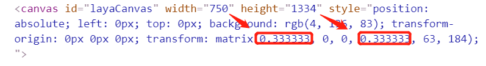 

（图1-8）

**需要注意的是，**

引擎提供了`Laya.stage.useRetinalCanvas`用于控制是否采用高清分辨率的画布。默认并不开启，一旦开启后，就会采用直接修改画布宽高的方式，让画布直接获得最大的高清画布分辨率。

### 1.9 舞台宽高

舞台宽高是指LayaAir引擎的stage宽高，是设计内容在**缩放**（通常是指缩放全屏或最大尺寸）**前**的真正适配（已考虑不同机型的DPR）宽高。

**默认情况下，stage宽高会等于画布的宽高。**

但是，如果开发者启用了`Laya.stage.useRetinalCanvas`，那画布就会采用 **缩放后** 的 高清分辨率。

而stage的宽高，还是开发者未启用`Laya.stage.useRetinalCanvas`时的画布缩放前宽高。

引擎的节点对象都是在stage上进行添加与控制的，在stage范围内，可以控制显示、进行事件监听，碰撞检测等，所以对stage宽高的适配还是非常重要的。

在DevTools控制台，我们可以通过引擎API(`Laya.stage.width`和`Laya.stage.height`)，查看舞台宽高。


## 2、LayaAir屏幕适配模式详解

为了让大家真正理解各适配模式的适配策略，以便更好的进行屏幕适配。本节将场景的设计宽高调整为`750×1334`的竖屏界面，分别就各个适配模式对比不同机型进行讲解。

在适配对比的机型选择方面，iPhone4的`640 × 960`代表老旧机型，宽高比为1.5，只是为了对比适配效果。iPhone8的`750 × 1334`是我们为设计宽高选定的机型，宽高比约为1.78，无论哪个模式都是完美的1：1适配。iPhone8 Plus代表着同样约为1.78宽高比，但物理分辨率和DPR都与iPhone8不同的同比例机型。iPhoneX代表着宽高比大于2的各种全面屏机型。

### 2.1 最容易理解的适配模式

#### 2.1.1 默认的不缩放模式noscale

noscale模式是引擎默认的模式。该模式下，在任何屏幕都会始终保持设计时的分辨率原样效果，相当于将不缩放的设计宽高画布直接贴在屏幕上。

当物理宽高低于设计宽高会显示不全，物理宽高超过设计宽高的会漏出屏幕背景色。

该模式在移动端通常不被使用，**无法做到各机型的全屏适配。**

即便是在PC网页中，也要考虑到设计分辨率，可能会在某些分辨率较低的老显示器上显示不全，在某些超高分辨率的显示器上只会显示为一小块的兼容问题是否被接受。**通常仅用于确定了屏幕大小的特定机型或者是固定大小的嵌入场景。**

高分辨率下的PC浏览器效果如图2-1中所示。

 

（图2-1）

#### 2.1.2 物理分辨率画布模式full

full模式和noscale模式一样，并没有对设计宽高做缩放处理。

但有一个根本的区别就是，full模式下，画布大小直接取值物理分辨率，物理宽高是多少，画布就有多大。

比如，同样是图2-2中的场景，宽高是1334和750。

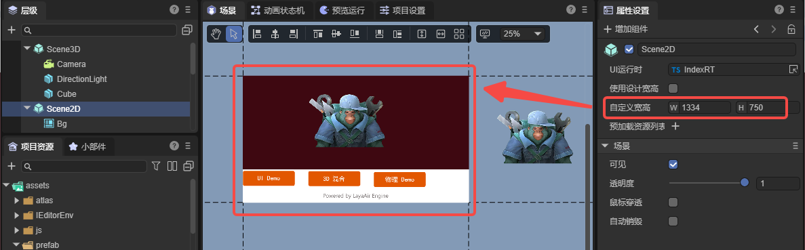 

（图2-2）

noscale与full模式的对比效果如图2-3所示，

 

（图2-3）

具体区别如下：

- **漏出背景色**：

  漏出的背景色是画布外的颜色，由于noscale模式的画布与设计宽高一样大，所以就漏出背景色（IDE里设置）。而full模式的画布是与屏幕（浏览器宽高）一样大，所以屏幕多大就有多大。不会漏出背景色。

- **设计内容居中的区别**：

  同样是设置了画布垂直方向顶部对齐和水平方向居中对齐，左侧的noscale模式，因为画布没有铺满全屏，所以按画布对齐模式进行了居中和顶部对齐。而右侧的full模式，画布已经铺满全屏，所以画布的居中和底色就看不出来了。

- **场景编辑时，设计宽高区域外的是否被显示**：

  由于noscale模式的画布与设计宽高一样大，所以只有设计宽高内的才会被显示。超过设计宽高的无法在画布上出现。而full模式下，只要屏幕大于设计宽高，就会显示设计宽高以外的内容。

另外，使用full模式时，最好是保持场景“使用设计宽高”处于勾选状态，设置如图2-4所示。

  

（图2-4）

勾选后，舞台是全屏的，更适合UI的动态布局，效果对比如图2-5所示

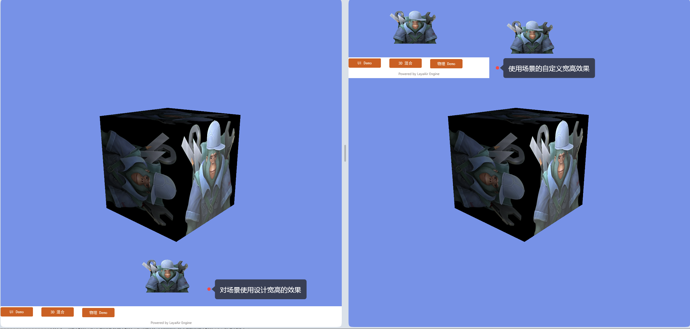 

（图2-5）

**需要注意的是，**

full模式， 由于没有按DPR进行缩放处理，在高倍DPR的屏幕下，会显的设计内容较小。所以这种模式只适用于3D游戏，2D部分仅用于UI，并且还要考虑按钮大小在不同设备的差异，或自定根据像素比缩放处理。

### 2.2 移动端适配模式

在移动端，我们通常会需要保持设计宽高等比缩放的全屏适配方案。而以下几种模式正是我们推荐开发者优先采用的适配模式。

> 如果是3D游戏，或者是对小字号文本的清晰度要求较高，建议开启视网膜画布（useRetinalCanvas）模式。

#### 2.2.1 保宽适配模式fixedwidth

fixedwidth保宽模式就是在保障设计宽的内容一定全屏显示的等比缩放模式。这种模式推荐应用于竖屏游戏。

在这个模式下，画布宽和舞台宽会等于设计宽。但**画布高和舞台高**会按物理宽与设计宽的比例**进行缩放后改变**，不采用我们配置的设计高。所以，当改变后的画布和舞台高大于原来的设计高，底部就会露出舞台背景色（Laya.stage.bgColor）。如果改变后的画布和舞台高小于原来的设计高，那就会被裁剪掉多出的部分。

fixedwidth模式，不同机型对比效果，如图2-6所示。

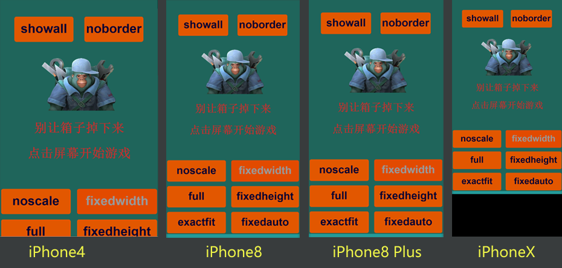 

（图2-6）

看到图2-6的黑色背景色，或许有开发者看到这里会想，我需要的是全屏适配，这个不适合。其实不用担心，这是为了让大家理解fixedwidth的适配规则，故意没有处理，露出了舞台背景色。

在这个模式下，舞台的宽高已经被缩放拉满全屏，所以。开发者完全可以通过相对布局属性（top和bottom），把背景拉到全屏以及按钮拉到屏幕相对位置显示。实现各个屏幕下都做到完美的全屏适配。

#### 3.2.2 保高适配模式fixedheight

fixedheight保高模式就是在保障设计高的内容一定全屏显示的等比缩放模式。这种模式推荐应用于横屏游戏。

在这个模式下，画布高和舞台高会等于设计高。但**画布宽和舞台宽**会按物理高与设计高的比例**进行缩放后改变**，不采用我们配置的设计宽。所以，当改变后的画布和舞台宽小于原来的设计宽，那就会被裁剪掉多出的部分，如图2-7所示。

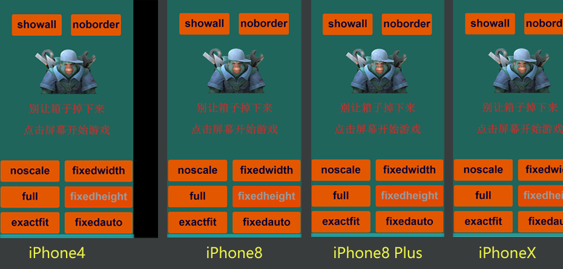 

(图2-7)

如果改变后的画布和舞台宽大于原来的设计宽，底部就会露出舞台背景色（Laya.stage.bgColor），如图2-8所示。

 

(图2-8)

图2-7和图2-8仍然是故意没有处理。通过相对布局属性（left和right），把背景拉到全屏以及按钮拉到屏幕相对位置显示。实现各个屏幕下都做到完美的全屏适配。

#### 3.2.3 自动保宽高模式fixedauto

fixedauto自动保宽高模式就是在保障**设计宽高的内容**，**在任意机型的分辨率下**一定**全部显示，而不被裁切**。但有可能会**露出舞台背景色**（Laya.stage.bgColor），如图2-9所示。 **需要通过结合相对布局属性**，进行全屏适配，解决露出舞台背景色的问题。

 

（图2-9）

这种模式，其实最终采用的是fixedwidth或者fixedheight，是通过物理宽高比和设计宽高比进行对比判断。物理宽高比小于设计宽高比的采用fixedwidth模式，否则就采用fixedheight。

### 2.3 PC适配模式showall

showall模式的适配结果与fixedauto非常像，也是保障设计宽高一定会在屏幕内全部显示，但区别和问题是，showall模式的画布和舞台并未做到所有分辨率下的全屏适配，而是取（物理宽/设计宽）与（物理高/设计高）的最小比值，进行等比缩放。因此，在与设计宽高比例不同的设备上，就会存在露出浏览器底色的问题。

这种适配模式的好处是，不需要用相对布局二次适配了，设计效果什么样就一定是什么样，肯定是全部显示，不变形，不被裁切。

对于PC设备来说，不同显示器的硬件差异极大，通常不需要保障所有设备的全屏需求。

所以，**showall这个适配模式，通常仅用于PC网页**，几乎不会用于手机等移动端设备。

showall模式不同屏幕对比效果，如图2-10所示。

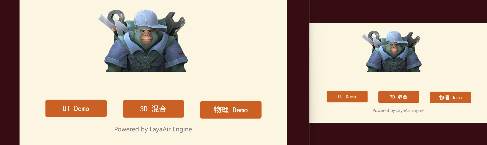 

（图2-10）

在PC浏览器里，尤其是竖屏游戏，如图2-11，推荐首选showall模式。

 

(图2-11)

### 2.4 其它适配相关学习

除了适配模式外，还有一些其它适配相关的内容，例如横竖屏适配、画布对齐等。

可以前往IDE的基础文档查看《[项目设置详解](../../IDE/projectSettings/readme.md)》。
