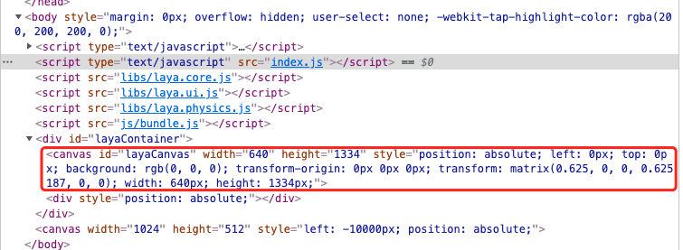

# 2D基础概念

> Author : Charley

本篇介绍除3D基础概念之外的一些引擎基础概念。

## 一、通用的基础概念

### 1.1 画布

画布是浏览器提供的 `canvas` 元素，如图1-1所示：

 

（图1-1）

LayaAir 引擎的所有可见画面，都是逐帧绘制在画布上的。引擎通过每秒绘制多帧图像，实现连续播放的动画效果，这也是游戏运行是否流畅的重要性能指标之一。

画布就像画家的画纸，是每一帧图像的承载容器。没有画布，引擎便无法进行可视化渲染。

> 帧数越高画面越流畅，通常是60帧是满帧，但设备的不同会有所差异，例如有的机型上可以达到90帧满帧或者120帧满帧。

LayaAir 引擎中的画布大小，取决于项目中设定的设计宽高和屏幕适配策略。如图1-2所示：

  

(图1-2)

在不同的设备分辨率下，会导致画布大小可能有所变化。这些知识，在屏幕适配的文档会展开介绍。

### 1.2 舞台

舞台（Stage）是 LayaAir 引擎在画布（Canvas）上用于绘制游戏画面和处理交互事件的实际可视区域。

可以将画布比喻为一张画纸，而舞台就像画纸上的作画区域。画家是引擎，只能在舞台规定的范围内进行绘制和交互。无论画布尺寸多大，超出舞台区域的内容都不会显示。

例如：
设想你把一张纸铺满整个桌面（画布全屏），但如果只允许画家在纸的中间区域作画（舞台未全屏），那么最终呈现的画面仍受限于这个中心区域，其他部分将被裁剪或忽略。

因此，对于需要全屏适配的游戏，仅将画布设置为全屏还不够，还需将舞台尺寸同步扩展到与画布相同，确保画面内容完整显示。

> 舞台大小的设置依赖于项目的设计宽高和屏幕适配策略。建议结合《屏幕适配》文档一同阅读，以更深入理解舞台与适配机制之间的关系。
>

### 1.3 对象

对于有编程基础的读者而言，“对象”通常指的是类的实例，这是面向对象编程中的基本概念。

从更广义的角度来看，凡是具有属性结构，或可以动态设置属性的数据结构，也可以被称为“对象”。例如，JavaScript 中的 JSON 对象，或一个空对象字面量 `{}`，都属于广义上的对象范畴。

### 1.4 节点

在 LayaAir 引擎中，`Node`（节点）类是所有可加入显示列表对象的基类。2D 的基础精灵 `Sprite` 和 3D 的基础精灵 `Sprite3D` 都继承自 `Node`。不仅如此，所有继承自 `Node` 的子类或孙类对象，统称为“节点”，如：`Sprite` 节点、`Image` 节点等。

> 只有继承自 `Node` 的对象，才具备添加子节点的能力。

### 1.5 显示对象、容器对象

在节点体系中，具备可视内容（如图片、文字、动画、模型等）的节点被称为**显示对象**。而有些节点本身不参与渲染，仅用于组织和挂载子节点，这类节点被称为**容器对象**，例如：`Sprite`、`Sprite3D`、`Box` 等。

有时候，同一个节点对象，既可以作为显示对象，也可以作为容器对象。

例如`Sprite`，当设置了纹理资源时，它即为显示对象；若未设置纹理，仅用于管理子节点，则作为容器对象使用。

### 1.6 显示列表

**显示列表** 是一个抽象概念，可理解为基于舞台（Stage）构建的节点树结构。所有参与渲染或组织结构的节点（包括显示对象与容器对象）都位于显示列表中。显示列表负责统一管理引擎运行时显示的所有节点对象。

需要注意的是：`Sprite` 与 `Sprite3D` 分别作为 2D 和 3D 的基础显示对象，**它们所属的节点体系不能互相嵌套**。也就是说，`Sprite` 及其子节点不能作为 `Sprite3D` 的子节点，反之亦然。

### 1.7 图形API

图形 API（Graphics API）是开发者与底层图形硬件之间的桥梁，提供了一套编程接口，用于控制图形的绘制与渲染。通过图形 API，我们可以在程序中绘制图形元素、加载纹理、控制变换效果，最终由显卡将这些指令转换为可显示的画面。无论是 2D 还是 3D 图形的实现，图形 API 都是不可或缺的底层支持。

在 HTML5 环境中，当前主流的 3D 图形 API 是 WebGL，WebGL 的下一代替代者 WebGPU 也正在逐步被浏览器支持。LayaAir3引擎同时支持WebGL与WebGPU。

### 1.8 图像

图像是指一张可视化的二维图片数据，通常来自本地文件或网络资源。它可用于直接展示，也常作为素材参与图形绘制、纹理生成等后续处理。

常见的图像文件以 `.png`、`.jpg` 等格式结尾，是最常用的资源类型之一。与音频、视频、动画、图集等素材一样，图像属于游戏项目中的基本资源类型。

### 1.9 纹理

很多新手常常将**纹理**和**图像**混为一谈，实际上，它们是两个不同的概念。

**纹理**是图像在图形渲染系统中的一种表示形式，通常指将图像数据上传到 GPU 后形成的图形资源。纹理可用于图形管线中的贴图、采样、混合等操作。可以理解为：纹理是“能够被显卡识别并参与绘制”的图像版本，而图像只是纹理的来源之一。

例如，**压缩纹理**就与普通图像资源（如 PNG、JPG等）不同。虽然它同样以文件形式存储在磁盘中，但其数据格式已经符合 GPU 的纹理读取标准，加载时可以直接上传到 GPU 使用，无需经过解码。这类纹理资源具有更高的加载效率和更低的内存占用，常用于优化大规模图像资源的加载与渲染。

此外，**渲染纹理**（RenderTexture）是一种特殊的纹理，它不是从图像文件中生成的，而是**将渲染结果直接输出到一张纹理上**形成的。这类纹理的像素内容来自程序的绘制结果，而非磁盘资源。

渲染纹理常用于将某个 3D 节点、场景或摄像机的渲染输出“截取”为纹理，并用于后续显示。例如，可将3D场景画面渲染到一张纹理上，再将该纹理应用在 2D 节点中。

与普通纹理不同，RenderTexture 的内容是动态生成的，可以每帧刷新，也可以按需更新。它是实现屏幕缓存、离屏渲染（off-screen rendering）、后期处理等高级图形效果的重要工具，是 2D 与 3D 图形系统中不可或缺的核心纹理类型之一。

## 二、2D专属概念

### 2.1 UI

**UI** 是英文 `User Interface` 的缩写，中文意思是“用户界面”。在游戏和应用中，UI 指的是用户在屏幕上所能看到、点击、交互的一切界面元素，例如按钮、文本框、滑动条、进度条、菜单栏、信息面板等。

UI 本身不直接参与游戏的物理或逻辑行为，但它是用户与游戏系统之间进行交互的桥梁。玩家通过点击按钮、滑动摇杆、输入文字等方式与游戏互动，游戏也通过 UI 向用户展示状态信息，如角色血量、得分、任务提示、对话内容等。

在 LayaAir 引擎中，UI 系统提供了一套封装完善的 UI 组件库和配套功能，方便开发者构建常见的用户界面。但需要注意的是，UI 的概念并不限于 UI 组件系统本身——凡是用于与用户交互、信息展示的可视对象，都可以称为 UI。例如，使用 2D 基础对象（如 `Sprite`）制作的界面，同样属于 UI 范畴。

因此，广义的 UI 是一种界面交互的职能，而不是特定组件的专属称谓。UI 系统只是实现 UI 的一种工具或方式。

### 2.2 小部件

UI小部件是用户界面中组成元素的基本单元，通常指功能独立、可复用的界面组件，用于实现按钮、文本框、滑动条、复选框等交互控件。

简单来说，UI小部件就是构建界面的“积木块”，它们封装了显示和交互功能，方便开发者快速搭建和管理界面布局。

在 LayaAir3 引擎中，UI小部件主要分为两类：

- **2D基础对象**：属于引擎原生的2D节点系统，不依赖任何UI框架，通用于任意UI方案。
- **UI系统组件**：即UI框架所提供的可视化控件，依赖具体的UI系统。

如图2-1所示：

  

(图2-1)

了解更多，可查询相关的《UI小部件》文档。

### 2.3 UI运行时

**UI 运行时** 是 LayaAir 引擎在 UI 系统中提供的一种运行时绑定机制，用于简化复杂 2D 节点对象的代码管理逻辑。

基于UI运行时，开发者可以在编辑器中为界面上的任意节点命名并定义变量，运行时便可直接通过 `this.xx` 的形式访问这些节点，而无需手动逐层查找节点或通过 `getChildByName` 方式定位。这种机制极大地提升了 UI 结构的可维护性与脚本编写效率，特别适用于层级复杂的界面开发。

UI 运行时机制的底层实现是通过**自定义类继承 UI 组件类**的方式完成的。因此除了便捷地访问和控制 UI 节点之外，开发者还可以通过继承重写来自引擎 UI 组件的逻辑行为，例如修改UI数据源的结构等，实现更灵活的UI功能控制。

了解更多，可查询相关的《UI运行时》文档。

### 2.4  2D区域

LayaAir 引擎中的 **2D 区域（Area2D）** 是专为 2D 游戏中相机视野管理而设计的容器。每个 2D 区域仅允许存在一个 2D 主相机，用于控制区域内节点的视角、位置等变换。

在 2D 区域外的节点，则属于**静态 UI**，它们不受 2D 相机影响，始终保持在固定屏幕位置。运行时，静态 UI、2D 区域内容、3D 场景画面会一起叠加显示，**显示顺序为：2D 在上，3D 在下**。

对于同属 2D 系统的静态 UI 与 2D 区域，渲染顺序由节点树顺序决定：节点越靠后（在树结构中越靠下），显示时层级越高，越不容易被其他元素遮挡。

所有显示对象，包括2D基础对象和 UI 组件，只要被添加到 2D 区域中，就会受到 2D 相机的控制。当相机移动时，这些节点的显示位置也会发生变化。相比之下，**静态 UI（不在 2D 区域中的节点）**则完全不受相机影响，适合用于界面固定元素，例如：手势控制摇杆、技能按钮、功能导航栏等。

注意，固定的 UI 元素应避免放入 2D 区域中，否则会随着相机移动而偏离屏幕，导致无法显示。