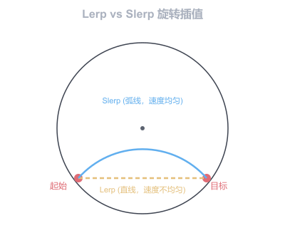
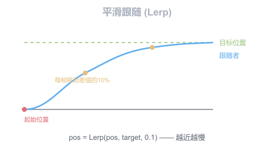

# 插值

插值是在两个已知值之间计算中间值的技术，是平滑动画和过渡效果的基础。LayaAir引擎在多个类中提供了插值方法。

## 一、数值线性插值

`MathUtil.lerp` 对两个数值进行线性插值：

```typescript
// lerp(left, right, amount)
// amount = 0 返回 left, amount = 1 返回 right
let value = Laya.MathUtil.lerp(0, 100, 0.5);  // 50
let value2 = Laya.MathUtil.lerp(0, 100, 0.25); // 25
```

## 二、向量插值

### 2.1 Vector3 插值

```typescript
let start = new Laya.Vector3(0, 0, 0);
let end = new Laya.Vector3(10, 10, 10);
let out = new Laya.Vector3();

Laya.Vector3.lerp(start, end, 0.5, out);  // (5, 5, 5)
```

### 2.2 Vector4 插值

```typescript
let a = new Laya.Vector4(0, 0, 0, 0);
let b = new Laya.Vector4(1, 1, 1, 1);
let out = new Laya.Vector4();

Laya.Vector4.lerp(a, b, 0.5, out);
```

## 三、旋转插值

### 3.1 线性插值（Lerp）

```typescript
let startRot = new Laya.Quaternion();
let endRot = new Laya.Quaternion();
let out = new Laya.Quaternion();

Laya.Quaternion.lerp(startRot, endRot, 0.5, out);
```

### 3.2 球面线性插值（Slerp）

沿球面最短弧插值，旋转角速度恒定，推荐用于旋转动画：

```typescript
Laya.Quaternion.slerp(startRot, endRot, 0.5, out);
```

### Lerp 与 Slerp 对比



（图3-1）

| 特性 | Lerp | Slerp |
|------|------|-------|
| 插值路径 | 直线 | 球面弧线 |
| 角速度 | 不恒定 | 恒定 |
| 性能 | 较快 | 较慢 |
| 适用场景 | 位置、颜色、数值 | 旋转 |

## 四、MathUtil 辅助方法

```typescript
// 将值限制在 [min, max] 范围内
let clamped = Laya.MathUtil.clamp(value, 0, 100);

// 将值限制在 [0, 1] 范围内
let clamped01 = Laya.MathUtil.clamp01(value);

// 循环值（类似取模，但处理负数）
// 例如角度循环：repeat(370, 360) = 10
let repeated = Laya.MathUtil.repeat(370, 360);

// 2D距离
let dist = Laya.MathUtil.distance(x1, y1, x2, y2);

// 两点连线角度
let angle = Laya.MathUtil.getRotation(x0, y0, x1, y1);

// 四舍五入到指定精度
let rounded = Laya.MathUtil.roundTo(3.14159, 2);  // 3.14
```

## 五、应用示例

### 5.1 平滑跟随



（图5-1）

```typescript
onUpdate(): void {
    let current = this.owner.transform.position;
    let target = this.target.transform.position;
    let out = new Laya.Vector3();

    Laya.Vector3.lerp(current, target, 0.1, out);
    this.owner.transform.position = out;
}
```

### 5.2 颜色渐变

```typescript
let r = Laya.MathUtil.lerp(startColor.r, endColor.r, t);
let g = Laya.MathUtil.lerp(startColor.g, endColor.g, t);
let b = Laya.MathUtil.lerp(startColor.b, endColor.b, t);
```

### 5.3 缓动插值

线性插值是匀速的，修改 t 值的变化方式可实现缓动效果：

```typescript
// 缓入（先慢后快）
let easeIn = t * t;

// 缓出（先快后慢）
let easeOut = 1 - (1 - t) * (1 - t);

// 也可使用贝塞尔缓动
let eased = Laya.Bezier.getRate(t, 0.42, 0, 0.58, 1);
```

> 关于更完整的缓动动画系统，请参考 [Tween缓动系统](../../Tween/readme.md)。
