# AI开发环境：IDE-MCP

LayaAir官方推出的IDE-MCP插件，让AI可以直接操控LayaAirIDE，使开发者无需学习IDE的使用方法，也可完成完整的开发流程。

## 1、IDE-MCP插件的核心功能

**IDE-MCP插件的核心功能：使AI拥有操作IDE的能力。**

引擎官方提供的LayaAir-CodingMCP功能让AI可以准确的编写脚本代码，抹平了引擎使用的「API 熟悉期」，但现代化的游戏开发流程往往不是单纯的代码开发，而是资源管理，场景编辑，预制体创建，代码开发，项目运行调试，构建发布等一系列流程共同完成的。不仅如此，完全通过代码实现的游戏项目往往难以直观的调整效果，也不符合开发者的习惯。

除此之外，开发者从零开始学习引擎IDE的使用方法也是一个复杂的过程。学习引擎的API可以借助已有的编程经验，但不同游戏引擎的IDE往往存在很大的使用差别，学习IDE的使用方法很可能是真正意义上的从零开始。

IDE-MCP插件则完美的解决了这些问题，开发者只需要知道“在场景中添加节点”、“节点上添加物理组件”、“创建一个预制体”这些较为模糊的操作，然后将这些操作告诉AI，AI就可以直接调用IDE中的相关指令，精准完成对应操作。

这种全新的AI使用模式，使开发者可以简单，快速的完成项目开发的全流程。

## 2、IDE-MCP插件的额外功能

**IDE-MCP插件集成了CodingMCP的功能。**

在不使用IDE-MCP插件的情况下，如果开发者想要使用CodingMCP的功能，需要在AI编码工具中配置相关参数。这是一个很麻烦的流程，不同的AI编码工具配置MCP的方法往往也不同。

不仅如此，MCP服务对引擎版本有明确的要求，开发者需要自行保证项目使用的引擎版本与MCP服务中设置的引擎版本相同，否则会导致MCP失效等问题。这意味着如果开发者使用了不同版本的引擎，就需要频繁切换MCP服务。

IDE-MCP插件解决了这些痛点。开发者只需要在插件中填入API Key，插件会自动检索环境中已经安装的AI编码工具以及当前引擎版本，并自动完成相关配置，无需开发者进行麻烦的参数配置工作，快速上手进行开发。

## 3、IDE-MCP插件的使用流程

### 3.1 导入资源包

开发者将下载好的插件包导入项目中即可，具体的操作流程可参考[包管理器与资源包导入](../../../IDE/layapackage/pluginImport/readme.md)。

导入完成后，在AI服务栏点击MCP Server Settings即可打开配置面板：

### 3.2 配置参数

插件在初次运行时需要进行一些参数配置，点击开始配置按钮：

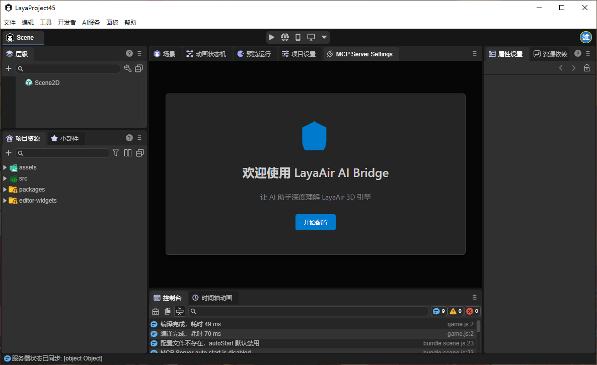

首先要进行**服务配置**：

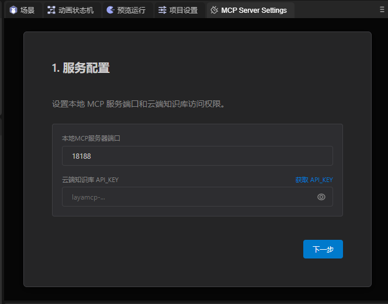

`本地MCP服务器端口`：在启用此插件后，插件会自行开启一个MCP服务，此设置用于配置服务端口。一般情况下无需修改，除非此端口与已用端口存在冲突。需要注意的是，如果开发者想要在多个LayaAirIDE中使用此插件，则每个IDE中配置的端口号必须不同。

`云端知识库API_KEY`：用于连接LayaAir MCP服务，可以点击右侧的`获取API_KEY`按钮或上方AI服务栏中的Coding MCP服务来获取API_KEY，具体流程请参考[AI编码环境](../CodingMCP/readme.md)这篇文章。

配置完成后点击**下一步**。

接下来要配置**环境自动集成**相关参数：

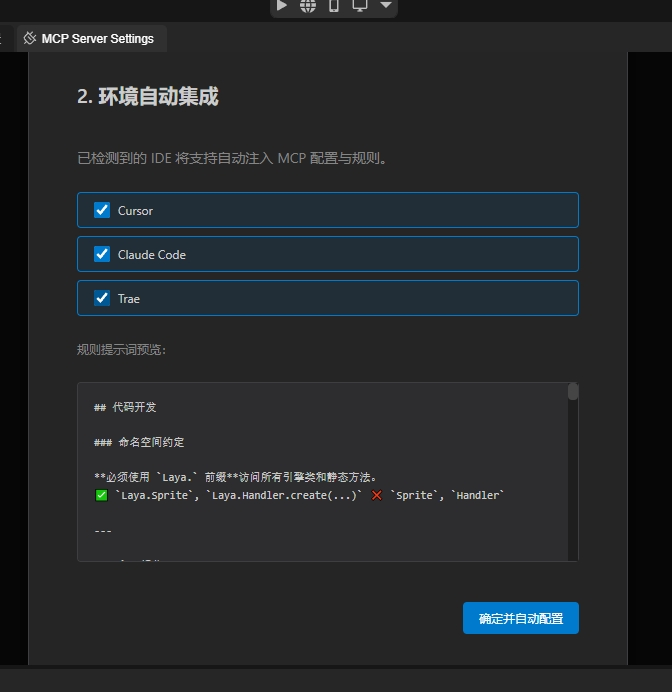

`AI编码工具`：LayaMCP插件会自动检测电脑中已经安装的AI编码工具，并自动将MCP的配置与规则注入其中。开发者只需要勾选要注入MCP的编码工具即可。目前插件支持的AI编码工具包括Cursor、Claude Code、Trae三种。

`规则提示词预览`：规则提示词用于告知AI与MCP协同工作的方式，以保证生成内容的效果与质量。插件会提供一个标准的规则模板，开发者也可以根据项目的需求进行优化。有关规则提示词的更多内容，开发者可参考[AI编码环境](../CodingMCP/readme.md)中的2.3节。

设置完成后，点击确定并自动配置即可。

### 3.3 修改参数

插件在使用的过程中随时都可以修改相关参数：

**IDE MCP**：

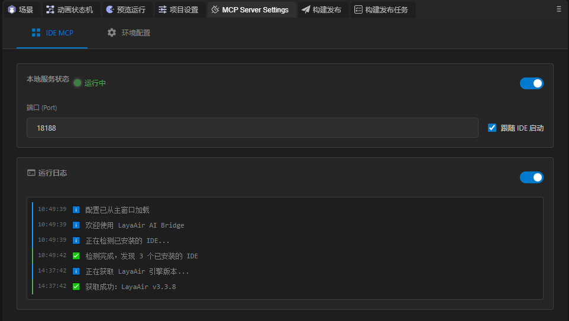

本地服务状态：此处可以配置IDE-MCP服务的端口，以及控制MCP服务是否启用；勾选跟随IDE启动这一项后，插件会在项目打开时自动启动，否则需要开发者手动启动。

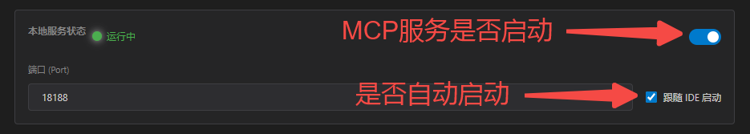

运行日志：开发者可以在此处查看MCP工具的相关运行日志。

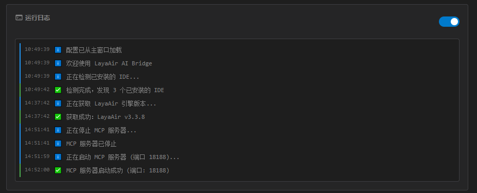

**环境配置**：

环境选择：开发者可以在此处选择MCP服务会配置到哪个编码工具中。

云端知识库设置：插件会自动读取当前项目使用的引擎版本，并配置到MCP服务中。

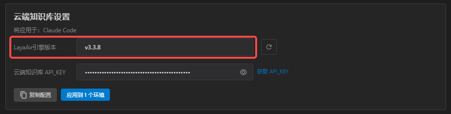

如果开发者更换了引擎版本，可以点击右侧按钮重新获取：

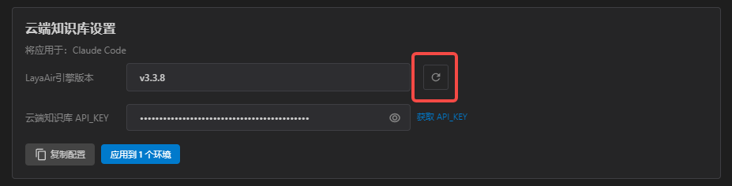

云端知识库 API_KEY：此处设置用于连接MCP服务的KEY，如果开发者使用的KEY发生了变化，需要在此处重新设置。

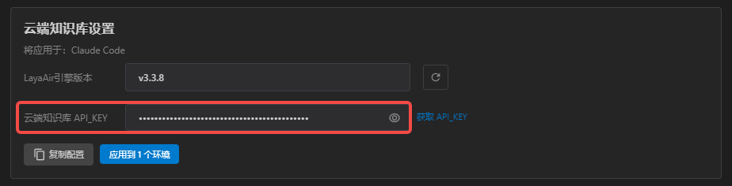

当云端知识库设置发生变化后，需要点击下方按钮将设置重新应用到AI编码工具中。

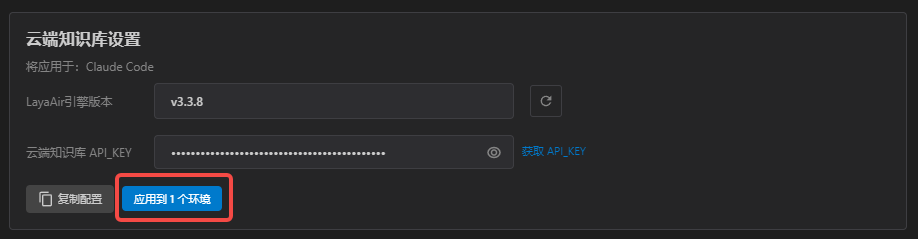

**AI提示词&规则**：

如果开发者想要为AI生成的内容追加新的规则，可以在此处修改。

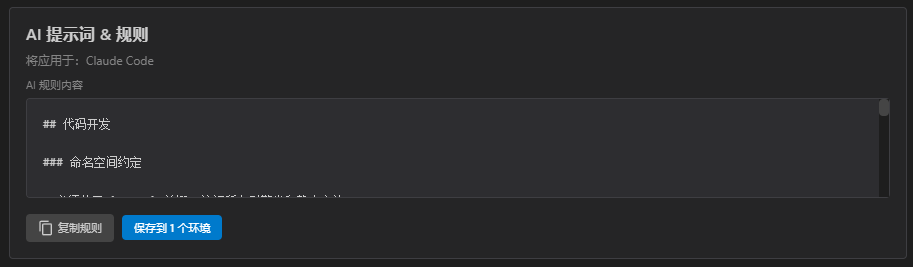

修改提示词后需要点击下方按钮，将提示词应用到环境中。

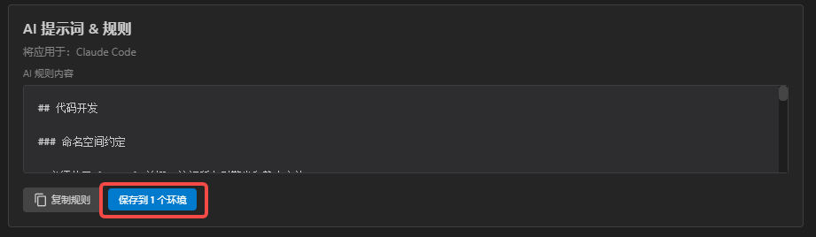

## 4、使用实践

在配置好IDE-MCP插件后，开发者即可在AI编码工具中对项目进行开发。当开发者的命令中包含与IDE相关的操作时，AI会自动调用IDE相关的功能，例如写入文件等。

在实际测试的流程中，我们通过 IDE-MCP插件 + Claude Code 的方式开发了一款类似羊了个羊的游戏，游戏的主体功能基本上可以一次生成成功，项目运行时如果出现报错，可以将报错内容直接粘贴给AI，AI会自动进行修复。其它的需求例如调整效果，创建预制体等也基本可以完成。

使用AI开发项目的速度是很快的，我们制作羊了个羊所用时间在40分钟左右，高效的开发意味着开发者可以反复进行尝试，多次修改自己的游戏内容与表现效果，对自己的各种想法都做出尝试。

开发者在使用IDE-MCP插件过程中，最重要的是要转变自己的思路，不再思考复杂的算法设计，效果实现等问题，更多的将自己的精力放在一些新奇有趣的创意上，即便是很模糊的想法，也可以通过和AI聊天的方式不断拓展，最终形成一个可落地的项目。

