# 通用发布

> Author: Charley

在完成项目的开发与调试之后，最终的目标是将游戏或应用构建并发布到目标平台，让玩家或用户能够顺畅体验。LayaAir IDE 提供了一套完善的构建与发布流程，帮助开发者快速生成适配不同平台的运行版本。无论是 Web、PC 客户端，还是各类移动端与小游戏平台，IDE 都能根据平台特性最大程度地降低开发者的发布成本。

LayaAir 支持当前主流平台的发布能力，包括网页端、移动端（Android、iOS、HarmonyOS Next）、小游戏端（微信、抖音、华为、OPPO、vivo、支付宝、淘宝等），以及 PC 端（Windows、Linux）等。

本篇的“**通用发布**”部分涵盖了各平台发布的通用基础能力。开发者需要重点掌握这里的配置与功能，以避免最终的发布效果与预期不符。


## 1、发布入口与流程

### 1.1 构建发布的入口  

开发者可以通过 IDE 顶部菜单栏中的 **“文件” → “构建发布”** 打开构建发布面板。该面板可以自由停靠在 IDE 的中间区域，方便进行构建配置，如图1-1所示：  

  

（图1-1）  

在通用面板的底部，默认提供了 **“构建 Web”** 与 **“构建其它”** 两个快捷按钮。开发者既可以直接点击按钮进行快速构建，如图1-2所示。也可以在左侧平台列表中选择目标平台，进入对应的配置面板后再进行构建发布。  

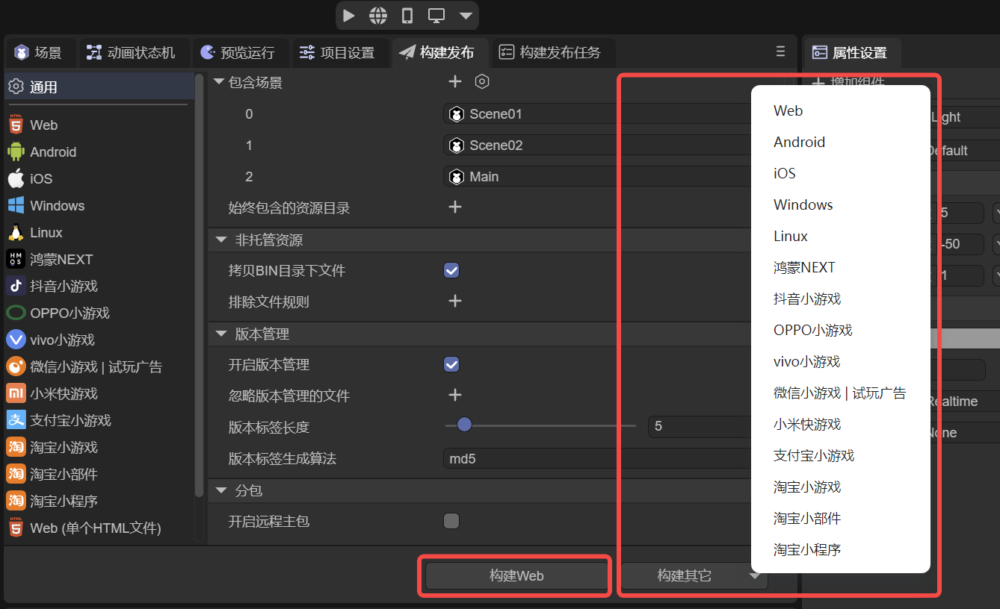  

(图1-2)  

`Web` 是指发布为《[HTML5版本](../web/readme.md)》，运行于各平台的浏览器HTML5环境、内嵌APP或小程序的`webView`环境中。

`Android` 是指发布为《[安卓平台](../Android/readme.md)》，运行于安卓的APP环境中。

`iOS` 是指发布为《[iOS平台](../iOS/readme.md)》，运行于iOS的APP环境中。

`Windows`是指发布到《[Windows平台](../Windows/readme.md)》，直接运行于windows系统桌面。

Liunx是指发布到 《[Liunx平台](../Linux/readme.md)》，直接运行于Liunx系统桌面。

`鸿蒙NEXT`是指发布为已适配《[鸿蒙NEXT](../Harmony/readme.md)》的项目工程。

`抖音小游戏` 是指发布为已适配《[抖音小游戏](../miniGame/byteDance/readme.md)》的项目工程。

`OPPO小游戏`是指发布为已适配《[OPPO小游戏](../miniGame/OPPO/readme.md)》的项目工程。

`VIVO小游戏`是指发布为已适配《[VIVO小游戏](../miniGame/vivo/readme.md)》的项目工程。

`微信小游戏 | 试玩广告` 是指发布为已适配《[微信小游戏 或 试玩广告](../miniGame/wechat/readme.md)》的项目工程。

`小米快游戏`是指发布为已适配《[小米快游戏](../miniGame/xiaomi/readme.md)》的项目工程。

`支付宝小游戏`是指发布为已适配《[支付宝小游戏](../miniGame/alipaygame/readme.md)》的项目工程。

`淘宝小游戏`是指发布为已适配《[淘宝小游戏](../miniGame/tbgame/readme.md)》的项目工程。

> 本篇主要介绍通用的发布设置，各发布平台可以点击以上链接查看文档。

### 1.2 发布任务与操作

点击构建按钮后，IDE 会自动切换到 **“构建发布任务”** 面板。在发布过程完成后，开发者可以通过选中对应的历史记录来执行一系列操作，例如：打开发布目录、查看构建日志、重新构建、直接运行、扫码运行或删除构建目录。如图1-3所示。  

  

(图1-3)  

## 2、 基础  

基础设置部分涵盖了所有平台在发布过程中都会用到的公共信息。开发者需要在这里进行必要的配置，以确保项目在不同平台上都能正确识别和展示。  

### 2.1 名称  `name`

**项目的内部名称**，在创建项目的时候填写，此处可修改（通常不修改，与工程文件名称保持一致）。  如果没有设置显示名称，默认作为显示名称来使用。

例如， **Web 发布** 后，名称会显示在生成的 HTML 文件中，作为网页的 `<title>`。  

作为 Native 包，名称将作为包名，以及窗体上的默认名称。如图2-1所示。

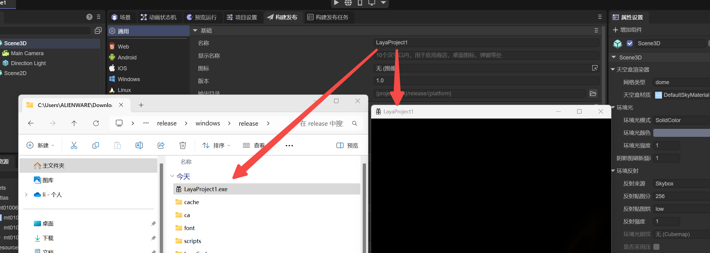 

（图2-1）

### 2.2 显示名称 `displayName`

用户可见的产品名称。用于网页浏览器标题、桌面应用名称、安装包名称等。  

设置后，系统会优先显示该名称，而不是项目的名称。  如图2-2所示。

 

(图2-2)

### 2.3 图标  `icon`

作为应用在桌面、安装界面等处的默认图标。 通常需要是一个正方形的图标。

### 2.4 版本 `version`

项目的版本号，用于标识不同的功能版本。  
- 当进行较大功能更新时，可以将版本号从 `1.0` 升级到 `2.0`。  
- 如果只是进行小范围的 Bug 修复或优化，则可在原版本号基础上递增，如 `1.0` → `1.1`。  推荐采用 **浮点数格式**（如 `0.1`、`1.3`、`5.0`），便于管理和区分。  

### 2.5 输出目录  `outputPath`

发布后生成的文件存放目录。  
- 默认路径为项目根目录下的 `release` 文件夹。  
- **建议保持默认路径**，以便统一管理。  
- 如有特殊需求，开发者也可以自定义路径，既可以是项目目录下的子文件夹，也可以是完全独立的目录。  

## 3、脚本

### 3.1 压缩引擎库 `useCompressedEngine`

正式发布时，建议勾选，启用后将使用压缩版引擎类库，减少包体大小。

### 3.2  压缩`JS`文件 `minifyJS`

正式发布时，建议勾选，启用后将输出压缩后的 `JS` 文件，进一步减小体积。 

### 3.3 生成源代码映射 `sourcemap`

启用后会在输出目录生成 `.js.map` 文件，用于调试时的源码映射。

Source Map（源代码映射）是一种用于调试和开发的技术，它建立了原始源代码与压缩、混淆后的代码之间的映射关系。通过创建一个源代码映射文件，可以在浏览器开发者工具中准确地将压缩后的代码映射回原始的源代码，从而方便开发者在调试过程中定位问题、查看错误堆栈和变量值，提高调试效率。 

### 3.4 包含源代码 `sourcesContent`

包含源代码是源代码映射的关联属性，

勾选后，源代码映射的`.map` 文件中会直接带上源码内容，调试时可以在浏览器里直接看到完整源码，调试体验最好，但会增加发布包大小，并且源码容易被还原查看。

如果不勾选，`.map` 文件只保存源码的映射关系，不带源码文本，只能看到压缩后的 `JS`。但出错时，能提供正确的错误行列定位，属于“调试信息最小化”的方案，常用于线上环境。

## 4、资源选项

### 4.1 启动场景 `startupScene`

启动场景是引擎加载与初始化之后的项目入口场景，必需要设置。

### 4.2 包含场景 `includedScenes`

对于场景，只有启动场景和被包含的场景文件才会被复制到发布目录。

> 发布流程，会将场景引用的资源一起打包到发布目录。  

### 4.3 始终包含的资源目录 `alwaysIncluded`

`IDE`项目assets中的资源有很多，哪些资源会复制到发布目录，主要由三种规则决定。

第一，发布场景（启动场景+包含场景）中所引用的资源会被复制到发布目录。

第二，assets目录下，所有采用resources命名的目录下的所有资源，都会被自动合并复制到发布目录下的resources目录内。如图4-1所示。

 

(图4-1)

第三，除以上两种规则外，在`始终包含的资源目录`配置中的目录，也会被复制到发布目录中。如图4-2所示。

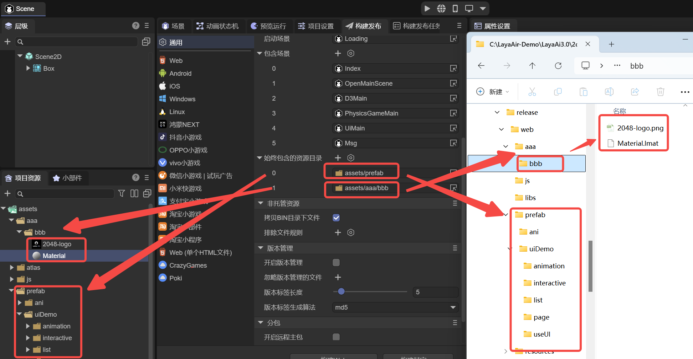 

（图4-2）

## 5、非托管资源

### 5.1 拷贝BIN目录下文件 `copyBinFiles`

勾选后，项目工程中 **bin 目录** 下的文件会被一并复制到发布目录。  

该功能主要适用于以下场景：  
- **自定义修改了 `bin/index.html`**（不建议直接修改该文件）；  
- 在 **bin 目录** 下存放了一些不便放在 `assets` 目录的特殊资源，例如需要通过 **DOM 方式** 直接加载的资源。  

### 5.2 排除文件规则 `excludeFilesRule`

`排除文件规则` 是 `拷贝 BIN 目录下文件` 的配套选项。  

当勾选了 **拷贝 BIN 目录下文件** 后，可以在此规则中配置需要排除的文件或目录。例如：  
- 排除某个指定目录（含子目录）的所有文件，例如`abc/**/*`  

- 排除具体文件，例如`bg2.png`  

  如图5-1所示。

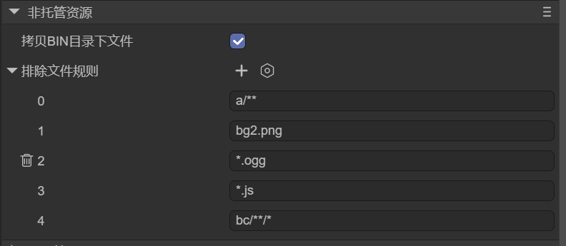 

（图5-1）

## 6、版本管理

### 6.1 开启版本管理 `enableVersion`

启用版本管理后，除引擎自带的入口文件外，其余未被忽略的文件名称都会附加一个由指定算法和长度生成的版本标签，如图6-1所示。  

 

(图6-1)

这种方式可以有效避免因 `CDN` 或浏览器缓存导致的文件更新不及时，从而引发的显示异常问题。  

### 6.2 忽略版本管理的文件 `ignoreFilesInVersion`

开启版本管理后，除引擎自带的入口文件外，默认是所有文件都会携带版本标签。

忽略版本管理的文件的功能，允许开发者可以指定部分文件不携带版本标签。

### 6.3 版本标签生成算法 `versionAlgorithm`

版本标签的默认算法为 **MD5**，也可以选择 **SHA1** 或 **SHA256**。  

开发者可根据项目需求选择合适的算法。  

### 6.4 版本标签长度 `versionTagLength`

版本标签的默认长度为 **5 位**。  

开发者可自由调整，但需注意合理性，例如 MD5 算法的长度最大为 **32 位**。

## 7、分包

### 7.1 开启远程主包 `enableRemoteMainPackage`

在实际项目中，通常会将 **游戏资源** 与 脚本代码、引擎库 、入口文件分开存放。  

例如：将资源托管在腾讯云 COS（对象存储）等远程服务器上，而脚本与引擎库则保留在小游戏本地包体中。  

启用 `开启远程主包` 后，需要设置资源服务器地址 `mainPackageRemoteUrl`，作为资源加载的路径前缀，如图7-1所示。  

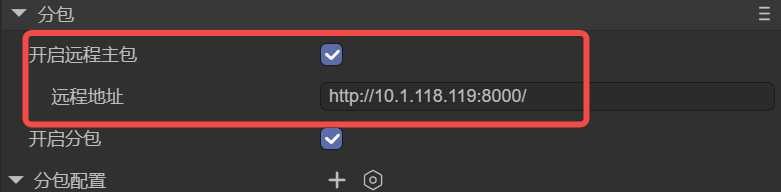 
(图7-1)

配置完成后，发布流程会将所有资源单独输出到一个名为 **`目标平台-remote`** 的目录中。  

该目录中的内容需要上传到远程服务器，而原始的发布目录不再包含项目资源，仅包含入口文件、引擎库（libs）和项目脚本（js），如图7-2所示。 

   

(图7-2)

在开发或测试阶段，如果暂时没有远程服务器，可以直接在 **远程资源目录** 下启动一个本地 Web 服务（如使用 `anywhere`），并将该服务的访问地址配置为资源服务器 URL，如图7-3所示。

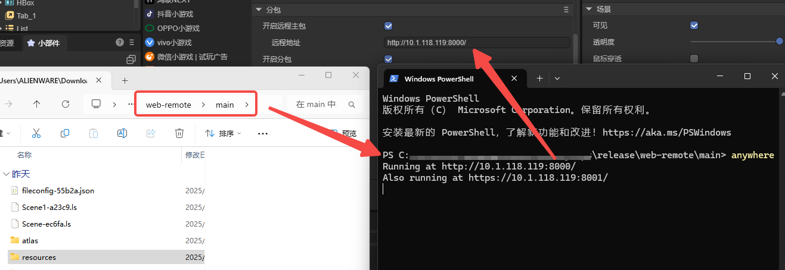 

(图7-3)

发布完成后，可以通过调试工具验证资源加载情况。此时，资源的请求路径将指向配置的远程地址，而非项目的启动 URL，如图7-4所示。  

 

(图7-4)

### 7.2 开启分包 `enableSubpackages`

为了避免首包过大，用户等待时间长而导致用户流失。以及平台的限制（例如小游戏包体限制）、代码和资源模块化开发等需求。将项目分成入口主包，以及若干模块的分包，构成一个完整的项目。

开启分包后，可以配置一个或多个分包，以及WASM分包，如图7-5所示。

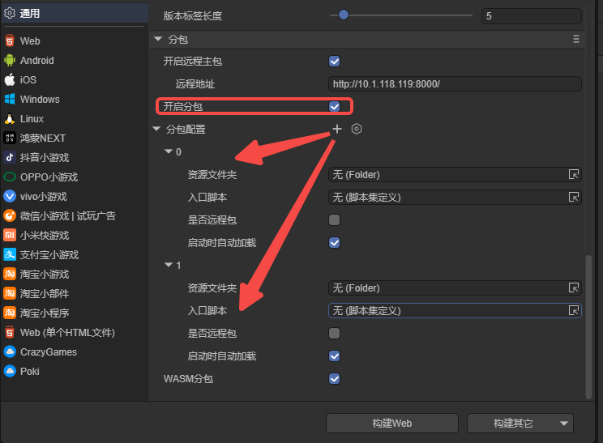 

(图7-5)

### 7.3 分包配置 `subpackages`

#### 7.3.1 资源文件夹 `path`

`资源文件夹` 指定了每个分包的根目录路径。  
通常我们会将目录命名为 `sub1`、`sub2` 等，再通过选择或拖拽的方式，将该目录绑定到 `资源文件夹` 配置项中，如图7-6所示。  

  

(图7-6)

需要注意：如果分包目录中的资源不在“包含场景”里，而是依赖代码动态加载，则必须将分包目录额外添加到 **始终包含的资源目录** 中如图7-7所示，否则发布时可能被忽略。

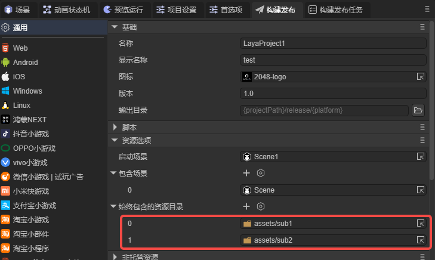 

（图7-7）

#### 7.3.2 入口脚本  `mainScript`

如果分包的目的仅是资源分包，那`入口脚本`处可不设置，默认为无，即可。

入口脚本的主要作用是代码分包。可接收 `脚本集定义`文件。

#### 创建 `脚本集定义`文件

`脚本集定义` 是 LayaAir 3 IDE 中内置的一种脚本分包专用的配置文件，用于将分包目录下指定的 TypeScript 脚本编译合并为分包的 `game.js` 文件。  
该文件一般放在分包目录内，通过 **右键目录 → 创建 → 脚本集定义** 即可生成，如图7-8所示。

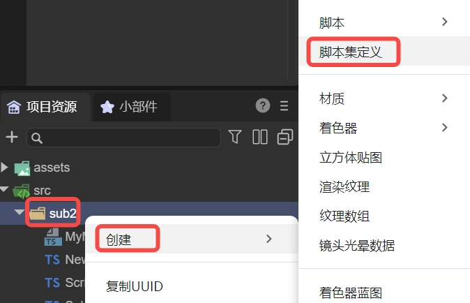 

（图7-8）

例如：在分包 `sub2` 中，需要在加载时执行某些逻辑。我们可以将相关脚本放在 `src/sub2/` 目录下，并在 `脚本集定义` 中配置入口文件,如图7-9所示。  

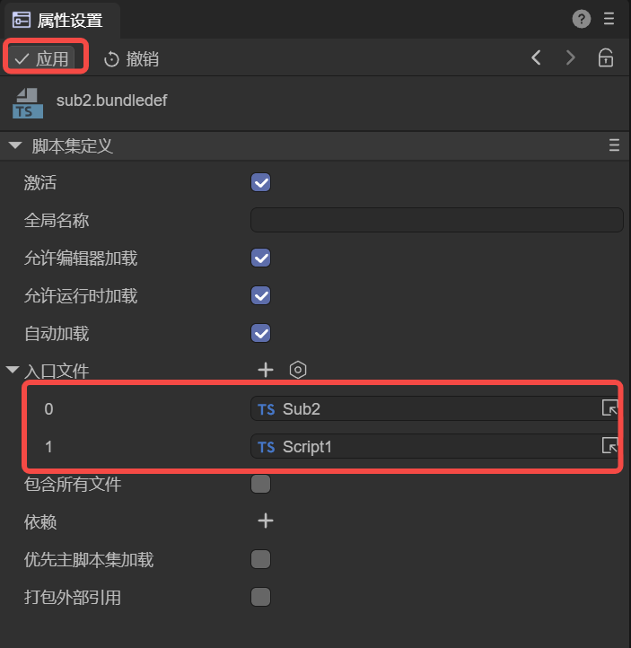  

（图7-9）

代码分包的`脚本集定义`常用配置为`入口文件`、`包含所有文件`、`依赖`。

##### 入口文件`entries`

- 发布后，每个分包只有一个 `game.js` 文件，它就是该分包的逻辑入口。  
- 在入口文件 `entries` 中配置的 TypeScript 文件会被编译并合并进 `game.js`。  
- 只能选择脚本集文件所在目录下的脚本。  

如果希望分包目录下的 **所有脚本** 都合并进 `game.js`，可以勾选 **包含所有文件 `includeAllFiles`**。  

未勾选时，则仅会编译入口文件中指定的 TypeScript 脚本。  

##### 依赖 `references`

入口文件中的脚本，即使引用了不在入口文件`entries`中指定的其它类，这些类也会被自动编译进 `game.js`。  

但若涉及 **跨脚本集依赖**（依赖另一个脚本集定义的脚本功能时），需在**依赖** `references` 中显式声明，以确保加载顺序正确。  

#### `脚本集定义` 属性说明

全部的脚本集定义属性说明如下：

| 属性名称           | 属性中文名称     | 属性说明                                                     |
| ------------------ | ---------------- | ------------------------------------------------------------ |
| enabled            | 激活             | 默认勾选，勾选后脚本集定义的配置才会生效。                   |
| globalName         | 全局名称         | 一般不需要设置。用于模块命名，例如module1，那么其他模块可以通过”module1.xxx“访问这个模块导出的类和函数。 |
| allowLoadInEditor  | 允许编辑器加载   | 默认勾选，控制脚本集是否在编辑器环境中被加载。               |
| allowLoadInRuntime | 允许运行时加载   | 发布构建时，只有 allowLoadInRuntime为true 的脚本集才会被包含。 |
| autoLoad           | 自动加载         | 决定是否在分包启动时自动加载执行脚本。                       |
|                    |                  |                                                              |
| entries            | 入口文件         | 通过入口文件配置需要编译到game.js的TS文件。开发者可以控制哪些需要编译到game.js里。需要注意的是，只能配置脚本集文件所在目录内的TS文件。 |
| includeAllFiles    | 包含所有文件     | 勾选后，构建发布流程会编译脚本集文件所在目录下全部TS文件为game.js。只有不勾选的时候，才会处理入口文件中指定的TS文件。 |
| references         | 依赖             | 为了确保加载顺序的正确，当我们使用到另一个脚本集定义的功能时，要在依赖`references`这里指定引用代码所在的脚本集文件。 |
| loadBeforeMain     | 优先主脚本集加载 |                                                              |
| bundleExternals    | 打包外部引用     | 默认是不勾选。勾选后，如果脚本集引用脚本集外面的文件，那么这些文件会一并打包进这个脚本集。如果不勾选，那么那些外部文件不会打包进来。 |


配置好后，在项目发布时，只需将脚本集定义放在`入口脚本`处，然后在`资源文件夹`选择非主包的文件夹，注意该分包不可为远程包，如图2-28所示，

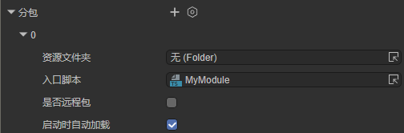

（图2-28）

#### 7.3.3 是否远程包 `remote`

#### 7.3.4 启动时自动加载 `autoLoad`

#### 7.4 `WASM`分包 `enableWasmSubpackage`

勾选`开启分包`和`WASM分包`后，发布时会筛选所有以".wasm"结尾的文件，当存在WASM文件时，创建一个分包配置对象 wasmSubpackage ，设置为`启动时自动加载`。并在资源输出目录中自动创建一个"wasm_files"文件夹，将".wasm"结尾的文件都复制到这个文件夹中。资源的引用路径也会自动调整。


需要注意的是，.wasm的文件，在IDE里，必须导入为插件才，才会复制到分包目录中。


### 2.6 资源分包


在配置资源分包时，需要设置如下参数：

| 参数           | 说明                                                         |
| -------------- | ------------------------------------------------------------ |
| 资源文件夹     | 资源文件夹中的内容，就是要进行分包的资源                     |
| 入口脚本       | 参考2.7节中代码分包                                          |
| 是否远程包     | 勾选后，该资源文件夹（分包）在`版本发布`后会发布到release\xxx-remote目录下 |
| 启动时自动加载 | 勾选后，运行启动发布的项目时，该资源文件夹（分包）会自动加载 |
| 远程包地址     | 如果同时勾选“是否远程包”和“启动时自动加载”，会显示此参数，要求填写远程包的地址 |

> Web发布后的远程包文件在web-remote文件夹下。小游戏也支持远程包，**发布后的远程包位于release目录下**，例如，微信小游戏发布后的远程包文件位于release\wxgame-remote文件夹下，其它小游戏也是同理。


#### 2.6.1 远程包

远程包是指可以将这部分资源放置到CDN（内容分发网络，不理解的读者可以先将它理解为一种服务器），来提供高性能、可扩展性及低成本的网络内容传递给用户。如果Web平台不使用远程包，则对其分包的意义不大。小游戏使用远程包则是为了减小包体。

例如动图2-15所示，如果设置"sub1"和"sub2"目录为远程包，则在发布后，这两个目录会发布到“release\web-remote”目录下。

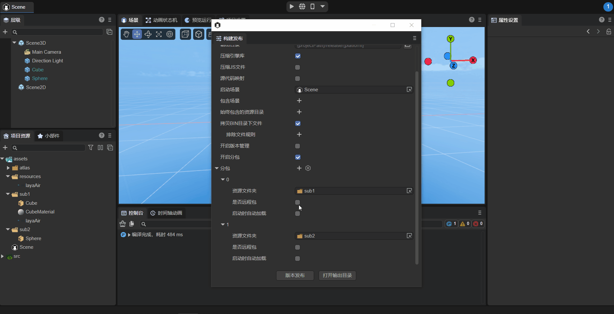

（动图2-15）


#### 2.6.2 IDE中自动加载

如图2-17所示，在IDE中引用了资源（添加资源在场景中）后，

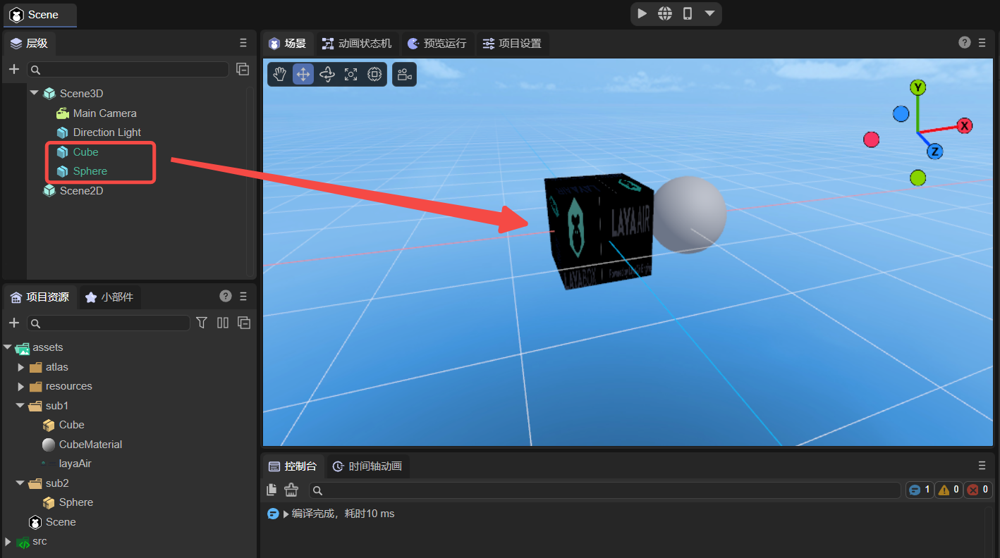

（图2-17）

在构建发布时，勾选`启动时自动加载`，然后填写远程包地址，就是本地服务器的地址`http://192.168.56.1:2840/`，如下动图所示：

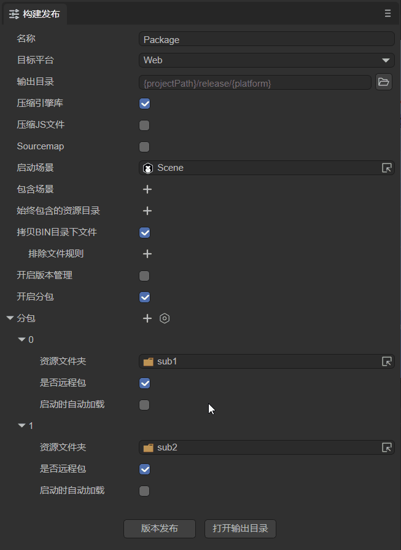 

（动图2-18）

点击`版本发布`后，需要再次将"sub1"和"sub2"上传到本地服务器“serve”文件夹，如动图2-19所示：

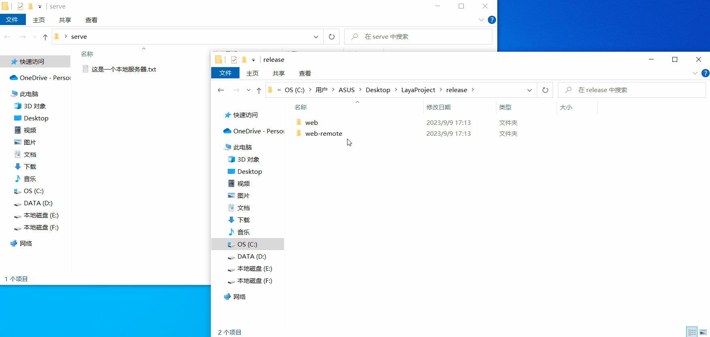

（动图2-19）


#### 2.6.3 代码引用的资源

有时，我们不想让游戏一开始就加载过多的资源，这样负荷太大，这时就需要手动代码加载了。

如图2-22所示，场景中没有引用要分包的资源，在Scene2D节点的属性设置中添加一个自定义组件脚本，

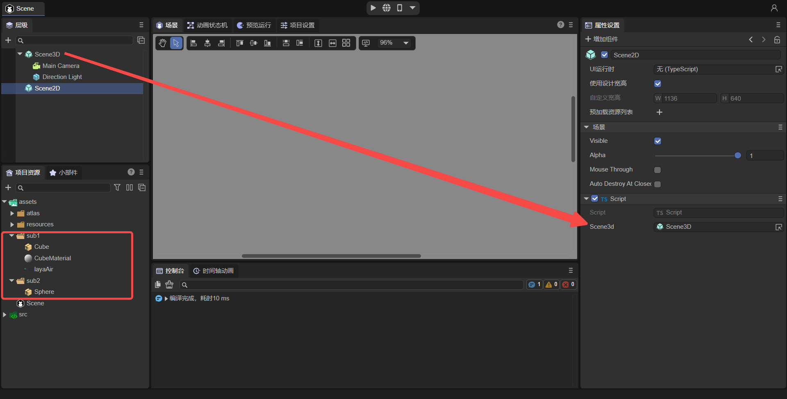

（图2-22）

然后在脚本中添加如下代码：

```typescript
const { regClass, property } = Laya;

@regClass()
export class Script extends Laya.Script {
    //declare owner : Laya.Sprite3D;

    @property({ type: Laya.Scene3D })
    scene3d: Laya.Scene3D;

    constructor() {
        super();
    }

    /**
     * 组件被激活后执行，此时所有节点和组件均已创建完毕，此方法只执行一次
     */
    onAwake(): void {
        //Web平台使用远程包
        Laya.loader.loadPackage("sub1","http://192.168.56.1:2840/",this.printProgress).then(()=>{
            Laya.loader.load("sub1/cube.lh").then((res:Laya.PrefabImpl) =>{
                let sp3:Laya.Sprite3D =res.create() as Laya.Sprite3D;
                this.scene3d.addChild(sp3);
            });
        })

        Laya.loader.loadPackage("sub2","http://192.168.56.1:2840/",this.printProgress).then(()=>{
            Laya.loader.load("sub2/sphere.lh").then((res:Laya.PrefabImpl) =>{
                let sp3:Laya.Sprite3D =res.create() as Laya.Sprite3D;
                sp3.transform.localPositionX += 1.0; //防止球体和立方体都在初始位置发生重叠
                this.scene3d.addChild(sp3);
            });
        })
    }

    printProgress(res: any) {
        console.log("加载进度" + JSON.stringify(res)); //将res对象转换成JSON格式的字符串，此处打印的值为1。本句代码主要应用于小游戏发布后打印loadTask反应下载进度
    }

}
```

> 注：资源加载请参考[《资源加载》](../../basics/common/Loader/readme.md)。

利用代码加载时，不勾选`启动时自动加载`，但如果分包的资源不在resources目录下（本例中的"sub1"和"sub2"就不在），就要将包添加到`始终包含的资源目录`中，配置如下图所示：

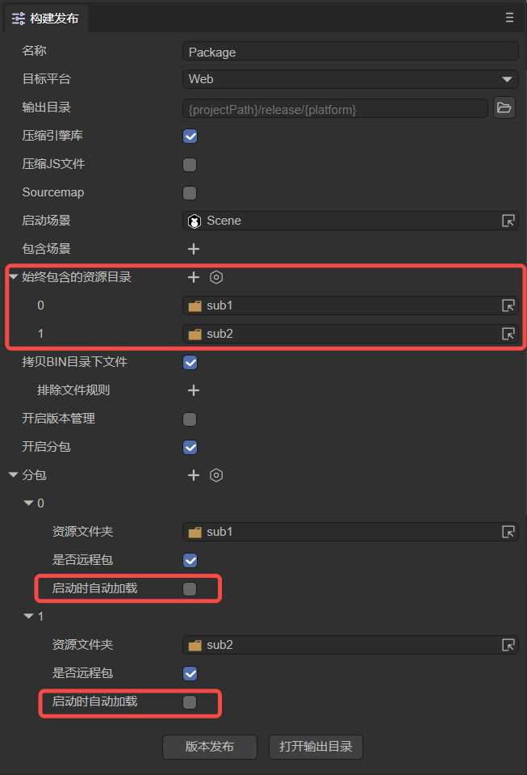

（图2-23）


### 2.7 代码分包

#### 2.7.1 方法

除了资源分包，还可以将代码进行分包。一般用于**小游戏的分包**，可以降低首包体积（因为小游戏限制包体大小），加快加载速度。


#### 2.7.2 演示

这里以”2D入门示例“为例，演示代码分包流程。

新建示例项目后，如图2-29所示，在src文件夹下新建一个`脚本集定义`MyModule.bundledef，然后在其属性设置面板中，勾选`包含所有文件`。这里是将src目录下的代码全部进行了拆分，开发者可以根据自己的需求拆分代码。

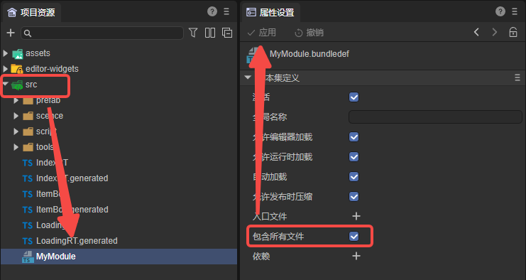

（图2-29）

>当激活MyModule后，项目目录“bin\js\bundles”的bundle.js文件体积会变小，同时会多出一个MyModule.js文件。
>
>这就是将src目录下的代码进行了拆分，bundle.js中的代码拆分到了MyModule.js中。

然后在构建发布中，按照图2-30所示，将MyModule放在`入口脚本`处，并勾选`启动时自动加载`。其中，`资源文件夹`的script文件夹是在assets目录下新建的一个空文件夹，发布后的代码分包将位于该文件夹中。

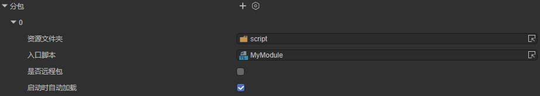

（图2-30）

>发布后可以发现，发布目录的js文件夹下，原来bundle.js中的代码拆分到了分包script文件夹中。


## 3、其它通用的项目发布说明


## 打包图集

图集(Atlas)是游戏开发中常见的一种美术资源，通过IDE发布流程将多张图片合并成一张大图，并通过atlas格式的文件存放原始图片资源信息。

图3-1就是采用LayaAirIDE打包好的一张png图集资源。 


(图3-1)

### 3.1 为什么要使用图集资源

在游戏中使用多张图片合成的图集资源作为美术资源，有以下优势：

**1 优化内存**

合成图集时会去除每张图片周围的空白区域，加上可以在整体上实施各种优化算法，合成图集后可以大大减少游戏包体和内存占用。

**2 减少CPU运算**

多个 `Sprite` 如果渲染的是来自同一张图集的图片时，这些`Sprite`可以使用同一个渲染批次来处理，大大的减少CPU的运算时间，提高运行效率。


### 3.2 支持图集打包的格式

LayaAirIDE支持对PNG与JPG两种资源格式打包为图集。但是图集打包的原始资源，推荐使用PNG，因为JPG的体积会较大。

> Tips：
>
> 需要注意的是，PNG原始资源的位深度不能超过32，否则打包出来的图集会出现花屏。打进图集的资源 Texttrue Type 属性要设置为 SpritetTextrue 。另外，PNG与JPG资源不能是其它格式的资源改名为PNG与JPG格式的。


### 3.3 用LayaAir IDE制作图集的方式

用LayaAir IDE制作图集有两种方式，第一种方式更为细致，第二种方式更为简单快捷，开发者可以自行选择。

#### 3.3.1 自动生成

自动将图片资源打包只有在LayaAir IDE发布时才可以，但是需要添加和设置图集打包配置文件，这里我们通过一个示例来讲解，如图3-2所示： 

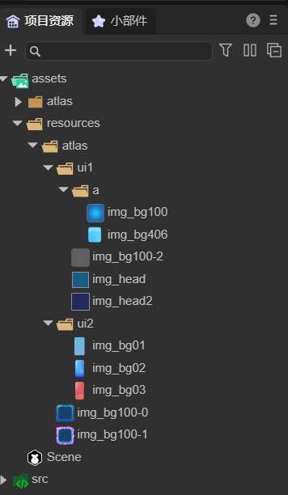

（图3-2） 

1，所有的图片资源都放在 assets/resources 目录下，上文提到，由于项目开发中图片可能会使用代码的使用方式，因此在不指定“始终包含的资源目录”的情况下，放在resources目录下会直接发布到输出目录中。

2，resources目录下的atlas目录，用来存放一些散图和子文件夹（里面也有散图），这么做的好处是对资源做好分类管理，往往resources目录下还有其它资源目录，尽量把图片资源和其它资源分开存放。

3，atlas目录下，有两张图片（img_bg100-0.png和img_bg100-1.png）和子文件夹ui1、ui2，里面分别有很多散图，同时ui1目录下还有 a子文件夹。

如果不进行图集打包，那么在发布后，输出目录下的 atlas 目录里都是散图。下面来看看如何打包图集：

**第一步：添加配置文件**

如动图3-3所示，在atlas目录下添加配置文件。  


（动图3-3）

在resources/atlas目录下，右键->创建，选择“自动图集设置”，则会创建一个AtlasConfig.atlascfg文件。放到atlas下的目的，是可以对atlas目录中的图片和子文件夹下的图片同时进行图集打包（支持单张图集和多个子文件夹图集）。开发者可以对此文件重命名。


**第二步：图集设置文件属性**

点击 AtlasConfig 文件，如图3-4所示： 

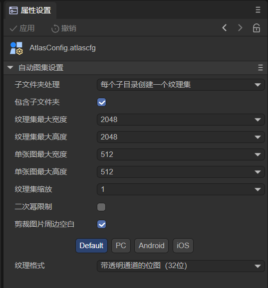

（图3-4）

`子文件夹处理`：

每个子目录创建一个纹理集：每个子文件夹打包一个图集。

共用一个纹理集：所有子文件夹和同级目录中的图片打包成一个大图集。

`包含子文件夹`：

勾选后，支持将子文件夹打包图集，不勾选，只处理同一级目录中的图片打包图集。

`图集最大宽\高度`：

默认值为`2048×2048`，该值决定单个图集的最大尺寸。如果原始图片过多，超过单个图集最大宽高时，则会在打包时生成新的图集文件（多个图集）。

`单图最大宽\高度`：

默认值为`512×512`，超过这个尺寸的单图将不会被打包到图集中。

> Tips：超过512×512的单图不建议打包到图集中，可以单独预加载此图，但是，加载单图也不能超过1024×1024，否则会对性能有影响。

`纹理集缩放`：

这里可以通过缩放减少图集体积，比如改为0.5，IDE会按原图宽高分别乘0.5生成到图集中，显示的时候会保持会通过拉伸保持原图大小，这样处理后，虽然图集的尺寸会变小，但是显示的效果也会有所影响，可以视为一种图集的另类压缩方案。如果要保持设计时的图片精度，尽量不要调整默认值。

`二次幂限制`：

如果勾选，则生成的图集图片宽高将会是2的整次幂。这里，建议美术在设计的时候，就按2的整次幂来设计，通过图集工具强行保持2的整次幂，肯定会导致图集的体积变大。所以，除非是面临某些强制要求按2的整次幂优化的Runtime环境，常规情况下无需勾选，尽量提要求给美术设计人员，按32、64、128、256等2的整次幂来设计图片的宽高。

`剪裁图片周边空白`：

如果勾选，则生成的图集图片会自动把原始图片中空白区域裁剪掉。默认是是勾选状态，不要去掉。

`纹理格式`：

png32为默认格式，此格式支持透明度和更多的颜色；png24，无透明度；纹理压缩参考文档[《纹理压缩》](../../IDE/uiEditor/textureCompress/readme.md)。


**第三步：发布生成图集**

当设置好后，在“构建发布”进行发布，等待发布成功，这时来看看发布后的目录，如图3-5所示： 

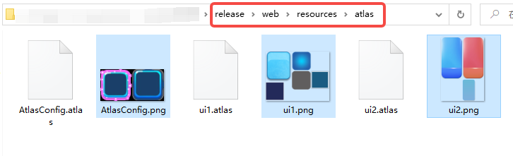

（图3-5）

1、生成了3个图集（AtlasConfig，ui1 和 ui2），由于选择了 `每个子目录创建一个纹理集` 方式，ui1 和 ui2 各自生成一个图集（子文件夹打成的图集文件命名是按照文件夹名字），atlas下的图生成一个图集（AtlasConfig.atlascfg所在文件夹生成的图集文件命名按照AtlasConfig文件名）。

2、如果有尺寸超过了512x512的图，则不打入图集（512×512是图3-4的设置）。

3、ui1目录下存在一个a目录，并且勾选了`包含子文件夹`，所以在图集ui1中也打入了a文件夹下的散图。如果不勾选`包含子文件夹`，则ui1/a 目录会保留，下面还是散图。


#### 3.3.2 工具制作

第二种方式更为快捷简单，但无法做到像第一种方式那样进行细致的属性设置，此方法在[《动画节点》](../../2D/displayObject/Animation/readme.md)中也有提到，下面来为大家演示。

首先点击”工具“菜单中的”制作图集“。 

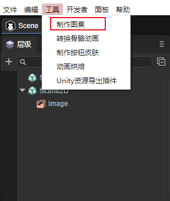

（图3-6）

然后将所需要打包的文件夹拖入图片所在文件夹中，点击`制作`。 


（图3-7）

也可以点击文件夹图标自行选择路径，如图3-8所示。 

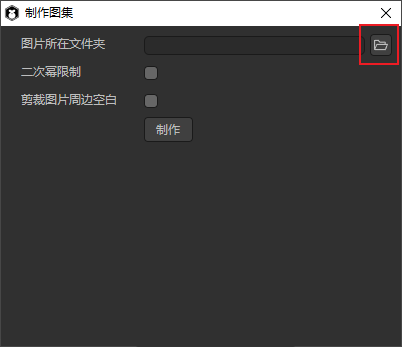

（图3-8）

点击制作之后，输入文件名点击保存如图3-9所示。 


（图3-9）

这样图集就制作好了。

当我们对图集中包含的图片有增删时，只需要重复一次上面的流程，点击.atlas文件，点击是，即可成功替换，如图3-10所示。

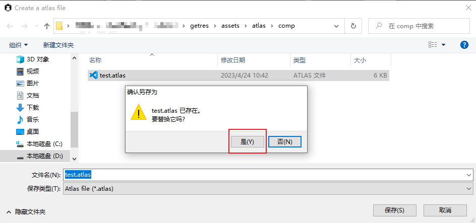

（图3-10）

> [!Tip]
>
> 如果使用第二种图集打包方式，那么开发者要保证，此目录会非常稳定，后续不会进行图片资源的增删修改，如果不能保证稳定的目录，那么最好使用第一种打包方式。


### 3.4 打包生成的图集文件介绍

#### 3.4.1 打包生成的图集文件

打包图集后，会生成图集专用资源（分别是同名的`.atlas`文件和`.png`文件）

#### 3.4.2 atlas后缀文件

`.atlas`是LayaAirIDE特有的图集格式，仅用于图集，所以在加载`.atlas`时不需要填写类型，和加载普通的单图方式一样，更加方便，是推荐的图集加载方式。atlas方式加载图集的示例代码为：

```typescript
//atlas方式图集使用示例
Laya.loader.load("resources/atlas/Atlas_ui.atlas").then( 
	()=>{} 
);
```


### 3.5 如何在项目中使用图集中的小图

在项目中如果用到图集中的资源，则需先预加载图集资源，然后设置图片的皮肤（*skin*）属性值为“原小图目录名/原小图资源名.png”。

例如：现在我们将图3-5中原来的小图 `img_head2.png` 和  comp 目录下的 image.png 在项目中通过图集的方式显示出来，示例代码如下：

```typescript
        let resArr: Array<any> = [

            { url: "resources/atlas/Atlas.atlas", type: Laya.Loader.ATLAS },
            { url: "resources/atlas/Atlas_ui.atlas", type: Laya.Loader.ATLAS },
            { url: "resources/atlas/Atlas_comp.atlas", type: Laya.Loader.ATLAS }];


        Laya.loader.load(resArr).then( ()=>{
                //创建Image1实例
                var img1 = new Laya.Image();
                //设置皮肤（取图集中小图的方式就是 原小图目录名/原小图资源名.png）
                img1.skin = "resources/atlas/img_head2.png";
                //添加到舞台上显示
                Laya.stage.addChild(img1);

                //创建Image2实例
                var img2 = new Laya.Image();
                //设置皮肤（取图集中小图的方式就是 原小图目录名/原小图资源名.png）
                img2.skin = "resources/atlas/comp/image.png";
                //添加到舞台上显示
                Laya.stage.addChild(img2);
            } 
        );
```

运行效果，如图3-11所示：


（图3-11）

至此，打包图集就介绍完了，开发者需要提前规划好图片的目录管理，可以根据功能划分，每个功能创建一个子文件夹，这样图集的尺寸能尽量控制在合理范围内，按功能划分的好处也是方便查找。开发者在使用过程中如果遇到问题，欢迎随时和我们交流。


## 四、发布原生资源

原生资源是指通过原生JS实现DOM元素加载的资源，在项目开发中通常会用到，因此有的开发者希望在index.html里写入一些实现DOM的JS代码来加载这些图片或者视频资源，在预览运行时，由于index.html在bin目录下，因此这些资源只能存放在bin目录下。如图4-1所示：


（图4-1）

> LayaAir 3.0.0 beta5 版本开始，会支持发布bin目录下原生资源的功能

在项目Web发布后，默认情况下，所有bin目录下的资源都会发布到web目录中，如图4-2所示： 


（图4-2）


同时，LayaAir3.0 IDE也为开发者提供了排除资源规则，在这里添加规则可以指示打包器排除bin文件夹下的部分文件或文件夹，例如排除一个文件夹可以使用‘abc/**’等，如图4-3所示 

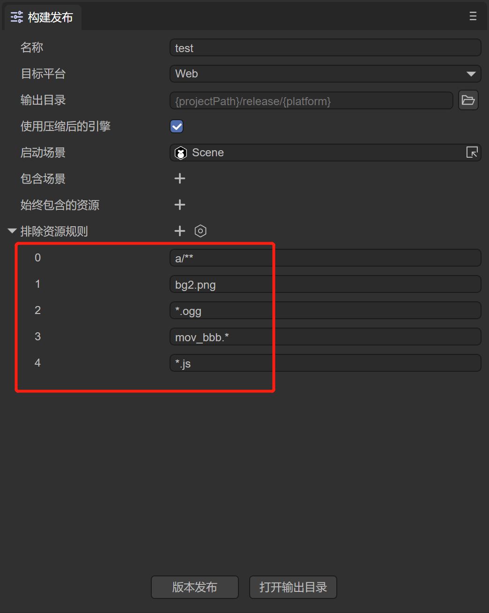

（图4-3）


点击发布后，上述bin文件夹下的原生资源都已经排除了，如图4-4所示： 

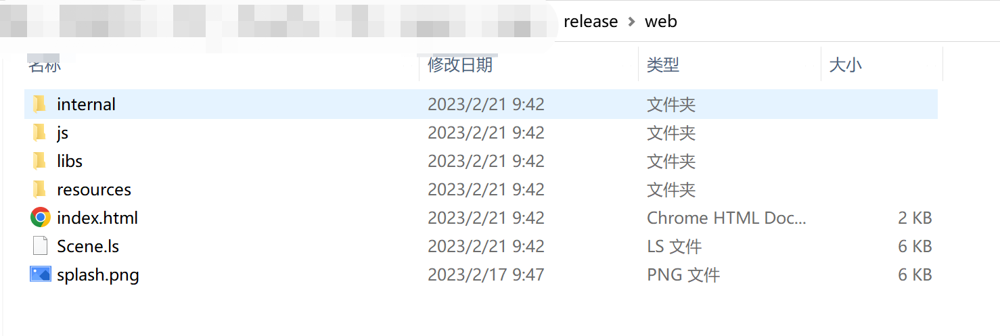

（图4-4）


推荐调用原生对象，下面来讲讲用LayaAir调用原生对象的好处。

我们来举一个例子 ，在bin目录下的index.html中加入一个img标签添加了一些样式，src指定为bin目录下的bg2.png，同时有点击图片隐藏图片的功能，如图4-5所示。发布后，这段DOM的代码也会一同发布到web目录下的index.html中。 

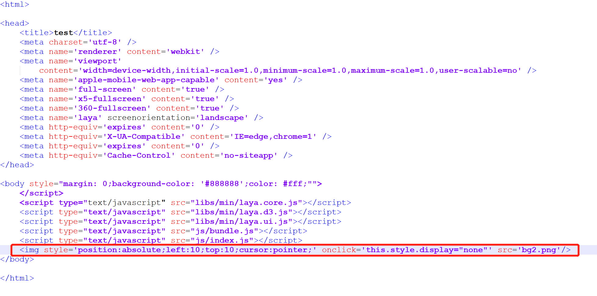

（图4-5）

我们运行web目录下的index.html是没有问题的，但是bg2.png必须放在bin目录下，如果项目的开发中也可能会使用到这张图，也就是说assets目录下也会同样存放一张bg2.png，那么开发者就需要在两个地方维护同样的图，造成了一定的麻烦。因此我们推荐开发者使用LayaAir提供的调用原生对象的方式来处理，代码如下：

```typescript
//创建原生img对象
let img:any = Laya.Browser.document.createElement("img");
//设置样式
img.style = "position:absolute;left:10;top:10;cursor:pointer;";
//指定资源地址
img.src = Laya.URL.postFormatURL(Laya.URL.formatURL("resources/bg2.png"));
//设置img元素的属性
img.setAttribute("onclick", "this.style.display=\'none\'");
//添加到页面
Laya.Browser.document.body.appendChild(img);
```

我们把bin目录下index.html中的DOM代码删掉，并且把bg2.png剪切到assets的resources目录下，再次发布

这种情况下，web目录下的index.html没有任何DOM代码了，bg2.png也在resources目录下只有一份，同时运行效果也与之前一样！

通过使用 **Laya.URL.postFormatURL(Laya.URL.formatURL("resources/bg2.png"));** 在IDE的预览时和发布后运行时，LayaAir引擎都会使用 resources/bg2.png 作为原生img的src的图片地址，开发者可以自己来试一试。

到这里，通过LayaAir调用原生对象的方式就介绍完了，开发者可以根据自己的需求来使用。

> 注意：beta5之前的老项目导入，需要手动删除bin里index.html，预览时会重新生成新的模板

