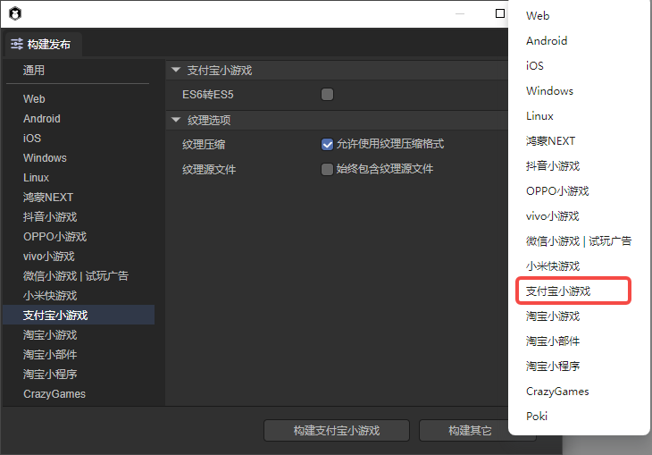
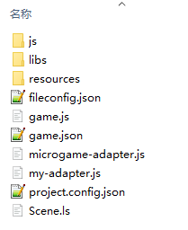
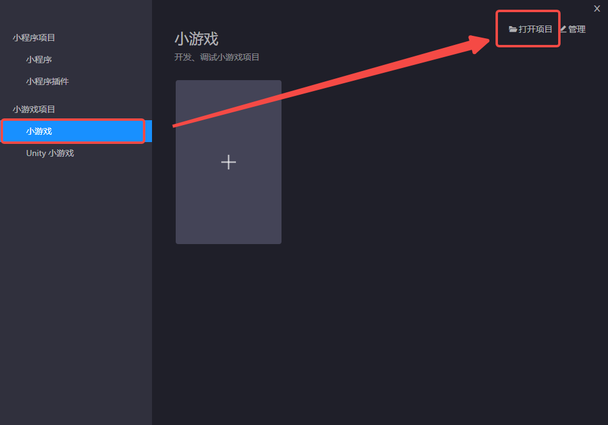
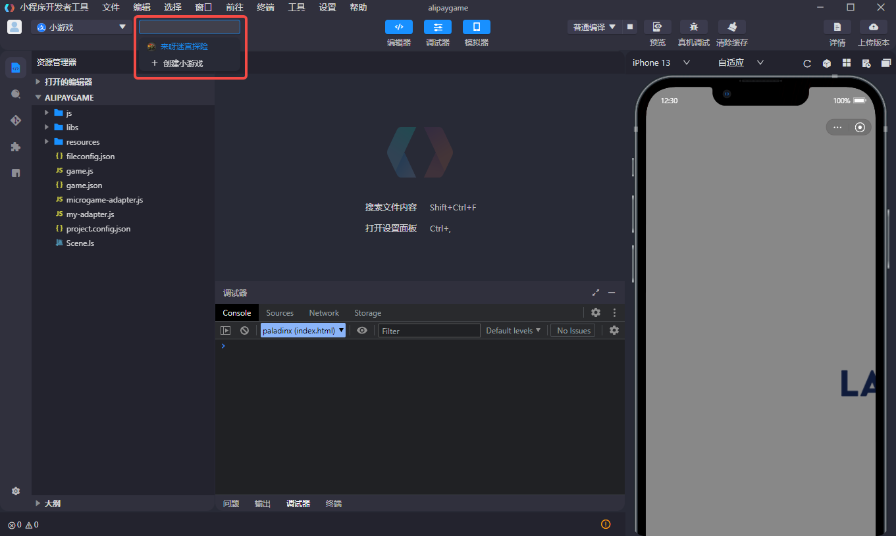
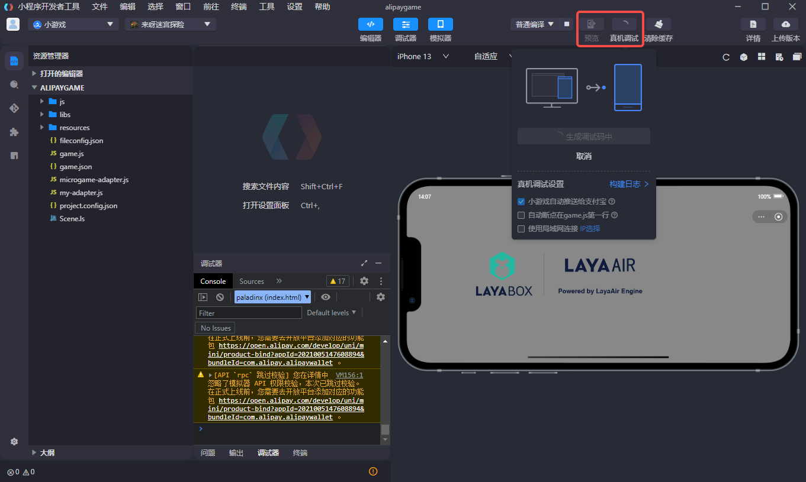
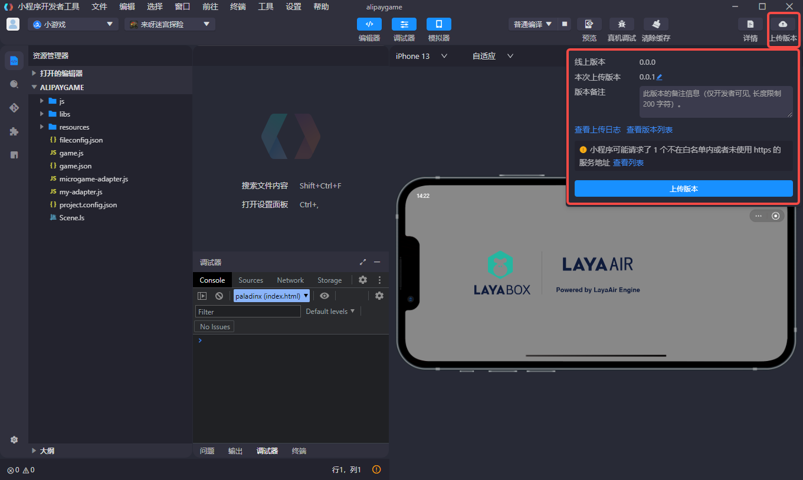
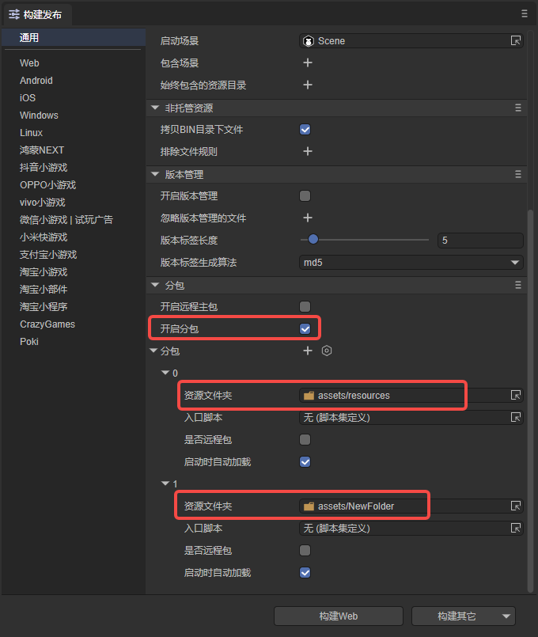

# 支付宝小游戏

## 一、概述

支付宝小游戏不需要用户进行下载，是点开即玩的全新游戏类型。

相较 APP，小游戏有着开发周期短、开发成本低等特性，能够让开发者更简单的参与到开发过程中。实现快速上线，快速变现。

推荐要看一下支付宝小游戏的[文档](https://opendocs.alipay.com/mini-game/08tzon)，文档中开始使用这部分可以帮助开发者快速学习如何发布上线小游戏项目。LayaAir引擎的文档更多的是引擎相关的内容。

>在支付宝小游戏发布前，需要先进行[通用](../../generalSetting/readme.md)设置。


## 二、构建发布为支付宝小游戏

### 2.1 选择目标平台

在构建发布面板中，侧边栏选择目标平台为支付宝小游戏。如图2-1所示，



（图2-1）

点击“构建支付宝小游戏”，或“构建其它”选项中的“支付宝小游戏”，即可发布项目为支付宝小游戏。

`ES6转ES5`：用于兼容某些旧机型，一般不用勾选。

`压缩纹理`：一般需要勾选“允许使用压缩纹理格式”，如果不勾选，则忽略所有图片对于压缩格式的设置。

`纹理源文件`：可以不勾选“始终包含纹理源文件”，如果勾选，则即使图片使用了压缩格式，仍然把源文件（png/jpg)打包。目的是遇到不支持压缩格式的系统时，fallback到源文件。


### 2.2 发布后的小游戏目录介绍

发布后的目录结构如图2-2所示 ：



（图2-2）

**js目录 与 libs目录**：

项目代码和引擎库。

**resources资源目录 与 Scene.ls**：

resources资源目录和场景文件Scene.ls，小游戏由于初始包的限制，建议将初始包的内容提前规划好，最好能放到统一的目录下，便于初始包的剥离。

**fileconfig.json**：

文件中包含了一些项目的配置信息。

**game.js**：

支付宝小游戏的入口文件，游戏项目入口JS文件与适配库JS等都是在这里进行引入。IDE创建项目的时候已生成好，一般情况下，这里不需要动。

**game.json**：

小游戏的配置文件，开发者工具和客户端需要读取这个配置，完成相关界面渲染和属性设置。

**microgame-adapter.js与my-adapter.js**: 

支付宝小游戏适配库文件，用于适配支付宝小游戏。

**project.config.json**：

小游戏的项目配置文件，文件里包括了小游戏项目的一些信息。


## 三、使用支付宝小游戏开发工具

调试LayaAir构建发布后的支付宝小游戏项目，还需要配置相关环境。步骤如下：

### 3.1 创建小游戏应用

无论是调试还是正式发布支付宝小游戏，首先需要创建一个小游戏应用。开发者可以参考[创建小游戏 - 支付宝文档中心](https://opendocs.alipay.com/mini-game/093ryh?pathHash=2f29f6ae)，创建小游戏应用。


### 3.2 安装小游戏开发工具

开发者可以前往[下载小程序开发者工具 - 支付宝文档中心](https://opendocs.alipay.com/mini/ide/download?pathHash=9ced7631)，下载小程序开发者工具，并进行安装。


### 3.3 打开创建好的项目

打开小程序开发者工具IDE，选择打开项目。



找到LayaAirIDE中构建发布好的项目，选择alipaygame文件夹。


点击完成，即可打开项目。


>注意：小游戏和小程序的项目结构是不一样的，两者并不通用，开发者要选择小游戏作为项目类型。


### 3.4 登录支付宝开发者账号

打开IDE之后，我们首先要登录支付宝开发者账号。在IDE左上角点击登录，并用手机支付宝扫描二维码进行登录。需要注意，这里使用的支付宝账号应是3.1章节中设置好的有项目开发权限的账号。


### 3.5 支付宝开发者工具的编译

完成小游戏项目的创建后，即可在支付宝开发者工具工具内预览效果和调试。


### 3.6 预览或真机调试

在开始预览或是真机调试之前，开发者要先选择该项目对应的小游戏是哪个。在IDE的左上角，选择需要的小游戏应用。



> 即使开发者没有选择小游戏项目，支付宝开发者工具也会提醒开发者进行选择。


由于LayaAirIDE里也可以调试项目效果，除非是适配相关的问题，基本上两边的效果不会有不一致的情况。因此这一步最重要的是点击预览或是真机调试功能，通过手机支付宝扫码或是直接推送的方式，在手机上进行调试。




### 3.7 上传与发布

若想将调试好的支付宝小游戏真正发布到线上，还需要上传和发布操作。

开发者可以在IDE右上角找到上传版本功能。



在上传完成后，小游戏项目还需要设置体验版，提交审核，灰度测试，上架小游戏等操作，具体的操作流程请参考[小游戏发布 - 支付宝文档中心](https://opendocs.alipay.com/mini-game/094o15?pathHash=af8f31f0)这篇文档。


## 四、分包加载

下面介绍LayaAir IDE给支付宝小游戏分包的方法，开发者可以先看一下[通用](../../generalSetting/readme.md)设置的分包。可以通过以下步骤进行分包加载，如图4-1所示，勾选开启分包，然后选择要分包的文件夹即可。开发者还可以选择是否开启远程包。



（图4-1）

>支付宝小游戏分包限制：
>
>- 整个小游戏所有主包+分包大小不超过 20M
>- 主包不超过 4M
>- 单个普通分包不限制大小
>
>请参考支付宝小游戏[分包加载 - 支付宝文档中心](https://opendocs.alipay.com/mini-game/08uo7z?pathHash=55a76c85)。

IDE自动加载分包需要在发布时勾选分包的“启动时自动加载”选项。如果是代码引用资源，方法与web发布略有不同，加载代码示例如下：

```typescript
const { regClass, property } = Laya;

@regClass()
export class Script extends Laya.Script {

    @property({ type: Laya.Scene3D })
    scene3d: Laya.Scene3D;

    constructor() {
        super();
    }

    // 组件被激活后执行，此时所有节点和组件均已创建完毕，此方法只执行一次
    onAwake(): void {

        //支付宝小游戏
        Laya.loader.loadPackage("sub1", this.printProgress).then(() => {
            Laya.loader.load("sub1/Cube.lh").then((res: Laya.PrefabImpl) => {
                let sp3: Laya.Sprite3D = res.create() as Laya.Sprite3D;
                this.scene3d.addChild(sp3);
            });
        })

        Laya.loader.loadPackage("sub2", this.printProgress).then(() => {
            Laya.loader.load("sub2/Sphere.lh").then((res: any) => {
                let sp3 = res.create();
                this.scene3d.addChild(sp3);
            });
        })
        
    }

    printProgress(res: any) {
        console.log("加载进度" + JSON.stringify(res));
    }

}
```

代码中`printProgress`会打印加载进度日志，效果如下所示：


（图4-2）

