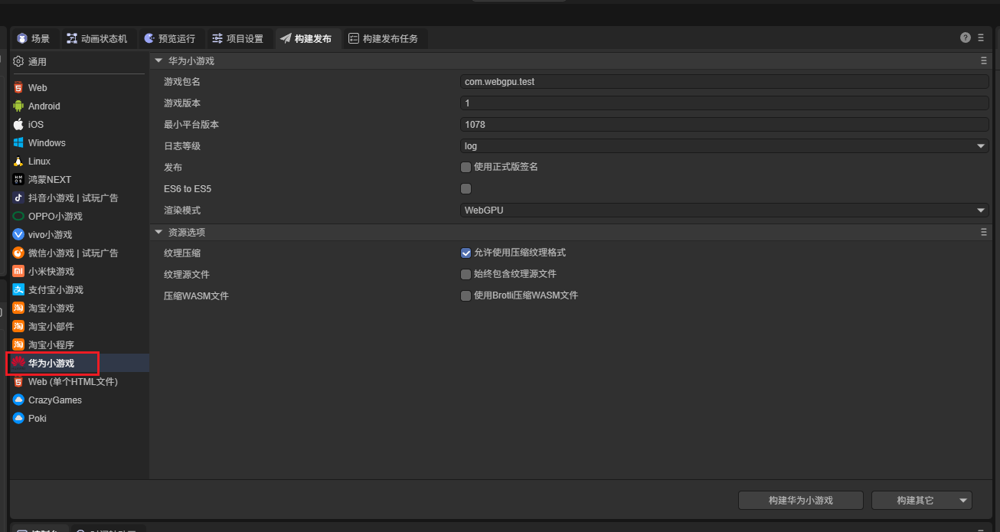
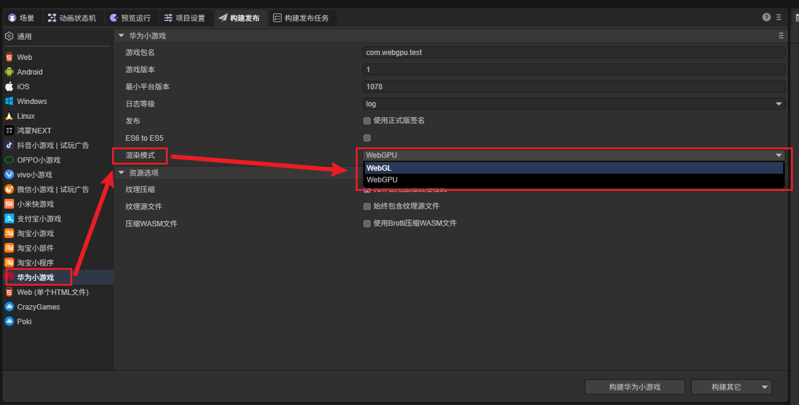
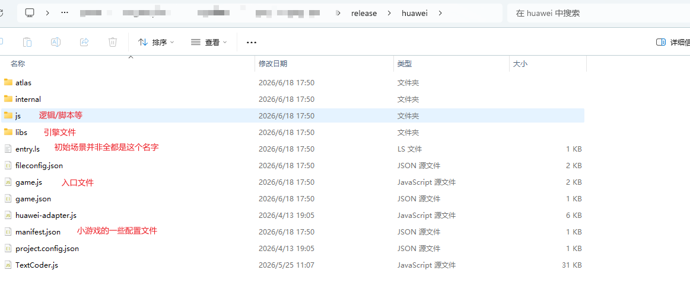
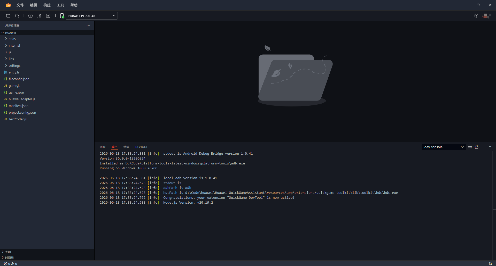
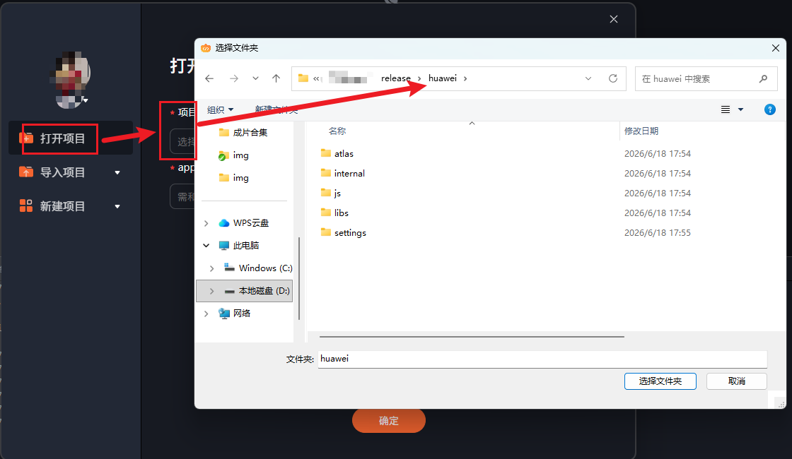
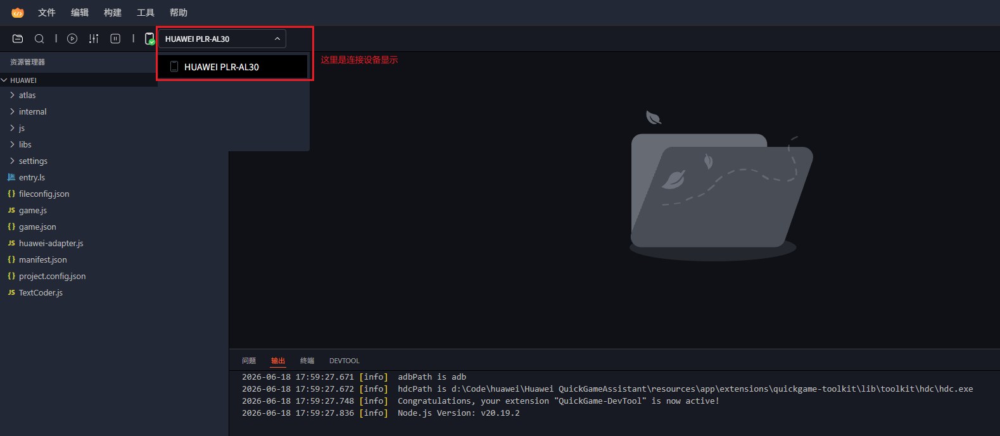
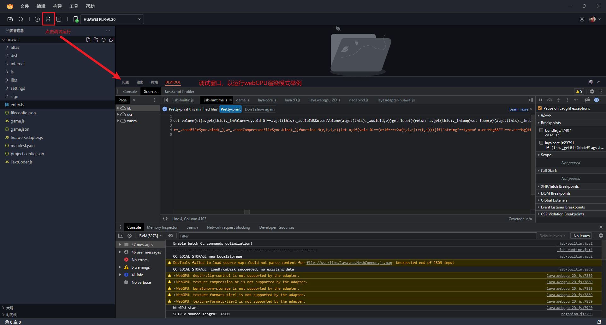
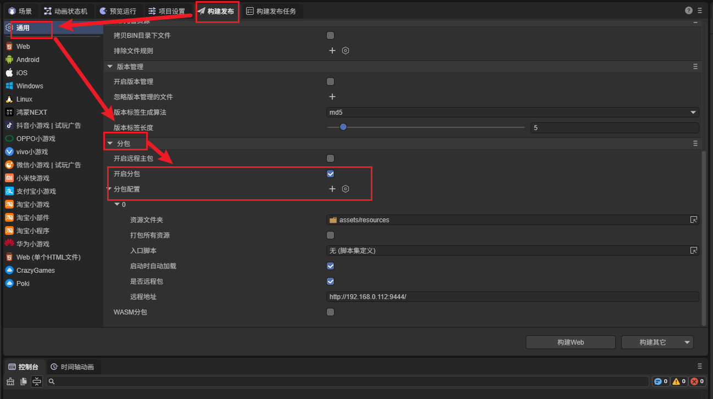

# 华为小游戏


## 一、概述

华为小游戏是一种免安装应用，开发一次即可分发到所有支持该标准的华为设备运行，采用鸿蒙渲染技术，具备即点即玩、自动更新、占用内存少等特点。其分发场景包括应用市场、快应用中心、花瓣轻游、桌面全局搜索等。

推荐开发者先查看华为[小游戏开发者文档](https://developer.huawei.com/consumer/cn/doc/quickApp-Guides/quickgame-dev-runtimegame-guide-0000001159778255)，LayaAir 引擎的文档更多是引擎相关的，华为平台接口与发布的更多细节请以华为官方文档为准。

华为小游戏的发布与调试主要依赖华为官方提供的可视化工具 **华为快游戏开发者工具**，它支持生成签名证书、调试、真机运行与发布。开发者在 LayaAir IDE 中配置参数并一键构建后，得到的是华为小游戏的**项目结构**（工程）；最终构建产物需要在华为快游戏开发者工具中生成。后续再用华为开发者工具打开该工程进行调试与发布，具体见第三节。

> 与其它小游戏平台一样，华为小游戏发布前需要先进行[通用](../../generalSetting/readme.md)设置。
>
> **【华为特有】** 华为小游戏在发布时提供了 **WebGL 与 WebGPU 两种渲染模式**，需要根据目标机型与平台版本选择，详见 2.2 节。


## 二、发布为华为小游戏

### 2.1 选择目标平台

在构建发布面板中，侧边栏选择目标平台为华为小游戏。如图2-1所示，



（图2-1）

点击“构建华为小游戏”，或“构建其它”选项中的“华为小游戏”，即可发布项目为华为小游戏。

下面介绍一下这些功能参数的填写：

> 从LayaAir3.2开始，游戏名称、游戏图标、游戏版本名称（版本）都在通用设置中进行配置。

**游戏包名**

游戏包名的格式是 `com.company.module` 第一位com不要变，第二位是公司名，第三位是项目名。都要写英文，例如：`com.layabox.demoGame`。

**游戏版本**

游戏版本与版本名称用处不同，这里是渠道平台用于区别版本更新。每次提审都要至少递归+1，自己测试无所谓。但是提审这里的值必须要比上次提审的值至少要+1，+N也是可以的，绝对不能等于或者小于上个版本值，建议是提审版本号递归+1。这里需要注意的是，游戏版本必须为正整数。

**最小平台版本**

最小平台版本，按调试器上显示的平台版本号填写即可。

**日志等级**

日志等级用于控制运行日志的输出粒度，对应 `manifest.json` 中 `config.logLevel`，可选 `off`、`error`、`warn`、`info`、`log`、`debug`，方便了解当前程序的运行状态。

**ES6 to ES5**

是否开启 ES6 转 ES5。开启后会将 ES6 语法转换为 ES5，以兼容部分较低版本的运行环境；如果确认目标环境均支持 ES6，可不开启以减少转换开销。

**渲染模式**

华为小游戏特有的配置项，提供 **WebGL** 与 **WebGPU** 两种渲染模式可选，详见 2.2 节。

**是否使用正式版签名**

如果只是测试版本调试，这里可以不用勾选。正式上线发布前（提版本到平台）必须勾选。

如果勾选了，就会启用正式版签名。关于release签名:

①对于公司,一般一个公司只用一个签名，如果公司已经有签名了，推荐使用公司的签名。如果没有的话，IDE中的发布集成了这个功能，方便开发者生成签名（华为快游戏开发者工具也提供了生成签名证书的能力）。

②对于个人开发者，可以多个项目使用一个正式签名。只需要生成一次即可。

如果已经release签名了，将签名文件放到Laya项目 sign/release 文件夹下。

**压缩纹理**

`压缩纹理`：一般需要勾选“允许使用压缩纹理格式”，如果不勾选，则忽略所有图片对于压缩格式的设置。

`纹理源文件`：可以不勾选“始终包含纹理源文件”，如果勾选，则即使图片使用了压缩格式，仍然把源文件（png/jpg)打包。目的是遇到不支持压缩格式的系统时，fallback到源文件。


### 2.2 渲染模式切换：WebGL 与 WebGPU

华为小游戏在 LayaAir IDE 的发布面板中提供了 **渲染模式** 配置项，可在 **WebGL** 与 **WebGPU** 之间切换，如图2-2所示。



（图2-2）

- **WebGL**：兼容性更好，适用于绝大多数机型，作为默认/兜底的渲染模式。
- **WebGPU**：可获得更好的渲染性能，但对系统与小游戏服务版本有要求，仅在满足条件的设备上才能运行。

**WebGPU 的支持判断（建议）**

是否使用 WebGPU 版本由小游戏原生平台决定，开发者可参考以下方式判断当前设备是否适合运行 WebGPU：

- `navigator.gpu` 是否存在；
- `qg.getSystemInfoSync()` 返回的 `coreVersion` 是否大于 `1001`。

以上仅作为建议性的判断依据，可据此决定是否启用 WebGPU 渲染模式。

**建议运行环境**

建议在 **鸿蒙5 + 小游戏服务 15.5.2.300** 及以上的环境下使用 WebGPU 渲染模式；更早期的版本可能也可以运行，但可能存在问题，不建议使用。

**运行时的控制台区别**

发布并运行后，可以通过开发者工具控制台（或真机日志）观察当前实际运行的渲染端，从而确认运行的是 WebGL 还是 WebGPU 版本。开发者可在控制台打印 `Laya.LayaGL.renderEngine`，根据返回的渲染引擎对象判断当前的运行渲染端：

```javascript
console.log(Laya.LayaGL.renderEngine);
```


### 2.3 构建后的项目目录介绍

点击构建后，LayaAir IDE 生成的是华为小游戏的项目结构（工程），**并非最终的 rpk 包**；rpk 包需要在华为快游戏开发者工具中生成（见第三节）。

构建后的项目目录结构如图2-3所示：



（图2-3）

**js目录 与 libs目录**：

项目代码和引擎库。

**resources目录 与 Scene.ls**：

resources资源目录和场景文件Scene.ls，小游戏由于初始包的限制，建议将初始包的内容规划好，最好能放到统一的目录下，便于初始包的剥离。

**game.js**：

华为小游戏的主包入口文件，游戏项目入口JS文件与适配库JS等都是在这里进行引入。IDE创建项目的时候已生成好，一般情况下，这里不需要动。

**manifest.json**：

小游戏的项目配置文件，文件里包括了小游戏项目的一些信息（详见 2.4 节），如果想修改，可以直接在这里面编辑。


### 2.4 manifest.json 配置说明

`manifest.json` 配置文件包含了小游戏描述、接口声明、页面路由等信息。IDE 发布时会自动生成，开发者也可按需手动编辑。主要属性如下：

| 属性 | 类型 | 必填 | 描述 |
| --- | --- | --- | --- |
| `package` | string | M | 小游戏包名 |
| `name` | string | M | 小游戏名称 |
| `appType` | string | M | 应用类型，小游戏填写 `fastgame` |
| `icon` | string | M | 小游戏图标，必须与 AGC 控制台上架审核的图标保持一致 |
| `versionName` | string | O | 应用版本名称，例如“1.0” |
| `versionCode` | integer | M | 应用版本号，从 1 自增，每次重新上传包后必须 +1，否则影响上架版本更新 |
| `minPlatformVersion` | integer | M | 支持的最小平台版本号，默认值 1000，用于兼容性检查 |
| `config` | object | M | 系统配置信息，含日志等级 `logLevel`（取值见上文“日志等级”） |
| `display` | object | O | UI 显示配置，如 `backgroundColor`、`fullScreen`、`orientation`（`portrait`/`landscape`/`auto`）、`pages` 等 |
| `subpackages` | object | O | 定义并启用分包加载，详见第四节 |

> `minPlatformVersion` 说明：若小游戏引擎低于该值，打开快应用中心或花瓣轻游时将弹框提示用户更新到最新版本；若用户选择不更新，将直接退出。

配置示例：

```json
{
  "package": "com.company.unit",
  "name": "appName",
  "icon": "/Common/icon.png",
  "versionName": "1.0",
  "versionCode": 1,
  "minPlatformVersion": 1000,
  "config": {
    "logLevel": "off"
  },
  "display": {
    "backgroundColor": "#ffffff",
    "fullScreen": false,
    "pages": {
      "Hello": {
        "backgroundColor": "#eeeeee",
        "fullScreen": true
      }
    }
  },
  "subpackages": [
    { "name": "pkgA", "resource": "PackageA" },
    { "name": "pkgB", "resource": "PackageB" }
  ]
}
```

更多 `manifest.json` 属性请参见华为官方[小游戏开发者文档](https://developer.huawei.com/consumer/cn/doc/games-guides/games-quickgame-manifest-0000002351944509)。


## 三、使用华为开发者工具调试

华为官方提供了可视化的 **快游戏开发者工具**，支持 Windows 与 Mac 系统，集成了生成签名证书、调试、真机运行与发布等能力，可直接用它完成调试。

### 3.1 下载与环境要求

从华为官网下载并安装[快游戏开发者工具](https://developer.huawei.com/consumer/cn/doc/quickApp-Guides/quickgame-tool-download-0000001166035569)（该下载页内同时附有工具的使用说明）。

> **版本要求**：仅 **15.0.2.300 及以上**版本的小游戏服务支持快游戏开发者工具运行调试。小游戏服务版本查看路径：手机“设置”APP → 应用与服务 → 右上角四点“更多应用” → 小游戏服务。若版本低于该要求，请通过“应用市场”的“闲时更新”或更新手机系统进行升级。

### 3.2 开发者工具界面

快游戏开发者工具包括向导界面与主界面：

- **向导界面**：打开项目、新建项目。
- **主界面**：包括菜单区、快捷运行区、资源区、编码区、控制台区。其中菜单栏包含“文件、编辑、构建、工具、帮助”等功能，可在“工具”中生成证书、进行游戏性能调优等。



（图3-1）

### 3.3 导入工程并真机调试

在开发者工具中打开 LayaAir 发布生成的华为小游戏工程后，即可进行编译、真机运行与调试：

1、在开发者工具向导界面点击“打开项目”，选择 LayaAir 项目导出的路径，打开该工程。如图3-2所示。



（图3-2）

2、用数据线连接华为手机（开启开发者模式与 USB 调试），通过快捷运行区进行真机运行。如图3-3所示。



（图3-3）

3、运行后，可在控制台区查看日志、进行调试；也可使用“工具”菜单中的游戏性能调优等能力。如图3-4所示。



（图3-4）

> 快游戏开发者工具调试小游戏的详细流程，请参见华为官方文档[调试小游戏](https://developer.huawei.com/consumer/cn/doc/quickApp-Guides/quickgame-tool-debug-quickgame-0000002534142087)。


## 四、分包加载

对于包内资源较为丰富的华为小游戏，华为提供了分包策略：将包体按规则拆分为一个主包和若干分包，玩家进入游戏时仅下载、加载主包，游戏过程中再按需触发其它分包的下载，从而缩短进入游戏的时间、减少流量消耗。开发者可以先看一下[通用](../../generalSetting/readme.md)设置的分包。

> 华为小游戏分包大小限制：
>
> - 小游戏总包体大小不超过 **30MB**（不区分是否接入华为支付）。
> - 主包体大小不超过 **4MB**。
> - 单个普通分包不限制大小。
>
> 说明：已在架小游戏目前仅要求包体大小超过 20MB 的必须分包。详细请参考华为官方[分包加载](https://developer.huawei.com/consumer/cn/doc/games-guides/games-quickgame-subpackage-0000002317894828)文档。

> 注意：若打包后的包体大于 30MB，请先使用引擎提供的分包模式，将各分包内的资源文件放至远程服务器，缩小包体体积。

在 LayaAir IDE 中分包，如图4-1所示，点击开启分包后，选择要进行分包的文件夹即可。在设置时需要注意，如果是代码加载的资源、在场景里没有引用，那么一定要添加到`始终包含的资源目录`。



（图4-1）

发布后，IDE 会按所选的分包文件夹在 `manifest.json` 中自动生成 `subpackages` 配置，没有配置在其中的目录文件将统一打包成主包。

> 注意：华为分包内可以有若干个 js 文件，但**每个分包的入口文件只能命名为 `game.js`**，且 `game.js` 不能单独作为一个分包。

底层由华为的 `qg.loadSubpackage` 接口触发分包下载，LayaAir 引擎已封装为 `Laya.loader.loadPackage`，代码加载分包示例如下：

```typescript
//小游戏加载分包
Laya.loader.loadPackage("sub1", this.printProgress).then(() => {
    Laya.loader.load("sub1/Cube.lh").then((res: Laya.PrefabImpl) => {
        let sp3: Laya.Sprite3D = res.create() as Laya.Sprite3D;
        this.scene3d.addChild(sp3);
    });
})
```
