# APP扫码运行器

## 一、前言

在使用LayaAir引擎开发手机端游戏时，开发者需要通过引擎的构建发布功能打包游戏，然后发布到手机上的对应平台进行运行。这一流程在一般情况下没有什么问题，但如果开发者想要频繁调整游戏效果，并在手机中进行查看，那每次更新游戏内容都需要重新打包的流程就会显得很慢。

为了解决这个问题，LayaAirIDE提供了扫码运行器功能，开发者在手机中安装扫码运行器，即可直接扫码运行。

**Tips：确保测试机与电脑在同一个局域网内方可进行测试**

## 二、安装扫码运行器

点击移动端预览按钮，然后点击运行器即可打开安装运行器用的二维码：

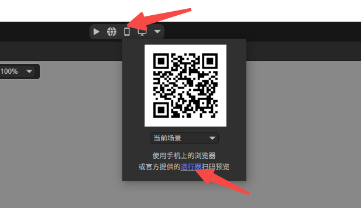

打开后的二维码：

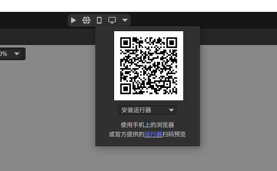

安卓端和ios端安装的流程有所不同，这里分别进行说明。

### 2.1 安卓端

直接用android手机进行扫码，点击apk进行安装即可。

**Tips：如果使用微信扫码，由于微信的安全设置，扫码后需要复制链接地址到手机浏览器中进行下载。**

### 2.2 iOS版本的下载和安装

　　用微信扫码后，点击“在Safari中打开”，在Safari浏览器中打开后点击**Install**按钮，然后点击安装即可，如下图所示：

**步骤1：**

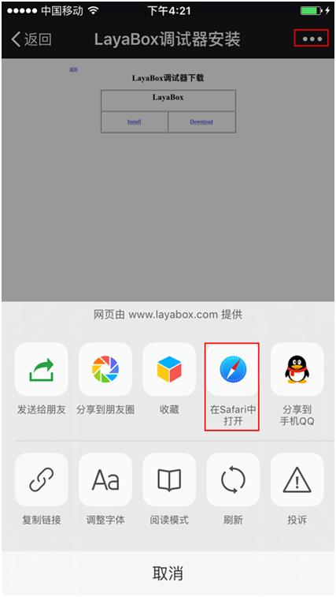

 图1

**步骤2：**

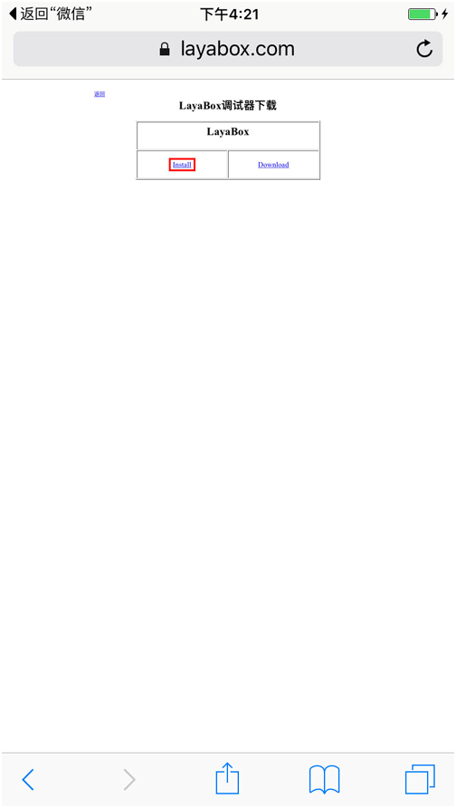

图2

**步骤3：**

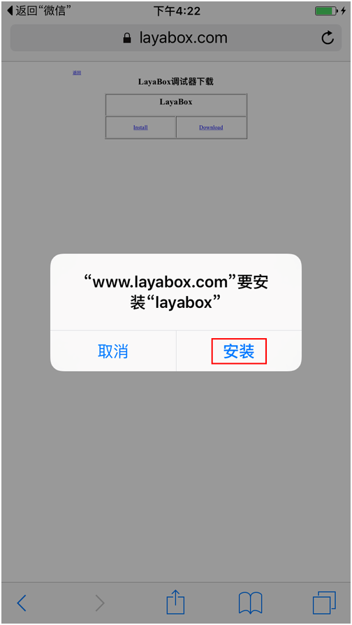

图3

**Tips：**

点击安装后，这里没有自动跳转功能，需要手动去系统桌面上看一下，是否存在Layabox的应用正在安装，如果正在安装，就等待安装结束后进行下一步操作。

**步骤4：**

安装成功后，点击运行会弹出”未受信任的企业开发者”，这个时候需要开发者自己进行设置一下。

点击”设置”—>”通用”—>”设备管理”—>”点击LayaBox Network Technology..”—>”点击信任”。

之后再打开LayaBox测试App就可以正常使用了，具体步骤如下所示：

**步骤5：**

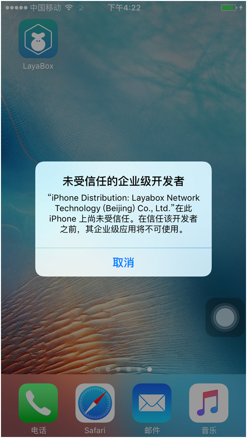

 图4

**步骤6：**

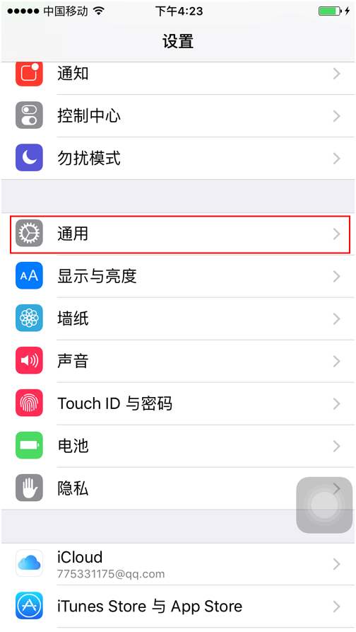

 图5

**步骤7：**

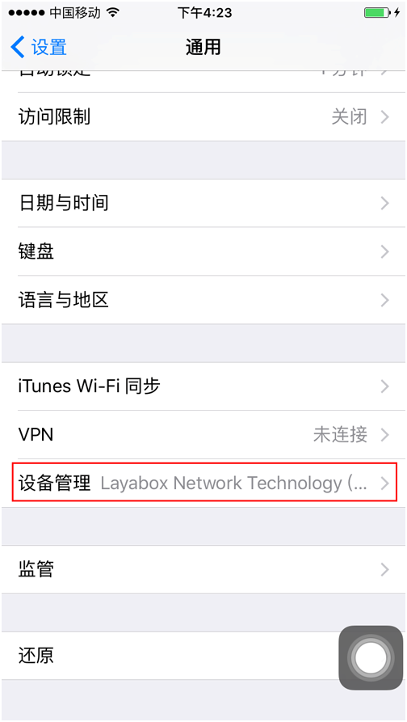

图6

**步骤8：**

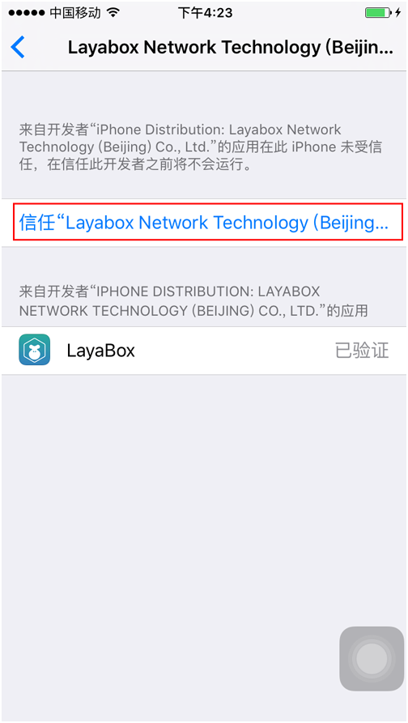

 图7

**步骤9：**

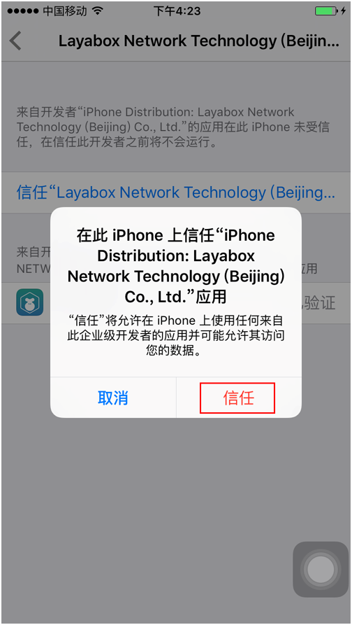

## 三、使用测试App进行项目的测试

**步骤1：**

打开应用之后，会看见如图8的界面：

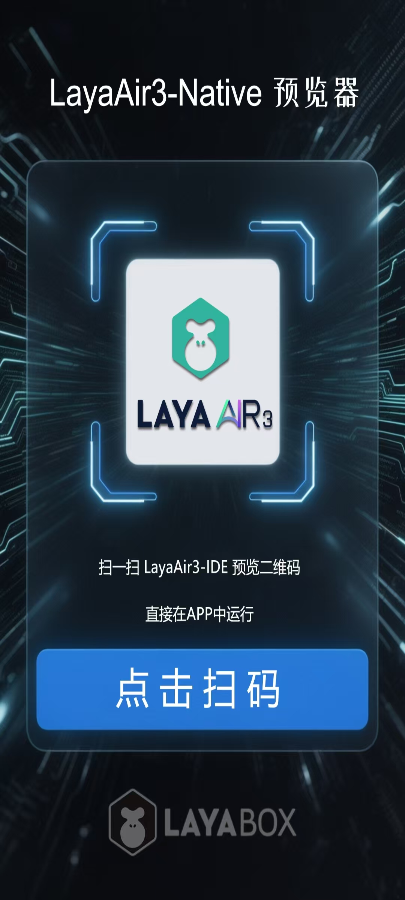

图8

**步骤2：**

使用LayaAirIDE打开案例项目，点击菜单栏最右侧的二维码图标 ，显示项目的二维码界面(如图9)。

图9

**步骤3：**

点击测试APP内的点击扫码（图10），**确保测试手机与项目所在电脑在同一个局域网下**，即可开启测试。

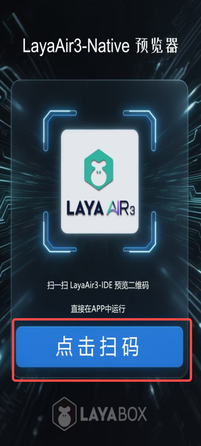

图10

扫码成功后，测试App会运行案例项目。

## 四、建议

　　建议开发者学习一下android和ios开发的基本知识，使用过程中可以把移动设备连接到电脑上，随时查看log，log中有很多重要的信息，可以帮助开发者定位问题。比如：非utf8格式编码的文件名字、网络错误、下载错误等等。

