# 淘宝小游戏

>Version >= LayaAir 3.1.1

## 一、概述

淘宝小游戏是指开发者基于[淘宝开放平台](https://open.taobao.com/)开发，直接投放至手淘、猫客、淘特等消费者端为淘宝、淘特消费者提供各年龄段适用游戏，包含养成类、益智类、合成类、建造类等。

推荐开发者查看淘宝官方对于[小游戏的介绍](https://open.taobao.com/v2/doc#/abilityToOpen?docType=1&docId=121009&treeId=804)，能够了解应用场景、查看接入指南等。还可以浏览一下淘宝官方的[开发指南](https://open.taobao.com/v2/doc#/abilityToOpen?treeId=776&docId=119114&docType=1)。

**下载并安装淘宝开发者工具**

[淘宝开发者工具](https://developer.taobao.com/)主要用于小游戏产品的预览与调试、真机测试、上传提交等。是淘宝小游戏开发的必备工具。

> 在淘宝小游戏发布前，需要先进行[通用](../../generalSetting/readme.md)设置。


## 二、发布为淘宝小游戏

### 2.1 选择目标平台

在构建发布面板中，侧边栏选择目标平台为淘宝小游戏。如图2-1所示，


（图2-1）

点击“构建淘宝小游戏”，或“构建其它”选项中的“淘宝小游戏”，即可发布项目为淘宝小游戏。

`压缩纹理`：一般需要勾选“允许使用压缩纹理格式”，如果不勾选，则忽略所有图片对于压缩格式的设置。

`纹理源文件`：可以不勾选“始终包含纹理源文件”，如果勾选，则即使图片使用了压缩格式，仍然把源文件（png/jpg)打包。目的是遇到不支持压缩格式的系统时，fallback到源文件。


### 2.2 发布后的小游戏目录介绍

发布后的目录结构如图2-2所示 ：


（图2-2）

**js目录 与 libs目录**：

项目代码和引擎库。

**resources目录 与 Scene.ls**：

resources资源目录和场景文件Scene.ls，小游戏由于初始包的限制，建议将初始包的内容在规划好，最好能放到统一的目录下，便于初始包的剥离。

**game.js**：

淘宝小游戏的入口文件，游戏项目入口JS文件与适配库JS等都是在这里进行引入。IDE创建项目的时候已生成好，一般情况下，这里不需要动。

**game.json**：

小游戏的配置文件，开发者工具和客户端需要读取这个配置，完成相关界面渲染和属性设置。比如屏幕的横竖屏方向。

**mini.project.json**：

小游戏的项目配置文件，文件里包括了小游戏项目的一些信息，如果想修改，可以直接在这里面编辑。

**my-adapter.js**：

淘宝小游戏适配库文件。


## 三、使用淘宝开发者工具创建小游戏项目

### 3.1 账号准备

预览和调试淘宝小游戏时，需要进行入驻。开发者需要登录[淘宝开放平台](https://open.taobao.com/)，登录自己的开发者账号（淘宝账号）并创建应用。具体的操作可以参考官方的[文档](https://open.taobao.com/doc.htm?docId=121007&docType=1&spm=0.0.0.0.qtzgFm)，入驻成功后就可以进行后续的步骤。


### 3.2 导入项目

在LayaAir IDE中创建并发布淘宝小游戏项目后，打开淘宝开发者工具，在侧边栏选择小游戏，点击打开项目，如图3-1所示，

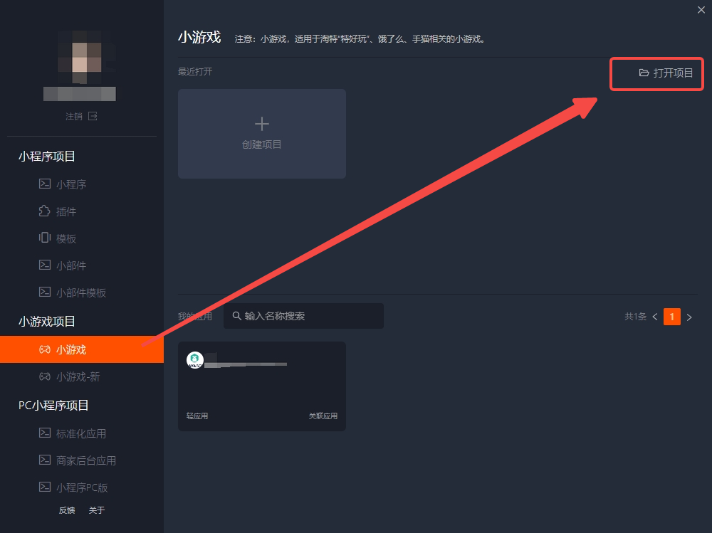

（图3-1）

然后，选择项目路径，项目类型选择“小游戏-新”一栏的选项，关联应用则是在3.1节中创建的应用，最后点击确定打开项目。

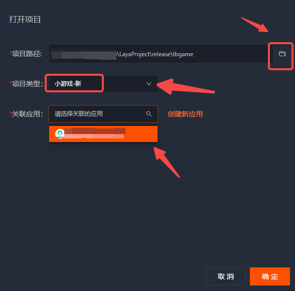

（图3-2）


### 3.3 真机测试与调试

打开淘宝开发者工具后，一般预览时都要勾选云构建，如图3-3所示，


（图3-3）

然后就可以进行预览和真机调试了。如图3-4所示，点击调试按钮，等待二维码生成，使用手机淘宝APP扫码即可。


（图3-4）


## 四、分包加载

下面介绍LayaAir IDE给淘宝小游戏分包的方法，开发者可以先看一下[通用](../../generalSetting/readme.md)设置的分包。可以通过以下步骤进行分包加载，如图4-1所示，勾选开启分包，然后选择要分包的文件夹即可。开发者还可以选择是否开启远程包。


（图4-1）

需要注意，远程包的地址需要使用“阿里云的CDN地址”或“在[淘宝开放平台](https://open.taobao.com/)上创建的应用中进行白名单的配置”。所以，远程包地址如果是本地服务器地址会报错，出现下载失败等情况。因此，最好使用https的外部服务器资源地址，并添加到小游戏后台的白名单作用域上。

> 淘宝小游戏分包限制：
>
> 1）整个小程序所有分包大小不超过20MB。
>
> 2）单个分包或主包大小不能超过2MB。
>
> 请参考淘宝小游戏[官方文档](https://open.taobao.com/v2/doc#/abilityToOpen?docId=119146&docType=1)。

### 4.1 推荐使用根目录进行分包

一般来说，在进行图4-1所示的分包时，通常选取的sub1和sub2是资源根目录（assets目录下），如图4-2所示，

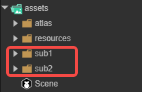

（图4-2）

其发布后的情况如图4-3所示（sub1和sub2都作为根目录）。

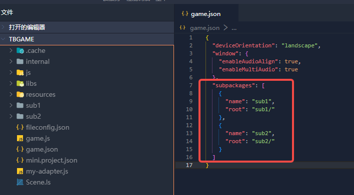

（图4-3）

此时，在代码中加载分包，是可以加载到分包内的资源的：

```typescript
        Laya.loader.load("sub1/Cube.lh").then((res: Laya.PrefabImpl) => {
            // ......
        });

        Laya.loader.load("sub2/Sphere.lh").then((res: Laya.PrefabImpl) => {
            // ......
        });
```


### 4.2 特殊情况下多级目录的分包

有时开发者的分包选取的并不是资源根目录（assets目录下），如图4-4所示，

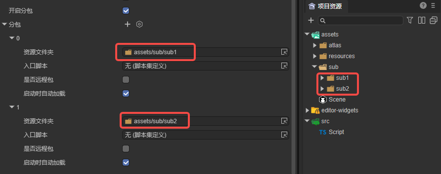

（图4-4）

这样分包，发布后的结果如图4-5所示（sub1和sub2都不是根目录），

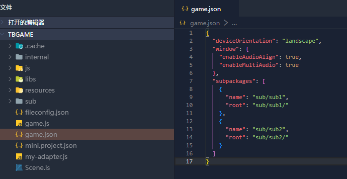

（图4-5）

此时，在代码中加载分包：

```typescript
        Laya.loader.load("sub/sub1/Cube.lh").then((res: Laya.PrefabImpl) => {
            // ......
        });

        Laya.loader.load("sub/sub2/Sphere.lh").then((res: Laya.PrefabImpl) => {
            // ......
        });
```

在真机调试的时候，会编译报错，如图4-6所示。


（图4-6）

这是由于淘宝小游戏的限制，所以开发者在发布后，需要更改game.json中的内容，如图4-7所示，将name改为单一目录名。

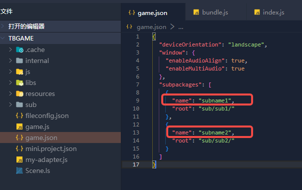

（图4-7）

此时，在代码中加载分包，不要通过路径加载，而改为使用分包名进行加载：

```typescript
        Laya.loader.load("subname1/Cube.lh").then((res) => {
            // ......
        });

        Laya.loader.load("subname2/Sphere.lh").then((res) => {
            // ......
        });
```

还需要注意的是，在构建发布时勾选了`启动时自动加载`选项，需要将自动加载的分包路径更改为分包名，如图4-8所示。

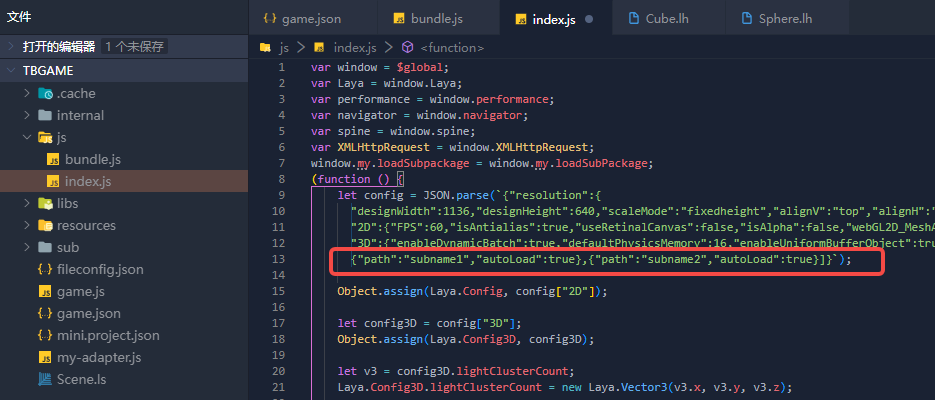

（图4-8）

另外，更改分包名后，如果在分包中的资源有引用resources目录下的资源，需要注意层级关系，如图4-9所示。所以，不建议开发者在分包中引用其它目录下的资源。

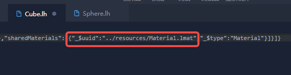

（图4-9）

综上，如果采用4.2节的方式分包，在发布后需要手动更改分包名。因此，建议开发者在管理资源时，就按照4.1节的方式进行规划，这样便于最终的分包。


## 五、高性能模式切换

### 5.1 什么是高性能模式

为提升小游戏在手机淘宝中的运行性能，淘宝推出了高性能模式，游戏经过简单的适配，即可大幅提升流畅度。普通模式下，iOS机型面对计算密集型任务时可能存在耗时较久、导致加载界面卡死的问题，切换到高性能模式即可解决。

高性能模式与普通模式的能力基本一致，但有以下几点区别需要注意：

- **基础库依赖**：普通模式容器依赖基础库，调用 `my.createRewardedAd`、`my.tb.virtualTrade` 等接口会有基础库版本限制；高性能模式容器不再依赖基础库，调用上述接口不再有版本限制。
- **回访能力**：高性能模式不支持 widget，接入后的回访能力请改为接入“添加到桌面快捷方式”。
- **云存档**：高性能模式已支持云存档能力，详情参考淘宝“云存档（新游戏）”接入文档。
- **机型限制**：暂不支持鸿蒙机型，最新支持情况请咨询游戏接入运营。

> 本节内容依据淘宝官方[高性能模式文档](https://miniapp.open.taobao.com/doc.htm?docId=122003&docType=1&tag=game-dev)整理，更多细节请以官方文档为准。


### 5.2 高性能模式的连接

开启高性能模式后，**模拟器调试与普通模式没有区别**，需要通过真机来验证是否真正运行在高性能模式下。无论是预览还是调试，都可以通过扫描二维码进入游戏。

**真机调试的平台差异需要注意：**

- **iOS**：高性能模式下**暂不支持真机调试**，只能通过控制台观察日志进行排查。
- **安卓**：高性能模式下支持真机调试，可利用 vConsole 进行调试，方便调试小游戏。安卓真机调试效果如图5-4所示。

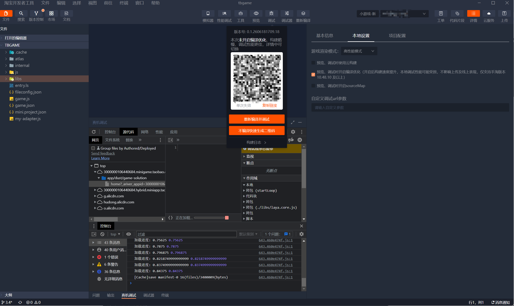

（图5-4）

**是否处于高性能模式的判定步骤：**

1、在 IDE 中扫描真机预览码（注意是真机预览，不是模拟器），如图5-1所示。

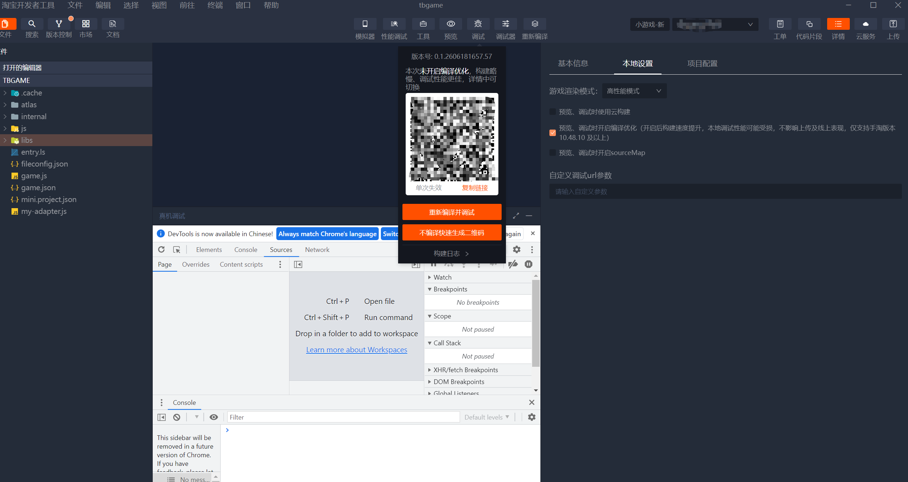

（图5-1）

2、观察游戏画面角落是否出现 vConsole 浮标（可点击展开日志面板）。**浮标存在表示运行于高性能模式，浮标缺失则表示运行于普通模式**，如图5-2所示。

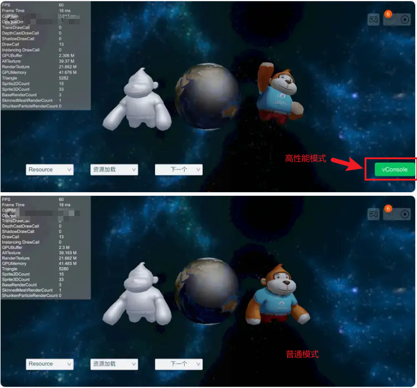

（图5-2）

> 注意：以上判定方法仅限本地调试预览，上传发布后的体验版本与线上版本不存在该浮标差别。

高性能模式下的真机调试目前**仅支持 Android**（需最新的安卓手淘包），具体的 IDE 真机调试流程可参考淘宝官方文档：[高性能小游戏 IDE 真机调试](https://miniapp.open.taobao.com/doc.htm?docId=122327&docType=1&tag=game-dev)。


### 5.3 高性能模式的启动条件

开启高性能模式需要满足以下运行环境要求：

| 项目 | 要求 |
| --- | --- |
| 手淘版本 | **>= 10.46.0**，建议直接更新至最新版本。不满足时会自动降级进入普通模式（查看路径：我的淘宝 - 设置 - 关于淘宝） |
| 淘宝开发者工具 | 建议 **>= 3.0.9**，或直接更新至最新版本（查看路径：淘宝开发者工具 - 关于） |
| minigame-biz 插件 | 需安装小游戏新插件，参考淘宝[IDE 安装小游戏新插件](https://miniapp.open.taobao.com/doc.htm?docId=122326&docType=1&tag=game-dev)文档 |
| 机型 | 暂不支持鸿蒙机型 |

**内存与存储限制（务必注意）：**

- 高性能模式下内存要求更加严格，触及内存告警水位会在游戏运行时弹出“内存不足”提示。请做好内存优化，建议采用压缩纹理等方案。
- 淘宝小游戏对游戏存储空间有 **200MB 限制**，超出后磁盘的写入、解压等操作会失败。游戏上线前需针对该情况进行测试，可在遇到磁盘错误时手动调用清理接口请求玩家清理，或向平台申请进入游戏时自动清理。


### 5.4 高性能模式的切换方式

**开启方式：** 进入淘宝开发者工具的 IDE 详情页，点击“游戏渲染模式”下拉框，选择「高性能模式」即可，如图5-3所示。

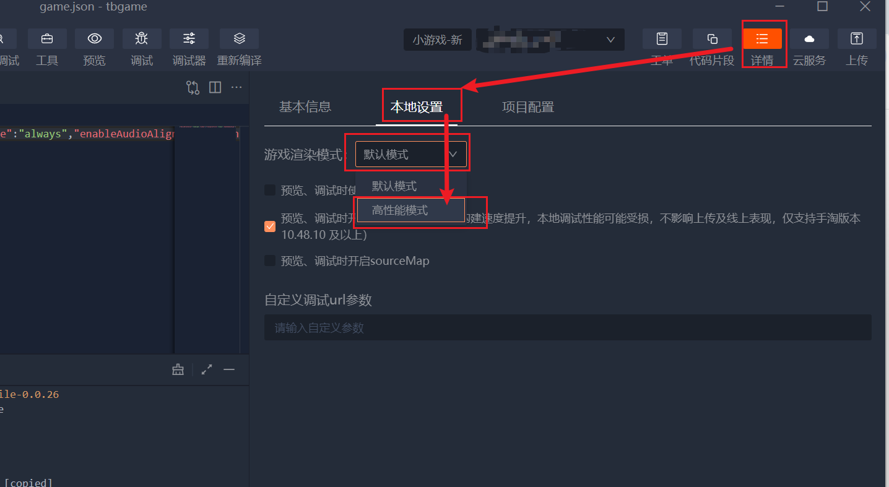

（图5-3）

**游戏适配：** 正常情况下游戏无需改造即可无缝切换到高性能模式，但仍有少量声明和适配点：

1、**环境判断**：淘宝原生通过 `my.env.isHighPerformanceMode` 判断当前运行时是否处于高性能模式；LayaAir 引擎也封装了 `Laya.Browser.isIOSHighPerformanceMode` 用于判断，对 LayaAir 开发者更为推荐。可据此针对性地做适配：

```javascript
// LayaAir 引擎封装（推荐）
if (Laya.Browser.isIOSHighPerformanceMode) {
    // 这里可以针对高性能模式做一些针对性的适配
}

// 淘宝原生接口
if (my.env.isHighPerformanceMode) {
    // 这里可以针对高性能模式做一些针对性的适配
}
```

2、**严格模式**：业务代码的 JS 需要开启严格模式。

3、**渲染差异**：压缩纹理推荐使用 ASTC 格式，以优化内存占用。


## 六、Q&A

**1、真机与IDE表现不一致，或者IDE出现报错**

这个以真机预览为准，淘宝IDE出现报错可以反馈给淘宝。


**2、作用域问题**

由于淘宝小游戏与其他平台的作用域不同，淘宝小游戏作用域为`$global`，LayaAir已经在发布后的js内，使用`var window = $global`来替代使用，使用过程中如果存在“xx is undefined”的情况，可以排查下对应js内是否没有进行声明。

